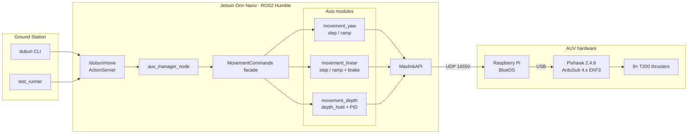
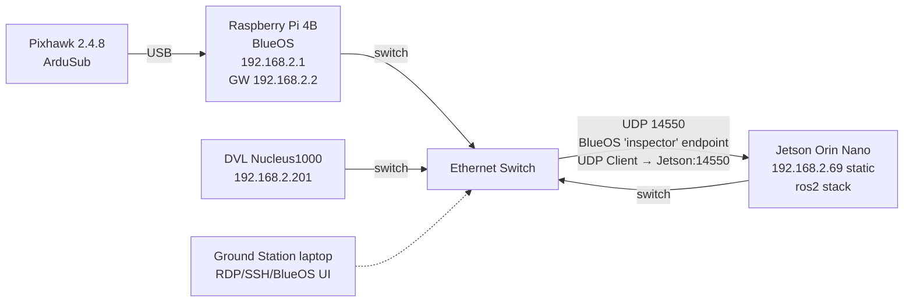

# BRACU Duburi — `duburi_ws`

> **The only AUV in Bangladesh.**
> A fully autonomous underwater vehicle built from scratch by undergraduates at
> BRAC University, finishing 2nd at RoboSub 2023 and 8th at RoboSub 2025 — still
> the only Bangladeshi team in the competition. This repository is the ROS2
> Humble control, mission, and simulation stack that drives her.

<p align="center">
  <em>"Keep the math honest, keep the modules small, keep the sub coming home."</em>
</p>

<!-- Badges -->


---

## Table of Contents

1. [What this repo is](#1-what-this-repo-is)
2. [Vehicle at a glance](#2-vehicle-at-a-glance)
3. [Architecture](#3-architecture)
4. [Code structure](#4-code-structure)
5. [Network setup](#5-network-setup)
6. [Prerequisites](#6-prerequisites)
7. [Build](#7-build)
8. [Run — three modes](#8-run--three-modes)
9. [Command cookbook (duburi CLI)](#9-command-cookbook-duburi-cli)
10. [Configuration guide](#10-configuration-guide)
11. [Tuning guide](#11-tuning-guide)
12. [Telemetry & log cheatsheet](#12-telemetry--log-cheatsheet)
13. [Troubleshooting](#13-troubleshooting)
14. [Development workflow](#14-development-workflow)
15. [Roadmap](#15-roadmap)
16. [Further reading](#16-further-reading)
17. [Team & acknowledgments](#17-team--acknowledgments)
18. [License](#18-license)

---

## 1. What this repo is

`duburi_ws` is a ROS2 Humble colcon workspace that exposes one clean action
surface — `/duburi/move` — over the top of ArduSub. One Python node owns the
MAVLink connection, receives goals, and dispatches them to per-axis movement
controllers. A companion CLI (`duburi`) and a scripted mission runner
(`test_runner`) sit on top of that action server.

Three packages live inside:

| Package             | Role                                                                                     |
|---------------------|------------------------------------------------------------------------------------------|
| `duburi_interfaces` | `Move.action` — the single action type every mission goes through                        |
| `duburi_control`    | MAVLink API + axis-split movement controllers (step / ramp variants, depth PID)          |
| `duburi_manager`    | ROS2 node, action server, telemetry logger, CLI, connection profiles, mission demo       |

Design principles we actually follow:

- **Axis-split control.** Yaw, linear, and depth each live in their own module,
  each with a bang-bang `_step` variant and a smoothed `_ramp` variant. The
  facade is a lock and a dispatch table — nothing else.
- **Preserve the proven default.** Smoothing is opt-in via two ROS parameters.
  `ros2 run duburi_manager auv_manager` replays the same bang-bang behaviour
  that won us runs in Singapore.
- **ArduSub does the hard bit.** Attitude control runs on the flight controller
  at 400 Hz — we never fight it. We stream setpoints (`SET_ATTITUDE_TARGET`,
  `RC_CHANNELS_OVERRIDE`) and let the EKF3-fused AHRS2 yaw and Bar30 depth do
  their jobs.
- **Every cross-command boundary is a hard reset.** Locks serialise, `stop()`
  resets RC + DepthPID + ACK cache, each axis module owns its exit semantics.
  No residual state leaks between two back-to-back goals.

---

## 2. Vehicle at a glance

| Component              | Hardware                                           |
|------------------------|----------------------------------------------------|
| Frame                  | BlueROV2 Heavy (vectored_6dof, 8× T200)            |
| Flight controller      | Pixhawk 2.4.8 running ArduSub 4.x                  |
| Companion              | Raspberry Pi 4B 8 GB — BlueOS (video, endpoints)   |
| Primary SBC            | Jetson Orin Nano (all ROS2 nodes live here)        |
| Depth sensor           | Bar30 (ArduSub AHRS2 altitude)                     |
| DVL                    | Nortek Nucleus1000 @ `192.168.2.201`               |
| Cameras                | Blue Robotics Low-Light (forward + downward)       |
| Network switch         | 5-port, binds all three SBCs + DVL                 |

Competition record:
- **RoboSub 2025** — 8th overall (San Diego, CA).
- **RoboSub 2023** — 2nd overall.
- **SAUVC** — multiple finals appearances.

Design goals for the 2026 season:
1. Make the yaw and linear profiles smooth enough that vision-based PID can
   run on top without fighting the motion profile.
2. Add a `duburi_sensors` package (Phase 3) to centralise IMU / compass /
   depth / camera streams on ROS topics.
3. Plug in vision + `robot_localization` EKF when vision hardware comes up.

---

## 3. Architecture



Key data flow:

1. The CLI (or `test_runner`, or any other client) sends a `Move` goal to
   `/duburi/move`.
2. `auv_manager_node` is the **only** entity calling `recv_match` on the
   MAVLink connection. All reads go through a single reader; all writes go
   through `MavlinkAPI`.
3. The action executor dispatches the goal to the appropriate axis module.
4. The axis module loops at 10-20 Hz, reads cached telemetry, writes RC
   override or attitude target, and logs a `[DEPTH]` / `[YAW  ]` / `[FOR  ]`
   line every 0.5 s.
5. ArduSub's EKF3-fused stabiliser does the 400 Hz inner loop.
6. The action result returns either a success or a MAVLink-grounded failure
   reason (`DENIED`, `NO_ACK`, timeout, ...).

---

## 4. Code structure

```
duburi_ws/
├── build_duburi.sh                    # colcon build helper
├── README.md
├── CLAUDE.md                          # agent/context index
├── LICENSE
├── .claude/context/                   # research notes (ArduSub, PID, yaw, ...)
└── src/
    ├── duburi_interfaces/
    │   └── action/Move.action
    ├── duburi_control/
    │   └── duburi_control/
    │       ├── mavlink_api.py         # pymavlink wrapper + COMMAND_ACK
    │       ├── movement_pids.py       # DepthPID with anti-windup
    │       ├── motion_profiles.py     # smootherstep, trapezoid_ramp
    │       ├── movement_yaw.py        # yaw_step / yaw_ramp
    │       ├── movement_linear.py     # linear_step / linear_ramp + brake
    │       ├── movement_depth.py      # depth_hold (ALT_HOLD + PID throttle)
    │       └── movement_commands.py   # thin facade (lock + dispatch)
    └── duburi_manager/
        ├── duburi_manager/
        │   ├── auv_manager_node.py    # ROS2 node, ActionServer, telemetry
        │   ├── client.py              # DuburiClient Python API
        │   ├── cli.py                 # `duburi` command-line wrapper
        │   ├── test_runner.py         # scripted mission demo
        │   └── connection_config.py   # PROFILES + NETWORK topology
        └── config/modes.yaml          # default ros parameters
```

Every new command ends up in three places:
1. `duburi_interfaces/action/Move.action` if new fields are required
2. One method on `MovementCommands` dispatching to an axis module
3. A subcommand entry in `duburi_manager/cli.py`

---

## 5. Network setup

### 5.1 Topology



### 5.2 BlueOS endpoint configuration

On the BlueOS web UI (`http://192.168.2.1`) go to **Vehicle → Pixhawk →
Endpoints** and create:

| Field  | Value                 |
|--------|-----------------------|
| Name   | `inspector`           |
| Type   | `UDP Client`          |
| IP     | `192.168.2.69`        |
| Port   | `14550`               |

ROS2 side listens on `udpin:0.0.0.0:14550`. The same line works in sim,
laptop, and pool modes because BlueOS pushes MAVLink to us; we never dial
out. The canonical values live in
[src/duburi_manager/duburi_manager/connection_config.py](src/duburi_manager/duburi_manager/connection_config.py)
inside the `NETWORK` dict.

### 5.3 Sanity checks before a session

Run these from whichever machine you're starting the stack on:

```bash
ping -c 3 192.168.2.1             # BlueOS reachable
ping -c 3 192.168.2.69            # Jetson reachable (from laptop on switch)
ss -lun | grep 14550              # UDP 14550 bound & listening (after auv_manager is up)
timeout 5 tcpdump -i any udp port 14550 -c 10  # see MAVLink bytes flowing (needs root)
```

The `auv_manager` startup banner prints the expected BlueOS peer whenever
`mode:=pool` or `mode:=laptop` — if the printed IP doesn't match your
BlueOS endpoint config, fix BlueOS first.

---

## 6. Prerequisites

- **OS:** Ubuntu 22.04 (native, WSL2, or distrobox). BRACU Duburi's dev
  environment runs inside a distrobox with CUDA 12.8 on Arch host, ROS2
  Humble inside the box.
- **ROS2:** Humble Hawksbill (`sudo apt install ros-humble-desktop`).
- **Python:** 3.10 (ships with 22.04).
- **Python deps:** `pymavlink`, installed automatically by `colcon build`
  via the `install_requires` in `setup.py`.
- **For sim:** ArduPilot SITL + `sim_vehicle.py`, Gazebo Harmonic or Ignition
  (see `.claude/context/sim-setup.md`).
- **For hardware:** access to the AUV switch (either tethered laptop or
  onboard Jetson), BlueOS running on the Raspberry Pi.

---

## 7. Build

From the workspace root:

```bash
./build_duburi.sh
source install/setup.bash
```

The helper script:
1. Builds `duburi_interfaces` first (generates `Move` action types).
2. Builds `duburi_control` + `duburi_manager`.
3. Copies Debian-installed Python packages to the ament-expected layout
   (works around a Debian-vs-ament install quirk in colcon).
4. Symlinks executables so `ros2 run` can find them.

If you have already built once and only touched Python code, a plain
`colcon build --symlink-install --packages-select duburi_control duburi_manager`
is faster.

---

## 8. Run — three modes

### 8.1 SIM (Docker + Gazebo + ArduSub SITL)

Terminal 1 — ArduSub SITL:

```bash
sim_vehicle.py -L RATBeach -v ArduSub -f vectored_6dof --model=JSON \
    --out=udp:0.0.0.0:14550 --out=udp:127.0.0.1:14551 --console
```

Terminal 2 — Gazebo (optional, for visuals):

```bash
cd ~/Ros_workspaces/colcon_ws
gz sim -v 3 -r src/bluerov2_gz/worlds/bluerov2_underwater.world
```

Terminal 3 — manager node:

```bash
source install/setup.bash
ros2 run duburi_manager auv_manager --ros-args -p mode:=sim
```

Terminal 4 — commands via CLI (see §9).

### 8.2 DESK (Pixhawk via USB)

Plug the Pixhawk directly into the laptop or Jetson over USB. Grant serial
access on first use:

```bash
sudo usermod -aG dialout "$USER"   # log out / back in after the first time
ls -l /dev/ttyACM0                 # should show crw-rw---- root dialout
```

Start the node:

```bash
ros2 run duburi_manager auv_manager --ros-args -p mode:=desk
```

Useful for bench-testing ESC signals, calibration, and dry MAVLink plumbing
work without water.

### 8.3 POOL / HARDWARE (Jetson + BlueOS over switch)

1. Power on the AUV; confirm the switch link lights come up.
2. On a laptop on the same switch, open `http://192.168.2.1` and confirm
   the BlueOS `inspector` endpoint matches §5.2.
3. SSH into the Jetson:

   ```bash
   ssh fh1m@192.168.2.69
   cd ~/Ros_workspaces/duburi_ws
   source install/setup.bash
   ros2 run duburi_manager auv_manager --ros-args -p mode:=pool
   ```

4. Expected startup banner:

   ```
    DUBURI AUV MANAGER  │  mode: pool
    MAVLink: sys=1 comp=0  (v2.0)
    Profiles: yaw=step  linear=step
    Expect BlueOS "inspector" → UDP Client 192.168.2.69:14550
   ```

5. Within ~2 s you should see a `[STATE]` line. If not, the endpoint is
   misconfigured or the switch isn't bridged — see §13.

---

## 9. Command cookbook (`duburi` CLI)

All commands go through the `/duburi/move` action server and block until
the goal succeeds, fails, or times out. The CLI exits with code 0 on
success and 1 on failure so it composes cleanly in shell pipelines.

```bash
# Power / mode
ros2 run duburi_manager duburi arm
ros2 run duburi_manager duburi set_mode ALT_HOLD
ros2 run duburi_manager duburi disarm

# Linear translations (duration seconds, optional gain %)
ros2 run duburi_manager duburi move_forward 5 80
ros2 run duburi_manager duburi move_back    3 70
ros2 run duburi_manager duburi move_left    4
ros2 run duburi_manager duburi move_right   2 60

# Depth (metres, negative = below surface)
ros2 run duburi_manager duburi set_depth -1.5

# Yaw (degrees, signed by verb)
ros2 run duburi_manager duburi yaw_left  90
ros2 run duburi_manager duburi yaw_right 45

# Emergency neutral
ros2 run duburi_manager duburi stop
```

Scripted mission (edit
[src/duburi_manager/duburi_manager/test_runner.py](src/duburi_manager/duburi_manager/test_runner.py)
to choreograph):

```bash
ros2 run duburi_manager test_runner
```

For programmatic use from Python, import `DuburiClient`:

```python
from duburi_manager.client import DuburiClient
import rclpy
from rclpy.node import Node

rclpy.init()
node = Node('my_mission')
dc = DuburiClient(node)
dc.wait_for_connection()
dc.arm()
dc.set_mode('ALT_HOLD')
dc.set_depth(-1.5)
dc.move_forward(5.0, gain=80)
dc.yaw_left(90.0)
dc.disarm()
```

---

## 10. Configuration guide

All parameters declared on `auv_manager_node`:

| Parameter       | Type     | Default | Values / effect                                                  |
|-----------------|----------|---------|------------------------------------------------------------------|
| `mode`          | `string` | `sim`   | `sim`, `pool`, `laptop`, `desk` — chooses connection string      |
| `smooth_yaw`    | `bool`   | `false` | `true` → `yaw_ramp` (smootherstep setpoint sweep, no overshoot)  |
| `smooth_linear` | `bool`   | `false` | `true` → `linear_ramp` (trapezoid thrust, settle-only brake)     |

Examples:

```bash
# Defaults (both step) — proven bang-bang behaviour
ros2 run duburi_manager auv_manager

# Smoother yaw only (fight overshoot without changing linear feel)
ros2 run duburi_manager auv_manager --ros-args -p smooth_yaw:=true

# Both smoothed, pool mode
ros2 run duburi_manager auv_manager --ros-args \
    -p mode:=pool -p smooth_yaw:=true -p smooth_linear:=true
```

A YAML preset lives at
[src/duburi_manager/config/modes.yaml](src/duburi_manager/config/modes.yaml).
Use it like:

```bash
ros2 run duburi_manager auv_manager \
    --ros-args --params-file src/duburi_manager/config/modes.yaml
```

---

## 11. Tuning guide

### 11.1 DepthPID

Lives in
[src/duburi_control/duburi_control/movement_pids.py](src/duburi_control/duburi_control/movement_pids.py).
Gains are tuned for ArduSub's ALT_HOLD mode + BlueROV2 Heavy frame. If the
sub is over-/underweighted, re-trim the frame first, *then* touch PIDs.

| Gain  | Default | Effect                                                 |
|-------|---------|--------------------------------------------------------|
| `Kp`  | 180     | Raise for snappier descent, lower to reduce overshoot  |
| `Ki`  | 18      | Eliminates steady-state error; too high → low-frequency bob |
| `Kd`  | 20      | Dampens overshoot; noisy depth sensor → keep low       |

Workflow to retune (in sim first, always):
1. Set `Ki = 0`, `Kd = 0`. Find the `Kp` that gets to within ±0.2 m in
   ~3 s without oscillating.
2. Add `Kd` to kill the overshoot.
3. Add `Ki` last to close the steady-state error.

For more theory, read `.claude/context/pid-theory.md` (based on *PID
without a PhD*).

### 11.2 Smoothing flags

| Flag             | Math                                                             | When to enable                               |
|------------------|------------------------------------------------------------------|----------------------------------------------|
| `smooth_yaw`     | Setpoint streamed as `start + delta * smootherstep(t/dur)`       | Seeing yaw overshoot or fighting inertia     |
| `smooth_linear`  | Thrust = `gain * trapezoid_ramp(t, dur, ramp=0.4s)`              | Seeing lurch at start or backward drift at end |

Both flags are independent — you can mix and match.

### 11.3 Linear brake

Each linear variant owns its own exit in
[src/duburi_control/duburi_control/movement_linear.py](src/duburi_control/duburi_control/movement_linear.py).

| Variant       | Exit                                                                |
|---------------|---------------------------------------------------------------------|
| `linear_step` | Reverse kick 25% × 0.2 s, then 1.2 s settle. Needed because constant gain exits at full velocity. |
| `linear_ramp` | No reverse kick. 1.2 s settle only — the trapezoid ease-out IS the brake. |

Tunables at the top of `movement_linear.py`:

```python
_REV_KICK_PCT = 25      # %, higher = stronger brake (too high pushes backward)
_REV_KICK_SEC = 0.20    # s
_SETTLE_SEC   = 1.2     # s, both variants
_LINEAR_RAMP  = 0.4     # s, ease-in/out duration for linear_ramp
```

### 11.4 Yaw loop rate

`yaw_ramp` streams `SET_ATTITUDE_TARGET` at 10 Hz. Increase only if the
ArduSub endpoint can handle it (BlueOS default is fine at 10 Hz).
`movement_yaw.py` top-of-file constants:

```python
_YAW_HZ        = 10.0   # attitude target publish rate
_YAW_TOL_DEG   = 2.0    # lock tolerance in degrees
```

---

## 12. Telemetry & log cheatsheet

| Tag       | Meaning                                                             |
|-----------|---------------------------------------------------------------------|
| `[STATE]` | Periodic status line: arm, mode, yaw, depth, battery               |
| `[ACT  ]` | Action server state transition (EXECUTING / DONE / ABORTED)        |
| `[CMD  ]` | Command boundary (STOP, set_depth, brake, settle, ...)             |
| `[RC   ]` | Active RC override PWM values (Thr, Yaw, Fwd, Lat)                 |
| `[DEPTH]` | Depth PID: target, current, error, commanded throttle               |
| `[YAW  ]` | Yaw tracking: target, current, error                                |
| `[FOR  ]` | Forward translation progress                                        |
| `[BAC  ]` | Backward translation progress                                       |
| `[ARDUB]` | Relayed STATUSTEXT from ArduSub (EKF switches, arming checks, ...)  |
| `[INIT ]` | One-shot init notes                                                 |

`[STATE]` throttles itself — it only prints when yaw moves > 5°, depth
moves > 8 cm, battery moves > 0.2 V, or 30 s has passed.

---

## 13. Troubleshooting

| Symptom                                        | Likely cause / fix                                                                           |
|------------------------------------------------|-----------------------------------------------------------------------------------------------|
| No `[STATE]` line after startup                | UDP 14550 not reaching Jetson. Verify BlueOS `inspector` endpoint IP matches Jetson static IP. Run `ss -lun | grep 14550`. |
| `arm -> FAIL: DENIED`                          | ArduSub pre-arm check failed. Look at the `[ARDUB]` lines for the reason (compass, GPS, battery, ...). |
| `arm -> FAIL: NO_ACK`                          | Heartbeat present but no ACK. Usually pre-arm stall. Restart ArduSub or BlueOS if persistent. |
| `set_mode -> FAIL: DENIED`                     | Trying to enter a mode that requires conditions (e.g. ALT_HOLD needs Bar30 depth lock).       |
| Depth command times out at ~-0.5 m             | Was a known `MANUAL_CONTROL` regression — current codebase uses `RC_CHANNELS_OVERRIDE` only. If it returns, check DepthPID gains and water density. |
| Yaw overshoots target                          | Enable `-p smooth_yaw:=true`. If still overshooting, reduce `ATC_ANG_YAW_P` on ArduSub side.  |
| Small backward drift after `move_forward`      | Use `-p smooth_linear:=true` — the ramp variant uses settle-only brake instead of reverse kick. |
| `/dev/ttyACM0: Permission denied` (desk mode)  | `sudo usermod -aG dialout "$USER"` then log out / back in.                                     |
| Startup banner missing the BlueOS hint         | Hint only prints for `mode:=pool` or `mode:=laptop`. Other modes use local endpoints.          |
| EKF3 switches compass rapidly in logs          | Expected on a freshly powered Pixhawk. If persistent underwater, recalibrate compass on land. |

For anything else, run `colcon build --packages-select duburi_manager &&
source install/setup.bash` first — stale generated files are responsible
for 80% of weird failures.

---

## 14. Development workflow

### 14.1 Add a new high-level command

1. Extend `Move.action` if you need new fields.
2. Add a method to `MovementCommands` that acquires `self._lock`, calls
   `self.stop()`, runs the axis helper, and resets state on exit.
3. Add a dispatch entry in `_MOVE_DISPATCH` (or `_ACK_DISPATCH` if it uses
   `COMMAND_ACK`) inside `auv_manager_node.py`.
4. Add a subcommand in `cli.py`.
5. Test in sim with `test_runner.py` before touching hardware.

### 14.2 Add a new smoothing variant

1. Create a new function in the relevant `movement_*.py` (e.g.
   `yaw_trapezoid`). Keep the signature identical to the existing
   variants — same arguments, same exit semantics.
2. Dispatch from the facade based on a new flag or a richer enum.
3. Reuse math from `motion_profiles.py` where possible.

### 14.3 Debugging on the vehicle

- Always have `ros2 topic echo /rosout_agg` running in a second terminal.
- Log RC and attitude simultaneously — most bugs come from RC channels
  fighting `SET_ATTITUDE_TARGET`.
- When a test fails, save the full terminal output; most of the file is
  `[ARDUB]` lines that explain the underlying reason.

---

## 15. Roadmap

Phase 1 (done):
- Axis-split of the movement facade
- `COMMAND_ACK` + rich action results
- `smoothstep` / `trapezoid_ramp` profiles
- Per-variant exit semantics
- `duburi` CLI
- Workspace-root README

Phase 3 (next):
- `duburi_sensors` package: publish IMU / compass / depth / camera on
  dedicated ROS topics.
- `mavros` **read-only** telemetry consumer on a separate endpoint.
- Initial vision pipeline scaffolding.

Phase 4 (queued):
- `robot_localization` EKF fusing vision + AHRS2 + Bar30.
- Mission autonomy layer (behaviour trees or simple state machines).
- DVL integration if hardware budget allows.

Skipped intentionally for now:
- Phase 2 `mavros` bi-directional bridge (pymavlink is already doing what
  we need).
- ros2_control controller layer.

---

## 16. Further reading

Research notes and agent context live in `.claude/context/`:

- [hardware-setup.md](.claude/context/hardware-setup.md) — physical vehicle
- [sim-setup.md](.claude/context/sim-setup.md) — SITL + Gazebo details
- [ardusub-reference.md](.claude/context/ardusub-reference.md) — ArduSub params + MAVLink
- [proven-patterns.md](.claude/context/proven-patterns.md) — known-good control patterns
- [ros2-conventions.md](.claude/context/ros2-conventions.md) — project code style
- [pid-theory.md](.claude/context/pid-theory.md) — PID tuning notes (after *PID without a PhD*)
- [yaw-stability-and-fusion.md](.claude/context/yaw-stability-and-fusion.md) — yaw stabilisation + vision/Kalman roadmap
- [mission-design.md](.claude/context/mission-design.md) — mission planning patterns
- [mavlink-reference.md](.claude/context/mavlink-reference.md) — MAVLink messages we actually use

Top-level [CLAUDE.md](CLAUDE.md) is the agent memory index.

---

## 17. Team & acknowledgments

**BRACU Duburi** — BRAC University, Dhaka, Bangladesh.
Website: [bracuduburi.com](https://bracuduburi.com)

Competitions:
- RoboSub (San Diego, CA) — 2nd overall 2023, 8th overall 2025.
- SAUVC (Singapore) — repeat finalists.

Built on the shoulders of:
- [ArduPilot / ArduSub](https://ardupilot.org/sub/)
- [Blue Robotics BlueOS](https://bluerobotics.com/learn/bluerov2-software-setup-with-blueos/)
- [pymavlink](https://github.com/ArduPilot/pymavlink)
- [ROS2 Humble](https://docs.ros.org/en/humble/)
- [auv_controllers](https://github.com/Robotic-Decision-Making-Lab/auv_controllers) (reference design)
- [orca4](https://github.com/clydemcqueen/orca4) (reference ROS2 + ArduSub stack)

The only AUV in Bangladesh still comes home because the team keeps the
math honest and the modules small.

---

## 18. License

MIT — see [LICENSE](LICENSE).
