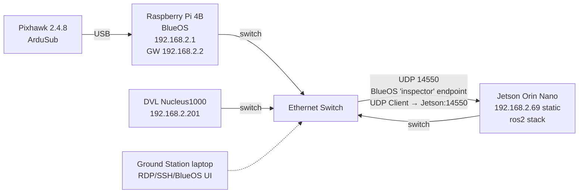

# BRACU Duburi — `duburi_ws`

> **The only AUV in Bangladesh.**
> A fully autonomous underwater vehicle built from scratch by undergraduates at
> BRAC University, finishing 2nd at RoboSub 2023 and 8th at RoboSub 2025 — still
> the only Bangladeshi team in the competition. This repository is the ROS2
> Humble control, mission, and simulation stack that drives her.

<p align="center">
  <em>"Keep the math honest, keep the modules small, keep the sub coming home."</em>
</p>

<!-- Badges -->


---

## Table of Contents

1. [What this repo is](#1-what-this-repo-is)
2. [Vehicle at a glance](#2-vehicle-at-a-glance)
2A. [Real vehicle vs sim](#2a-real-vehicle-vs-sim)
3. [Architecture](#3-architecture)
4. [Code structure](#4-code-structure)
5. [Network setup](#5-network-setup)
6. [Prerequisites](#6-prerequisites)
7. [Build](#7-build)
8. [Run — three modes](#8-run--three-modes)
9. [Command cookbook (duburi CLI)](#9-command-cookbook-duburi-cli)
10. [Configuration guide](#10-configuration-guide)
11. [Tuning guide](#11-tuning-guide)
12. [Telemetry & log cheatsheet](#12-telemetry--log-cheatsheet)
13. [Troubleshooting](#13-troubleshooting)
14. [Development workflow](#14-development-workflow)
15. [Roadmap](#15-roadmap)
16. [Further reading](#16-further-reading)
17. [Team & acknowledgments](#17-team--acknowledgments)
18. [License](#18-license)

---

## 1. What this repo is

`duburi_ws` is a ROS2 Humble colcon workspace that exposes one clean action
surface — `/duburi/move` — over the top of ArduSub. One Python node owns the
MAVLink connection, receives goals, and dispatches them to per-axis movement
controllers. A companion CLI (`duburi`) and a scripted mission runner
(`test_runner`) sit on top of that action server.

Three packages live inside:

| Package             | Role                                                                                     |
|---------------------|------------------------------------------------------------------------------------------|
| `duburi_interfaces` | `Move.action` + `DuburiState.msg` — the only ROS surface every client talks to           |
| `duburi_control`    | `Pixhawk` MAVLink wrapper + axis-split motion controllers (`drive_constant`/`drive_eased`, `yaw_snap`/`yaw_glide`, `hold_depth`) + the `COMMANDS` registry |
| `duburi_manager`    | ROS2 node, action server, telemetry logger, CLI, connection profiles, mission demo       |
| `duburi_sensors`    | `YawSource` abstraction — MAVLink AHRS default, BNO085 (ESP32-C3 USB CDC) opt-in, DVL/WitMotion stubs |

Design principles we actually follow:

- **Axis-split control.** Yaw, linear, and depth each live in their own module
  (`motion_yaw`, `motion_linear`, `motion_depth`), each with a bang-bang
  default (`yaw_snap`, `drive_constant`) and a smoothed variant (`yaw_glide`,
  `drive_eased`). The `Duburi` facade is a lock plus a dispatch table.
- **One source of truth for commands.** Every command is one row in
  `duburi_control/commands.py` and one method on `Duburi`. The action server,
  the `duburi` CLI, and the Python `DuburiClient` all read from `COMMANDS`,
  so adding a verb takes two edits — not five.
- **Preserve the proven default.** Smoothing is opt-in via two ROS parameters
  (`smooth_yaw`, `smooth_linear`). `ros2 run duburi_manager auv_manager`
  replays the same bang-bang behaviour that won us runs in Singapore.
- **ArduSub does the hard bit.** Attitude *and* depth control both run on the
  flight controller at 400 Hz — we never fight them. We stream setpoints
  (`SET_ATTITUDE_TARGET` for yaw, `SET_POSITION_TARGET_GLOBAL_INT` for depth,
  `RC_CHANNELS_OVERRIDE` for translation) and let the EKF3-fused AHRS2 yaw
  and Bar30 depth do their jobs.
- **Stop vs pause are different.** `stop()` actively holds RC neutral
  (1500 µs on every channel). `pause(N)` releases the override entirely
  (65535) for N seconds so the autopilot's own ALT_HOLD takes over, then
  re-engages neutral. Use `pause` between mission verbs, `stop` for
  emergency.
- **Every cross-command boundary is a hard reset.** Locks serialise, `stop()`
  forces RC neutral + clears the ACK cache, each axis module owns its exit
  semantics. No residual state leaks between two back-to-back goals.

| Axis     | Setpoint message                  | Loop that closes it           | Our role                    |
|----------|-----------------------------------|-------------------------------|-----------------------------|
| Yaw      | `SET_ATTITUDE_TARGET`             | ArduSub 400 Hz attitude PID   | stream + watch AHRS yaw     |
| Depth    | `SET_POSITION_TARGET_GLOBAL_INT`  | ArduSub ALT_HOLD position PID | stream + watch AHRS depth   |
| Linear   | `RC_CHANNELS_OVERRIDE` Ch5 / Ch6  | open loop (timed thrust)      | shape the thrust envelope   |

---

## 2. Vehicle at a glance

| Component              | Hardware                                                          |
|------------------------|-------------------------------------------------------------------|
| Hull                   | **BRACU Duburi 4.2** — octagonal Marine 5083 aluminum, in-house   |
| Frame type (ArduSub)   | `vectored_6dof` (8× Blue Robotics T200) — same as BlueROV2 Heavy  |
| Flight controller      | Pixhawk 2.4.8 running ArduSub 4.x                                 |
| Companion              | Raspberry Pi running BlueOS (MAVLink router, web UI, video)       |
| Primary SBC            | Nvidia Jetson Orin Nano (all ROS2 nodes live here)                |
| Depth sensor           | Bar30 (ArduSub AHRS2 altitude)                                    |
| External IMU           | ESP32-C3 + BNO085 over USB CDC (gyro+accel, opt-in via param)     |
| DVL                    | Nortek Nucleus1000 @ `192.168.2.201` (driver TODO — stub only)    |
| Cameras                | Blue Robotics Low-Light HD USB (forward + downward)               |
| Tether                 | FathomX power-over-Ethernet                                       |
| Power                  | Dual LiPo (one propulsion, one compute+sensors — isolated rails)  |
| Payload                | Slingshot torpedo, aluminum grabber (current-sensed), solenoid dropper |
| Network switch         | Onboard 5-port, binds all three SBCs + DVL                        |

Competition record:
- **RoboSub 2025** — 8th overall (San Diego, CA).
- **RoboSub 2023** — 2nd overall.
- **SAUVC** — multiple finals appearances.

Design goals for the 2026 season:
1. Make the yaw and linear profiles smooth enough that vision-based PID can
   run on top without fighting the motion profile.
2. Bring up the Nucleus1000 DVL driver and feed velocity into ArduSub's EKF3.
3. Plug in vision + `robot_localization` EKF when vision hardware comes up.

---

## 2A. Real vehicle vs sim

> **TL;DR — BlueROV2 Heavy is the Gazebo SITL target. The real AUV is BRACU Duburi 4.2.** Both share the `vectored_6dof` 8-thruster ArduSub frame, which is why BlueROV2 is a faithful proxy for control development. Hull shape, mass, and payload geometry differ.

| Aspect             | Sim (Gazebo)                   | Real (Duburi 4.2)                           |
|--------------------|--------------------------------|---------------------------------------------|
| Hull               | BlueROV2 Heavy chassis         | Octagonal Marine 5083 aluminum, in-house    |
| Frame type         | `vectored_6dof` (8× T200)      | `vectored_6dof` (8× T200)                   |
| Compass            | Synthetic, drift-free          | Pixhawk mag — noisy near aluminum + thrusters |
| Heading source     | ArduSub AHRS                   | ArduSub AHRS *or* BNO085 (`yaw_source` param) |
| Depth sensor       | Sim plugin                     | Bar30                                       |
| DVL                | None                           | Nortek Nucleus1000 (driver pending)         |
| Payload            | None                           | Torpedo, grabber, dropper                   |

The full Duburi 4.2 spec block lives in
[.claude/context/vehicle-spec.md](.claude/context/vehicle-spec.md) — that's
the canonical reference for hardware and the TDR-vs-implementation delta
(notably: TDR Appendix A lists VectorNav VN200 as the IMU; we use BNO085
+ ESP32-C3 instead — see §13 for why).

---

## 3. Architecture

```mermaid
flowchart LR
    subgraph ground [Ground Station]
        CLI[duburi CLI]
        Mission[test_runner]
    end

    subgraph jetson [Jetson Orin Nano · ROS2 Humble]
        Action["/duburi/move<br/>ActionServer"]
        Mgr[auv_manager_node]
        Facade[Duburi facade<br/>(COMMANDS dispatch)]
        subgraph axes [Motion modules]
            Yaw[motion_yaw<br/>yaw_snap / yaw_glide]
            Lin[motion_linear<br/>drive_constant / drive_eased + brake]
            Dep[motion_depth<br/>hold_depth setpoint]
        end
        API[Pixhawk]
    end

    subgraph vehicle [AUV hardware]
        BlueOS[Raspberry Pi<br/>BlueOS]
        Pix[Pixhawk 2.4.8<br/>ArduSub 4.x EKF3]
        Thr[8× T200 thrusters]
    end

    CLI --> Action
    Mission --> Action
    Action --> Mgr --> Facade
    Facade --> Yaw
    Facade --> Lin
    Facade --> Dep
    Yaw --> API
    Lin --> API
    Dep --> API
    API -- "UDP 14550" --> BlueOS
    BlueOS -- USB --> Pix
    Pix --> Thr
```

Key data flow:

1. The CLI (or `test_runner`, or any other client) sends a `Move` goal to
   `/duburi/move`.
2. `auv_manager_node` is the **only** entity calling `recv_match` on the
   MAVLink connection. All reads go through a single reader; all writes go
   through `Pixhawk`.
3. The action executor looks up the verb in the `COMMANDS` registry and
   dispatches to a same-named method on `Duburi` via `getattr`.
4. The motion module loops at 10-20 Hz, reads cached telemetry, writes RC
   override or attitude target, and logs a `[DEPTH]` / `[YAW  ]` / `[FOR  ]`
   line every 0.5 s (rate-limited via rclpy `throttle_duration_sec`).
5. ArduSub's EKF3-fused stabiliser does the 400 Hz inner loop. Telemetry
   stream rates are pinned at startup with `MAV_CMD_SET_MESSAGE_INTERVAL`
   (AHRS2 = 50 Hz, RC_CHANNELS = 5 Hz, BATTERY_STATUS = 1 Hz).
6. The action result returns a `Move.Result` with either success or a
   MAVLink-grounded failure reason (`DENIED`, `NO_ACK`, timeout, ...).
7. `auv_manager_node` republishes a typed `DuburiState` message on
   `/duburi/state` whenever the snapshot changes (or every ~1 s as a
   heartbeat).

---

## 4. Code structure

```
duburi_ws/
├── build_duburi.sh                    # colcon build helper
├── README.md
├── CLAUDE.md                          # agent/context index
├── LICENSE
├── .claude/context/                   # research notes (ArduSub, PID, yaw, ...)
└── src/
    ├── duburi_interfaces/
    │   ├── action/Move.action
    │   └── msg/DuburiState.msg        # typed snapshot for /duburi/state
    ├── duburi_control/
    │   └── duburi_control/
    │       ├── pixhawk.py             # pymavlink wrapper + COMMAND_ACK + set_message_rate
    │       ├── commands.py            # COMMANDS registry (single source of truth)
    │       ├── motion_profiles.py     # smootherstep, trapezoid_ramp
    │       ├── motion_yaw.py          # yaw_snap / yaw_glide
    │       ├── motion_linear.py       # drive_constant / drive_eased + brake
    │       ├── motion_depth.py        # hold_depth (ALT_HOLD + setpoint stream)
    │       ├── duburi.py              # Duburi facade (lock + dispatch)
    │       └── errors.py              # MovementError / Timeout / ModeChangeError
    ├── duburi_sensors/
    │   ├── duburi_sensors/
    │   │   ├── factory.py             # name -> YawSource dispatch
    │   │   ├── sensors_node.py        # standalone diagnostic node
    │   │   └── sources/
    │   │       ├── base.py            # YawSource ABC
    │   │       ├── mavlink_ahrs.py    # ArduSub AHRS2 wrapper (default)
    │   │       ├── bno085.py          # ESP32-C3 + BNO085 over USB CDC
    │   │       ├── dvl_stub.py        # placeholder for Nucleus1000 yaw
    │   │       └── witmotion_stub.py  # placeholder for HWT905 / WT901C
    │   ├── firmware/
    │   │   └── esp32c3_bno085.md      # MCU-side wire contract + ref code
    │   └── config/sensors.yaml        # yaw_source / bno085_port / baud
    └── duburi_manager/
        ├── duburi_manager/
        │   ├── auv_manager_node.py    # ROS2 node, ActionServer, telemetry
        │   ├── client.py              # DuburiClient Python API
        │   ├── cli.py                 # `duburi` command-line wrapper
        │   ├── test_runner.py         # scripted mission demo
        │   └── connection_config.py   # PROFILES + NETWORK topology
        └── config/modes.yaml          # default ros parameters
```

Every new command ends up in just two places:
1. One row in `duburi_control/commands.py` (`COMMANDS` dict — name, help text,
   accepted `Move.Goal` fields, and defaults).
2. A same-named method on `Duburi` in `duburi_control/duburi.py` returning a
   `Move.Result`.

The action server (`auv_manager_node.execute_callback`), the `duburi` CLI
(`cli._build_parser`), and the Python client (`DuburiClient.__getattr__`)
all read from `COMMANDS` at runtime — no wiring needed in any of them.

Only add a field to `Move.action` if you genuinely need a new parameter
shape; the existing `duration` / `degrees` / `meters` / `gain` / `timeout`
fields cover most verbs.

---

## 5. Network setup

### 5.1 Topology



### 5.2 BlueOS endpoint configuration

On the BlueOS web UI (`http://192.168.2.1`) go to **Vehicle → Pixhawk →
Endpoints** and create:

| Field  | Value                 |
|--------|-----------------------|
| Name   | `inspector`           |
| Type   | `UDP Client`          |
| IP     | `192.168.2.69`        |
| Port   | `14550`               |

ROS2 side listens on `udpin:0.0.0.0:14550`. The same line works in sim,
laptop, and pool modes because BlueOS pushes MAVLink to us; we never dial
out. The canonical values live in
[src/duburi_manager/duburi_manager/connection_config.py](src/duburi_manager/duburi_manager/connection_config.py)
inside the `NETWORK` dict.

### 5.3 Sanity checks before a session

Run these from whichever machine you're starting the stack on:

```bash
ping -c 3 192.168.2.1             # BlueOS reachable
ping -c 3 192.168.2.69            # Jetson reachable (from laptop on switch)
ss -lun | grep 14550              # UDP 14550 bound & listening (after auv_manager is up)
timeout 5 tcpdump -i any udp port 14550 -c 10  # see MAVLink bytes flowing (needs root)
```

The `auv_manager` startup banner prints the expected BlueOS peer whenever
`mode:=pool` or `mode:=laptop` — if the printed IP doesn't match your
BlueOS endpoint config, fix BlueOS first.

---

## 6. Prerequisites

- **OS:** Ubuntu 22.04 (native, WSL2, or distrobox). BRACU Duburi's dev
  environment runs inside a distrobox with CUDA 12.8 on Arch host, ROS2
  Humble inside the box.
- **ROS2:** Humble Hawksbill (`sudo apt install ros-humble-desktop`).
- **Python:** 3.10 (ships with 22.04).
- **Python deps:** `pymavlink`, installed automatically by `colcon build`
  via the `install_requires` in `setup.py`.
- **For sim:** ArduPilot SITL + `sim_vehicle.py`, Gazebo Harmonic or Ignition
  (see `.claude/context/sim-setup.md`).
- **For hardware:** access to the AUV switch (either tethered laptop or
  onboard Jetson), BlueOS running on the Raspberry Pi.

---

## 7. Build

From the workspace root:

```bash
./build_duburi.sh
source install/setup.bash
```

The helper script:
1. Builds `duburi_interfaces` first (generates `Move` action types).
2. Builds `duburi_control` + `duburi_manager`.
3. Copies Debian-installed Python packages to the ament-expected layout
   (works around a Debian-vs-ament install quirk in colcon).
4. Symlinks executables so `ros2 run` can find them.

If you have already built once and only touched Python code, a plain
`colcon build --symlink-install --packages-select duburi_control duburi_manager`
is faster.

---

## 8. Run — three modes

### 8.1 SIM (Docker + Gazebo + ArduSub SITL)

Terminal 1 — ArduSub SITL:

```bash
sim_vehicle.py -L RATBeach -v ArduSub -f vectored_6dof --model=JSON \
    --out=udp:0.0.0.0:14550 --out=udp:127.0.0.1:14551 --console
```

Terminal 2 — Gazebo (optional, for visuals):

```bash
cd ~/Ros_workspaces/colcon_ws
gz sim -v 3 -r src/bluerov2_gz/worlds/bluerov2_underwater.world
```

Terminal 3 — manager node:

```bash
source install/setup.bash
ros2 run duburi_manager auv_manager --ros-args -p mode:=sim
```

Terminal 4 — commands via CLI (see §9).

### 8.2 DESK (Pixhawk via USB)

Plug the Pixhawk directly into the laptop or Jetson over USB. Grant serial
access on first use:

```bash
sudo usermod -aG dialout "$USER"   # log out / back in after the first time
ls -l /dev/ttyACM0                 # should show crw-rw---- root dialout
```

Start the node:

```bash
ros2 run duburi_manager auv_manager --ros-args -p mode:=desk
```

Useful for bench-testing ESC signals, calibration, and dry MAVLink plumbing
work without water.

### 8.3 POOL / HARDWARE (Jetson + BlueOS over switch)

1. Power on the AUV; confirm the switch link lights come up.
2. On a laptop on the same switch, open `http://192.168.2.1` and confirm
   the BlueOS `inspector` endpoint matches §5.2.
3. SSH into the Jetson:

   ```bash
   ssh fh1m@192.168.2.69
   cd ~/Ros_workspaces/duburi_ws
   source install/setup.bash
   ros2 run duburi_manager auv_manager --ros-args -p mode:=pool
   ```

4. Expected startup banner:

   ```
    DUBURI AUV MANAGER  │  mode: pool
    MAVLink: sys=1 comp=0  (v2.0)
    Profiles: yaw=step  linear=step
    Expect BlueOS "inspector" → UDP Client 192.168.2.69:14550
   ```

5. Within ~2 s you should see a `[STATE]` line. If not, the endpoint is
   misconfigured or the switch isn't bridged — see §13.

---

## 9. Command cookbook (`duburi` CLI)

All commands go through the `/duburi/move` action server and block until
the goal succeeds, fails, or times out. The CLI exits with code 0 on
success and 1 on failure so it composes cleanly in shell pipelines.

```bash
# Power / mode
ros2 run duburi_manager duburi arm
ros2 run duburi_manager duburi set_mode --target_name ALT_HOLD
ros2 run duburi_manager duburi disarm

# Linear translations (duration seconds, optional gain %)
ros2 run duburi_manager duburi move_forward --duration 5 --gain 80
ros2 run duburi_manager duburi move_back    --duration 3 --gain 70
ros2 run duburi_manager duburi move_left    --duration 4
ros2 run duburi_manager duburi move_right   --duration 2 --gain 60

# Depth (metres, negative = below surface)
ros2 run duburi_manager duburi set_depth --target -1.5

# Yaw (degrees, signed by verb)
ros2 run duburi_manager duburi yaw_left  --target 90
ros2 run duburi_manager duburi yaw_right --target 45

# Emergency neutral (active hold — RC set to 1500 on every channel)
ros2 run duburi_manager duburi stop

# Pause (release the RC override for N seconds — autopilot takes over)
ros2 run duburi_manager duburi pause --duration 2.0
```

> The CLI is generated from `COMMANDS`, so every command takes its parameters
> as named flags. Field names map straight to fields on `Move.action`
> (`duration`, `gain`, `target`, `target_name`, `timeout`). Run
> `ros2 run duburi_manager duburi <cmd> --help` for the exact list per verb.

Sensor smoke-test (no thrusters, no ArduSub interaction — see §10A):

```bash
# Default — reads ArduSub AHRS via the same UDP endpoint as the manager.
# Stop the manager first, or this prints STALE.
ros2 run duburi_sensors sensors_node

# External BNO085 — runs without MAVLink, useful before pool runs.
ros2 run duburi_sensors sensors_node \
    --ros-args -p yaw_source:=bno085 -p bno085_port:=/dev/ttyACM0
```

Scripted mission (edit
[src/duburi_manager/duburi_manager/test_runner.py](src/duburi_manager/duburi_manager/test_runner.py)
to choreograph):

```bash
ros2 run duburi_manager test_runner
```

For programmatic use from Python, import `DuburiClient`. Every command in
`COMMANDS` is also accessible as a method on the client (via `__getattr__`),
or you can use `client.send(cmd, **fields)` directly:

```python
from duburi_manager.client import DuburiClient, MoveRejected, MoveFailed
import rclpy
from rclpy.node import Node

rclpy.init()
node = Node('my_mission')
dc = DuburiClient(node)
dc.wait_for_connection()

try:
    dc.arm()                                          # uses defaults from COMMANDS
    dc.set_mode(target_name='ALT_HOLD')
    dc.set_depth(target=-1.5)
    dc.move_forward(duration=5.0, gain=80)
    dc.yaw_left(target=90.0)
    dc.send('pause', duration=2.0)                    # equivalent to dc.pause(duration=2.0)
    dc.disarm()
except MoveRejected as exc:
    node.get_logger().error(f'goal rejected by server: {exc}')
except MoveFailed as exc:
    node.get_logger().error(f'goal failed: {exc}')
```

---

## 10. Configuration guide

All parameters declared on `auv_manager_node`:

| Parameter       | Type     | Default          | Values / effect                                                  |
|-----------------|----------|------------------|------------------------------------------------------------------|
| `mode`          | `string` | `sim`            | `sim`, `pool`, `laptop`, `desk` — chooses connection string      |
| `smooth_yaw`    | `bool`   | `false`          | `true` → `yaw_glide` (smootherstep setpoint sweep, no overshoot) |
| `smooth_linear` | `bool`   | `false`          | `true` → `drive_eased` (trapezoid thrust, settle-only brake)     |
| `yaw_source`    | `string` | `mavlink_ahrs`   | `mavlink_ahrs` (ArduSub onboard) \| `bno085` (ESP32-C3 + BNO085) |
| `bno085_port`   | `string` | `/dev/ttyACM0`   | USB CDC device path (only when `yaw_source==bno085`)             |
| `bno085_baud`   | `int`    | `115200`         | BNO085 stream baud rate                                          |

> The executable is registered under both names: `auv_manager` and `auv_manager_node` resolve to the same node.
>
> Yaw commands need a mode that tracks **absolute** heading. ArduSub honours `SET_ATTITUDE_TARGET` only in `ALT_HOLD` / `POSHOLD` / `GUIDED`. In `MANUAL` it's silently dropped; in `STABILIZE` it's treated as a yaw *rate* (and there's no depth hold, so the sub sinks during the turn). The node therefore auto-engages `ALT_HOLD` if you call `yaw_left` / `yaw_right` from `MANUAL` or `STABILIZE`; if you've already run `set_depth` (which engages `ALT_HOLD`) the existing mode is preserved.

Examples:

```bash
# Defaults (both step) — proven bang-bang behaviour
ros2 run duburi_manager auv_manager

# Smoother yaw only (fight overshoot without changing linear feel)
ros2 run duburi_manager auv_manager --ros-args -p smooth_yaw:=true

# Both smoothed, pool mode
ros2 run duburi_manager auv_manager --ros-args \
    -p mode:=pool -p smooth_yaw:=true -p smooth_linear:=true
```

A YAML preset lives at
[src/duburi_manager/config/modes.yaml](src/duburi_manager/config/modes.yaml).
Use it like:

```bash
ros2 run duburi_manager auv_manager \
    --ros-args --params-file src/duburi_manager/config/modes.yaml
```

---

## 10A. Yaw source — `duburi_sensors`

ArduSub's onboard AHRS is the default and works fine in sim. For pool /
real-world runs where the Pixhawk's compass is noisy near aluminium
frames or thrusters, you can swap in an external yaw source without
touching any control-side code. The package is **sensor-only** — no
fusion, no fallback, no mid-run switching. You pick one source per
launch, and if it goes silent the control loop holds its last value.

### Architecture

```
+-----------------------------+         +------------------------+
|   auv_manager_node          |         |   sensors_node         |
|   (control + ActionServer)  |         |   (diagnostic only)    |
+-----------------------------+         +------------------------+
              |                                    |
              | yaw_source param                   |
              v                                    v
        +-----------------------------------------------+
        |   make_yaw_source(name, **kw)  (factory)      |
        +-----------------------------------------------+
          |              |              |             |
          v              v              v             v
   MavlinkAhrs   BNO085Source    DVLSource (stub)   WitMotion (stub)
   (default)     (USB CDC JSON)  raises NotImpl     raises NotImpl
```

Every source implements the same three-method contract: `read_yaw()`,
`is_healthy()`, `close()`. Yaw is always degrees in `[0, 360)`,
Earth-referenced (magnetic north, +CW from above) — same convention
everywhere downstream.

### Switching source

```bash
# Default — ArduSub onboard AHRS (no extra hardware)
ros2 run duburi_manager auv_manager_node

# External — ESP32-C3 + BNO085 over USB CDC
ros2 run duburi_manager auv_manager_node \
    --ros-args -p yaw_source:=bno085 \
               -p bno085_port:=/dev/ttyACM0 \
               -p bno085_baud:=115200
```

If the chosen source can't initialise (e.g. wrong serial port), the node
**fails loudly at startup** rather than silently falling back. The
operator picked it; the operator gets told.

### Bootstrap calibration (BNO085 only)

The BNO085 firmware runs in `SH2_GAME_ROTATION_VECTOR` mode — gyro +
accelerometer fusion with the magnetometer **disabled**. That gives us
a smooth heading that is immune to the magnetic interference inside
the AUV (8 thrusters + battery currents + aluminum (Marine 5083) hull), but with no
absolute Earth reference: the chip's "yaw=0" is whatever direction it
was pointing at boot.

To turn that into an Earth-referenced heading without ever using the
BNO's mag, the manager performs a **one-shot calibration** at startup:

```
offset_deg = pixhawk_yaw  -  bno_raw_yaw    # captured once, locked
earth_yaw  = (bno_raw + offset_deg) mod 360 # applied forever after
```

* The Pixhawk magnetometer is read **once** during the first ≤5 s of
  startup, then never again. Run the calibration at the surface, away
  from large metal objects, with the AUV held level.
* If either the BNO or the Pixhawk yaw stays unavailable for more than
  the calibration timeout, the node aborts with a `RuntimeError` —
  same loud-failure policy as the rest of `duburi_sensors`.
* The locked offset is printed in the startup banner:

  ```
  Yaw source: BNO085 (/dev/ttyACM0 @ 115200)  Earth-ref offset: +124.30°
  ```

* Drift profile after calibration: the BNO085's bias-stabilised gyro
  drifts ~0.5 °/min in steady conditions — for a 2-3 minute mission
  that is well below pool-test repeatability.
* To re-zero the offset (e.g. after the AUV has been re-mounted),
  restart the manager. There is no mid-run recalibration on purpose;
  see `.claude/context/sensors-pipeline.md` for the rationale.

The diagnostic node accepts a `calibrate:=true` flag to exercise the
exact same code path without launching the full manager:

```bash
ros2 run duburi_sensors sensors_node --ros-args \
    -p yaw_source:=bno085 -p calibrate:=true \
    -p bno085_port:=/dev/ttyACM0
```

Without `calibrate:=true`, the diagnostic node prints **raw** BNO yaw
(sensor frame) — useful for verifying the wire, useless for navigation.

### Standalone diagnostic node

Before doing a mission with a new source, run the diagnostic node — it
talks to the sensor with no thrusters, no MAVLink-arming, no autopilot
side effects:

```bash
# AHRS via MAVLink (don't run alongside the manager — UDP port collision)
ros2 run duburi_sensors sensors_node

# BNO085 only (no MAVLink connection at all — pure desk test)
ros2 run duburi_sensors sensors_node \
    --ros-args -p yaw_source:=bno085 -p bno085_port:=/dev/ttyACM0
```

Output every 0.5 s:

```
[INFO] [SENSOR] yaw=123.45°  healthy=True   rx_hz= 49.8  total=1240
```

`rx_hz` is the per-second sample rate the source is producing — for a
healthy BNO085 stream that should sit at ~50 Hz. If you see `STALE`,
the wire is broken, the firmware crashed, or the chip is held by
another process.

### Adding a new source

1. Write `src/duburi_sensors/duburi_sensors/sources/my_sensor.py`
   subclassing `YawSource`. Mirror the threading + stale-detection
   pattern from `bno085.py`.
2. Add a builder + entry to `_BUILDERS` in
   [src/duburi_sensors/duburi_sensors/factory.py](src/duburi_sensors/duburi_sensors/factory.py).
3. Document the wire format in `src/duburi_sensors/firmware/<sensor>.md`.

That's it — no changes to `duburi_control` or `duburi_manager`.

### BNO085 firmware

The MCU-side contract (JSON-line over USB CDC at 115200, 50 Hz) and a
reference Arduino sketch live in
[src/duburi_sensors/firmware/esp32c3_bno085.md](src/duburi_sensors/firmware/esp32c3_bno085.md).
Smoke-test the wire from the Jetson with `cat /dev/ttyACM0` first;
if you don't see JSON, the Jetson side won't see it either.

---

## 11. Tuning guide

### 11.1 Depth — onboard ArduSub controller

Depth is no longer driven by a Python PID. We send an absolute depth
setpoint via `SET_POSITION_TARGET_GLOBAL_INT` and ArduSub's onboard 400 Hz
position controller closes the loop. This mirrors how yaw is driven via
`SET_ATTITUDE_TARGET` — one source of truth per axis, no stacked loops.

The flow in [src/duburi_control/duburi_control/motion_depth.py](src/duburi_control/duburi_control/motion_depth.py):

1. `Duburi.set_depth` engages `ALT_HOLD` (the only mode that honours
   absolute Z setpoints and also holds depth between frames).
2. **`prime_alt_hold` (0.5 s)** — stream the *current* depth as the
   target while sending neutral RC. This drains the well-known stale
   ALT_HOLD integrator state from the previous mode (Blue Robotics
   forum: ["Depth Hold Problems?"](https://discuss.bluerobotics.com/t/depth-hold-problems/8993)).
3. **`wait_for_depth`** — stream the real target at 5 Hz; exit when
   |error| < 0.07 m or timeout, log the closest depth reached.

If you need to tune depth response, do it on the **ArduSub side** via QGC
(parameters live on the Pixhawk, not in our code):

| ArduSub param   | Effect                                            |
|-----------------|---------------------------------------------------|
| `PSC_POSZ_P`    | Depth position gain. Default 1.0. Raise for snap. |
| `PSC_VELZ_P`    | Depth velocity gain. Default 5.0.                 |
| `PILOT_SPD_UP`  | Max ascend rate (cm/s). Default 50.               |
| `PILOT_SPD_DN`  | Max descend rate (cm/s). Default 50.              |
| `PILOT_ACCEL_Z` | Vertical accel limit. Lower = smoother profile.   |

> The Python-side `DepthPID` / `YawPID` classes that used to live in
> `movement_pids.py` have been removed — ArduSub's onboard PID is the only
> control loop in the live path. PID theory and tuning notes are still
> documented in [`.claude/context/pid-theory.md`](.claude/context/pid-theory.md)
> (based on *PID without a PhD*) and the previous Python implementation can
> be recovered from git history if it's ever needed as a hot-fix fallback.

### 11.2 Smoothing flags

| Flag             | Math                                                             | When to enable                               |
|------------------|------------------------------------------------------------------|----------------------------------------------|
| `smooth_yaw`     | Setpoint streamed as `start + delta * smootherstep(t/dur)`       | Seeing yaw overshoot or fighting inertia     |
| `smooth_linear`  | Thrust = `gain * trapezoid_ramp(t, dur, ramp=0.4s)`              | Seeing lurch at start or backward drift at end |

Both flags are independent — you can mix and match.

### 11.3 Linear brake

Each linear variant owns its own exit in
[src/duburi_control/duburi_control/motion_linear.py](src/duburi_control/duburi_control/motion_linear.py).

| Variant          | Exit                                                                |
|------------------|---------------------------------------------------------------------|
| `drive_constant` | Reverse kick 25% × 0.2 s, then 1.2 s settle. Needed because constant gain exits at full velocity. |
| `drive_eased`    | No reverse kick. 1.2 s settle only — the trapezoid ease-out IS the brake. |

Tunables at the top of `motion_linear.py`:

```python
REVERSE_KICK_PCT = 25      # %, higher = stronger brake (too high pushes backward)
REVERSE_KICK_SEC = 0.20    # s
SETTLE_SEC       = 1.2     # s, both variants
EASE_SECONDS     = 0.4     # s, ease-in/out duration for drive_eased
LINEAR_RATE_HZ   = 20.0    # RC override publish rate
```

### 11.4 Yaw loop rate

`yaw_glide` streams `SET_ATTITUDE_TARGET` at 10 Hz. Increase only if the
ArduSub endpoint can handle it (BlueOS default is fine at 10 Hz).
`motion_yaw.py` top-of-file constants:

```python
YAW_RATE_HZ = 10.0   # SET_ATTITUDE_TARGET stream rate
YAW_TOL_DEG = 2.0    # ArduSub attitude stabiliser tolerance
YAW_LOCK_N  = 5      # consecutive frames within tol before success
```

---

## 12. Telemetry & log cheatsheet

| Tag       | Meaning                                                             |
|-----------|---------------------------------------------------------------------|
| `[STATE]` | Periodic status line: arm, mode, yaw, depth, battery               |
| `[ACT  ]` | Action server state transition (EXECUTING / DONE / ABORTED)        |
| `[CMD  ]` | Command boundary (STOP, pause, set_depth, brake, settle, ...)      |
| `[RC   ]` | Active RC override PWM values (Thr, Yaw, Fwd, Lat)                 |
| `[DEPTH]` | Depth tracking: target, current, error (ArduSub onboard PID drives) |
| `[YAW  ]` | Yaw tracking: target, current, error                                |
| `[FOR  ]` | Forward translation progress                                        |
| `[BAC  ]` | Backward translation progress                                       |
| `[ARDUB]` | Relayed STATUSTEXT from ArduSub (EKF switches, arming checks, ...)  |
| `[INIT ]` | One-shot init notes (banner, message-rate pins)                    |

`[STATE]` throttles itself — it only prints when yaw moves > 5°, depth
moves > 8 cm, battery moves > 0.2 V, or 30 s has passed. The same
snapshot is also published as a typed `duburi_interfaces/DuburiState`
message on `/duburi/state` (subscribe with `ros2 topic echo /duburi/state`).

---

## 13. Troubleshooting

| Symptom                                        | Likely cause / fix                                                                           |
|------------------------------------------------|-----------------------------------------------------------------------------------------------|
| No `[STATE]` line after startup                | UDP 14550 not reaching Jetson. Verify BlueOS `inspector` endpoint IP matches Jetson static IP. Run `ss -lun | grep 14550`. |
| `arm -> FAIL: DENIED`                          | ArduSub pre-arm check failed. Look at the `[ARDUB]` lines for the reason (compass, GPS, battery, ...). |
| `arm -> FAIL: NO_ACK`                          | Heartbeat present but no ACK. Usually pre-arm stall. Restart ArduSub or BlueOS if persistent. |
| `set_mode -> FAIL: DENIED`                     | Trying to enter a mode that requires conditions (e.g. ALT_HOLD needs Bar30 depth lock).       |
| Depth command times out at ~-0.5 m             | ArduSub didn't enter `ALT_HOLD` (e.g. Bar30 unhealthy). Check `[CMD  ] set_depth` is followed by no `set_mode ALT_HOLD: ...` warning, and that `[STATE]` shows mode `ALT_HOLD`. On real hardware also verify Bar30 calibration. |
| First `set_depth` after arming lurches downward | Was the ALT_HOLD I-term-not-reset quirk. Fixed by the 0.5 s `prime_alt_hold` phase in `motion_depth.hold_depth`. If it returns, raise the prime duration in `motion_depth.py`. |
| Yaw overshoots target                          | Enable `-p smooth_yaw:=true`. If still overshooting, reduce `ATC_ANG_YAW_P` on ArduSub side.  |
| Small backward drift after `move_forward`      | Use `-p smooth_linear:=true` — the ramp variant uses settle-only brake instead of reverse kick. |
| `/dev/ttyACM0: Permission denied` (desk mode)  | `sudo usermod -aG dialout "$USER"` then log out / back in.                                     |
| Startup banner missing the BlueOS hint         | Hint only prints for `mode:=pool` or `mode:=laptop`. Other modes use local endpoints.          |
| EKF3 switches compass rapidly in logs          | Expected on a freshly powered Pixhawk. If persistent underwater, recalibrate compass on land.  |
| `BNO085 calibration timed out` at startup      | Pixhawk yaw or BNO yaw stayed unavailable for 5 s. Confirm `auv_manager_node`-style MAVLink works on its own (yaw_source=mavlink_ahrs), then confirm raw BNO works (`sensors_node` without `calibrate:=true`). Fix the missing one before retrying. |
| BNO yaw sweeps but Earth-ref offset looks wrong| Calibration was performed with the AUV not level / inside a magnetic field. Re-run at the surface, away from metal. The offset is locked for the lifetime of the node — restart to re-zero. |
| TDR PDF says "VectorNav VN200" but I don't see it anywhere | This codebase intentionally deviates from the TDR. We use BNO085 + ESP32-C3 instead — see [§2A](#2a-real-vehicle-vs-sim) and [.claude/context/vehicle-spec.md](.claude/context/vehicle-spec.md) for the full rationale. |

For anything else, run `colcon build --packages-select duburi_manager &&
source install/setup.bash` first — stale generated files are responsible
for 80% of weird failures.

---

## 14. Development workflow

### 14.1 Add a new high-level command

The whole loop is two edits:

1. Add a row to `COMMANDS` in
   [src/duburi_control/duburi_control/commands.py](src/duburi_control/duburi_control/commands.py)
   — pick a name, write the `--help` string, list the `Move.action`
   fields you want, and supply defaults for the optional ones.
2. Add a same-named method on `Duburi` in
   [src/duburi_control/duburi_control/duburi.py](src/duburi_control/duburi_control/duburi.py)
   that acquires `self.lock`, runs whatever motion helpers it needs, and
   returns a `Move.Result` (use `self._make_result(success, message,
   final_value=..., error_value=...)`).

That's it — the action server, the `duburi` CLI, and the Python
`DuburiClient` all read from `COMMANDS` at runtime, so no other file
needs to be touched. Test in sim with `test_runner.py` before touching
hardware. Only extend `Move.action` if the existing field shape
(`duration`, `gain`, `target`, `target_name`, `timeout`) genuinely
isn't enough for your verb.

### 14.2 Add a new smoothing variant

1. Create a new function in the relevant `motion_*.py` (e.g.
   `yaw_trapezoid` in `motion_yaw.py`). Keep the signature identical to
   the existing variants — same arguments, same exit semantics.
2. Dispatch from the facade based on a new flag or a richer enum.
3. Reuse math from `motion_profiles.py` where possible.

### 14.3 Debugging on the vehicle

- Always have `ros2 topic echo /rosout_agg` running in a second terminal.
- Log RC and attitude simultaneously — most bugs come from RC channels
  fighting `SET_ATTITUDE_TARGET`.
- When a test fails, save the full terminal output; most of the file is
  `[ARDUB]` lines that explain the underlying reason.

---

## 15. Roadmap

Phase 1 (done):
- Axis-split of the movement facade
- `COMMAND_ACK` + rich action results
- `smoothstep` / `trapezoid_ramp` profiles
- Per-variant exit semantics
- `duburi` CLI
- Workspace-root README

Phase 3 — `duburi_sensors` (**done**):
- `YawSource` ABC, `MavlinkAhrsSource` default, factory dispatch,
  `sensors_node` diagnostic. **Done.**
- `BNO085Source` over USB CDC + ESP32-C3 firmware contract +
  one-shot Pixhawk-mag offset calibration. **Done in software**,
  awaiting first pool run with the chip flashed.
- `mavros` **read-only** telemetry consumer on a separate endpoint —
  pending.
- Initial vision pipeline scaffolding (separate `duburi_vision` package).

Phase 4 (queued):
- `robot_localization` EKF fusing vision + AHRS2 + Bar30.
- Mission autonomy layer (behaviour trees or simple state machines).
- DVL integration if hardware budget allows.

Skipped intentionally for now:
- Phase 2 `mavros` bi-directional bridge (pymavlink is already doing what
  we need).
- ros2_control controller layer.

---

## 16. Further reading

Research notes and agent context live in `.claude/context/`:

- [vehicle-spec.md](.claude/context/vehicle-spec.md) — **canonical Duburi 4.2 spec**
- [known-issues.md](.claude/context/known-issues.md) — tracked code bugs from the audit
- [hardware-setup.md](.claude/context/hardware-setup.md) — physical vehicle
- [sim-setup.md](.claude/context/sim-setup.md) — SITL + Gazebo details
- [ardusub-reference.md](.claude/context/ardusub-reference.md) — ArduSub params + MAVLink
- [proven-patterns.md](.claude/context/proven-patterns.md) — known-good control patterns
- [ros2-conventions.md](.claude/context/ros2-conventions.md) — project code style
- [pid-theory.md](.claude/context/pid-theory.md) — PID tuning notes (after *PID without a PhD*)
- [yaw-stability-and-fusion.md](.claude/context/yaw-stability-and-fusion.md) — yaw stabilisation + vision/Kalman roadmap
- [mission-design.md](.claude/context/mission-design.md) — mission planning patterns
- [mavlink-reference.md](.claude/context/mavlink-reference.md) — MAVLink messages we actually use
- [sensors-pipeline.md](.claude/context/sensors-pipeline.md) — `duburi_sensors` design rules + calibration model

Top-level [CLAUDE.md](CLAUDE.md) is the agent memory index.

---

## 17. Team & acknowledgments

**BRACU Duburi** — BRAC University, Dhaka, Bangladesh.
Website: [bracuduburi.com](https://bracuduburi.com)

Competitions:
- RoboSub (San Diego, CA) — 2nd overall 2023, 8th overall 2025.
- SAUVC (Singapore) — repeat finalists.

Built on the shoulders of:
- [ArduPilot / ArduSub](https://ardupilot.org/sub/)
- [Blue Robotics BlueOS](https://bluerobotics.com/learn/bluerov2-software-setup-with-blueos/)
- [pymavlink](https://github.com/ArduPilot/pymavlink)
- [ROS2 Humble](https://docs.ros.org/en/humble/)
- [auv_controllers](https://github.com/Robotic-Decision-Making-Lab/auv_controllers) (reference design)
- [orca4](https://github.com/clydemcqueen/orca4) (reference ROS2 + ArduSub stack)

The only AUV in Bangladesh still comes home because the team keeps the
math honest and the modules small.

---

## 18. License

MIT — see [LICENSE](LICENSE).
