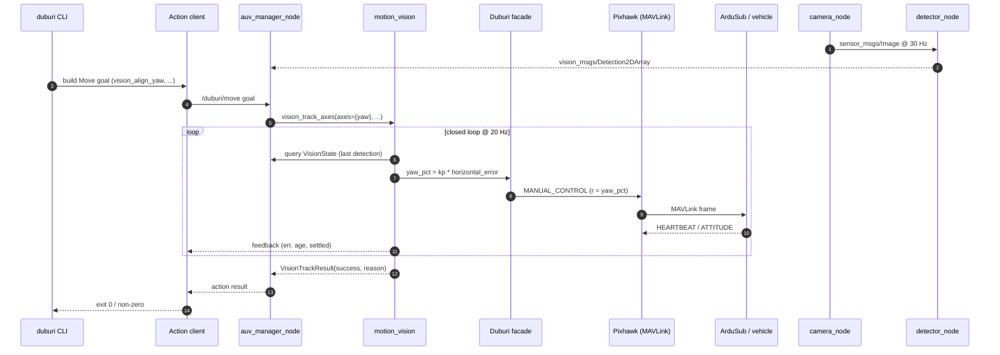
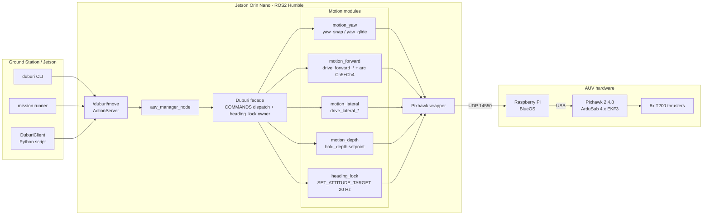
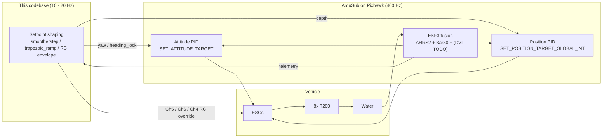
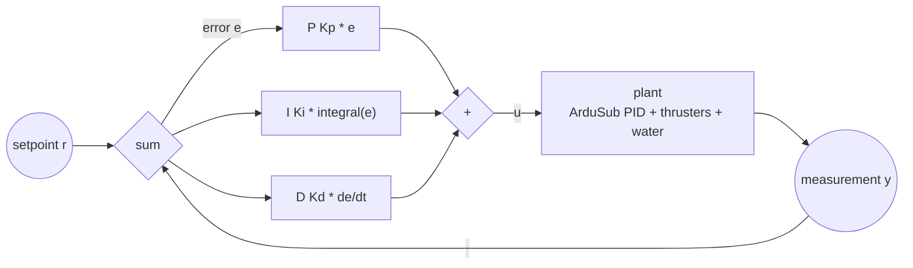
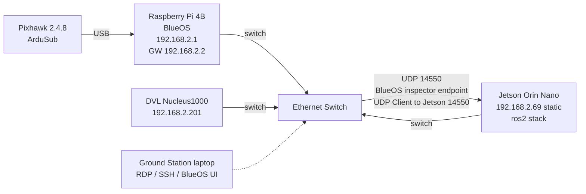
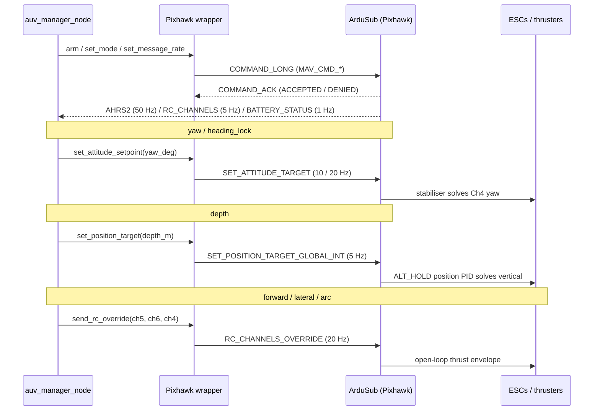

<h1 align="center">Mongla — <code>duburi_ws</code></h1>

<p align="center">
  <em>An AUV control stack named after the port that opens onto the Sundarbans.</em><br/>
  ROS 2 Humble · ArduSub · YOLO 26 · one action surface, axis-isolated control,
  vision in the same loop.
</p>

<p align="center">
  
</p>

<p align="center">
  
  
  
  
  
  
  
  
</p>

<p align="center">
  Mongla is a ROS 2 Humble control, mission, and simulation stack for ArduSub
  vehicles — one clean action surface (<code>/duburi/move</code>), one MAVLink
  owner, and per-axis motion modules behind a single dispatch table. The code is
  developed against an ArduSub SITL + Gazebo loop and field-tested on
  <strong>Duburi</strong>, a <code>vectored_6dof</code> 8-thruster AUV.
</p>

<p align="center">
  <a href="#quickstart-smoke-tests"><strong>Quickstart</strong></a> ·
  <a href="#concepts-in-5-videos"><strong>Concept videos</strong></a> ·
  <a href=".claude/context/mission-cookbook.md"><strong>Mission cookbook</strong></a> ·
  <a href="#9-command-cookbook-duburi-cli"><strong>CLI cookbook</strong></a> ·
  <a href="#3-architecture"><strong>Architecture</strong></a>
</p>

---

<p align="center">
  
</p>

### One verb, end to end

What actually happens when you type `ros2 run duburi_planner duburi vision_align_yaw --camera laptop --target_class person --duration 8`:



Same flow runs for every verb in §9 — only the motion module and the axes change. That single contract is why missions stay readable.

### What a session actually looks like

A pool-deck workflow is three terminals + one CLI prompt. Drop these into
`tmux` panes once and you never think about it again:

<table>
  <tr>
    <td align="center" width="25%">
      
      <br/><sub>Pre-flight: ports, UDP, BNO085, CUDA. <strong>~3 s.</strong></sub>
    </td>
    <td align="center" width="25%">
      
      <br/><sub>Connects MAVLink, owns Pixhawk, runs <code>/duburi/move</code>.</sub>
    </td>
    <td align="center" width="25%">
      
      <br/><sub>Camera + YOLO 26 + annotated debug stream. GPU-fast.</sub>
    </td>
    <td align="center" width="25%">
      
      <br/><sub>Where you actually drive the AUV. One verb per line.</sub>
    </td>
  </tr>
</table>

Exact commands for every pane live in [§5 Network setup](#5-network-setup) and
the [Quickstart smoke tests](#quickstart-smoke-tests) right below.

## Quickstart smoke tests

> Seven copy-paste scenarios, in the order you would actually run them.
> Each block lists **what success looks like** and **the exact commands**.
> All commands assume `source /opt/ros/humble/setup.bash && source install/setup.bash`.

### 0 — Bringup health check (no AUV needed)

Probes USB serial ports, BlueOS UDP stream, BNO085 USB CDC, and ROS env in
one shot. **Run this first** every session.

```bash
ros2 run duburi_manager bringup_check
```

Success: every line ends in `OK`. Failures print the missing piece (e.g.
"no Pixhawk on /dev/ttyACM*", "BNO085 not detected") with the exact fix.

### 1 — SIM only (Gazebo + ArduSub SITL, no real AUV)

In separate terminals (full SIM bring-up is documented in §8.1):

```bash
# T1: ArduSub SITL
sim_vehicle.py -L RATBeach -v ArduSub -f vectored_6dof --model=JSON \
    --out=udp:0.0.0.0:14550 --out=udp:127.0.0.1:14551 --console
# T2: manager (auto-detects sim mode via UDP 14550)
ros2 run duburi_manager auv_manager
# T3: drive it
ros2 run duburi_planner duburi arm
ros2 run duburi_planner duburi set_depth --target -0.5
ros2 run duburi_planner duburi move_forward --duration 3 --gain 60
ros2 run duburi_planner duburi disarm
```

Success: thrusters spin (open Gazebo for visuals — see §8.1), depth in T2
logs converges on -0.5 m, every CLI exits 0.

### 2 — Vision pipeline (webcam, no AUV)

```bash
# T1
ros2 launch duburi_vision webcam_demo.launch.py
# T2 -- inspect annotated frames
ros2 run rqt_image_view rqt_image_view /duburi/vision/laptop/image_debug
# T3 -- inspect raw detections
ros2 topic echo /duburi/vision/laptop/detections
```

Success: rqt_image_view shows your webcam with green bounding boxes around
people. The detector logs `in_hz=~30  with_target=>0%`.

### 3 — Vision + control loop (the big one)

The integration test: webcam drives the simulated BlueROV2 in Gazebo.

```bash
# T1: ArduSub SITL (see §8.1)
sim_vehicle.py -L RATBeach -v ArduSub -f vectored_6dof --model=JSON \
    --out=udp:0.0.0.0:14550 --out=udp:127.0.0.1:14551 --console
# T2: manager
ros2 run duburi_manager auv_manager
# T3: vision
ros2 launch duburi_vision webcam_demo.launch.py
# T4: drive
ros2 run duburi_planner duburi arm
ros2 run duburi_planner duburi set_depth --target -0.5
ros2 run duburi_planner duburi vision_align_yaw \
    --camera laptop --target_class person --duration 8
ros2 run duburi_planner duburi disarm
```

Success: when you move sideways in front of the webcam, the BlueROV2 yaws
to keep you centred. Manager logs `[vision] err=±0.0XX  ch4=±YY%`.

### 4 — Mission runner (auto-discovered)

```bash
ros2 run duburi_planner mission --list           # shows every missions/*.py
ros2 run duburi_planner mission move_and_see     # short open-loop + vision demo
ros2 run duburi_planner mission find_person_demo # full vision-driven walkthrough
```

Adding a new mission: drop `missions/<your_name>.py` exposing
`def run(duburi, log)`, rebuild `duburi_planner`, and it appears in
`--list` instantly. **No registry edit.** Full reference:
[.claude/context/mission-cookbook.md](.claude/context/mission-cookbook.md).

### 5 — Live-tune vision gains without restarting

While a vision verb / mission is running:

```bash
ros2 param set /duburi_manager vision.kp_yaw 80.0
ros2 param set /duburi_manager vision.deadband 0.06
ros2 param set /duburi_manager vision.target_bbox_h_frac 0.55
```

Every subsequent vision goal picks up the new value automatically — mission
files that omit those overrides use the live ROS-param value. Defaults live
in [src/duburi_manager/config/vision_tunables.yaml](src/duburi_manager/config/vision_tunables.yaml).

### 6 — BNO085 yaw source (plug-and-play)

Plug the ESP32-C3 + BNO085 into any USB port. The driver auto-probes
`/dev/serial/by-id/usb-Espressif*` and `/dev/ttyACM[0-9]` and locks onto
the first port that streams valid `{"yaw":..,"ts":..}` JSON.

Wire smoke-test (no MAVLink, no autopilot):

```bash
ros2 run duburi_sensors sensors_node --ros-args \
    -p yaw_source:=bno085               # bno085_port defaults to "auto"
```

Pin a specific port if you want determinism:

```bash
ros2 run duburi_sensors sensors_node --ros-args \
    -p yaw_source:=bno085 -p bno085_port:=/dev/ttyACM0
```

Calibrated, Earth-referenced (samples Pixhawk mag offset once, then
pure-gyro yaw — same path the manager uses):

```bash
ros2 run duburi_sensors sensors_node --ros-args \
    -p yaw_source:=bno085 -p calibrate:=true
```

Firmware + wiring contract: [src/duburi_sensors/firmware/esp32c3_bno085.md](src/duburi_sensors/firmware/esp32c3_bno085.md).
To make the manager use BNO085 instead of ArduSub AHRS, launch with
`-p yaw_source:=bno085` (and `-p bno085_port:=auto` is already the default).

---

## Concepts in 5 videos

> Watch these once if any of the underlying ideas feel hand-wavy. They cover
> the **engineering concepts** Mongla is built on, not Duburi specifics.
> Click any thumbnail to play on YouTube.

<table>
  <tr>
    <td align="center" width="33%">
      <a href="https://www.youtube.com/watch?v=UR0hOmjaHp0">
        
      </a>
      <br/>
      <strong>PID Control</strong><br/>
      <sub>Every motion verb (depth, yaw, vision-yaw) is a P or PI loop. Saves you a pool day.</sub>
    </td>
    <td align="center" width="33%">
      <a href="https://www.youtube.com/watch?v=MPU2HistivI">
        
      </a>
      <br/>
      <strong>YOLO Object Detection</strong><br/>
      <sub>The vision pipeline runs Ultralytics YOLO 26. Helps you read <code>detector_node</code> logs.</sub>
    </td>
    <td align="center" width="33%">
      <a href="https://www.youtube.com/watch?v=Ha66uKC-od0">
        
      </a>
      <br/>
      <strong>MAVLink protocol</strong><br/>
      <sub>Every Mongla command is one MAVLink message — see how the bytes line up.</sub>
    </td>
  </tr>
  <tr>
    <td align="center" width="33%">
      <a href="https://www.youtube.com/watch?v=X7YSnDbKMWo">
        
      </a>
      <br/>
      <strong>ROS 2 Actions</strong><br/>
      <sub><code>/duburi/move</code> is an Action: cancellable, gives feedback, returns a result.</sub>
    </td>
    <td align="center" width="33%">
      <a href="https://www.youtube.com/watch?v=4sSxPkhI9Do">
        
      </a>
      <br/>
      <strong>BlueROV2 platform</strong><br/>
      <sub>The Gazebo SITL target — same <code>vectored_6dof</code> frame as the real Duburi.</sub>
    </td>
    <td align="center" width="33%" valign="middle">
      <a href=".claude/context/mission-cookbook.md">
        
      </a>
      <br/>
      <strong>Mission Cookbook</strong><br/>
      <sub>Working principles, every verb, ten ready-to-steal mission samples.</sub>
    </td>
  </tr>
</table>

For the deeper architecture story (axis isolation, vision math, heading
lock thread model), browse [.claude/context/](.claude/context/) —
especially `axis-isolation.md`, `vision-architecture.md`, and the
[mission cookbook](.claude/context/mission-cookbook.md).

---

## 0. The name

**Mongla** (মোংলা) is Bangladesh's second seaport, opened in 1950 on the
confluence of the Pasur and Mongla rivers in Bagerhat district. It sits a
hundred-odd kilometres north of the Bay of Bengal, ringed on every side by
the **Sundarbans** — the largest contiguous mangrove forest in the world,
a UNESCO World Heritage site, and the home of the Royal Bengal tiger.
Where Chittagong is the country's industrial gateway, Mongla is its quieter
delta gateway: tidal channels, brown water, and ships threading the
mangroves to reach the sea.

This codebase borrows the name on purpose. The waters it imagines are
Bengal's: muddy, current-laden, magnetically noisy, GPS-denied. The
vehicle it drives — **Duburi** (ডুবুরি, Bengali for *diver*) — is the test
platform; the engineering principles below are written for the kinds of
estuaries Mongla itself sits inside.

---

## Table of Contents

- [Quickstart smoke tests](#quickstart-smoke-tests)
- [Concepts in 5 videos](#concepts-in-5-videos)

0. [The name](#0-the-name)
1. [What this repo is](#1-what-this-repo-is)
2. [Test platform at a glance](#2-test-platform-at-a-glance)
2A. [Real vehicle vs sim](#2a-real-vehicle-vs-sim)
3. [Architecture](#3-architecture)
4. [Code structure](#4-code-structure)
5. [Network setup](#5-network-setup)
6. [Prerequisites](#6-prerequisites)
7. [Build](#7-build)
8. [Run — three modes](#8-run--three-modes)
9. [Command cookbook (duburi CLI)](#9-command-cookbook-duburi-cli)
10. [Configuration guide](#10-configuration-guide)
10A. [Yaw source — duburi_sensors](#10a-yaw-source--duburi_sensors)
10B. [Vision — duburi_vision](#10b-vision--duburi_vision)
11. [Tuning guide](#11-tuning-guide)
12. [Telemetry & log cheatsheet](#12-telemetry--log-cheatsheet)
13. [Troubleshooting](#13-troubleshooting)
14. [Development workflow](#14-development-workflow)
15. [Roadmap](#15-roadmap)
16. [Further reading](#16-further-reading)
17. [Test platform & acknowledgments](#17-test-platform--acknowledgments)
18. [License](#18-license)

---

## 1. What this repo is

`duburi_ws` is a ROS2 Humble colcon workspace that exposes one clean action
surface — `/duburi/move` — over the top of ArduSub. One Python node owns
the MAVLink connection, receives goals, and dispatches them to per-axis
motion controllers. A companion CLI (`duburi`), a scripted mission runner
(`mission`), and a Python `DuburiClient` all live in `duburi_planner`.

> The historical workspace name `duburi_ws` and the action namespace
> `/duburi/*` are preserved because they correspond to the **test
> vehicle**, Duburi. The codebase itself is named **Mongla** — that's the
> branding used in this README and in commit messages.

Four packages live inside:

| Package             | Role                                                                                     |
|---------------------|------------------------------------------------------------------------------------------|
| `duburi_interfaces` | `Move.action` + `DuburiState.msg` — the only ROS surface every client talks to           |
| `duburi_control`    | `Pixhawk` MAVLink wrapper + axis-split motion controllers (`motion_forward`, `motion_lateral`, `motion_yaw`, `motion_depth`, `heading_lock`) + shared helpers (`motion_common`) + the `COMMANDS` registry |
| `duburi_manager`    | ROS2 node, action server, telemetry logger, connection profiles                           |
| `duburi_planner`    | `DuburiClient` Python API + `duburi` CLI + `mission` runner + `missions/*` scripts (YASMIN slot reserved under `state_machines/`) |
| `duburi_sensors`    | `YawSource` abstraction — MAVLink AHRS default, BNO085 (ESP32-C3 USB CDC) opt-in, DVL/WitMotion stubs |

Design principles we actually follow:

- **Axis-split control.** Forward (Ch5), lateral (Ch6), yaw, depth, and the
  curved `arc` verb each live in their own module (`motion_forward`,
  `motion_lateral`, `motion_yaw`, `motion_depth`). Each translation module
  has a bang-bang default (`drive_*_constant`) and a smoothed variant
  (`drive_*_eased`). Yaw has `yaw_snap` (default) and `yaw_glide` (opt-in).
  The `Duburi` facade is a lock plus a dispatch table.
- **Lock-aware neutrals.** `motion_common.Writers` builds axis-specific
  writers that automatically use `send_rc_translation` (leaving Ch4 free)
  whenever `heading_lock` is active, so a background yaw setpoint stream is
  never stomped by a translation command's neutral packet.
- **One source of truth for commands.** Every command is one row in
  `duburi_control/commands.py` and one method on `Duburi`. The action server,
  the `duburi` CLI, the `mission` runner, and the Python `DuburiClient` all
  read from `COMMANDS`, so adding a verb takes two edits — not five.
- **Preserve the proven default.** Smoothing is opt-in via two ROS parameters
  (`smooth_yaw`, `smooth_translate`). The defaults replay the same bang-bang
  behaviour that has the most wet-test hours behind it.
- **ArduSub does the hard bit.** Attitude *and* depth control both run on the
  flight controller at 400 Hz — we never fight them. We stream setpoints
  (`SET_ATTITUDE_TARGET` for yaw + `heading_lock`, `SET_POSITION_TARGET_GLOBAL_INT`
  for depth, `RC_CHANNELS_OVERRIDE` for translation/arc) and let the
  EKF3-fused AHRS2 yaw and Bar30 depth do their jobs.
- **Stop vs pause are different.** `stop()` actively holds RC neutral
  (1500 µs on every channel). `pause(N)` releases the override entirely
  (65535) for N seconds so the autopilot's own ALT_HOLD takes over, then
  re-engages neutral. Every translation verb also accepts a `settle=` kwarg
  for an extra post-command neutral-hold so the next command starts from
  zero residual velocity.
- **Sharp vs curved turns.** `yaw_left` / `yaw_right` are sharp pivots
  (`SET_ATTITUDE_TARGET`). `arc` keeps Ch5 thrust + Ch4 yaw stick in the
  same RC packet for car-style curved trajectories.
- **Heading-lock is yaw's depth-hold cousin.** `lock_heading` spins up a
  background `SET_ATTITUDE_TARGET` stream at 20 Hz; translations and `pause`
  run on top of it; `yaw_*` and `arc` suspend → execute → retarget; only
  `unlock_heading` (or shutdown) tears it down. It is **source-agnostic** —
  the same `YawSource` that feeds the manager (MAVLink AHRS, BNO085, or a
  Gazebo mock) also feeds the lock.
- **Every cross-command boundary is a hard reset.** Locks serialise, `stop()`
  forces RC neutral + clears the ACK cache, each axis module owns its exit
  semantics, and `settle=` plus `pause` close residual-inertia gaps between
  goals.

| Axis         | Setpoint message                  | Loop that closes it           | Our role                       |
|--------------|-----------------------------------|-------------------------------|--------------------------------|
| Yaw          | `SET_ATTITUDE_TARGET`             | ArduSub 400 Hz attitude PID   | stream + watch yaw_source      |
| Depth        | `SET_POSITION_TARGET_GLOBAL_INT`  | ArduSub ALT_HOLD position PID | stream + watch AHRS depth      |
| Forward      | `RC_CHANNELS_OVERRIDE` Ch5        | open loop (timed thrust)      | shape the thrust envelope      |
| Lateral      | `RC_CHANNELS_OVERRIDE` Ch6        | open loop (timed thrust)      | shape the thrust envelope      |
| Arc          | `RC_CHANNELS_OVERRIDE` Ch5+Ch4    | open loop                     | curved car-style trajectory    |
| Heading-lock | `SET_ATTITUDE_TARGET` (background) | ArduSub 400 Hz attitude PID   | stream until unlocked          |

---

## 2. Test platform at a glance

Mongla is developed against the test AUV **Duburi 4.2**. Any other ArduSub
`vectored_6dof` vehicle (e.g. BlueROV2 Heavy, BlueROV2 with extra
thrusters, custom Heavy clones) is a drop-in target — only the connection
profile changes.

| Component              | Hardware                                                          |
|------------------------|-------------------------------------------------------------------|
| Hull                   | **Duburi 4.2** — octagonal Marine 5083 aluminum, in-house         |
| Frame type (ArduSub)   | `vectored_6dof` (8× Blue Robotics T200) — same as BlueROV2 Heavy  |
| Flight controller      | Pixhawk 2.4.8 running ArduSub 4.x                                 |
| Companion              | Raspberry Pi running BlueOS (MAVLink router, web UI, video)       |
| Primary SBC            | Nvidia Jetson Orin Nano (all ROS2 nodes live here)                |
| Depth sensor           | Bar30 (ArduSub AHRS2 altitude)                                    |
| External IMU           | ESP32-C3 + BNO085 over USB CDC (gyro+accel, opt-in via param)     |
| DVL                    | Nortek Nucleus1000 @ `192.168.2.201` (driver TODO — stub only)    |
| Cameras                | Blue Robotics Low-Light HD USB (forward + downward)               |
| Tether                 | FathomX power-over-Ethernet                                       |
| Power                  | Dual LiPo (one propulsion, one compute+sensors — isolated rails)  |
| Payload                | Slingshot torpedo, aluminum grabber (current-sensed), solenoid dropper |
| Network switch         | Onboard 5-port, binds all three SBCs + DVL                        |

Active development goals:
1. Yaw and translation profiles smooth enough that vision-based PID can
   run on top without fighting the motion envelope.
2. Bring up the Nucleus1000 DVL driver and feed velocity into ArduSub's EKF3.
3. Plug in vision + `robot_localization` EKF when vision hardware lands.
4. Populate `duburi_planner/state_machines/` with YASMIN once mission
   logic outgrows linear scripts.

---

## 2A. Real vehicle vs sim

> **TL;DR — BlueROV2 Heavy is the Gazebo SITL target. The real test AUV is Duburi 4.2.** Both share the `vectored_6dof` 8-thruster ArduSub frame, which is why BlueROV2 is a faithful proxy for control development. Hull shape, mass, and payload geometry differ.

| Aspect             | Sim (Gazebo)                   | Real (Duburi 4.2)                           |
|--------------------|--------------------------------|---------------------------------------------|
| Hull               | BlueROV2 Heavy chassis         | Octagonal Marine 5083 aluminum, in-house    |
| Frame type         | `vectored_6dof` (8× T200)      | `vectored_6dof` (8× T200)                   |
| Compass            | Synthetic, drift-free          | Pixhawk mag — noisy near aluminum + thrusters |
| Heading source     | ArduSub AHRS                   | ArduSub AHRS *or* BNO085 (`yaw_source` param) |
| Depth sensor       | Sim plugin                     | Bar30                                       |
| DVL                | None                           | Nortek Nucleus1000 (driver pending)         |
| Payload            | None                           | Torpedo, grabber, dropper                   |

The full Duburi 4.2 spec block lives in
[.claude/context/vehicle-spec.md](.claude/context/vehicle-spec.md) — that's
the canonical reference for hardware on the test platform.

---

## 3. Architecture

### 3.1 End-to-end data flow



### 3.2 Control philosophy

We never close a Python control loop in the live path. ArduSub's onboard
400 Hz attitude + position PIDs do the actual stabilising; we stream
*setpoints*, then watch telemetry to decide when each goal is done.



### 3.3 PID without a PhD (cheat sheet)

The two onboard loops above are textbook PID; our setpoint-shaping is
deliberately the only thing we touch. See
[`pid-theory.md`](.claude/context/pid-theory.md) for the longer treatment.



Key data flow:

1. The CLI (or `mission` runner, or any other Python client) sends a `Move`
   goal to `/duburi/move`.
2. `auv_manager_node` is the **only** entity calling `recv_match` on the
   MAVLink connection. All reads go through a single reader; all writes go
   through `Pixhawk`.
3. The action executor looks up the verb in the `COMMANDS` registry and
   dispatches to a same-named method on `Duburi` via `getattr`.
4. The motion module loops at 10-20 Hz, reads cached telemetry, writes RC
   override or attitude target, and logs a `[DEPTH]` / `[YAW  ]` / `[FOR  ]`
   line every 0.5 s (rate-limited via rclpy `throttle_duration_sec`).
5. ArduSub's EKF3-fused stabiliser does the 400 Hz inner loop. Telemetry
   stream rates are pinned at startup with `MAV_CMD_SET_MESSAGE_INTERVAL`
   (AHRS2 = 50 Hz, RC_CHANNELS = 5 Hz, BATTERY_STATUS = 1 Hz).
6. The action result returns a `Move.Result` with either success or a
   MAVLink-grounded failure reason (`DENIED`, `NO_ACK`, timeout, ...).
7. `auv_manager_node` republishes a typed `DuburiState` message on
   `/duburi/state` whenever the snapshot changes (or every ~1 s as a
   heartbeat).

---

## 4. Code structure

```
duburi_ws/
├── build_duburi.sh                    # colcon build helper
├── README.md
├── CLAUDE.md                          # agent/context index
├── LICENSE
├── .claude/context/                   # research notes (ArduSub, PID, yaw, ...)
└── src/
    ├── duburi_interfaces/
    │   ├── action/Move.action
    │   └── msg/DuburiState.msg        # typed snapshot for /duburi/state
    ├── duburi_control/
    │   └── duburi_control/
    │       ├── pixhawk.py             # pymavlink wrapper + COMMAND_ACK + set_message_rate
    │       ├── commands.py            # COMMANDS registry (single source of truth)
    │       ├── motion_profiles.py     # smootherstep, trapezoid_ramp
    │       ├── motion_common.py       # shared constants + Writers (lock-aware) + thrust_loop
    │       ├── motion_yaw.py          # yaw_snap / yaw_glide (sharp pivots)
    │       ├── motion_forward.py      # drive_forward_* + arc (Ch5 / Ch5+Ch4 RC override)
    │       ├── motion_lateral.py      # drive_lateral_* (Ch6 RC override)
    │       ├── motion_depth.py        # hold_depth (ALT_HOLD + setpoint stream, lock-aware)
    │       ├── motion_vision.py       # vision_track_axes (Ch4/5/6 + depth, P-only) + vision_acquire
    │       ├── heading_lock.py        # background SET_ATTITUDE_TARGET streamer (yaw cousin of depth-hold)
    │       ├── duburi.py              # Duburi facade (lock + dispatch + heading_lock owner + vision_state_provider)
    │       └── errors.py              # MovementError / Timeout / ModeChangeError
    ├── duburi_sensors/
    │   ├── duburi_sensors/
    │   │   ├── factory.py             # name -> YawSource dispatch
    │   │   ├── sensors_node.py        # standalone diagnostic node
    │   │   └── sources/
    │   │       ├── base.py            # YawSource ABC
    │   │       ├── mavlink_ahrs.py    # ArduSub AHRS2 wrapper (default)
    │   │       ├── bno085.py          # ESP32-C3 + BNO085 over USB CDC
    │   │       ├── dvl_stub.py        # placeholder for Nucleus1000 yaw
    │   │       └── witmotion_stub.py  # placeholder for HWT905 / WT901C
    │   ├── firmware/
    │   │   └── esp32c3_bno085.md      # MCU-side wire contract + ref code
    │   └── config/sensors.yaml        # yaw_source / bno085_port / baud
    ├── duburi_manager/
    │   ├── duburi_manager/
    │   │   ├── auv_manager_node.py    # ROS2 node, ActionServer, telemetry, VisionState pool
    │   │   ├── vision_state.py        # per-camera Detection2DArray subscriber + bbox_error()
    │   │   └── connection_config.py   # PROFILES + NETWORK topology
    │   └── config/modes.yaml          # default ros parameters
    └── duburi_planner/
        └── duburi_planner/
            ├── client.py              # DuburiClient blocking ActionClient wrapper
            ├── cli.py                 # `duburi` command-line wrapper (auto-built from COMMANDS)
            ├── mission.py             # `mission` runner — dispatches into missions/<name>.run
            ├── missions/
            │   ├── square_pattern.py  # the legacy test_runner choreography
            │   ├── arc_demo.py        # sharp vs curved turn comparison
            │   ├── heading_lock_demo.py
            │   └── find_person_demo.py # full vision-driven 3D alignment demo
            └── state_machines/        # reserved for YASMIN-based plans
```

Every new command ends up in just two places:
1. One row in `duburi_control/commands.py` (`COMMANDS` dict — name, help text,
   accepted `Move.Goal` fields, and defaults).
2. A same-named method on `Duburi` in `duburi_control/duburi.py` returning a
   `Move.Result`.

The action server (`auv_manager_node.execute_callback`), the `duburi` CLI
(`duburi_planner/cli.py::_build_parser`), the `mission` runner
(`duburi_planner/mission.py`), and the Python client
(`DuburiClient.__getattr__`) all read from `COMMANDS` at runtime — no wiring
needed in any of them.

Only add a field to `Move.action` if you genuinely need a new parameter
shape; the existing `duration` / `degrees` / `meters` / `gain` / `timeout`
fields cover most verbs.

---

## 5. Network setup

### 5.1 Topology



### 5.1.1 MAVLink message flow we actually use



### 5.2 BlueOS endpoint configuration

On the BlueOS web UI (`http://192.168.2.1`) go to **Vehicle → Pixhawk →
Endpoints** and create:

| Field  | Value                 |
|--------|-----------------------|
| Name   | `inspector`           |
| Type   | `UDP Client`          |
| IP     | `192.168.2.69`        |
| Port   | `14550`               |

ROS2 side listens on `udpin:0.0.0.0:14550`. The same line works in sim,
laptop, and pool modes because BlueOS pushes MAVLink to us; we never dial
out. The canonical values live in
[src/duburi_manager/duburi_manager/connection_config.py](src/duburi_manager/duburi_manager/connection_config.py)
inside the `NETWORK` dict.

### 5.3 Sanity checks before a session

The fast path is a single command:

```bash
ros2 run duburi_manager bringup_check
```

It probes the canonical Pi (`192.168.2.1`) and Jetson (`192.168.2.69`)
IPs, looks for an active MAVLink stream on UDP `14550`, enumerates any
Pixhawk USB CDC devices, and tests BNO085 auto-detection -- printing
PASS / WARN / FAIL per check and a launch hint at the end. Exit code is
`0` when nothing failed, `1` otherwise (so it composes in scripts).

Manual probes if you want to double-check:

```bash
ping -c 3 192.168.2.1             # BlueOS reachable
ping -c 3 192.168.2.69            # Jetson reachable (from laptop on switch)
ss -lun | grep 14550              # UDP 14550 bound & listening (after auv_manager is up)
timeout 5 tcpdump -i any udp port 14550 -c 10  # see MAVLink bytes flowing (needs root)
```

The `auv_manager` startup banner prints the expected BlueOS peer whenever
`mode:=pool` or `mode:=laptop` — if the printed IP doesn't match your
BlueOS endpoint config, fix BlueOS first.

### 5.4 Plug-and-play mode

`mode:=auto` (the default) makes the manager pick its own connection
profile at startup:

| Probe                                                  | Picked profile |
| ------------------------------------------------------ | -------------- |
| UDP `14550` already in use (BlueOS pushing MAVLink)    | `pool`         |
| Pixhawk USB CDC present (`/dev/serial/by-id/*ardupilot*` or `/dev/ttyACM0`) | `desk` |
| Neither                                                | `sim`          |

Pin a specific profile by passing `-p mode:=pool` (or `desk`/`sim`/`laptop`).
The startup banner always prints the resolved mode so you can see what
auto-detect picked.

---

## 6. Prerequisites

- **OS:** Ubuntu 22.04 (native, WSL2, or distrobox). The reference dev
  environment runs inside a distrobox with CUDA 12.8 on an Arch host and
  ROS2 Humble inside the box.
- **ROS2:** Humble Hawksbill (`sudo apt install ros-humble-desktop`).
- **Python:** 3.10 (ships with 22.04).
- **Python deps:** `pymavlink`, installed automatically by `colcon build`
  via the `install_requires` in `setup.py`.
- **For sim:** ArduPilot SITL + `sim_vehicle.py`, Gazebo Harmonic or Ignition
  (see `.claude/context/sim-setup.md`).
- **For hardware:** access to the AUV switch (either tethered laptop or
  onboard Jetson), BlueOS running on the Raspberry Pi.

---

## 7. Build

From the workspace root:

```bash
./build_duburi.sh
source install/setup.bash
```

The helper script:
1. Builds `duburi_interfaces` first (generates `Move` action types).
2. Builds `duburi_control` + `duburi_manager`.
3. Copies Debian-installed Python packages to the ament-expected layout
   (works around a Debian-vs-ament install quirk in colcon).
4. Symlinks executables so `ros2 run` can find them.

If you have already built once and only touched Python code, a plain
`colcon build --symlink-install --packages-select duburi_control duburi_manager`
is faster.

---

## 8. Run — three modes

### 8.1 SIM (Docker + Gazebo + ArduSub SITL)

Terminal 1 — ArduSub SITL:

```bash
sim_vehicle.py -L RATBeach -v ArduSub -f vectored_6dof --model=JSON \
    --out=udp:0.0.0.0:14550 --out=udp:127.0.0.1:14551 --console
```

Terminal 2 — Gazebo (optional, for visuals):

```bash
cd ~/Ros_workspaces/colcon_ws
gz sim -v 3 -r src/bluerov2_gz/worlds/bluerov2_underwater.world
```

Terminal 3 — manager node:

```bash
source install/setup.bash
ros2 run duburi_manager auv_manager --ros-args -p mode:=sim
```

Terminal 4 — commands via CLI (see §9).

### 8.2 DESK (Pixhawk via USB)

Plug the Pixhawk directly into the laptop or Jetson over USB. Grant serial
access on first use:

```bash
sudo usermod -aG dialout "$USER"   # log out / back in after the first time
ls -l /dev/ttyACM0                 # should show crw-rw---- root dialout
```

Start the node:

```bash
ros2 run duburi_manager auv_manager --ros-args -p mode:=desk
```

Useful for bench-testing ESC signals, calibration, and dry MAVLink plumbing
work without water.

### 8.3 POOL / HARDWARE (Jetson + BlueOS over switch)

1. Power on the AUV; confirm the switch link lights come up.
2. On a laptop on the same switch, open `http://192.168.2.1` and confirm
   the BlueOS `inspector` endpoint matches §5.2.
3. SSH into the Jetson:

   ```bash
   ssh fh1m@192.168.2.69
   cd ~/Ros_workspaces/duburi_ws
   source install/setup.bash
   ros2 run duburi_manager auv_manager --ros-args -p mode:=pool
   ```

4. Expected startup banner:

   ```
    DUBURI AUV MANAGER  │  mode: pool
    MAVLink: sys=1 comp=0  (v2.0)
    Profiles: yaw=snap  translate=constant
    Expect BlueOS "inspector" → UDP Client 192.168.2.69:14550
   ```

5. Within ~2 s you should see a `[STATE]` line. If not, the endpoint is
   misconfigured or the switch isn't bridged — see §13.

---

## 9. Command cookbook (`duburi` CLI)

All commands go through the `/duburi/move` action server and block until
the goal succeeds, fails, or times out. The CLI exits with code 0 on
success and 1 on failure so it composes cleanly in shell pipelines.

```bash
# Power / mode
ros2 run duburi_planner duburi arm
ros2 run duburi_planner duburi set_mode --target_name ALT_HOLD
ros2 run duburi_planner duburi disarm

# Translations (duration seconds, optional gain %, optional settle s)
ros2 run duburi_planner duburi move_forward --duration 5 --gain 80
ros2 run duburi_planner duburi move_back    --duration 3 --gain 70 --settle 1.0
ros2 run duburi_planner duburi move_left    --duration 4
ros2 run duburi_planner duburi move_right   --duration 2 --gain 60

# Depth (metres, negative = below surface; engages ALT_HOLD if needed)
ros2 run duburi_planner duburi set_depth --target -1.5

# Sharp pivot (degrees, signed by verb; suspends heading_lock if active)
ros2 run duburi_planner duburi yaw_left  --target 90
ros2 run duburi_planner duburi yaw_right --target 45

# Curved trajectory (forward thrust + signed yaw stick in same RC packet)
ros2 run duburi_planner duburi arc --duration 4 --gain 50 --yaw_rate_pct 30

# Heading lock (background SET_ATTITUDE_TARGET stream until unlocked)
ros2 run duburi_planner duburi lock_heading --target 0 --timeout 120
ros2 run duburi_planner duburi unlock_heading

# Emergency neutral (active hold — RC set to 1500 on every channel)
ros2 run duburi_planner duburi stop

# Pause (release the RC override for N seconds — autopilot takes over)
ros2 run duburi_planner duburi pause --duration 2.0

# Vision-driven verbs (need duburi_vision pipeline up; see §10B)
ros2 run duburi_planner duburi vision_acquire --camera laptop --target_class person \
    --target_name yaw_left --timeout 30 --gain 25 --yaw_rate_pct 25
ros2 run duburi_planner duburi vision_align_yaw   --camera laptop --target_class person --duration 15
ros2 run duburi_planner duburi vision_align_lat   --camera laptop --target_class person --duration 15
ros2 run duburi_planner duburi vision_align_depth --camera laptop --target_class person --duration 15
ros2 run duburi_planner duburi vision_hold_distance --camera laptop --target_class person \
    --target_bbox_h_frac 0.55 --duration 20
ros2 run duburi_planner duburi vision_align_3d --camera laptop --target_class person \
    --axes yaw,forward,depth --duration 30 --target_bbox_h_frac 0.55
```

> The CLI is generated from `COMMANDS`, so every command takes its parameters
> as named flags. Field names map straight to fields on `Move.action`
> (`duration`, `gain`, `target`, `target_name`, `timeout`, `settle`,
> `yaw_rate_pct`). Run `ros2 run duburi_planner duburi <cmd> --help` for the
> exact list per verb.

Sensor smoke-test (no thrusters, no ArduSub interaction — see §10A):

```bash
# Default — reads ArduSub AHRS via the same UDP endpoint as the manager.
# Stop the manager first, or this prints STALE.
ros2 run duburi_sensors sensors_node

# External BNO085 — runs without MAVLink, useful before pool runs.
ros2 run duburi_sensors sensors_node \
    --ros-args -p yaw_source:=bno085 -p bno085_port:=/dev/ttyACM0
```

Scripted missions live in
[src/duburi_planner/duburi_planner/missions/](src/duburi_planner/duburi_planner/missions/).
List and run them via the CLI:

```bash
ros2 run duburi_planner mission --list
ros2 run duburi_planner mission square_pattern
ros2 run duburi_planner mission arc_demo
ros2 run duburi_planner mission heading_lock_demo
ros2 run duburi_planner mission find_person_demo   # vision-driven 3D alignment demo
```

For programmatic use from Python, import `DuburiClient` from
`duburi_planner`. Every command in `COMMANDS` is also accessible as a
method on the client (via `__getattr__`), or you can use
`client.send(cmd, **fields)` directly:

```python
from duburi_planner import DuburiClient, MoveRejected, MoveFailed
import rclpy
from rclpy.node import Node

rclpy.init()
node = Node('my_mission')
dc = DuburiClient(node)
dc.wait_for_connection()

try:
    dc.arm()                                          # uses defaults from COMMANDS
    dc.set_mode(target_name='ALT_HOLD')
    dc.set_depth(target=-1.5)
    dc.lock_heading(target=0.0, timeout=120.0)        # background yaw hold
    dc.move_forward(duration=5.0, gain=80, settle=0.8)
    dc.arc(duration=4.0, gain=50, yaw_rate_pct=30)    # curved manoeuvre
    dc.yaw_left(target=90.0)                          # sharp pivot, lock retargets
    dc.send('pause', duration=2.0)                    # equivalent to dc.pause(duration=2.0)
    dc.unlock_heading()
    dc.disarm()
except MoveRejected as exc:
    node.get_logger().error(f'goal rejected by server: {exc}')
except MoveFailed as exc:
    node.get_logger().error(f'goal failed: {exc}')
```

### 9.1 Mission DSL — `duburi` + `duburi.vision`

For mission scripts, prefer the
[`DuburiMission`](src/duburi_planner/duburi_planner/duburi_dsl.py) wrapper
over the raw `DuburiClient`. Every mission file in
`src/duburi_planner/duburi_planner/missions/` exposes one
`run(duburi, log)` function and gets the wrapped object for free:

```python
def run(duburi, log):
    duburi.target = 'person'                       # sticky context
    duburi.arm()
    duburi.set_depth(-0.5)
    duburi.move_forward(3.0, gain=60)              # open-loop verb
    duburi.vision.find(sweep='right')              # closed-loop, vision-driven
    duburi.vision.lock(axes='yaw,forward',         # multi-axis simultaneous hold
                       distance=0.55,
                       duration=12)
    duburi.move_back(2.0, gain=60)
    duburi.disarm()
```

Two namespaces, one mental model:

- `duburi.*` -- open-loop motion (arm, set_depth, move_*, yaw_*, arc, lock_heading, ...).
- `duburi.vision.*` -- closed-loop motion that mirrors the SAME axis names
  (`vision.yaw`, `vision.lateral`, `vision.depth`, `vision.forward`,
  `vision.find`, `vision.lock`).

Vision verbs read sticky `duburi.camera` / `duburi.target` and fall through
to `auv_manager_node`'s live `vision.*` ROS params when overrides are left
unset -- so deck-side tuning works without touching mission code. Every
verb accepted on the action server is also reachable as
`duburi.<name>(...)` via fall-through on the wrapper.

Full design + working principles + ten ready-to-steal samples:
[`.claude/context/mission-cookbook.md`](.claude/context/mission-cookbook.md).

---

## 10. Configuration guide

All parameters declared on `auv_manager_node`:

| Parameter          | Type     | Default          | Values / effect                                                                    |
|--------------------|----------|------------------|------------------------------------------------------------------------------------|
| `mode`             | `string` | `auto`           | `auto` (probes UDP 14550 + Pixhawk USB and picks `pool`/`desk`/`sim`), or pin one of `sim`, `pool`, `laptop`, `desk` |
| `smooth_yaw`       | `bool`   | `false`          | `true` → `yaw_glide` (smootherstep setpoint sweep, no overshoot)                   |
| `smooth_translate` | `bool`   | `false`          | `true` → `drive_*_eased` (trapezoid thrust, settle-only brake; forward + lateral)  |
| `yaw_source`       | `string` | `mavlink_ahrs`   | `mavlink_ahrs` (ArduSub onboard) \| `bno085` (ESP32-C3 + BNO085); same source feeds `lock_heading` |
| `bno085_port`      | `string` | `auto`           | `auto` (probes `/dev/serial/by-id/usb-Espressif*` + `/dev/ttyACM*`) or explicit USB CDC path |
| `bno085_baud`      | `int`    | `115200`         | BNO085 stream baud rate                                                            |
| `vision.kp_yaw` / `vision.kp_lat` / `vision.kp_depth` / `vision.kp_forward` | `double` | 60 / 60 / 0.05 / 200 | Per-axis P gains used by every `vision_*` verb when the goal field is left at the rosidl zero default. Tune live with `ros2 param set /duburi_manager vision.kp_yaw 80.0`. |
| `vision.deadband`  | `double` | `0.10`           | Per-axis settle band for vision verbs (0..1). Override per goal by passing the matching field, otherwise this lives default applies. |
| `vision.target_bbox_h_frac` | `double` | `0.55`  | Distance proxy used by `vision_hold_distance` / `vision_align_3d` when the goal field is unset. |
| `vision.stale_after` | `double` | `0.8`          | Seconds after which a Sample is treated as lost.                                  |
| `vision.on_lost`   | `string` | `fail`           | `fail` (raise) or `hold` (park, never raise). Per-goal override still wins.        |
| `vision.acquire_yaw_rate_pct` / `vision.acquire_gain` | `double` | 22 / 25 | Sweep speed and forward thrust used by `vision_acquire` (`duburi.vision.find`). |

> The executable is registered under both names: `auv_manager` and `auv_manager_node` resolve to the same node.
>
> Yaw commands need a mode that tracks **absolute** heading. ArduSub honours `SET_ATTITUDE_TARGET` only in `ALT_HOLD` / `POSHOLD` / `GUIDED`. In `MANUAL` it's silently dropped; in `STABILIZE` it's treated as a yaw *rate* (and there's no depth hold, so the sub sinks during the turn). The node therefore auto-engages `ALT_HOLD` if you call `yaw_left` / `yaw_right` from `MANUAL` or `STABILIZE`; if you've already run `set_depth` (which engages `ALT_HOLD`) the existing mode is preserved.

Examples:

```bash
# Defaults (both step) — proven bang-bang behaviour
ros2 run duburi_manager auv_manager

# Smoother yaw only (fight overshoot without changing linear feel)
ros2 run duburi_manager auv_manager --ros-args -p smooth_yaw:=true

# Both smoothed, pool mode
ros2 run duburi_manager auv_manager --ros-args \
    -p mode:=pool -p smooth_yaw:=true -p smooth_translate:=true
```

A YAML preset lives at
[src/duburi_manager/config/modes.yaml](src/duburi_manager/config/modes.yaml).
Use it like:

```bash
ros2 run duburi_manager auv_manager \
    --ros-args --params-file src/duburi_manager/config/modes.yaml
```

---

## 10A. Yaw source — `duburi_sensors`

ArduSub's onboard AHRS is the default and works fine in sim. For pool /
real-world runs where the Pixhawk's compass is noisy near aluminium
frames or thrusters, you can swap in an external yaw source without
touching any control-side code. The package is **sensor-only** — no
fusion, no fallback, no mid-run switching. You pick one source per
launch, and if it goes silent the control loop holds its last value.

### Architecture

```
+-----------------------------+         +------------------------+
|   auv_manager_node          |         |   sensors_node         |
|   (control + ActionServer)  |         |   (diagnostic only)    |
+-----------------------------+         +------------------------+
              |                                    |
              | yaw_source param                   |
              v                                    v
        +-----------------------------------------------+
        |   make_yaw_source(name, **kw)  (factory)      |
        +-----------------------------------------------+
          |              |              |             |
          v              v              v             v
   MavlinkAhrs   BNO085Source    DVLSource (stub)   WitMotion (stub)
   (default)     (USB CDC JSON)  raises NotImpl     raises NotImpl
```

Every source implements the same three-method contract: `read_yaw()`,
`is_healthy()`, `close()`. Yaw is always degrees in `[0, 360)`,
Earth-referenced (magnetic north, +CW from above) — same convention
everywhere downstream.

### Switching source

```bash
# Default — ArduSub onboard AHRS (no extra hardware)
ros2 run duburi_manager auv_manager_node

# External — ESP32-C3 + BNO085 over USB CDC
# Default port=auto: probes /dev/serial/by-id/usb-Espressif* + /dev/ttyACM* and
# picks the first device that streams a valid {"yaw":..,"ts":..} JSON line.
ros2 run duburi_manager auv_manager_node --ros-args -p yaw_source:=bno085

# Pin an explicit port if you have multiple ACM devices and don't want probing.
ros2 run duburi_manager auv_manager_node \
    --ros-args -p yaw_source:=bno085 \
               -p bno085_port:=/dev/ttyACM0 \
               -p bno085_baud:=115200
```

If the chosen source can't initialise (e.g. wrong serial port), the node
**fails loudly at startup** rather than silently falling back. The
operator picked it; the operator gets told.

### Bootstrap calibration (BNO085 only)

The BNO085 firmware runs in `SH2_GAME_ROTATION_VECTOR` mode — gyro +
accelerometer fusion with the magnetometer **disabled**. That gives us
a smooth heading that is immune to the magnetic interference inside
the AUV (8 thrusters + battery currents + aluminum (Marine 5083) hull), but with no
absolute Earth reference: the chip's "yaw=0" is whatever direction it
was pointing at boot.

To turn that into an Earth-referenced heading without ever using the
BNO's mag, the manager performs a **one-shot calibration** at startup:

```
offset_deg = pixhawk_yaw  -  bno_raw_yaw    # captured once, locked
earth_yaw  = (bno_raw + offset_deg) mod 360 # applied forever after
```

* The Pixhawk magnetometer is read **once** during the first ≤5 s of
  startup, then never again. Run the calibration at the surface, away
  from large metal objects, with the AUV held level.
* If either the BNO or the Pixhawk yaw stays unavailable for more than
  the calibration timeout, the node aborts with a `RuntimeError` —
  same loud-failure policy as the rest of `duburi_sensors`.
* The locked offset is printed in the startup banner:

  ```
  Yaw source: BNO085 (/dev/ttyACM0 @ 115200)  Earth-ref offset: +124.30°
  ```

* Drift profile after calibration: the BNO085's bias-stabilised gyro
  drifts ~0.5 °/min in steady conditions — for a 2-3 minute mission
  that is well below pool-test repeatability.
* To re-zero the offset (e.g. after the AUV has been re-mounted),
  restart the manager. There is no mid-run recalibration on purpose;
  see `.claude/context/sensors-pipeline.md` for the rationale.

The diagnostic node accepts a `calibrate:=true` flag to exercise the
exact same code path without launching the full manager:

```bash
ros2 run duburi_sensors sensors_node --ros-args \
    -p yaw_source:=bno085 -p calibrate:=true \
    -p bno085_port:=/dev/ttyACM0
```

Without `calibrate:=true`, the diagnostic node prints **raw** BNO yaw
(sensor frame) — useful for verifying the wire, useless for navigation.

### Standalone diagnostic node

Before doing a mission with a new source, run the diagnostic node — it
talks to the sensor with no thrusters, no MAVLink-arming, no autopilot
side effects:

```bash
# AHRS via MAVLink (don't run alongside the manager — UDP port collision)
ros2 run duburi_sensors sensors_node

# BNO085 only (no MAVLink connection at all — pure desk test)
ros2 run duburi_sensors sensors_node \
    --ros-args -p yaw_source:=bno085 -p bno085_port:=/dev/ttyACM0
```

Output every 0.5 s:

```
[INFO] [SENSOR] yaw=123.45°  healthy=True   rx_hz= 49.8  total=1240
```

`rx_hz` is the per-second sample rate the source is producing — for a
healthy BNO085 stream that should sit at ~50 Hz. If you see `STALE`,
the wire is broken, the firmware crashed, or the chip is held by
another process.

### Adding a new source

1. Write `src/duburi_sensors/duburi_sensors/sources/my_sensor.py`
   subclassing `YawSource`. Mirror the threading + stale-detection
   pattern from `bno085.py`.
2. Add a builder + entry to `_BUILDERS` in
   [src/duburi_sensors/duburi_sensors/factory.py](src/duburi_sensors/duburi_sensors/factory.py).
3. Document the wire format in `src/duburi_sensors/firmware/<sensor>.md`.

That's it — no changes to `duburi_control` or `duburi_manager`.

### BNO085 firmware

The MCU-side contract (JSON-line over USB CDC at 115200, 50 Hz) and a
reference Arduino sketch live in
[src/duburi_sensors/firmware/esp32c3_bno085.md](src/duburi_sensors/firmware/esp32c3_bno085.md).
Smoke-test the wire from the Jetson with `cat /dev/ttyACM0` first;
if you don't see JSON, the Jetson side won't see it either.

---

## 10B. Vision — `duburi_vision`

The perception package: a uniform `Camera` interface, a YOLO26 detector
that runs GPU-first, a `draw` module of on-image overlays that turn
"is the AUV aligned with the target?" from a guess into a single glance
at the debug image, and **six `vision_*` verbs on `/duburi/move`** that
let any client (CLI / mission / state machine) close the loop on a
detection. Tracking and Kalman filtering are scoped for v2/v3 and have
placeholder `PLAN.md` files in
[src/duburi_vision/duburi_vision/tracking/](src/duburi_vision/duburi_vision/tracking/PLAN.md)
and [filters/](src/duburi_vision/duburi_vision/filters/PLAN.md).

### Architecture

```
+------------------------+     +-------------------------+     +-----------------------+
|  camera_node           | --> |  detector_node          | --> |  auv_manager_node     |
|  Camera factory:       |     |  YoloDetector (YOLO26)  |     |  VisionState pool     |
|  webcam / ros_topic /  |     |  + draw.render_all()    |     |  + motion_vision loop |
|  jetson / blueos /     |     |  -> Detection2DArray    |     |  RC Ch4/5/6 + depth   |
|  mavlink (stubs)       |     |  -> image_debug         |     +-----------------------+
+------------------------+     +-------------------------+              ^
                                                                        |
                                                       /duburi/move (vision_* verbs)
```

The closed loop runs **inside the manager** — the same node that owns
MAVLink — so vision and control never fight for thrust. `VisionState`
is a per-camera subscriber pool, lazily built on first `vision_*` goal
with a one-shot `wait_vision_state_ready` preflight (logs which topic
is missing if the pipeline isn't up).

One camera per `camera_node` instance, picked by `profile:=` (matched against
`CAMERA_PROFILES` in [config.py](src/duburi_vision/duburi_vision/config.py)
and [config/cameras.yaml](src/duburi_vision/config/cameras.yaml)) or by an
explicit `source:=` + source-specific overrides. Adding a new source = one
row in `factory.BUILDERS` + a class — same UX as `duburi_sensors`.

### Topics

| Topic                                          | Type                          | Notes                                              |
|------------------------------------------------|-------------------------------|----------------------------------------------------|
| `/duburi/vision/<cam>/image_raw`               | `sensor_msgs/Image`           | Published by `camera_node` at the source's rate    |
| `/duburi/vision/<cam>/camera_info`             | `sensor_msgs/CameraInfo`      | Size only (K/D empty until we ship a calib file)   |
| `/duburi/vision/<cam>/detections`              | `vision_msgs/Detection2DArray`| One row per detection, hypothesis class id is str  |
| `/duburi/vision/<cam>/image_debug`             | `sensor_msgs/Image`           | Rate-limited overlay (default 5 Hz)                |

### GPU contract

`detector_node` calls `select_device()` once at startup. It logs a single
canary line you should grep for during deployment:

```
[VIS ] using cuda:0 (NVIDIA GeForce RTX 2060)  torch=2.11.0+cu128  cuda=12.8
```

`device:=cuda:0` is **fail-fast** — a missing/broken CUDA install raises
on init with a friendly message instead of silently falling back to CPU.
Set `device:=cpu` to opt out, or `device:=auto` for tests/CI.

### Visual cues in `image_debug`

Every glyph answers a specific question an operator will ask:

| Glyph                                           | Question it answers                       |
|-------------------------------------------------|-------------------------------------------|
| Top-left status badge (src / fps / dev / det)   | Is the camera streaming? Which device?    |
| Dashed center reticle                           | Operator's reference frame                |
| Light-gray boxes + labels                       | What did the model see?                   |
| Thick amber box + filled corners + crosshair    | Which target is being chased?             |
| Arrow center -> target                          | Which way must the AUV rotate / strafe?   |
| Bottom-left alignment readout (err_x, err_y)    | How well aligned is the AUV? (-1..+1)     |
| Red full-width "STALE FRAME" banner             | Catastrophic state — source unhealthy     |

The badge border is green when healthy and red when not, so you can spot
breakage in a single glance. If anything looks wrong, screenshot
`image_debug` and paste it into a bug report — every diagnostic state is
visible in one frame.

### Vision verbs (v4)

The six `vision_*` verbs share the same `/duburi/move` action surface as
every other command — same `DuburiClient`, same CLI auto-generation, same
result envelope. See §9 for a CLI cookbook.

| Verb                    | Closes the loop on …                                        | Output channels                      |
|-------------------------|-------------------------------------------------------------|--------------------------------------|
| `vision_align_3d`       | Centre + maintain distance on largest target_class. CSV `axes` picks subset of `yaw,lat,depth,forward`. | Ch4 / Ch5 / Ch6 + depth setpoint     |
| `vision_align_yaw`      | Horizontal centring (yaw stick).                             | Ch4                                  |
| `vision_align_lat`      | Horizontal centring (lateral strafe).                        | Ch6                                  |
| `vision_align_depth`    | Vertical centring (incremental ALT_HOLD setpoint).           | Depth setpoint                       |
| `vision_hold_distance`  | Drive forward/back so bbox height matches `target_bbox_h_frac`. | Ch5                               |
| `vision_acquire`        | Block (optionally driving via `target_name` verb) until target seen at least once. | Drive verb of choice |

Common knobs: `camera`, `target_class`, `deadband`, gain knobs (`kp_yaw`,
`kp_lat`, `kp_depth`, `kp_forward`), `target_bbox_h_frac`, and `on_lost`
(`'fail'` default; `'hold'` to ride out a flicker). Defaults are tuned
for a webcam-detected `'person'` so a fresh checkout works out of the
box. Architecture details: [`.claude/context/vision-architecture.md`](.claude/context/vision-architecture.md).

### Quickstart

```bash
# Lab dev: laptop webcam + YOLO26 + rqt viewer (one terminal)
ros2 launch duburi_vision webcam_demo.launch.py

# Subscribe to a Gazebo image topic instead
ros2 launch duburi_vision sim_demo.launch.py topic:=/your/image/topic

# Single-process smoke test (no inter-node hop, mirrors sensors_node)
ros2 run duburi_vision vision_node --ros-args -p profile:=laptop

# CPU fallback if you don't have CUDA
ros2 launch duburi_vision webcam_demo.launch.py cls_device:=cpu
```

### Pipeline diagnostics

```bash
# Topic-only health probe (no thrust, no manager required)
ros2 run duburi_vision vision_check --camera laptop --require-class person

# Detection -> RC echo: send one vision_align_yaw, watch [RC] Yaw on the manager
ros2 run duburi_vision vision_thrust_check --camera laptop --duration 4

# Full vision-driven 3D mission (acquire -> align yaw -> hold distance -> 3D align)
ros2 run duburi_planner mission find_person_demo
```

> **Gazebo note:** the `bluerov2_gz` model used today doesn't ship a camera
> plugin. Either add a `<sensor type="camera"/>` block + `ros_gz` image
> bridge to the world, or point `topic:=` at any other Image publisher
> (a re-published webcam works for end-to-end smoke tests).

---

## 11. Tuning guide

### 11.1 Depth — onboard ArduSub controller

Depth is no longer driven by a Python PID. We send an absolute depth
setpoint via `SET_POSITION_TARGET_GLOBAL_INT` and ArduSub's onboard 400 Hz
position controller closes the loop. This mirrors how yaw is driven via
`SET_ATTITUDE_TARGET` — one source of truth per axis, no stacked loops.

The flow in [src/duburi_control/duburi_control/motion_depth.py](src/duburi_control/duburi_control/motion_depth.py):

1. `Duburi.set_depth` engages `ALT_HOLD` (the only mode that honours
   absolute Z setpoints and also holds depth between frames).
2. **`prime_alt_hold` (0.5 s)** — stream the *current* depth as the
   target while sending neutral RC. This drains the well-known stale
   ALT_HOLD integrator state from the previous mode (Blue Robotics
   forum: ["Depth Hold Problems?"](https://discuss.bluerobotics.com/t/depth-hold-problems/8993)).
3. **`wait_for_depth`** — stream the real target at 5 Hz; exit when
   |error| < 0.07 m or timeout, log the closest depth reached.

If you need to tune depth response, do it on the **ArduSub side** via QGC
(parameters live on the Pixhawk, not in our code):

| ArduSub param   | Effect                                            |
|-----------------|---------------------------------------------------|
| `PSC_POSZ_P`    | Depth position gain. Default 1.0. Raise for snap. |
| `PSC_VELZ_P`    | Depth velocity gain. Default 5.0.                 |
| `PILOT_SPD_UP`  | Max ascend rate (cm/s). Default 50.               |
| `PILOT_SPD_DN`  | Max descend rate (cm/s). Default 50.              |
| `PILOT_ACCEL_Z` | Vertical accel limit. Lower = smoother profile.   |

> The Python-side `DepthPID` / `YawPID` classes that used to live in
> `movement_pids.py` have been removed — ArduSub's onboard PID is the only
> control loop in the live path. PID theory and tuning notes are still
> documented in [`.claude/context/pid-theory.md`](.claude/context/pid-theory.md)
> (based on *PID without a PhD*) and the previous Python implementation can
> be recovered from git history if it's ever needed as a hot-fix fallback.

### 11.2 Smoothing flags

| Flag                | Math                                                             | When to enable                               |
|---------------------|------------------------------------------------------------------|----------------------------------------------|
| `smooth_yaw`        | Setpoint streamed as `start + delta * smootherstep(t/dur)`       | Seeing yaw overshoot or fighting inertia     |
| `smooth_translate`  | Thrust = `gain * trapezoid_ramp(t, dur, ramp=0.4s)`              | Seeing lurch at start or backward drift at end |

Both flags are independent — you can mix and match.

### 11.3 Translation brake

Each translation variant owns its own exit. The shared loop + brake-kick
logic lives in
[src/duburi_control/duburi_control/motion_common.py](src/duburi_control/duburi_control/motion_common.py),
and the per-axis verbs are in
[motion_forward.py](src/duburi_control/duburi_control/motion_forward.py)
(Ch5 + `arc`) and
[motion_lateral.py](src/duburi_control/duburi_control/motion_lateral.py)
(Ch6).

| Variant                | Exit                                                                |
|------------------------|---------------------------------------------------------------------|
| `drive_*_constant`     | Reverse kick 25% × 0.2 s, then 1.2 s settle. Needed because constant gain exits at full velocity. |
| `drive_*_eased`        | No reverse kick. 1.2 s settle only — the trapezoid ease-out IS the brake. |
| `arc`                  | Streams Ch5 + Ch4 in one packet for `duration` s, then settles via the same `final_settle()` helper. |

Per-verb `settle=` extends the post-command neutral-hold for cases where
you want extra inertia bleed-off before the next move.

Tunables at the top of `motion_common.py`:

```python
THRUST_RATE_HZ   = 20.0    # RC override publish rate (forward + lateral + arc)
EASE_SECONDS     = 0.4     # ease-in/out duration for drive_*_eased
REVERSE_KICK_PCT = 25      # %, higher = stronger brake (too high pushes backward)
REVERSE_KICK_SEC = 0.20    # s
SETTLE_SEC       = 1.2     # s, default for both variants
```

### 11.4 Yaw loop rate

`yaw_glide` streams `SET_ATTITUDE_TARGET` at 10 Hz. Increase only if the
ArduSub endpoint can handle it (BlueOS default is fine at 10 Hz).
`motion_yaw.py` top-of-file constants:

```python
YAW_RATE_HZ = 10.0   # SET_ATTITUDE_TARGET stream rate
YAW_TOL_DEG = 2.0    # ArduSub attitude stabiliser tolerance
YAW_LOCK_N  = 5      # consecutive frames within tol before success
```

---

## 12. Telemetry & log cheatsheet

| Tag       | Meaning                                                             |
|-----------|---------------------------------------------------------------------|
| `[STATE]` | Periodic status line: arm, mode, yaw, depth, battery               |
| `[ACT  ]` | Action server state transition (EXECUTING / DONE / ABORTED)        |
| `[CMD  ]` | Command boundary (STOP, pause, set_depth, brake, settle, ...)      |
| `[RC   ]` | Active RC override PWM values (Thr, Yaw, Fwd, Lat)                 |
| `[DEPTH]` | Depth tracking: target, current, error (ArduSub onboard PID drives) |
| `[YAW  ]` | Yaw tracking: target, current, error                                |
| `[FOR  ]` | Forward translation progress                                        |
| `[BAC  ]` | Backward translation progress                                       |
| `[ARDUB]` | Relayed STATUSTEXT from ArduSub (EKF switches, arming checks, ...)  |
| `[INIT ]` | One-shot init notes (banner, message-rate pins)                    |

`[STATE]` throttles itself — it only prints when yaw moves > 5°, depth
moves > 8 cm, battery moves > 0.2 V, or 30 s has passed. The same
snapshot is also published as a typed `duburi_interfaces/DuburiState`
message on `/duburi/state` (subscribe with `ros2 topic echo /duburi/state`).

---

## 13. Troubleshooting

| Symptom                                        | Likely cause / fix                                                                           |
|------------------------------------------------|-----------------------------------------------------------------------------------------------|
| `lock_heading` active but yaw still drifts mid-`move_forward` | Confirm the manager was started against an updated build — translations must use the lock-aware `Writers` (`send_rc_translation`). Check `motion_common.make_writers(release_yaw=True)` is being called. |
| `arc` curves the wrong way                     | `yaw_rate_pct` is positive = clockwise from above. Flip the sign or use `yaw_left`-style verb. |
| No `[STATE]` line after startup                | UDP 14550 not reaching Jetson. Verify BlueOS `inspector` endpoint IP matches Jetson static IP. Run `ss -lun | grep 14550`. |
| `arm -> FAIL: DENIED`                          | ArduSub pre-arm check failed. Look at the `[ARDUB]` lines for the reason (compass, GPS, battery, ...). |
| `arm -> FAIL: NO_ACK`                          | Heartbeat present but no ACK. Usually pre-arm stall. Restart ArduSub or BlueOS if persistent. |
| `set_mode -> FAIL: DENIED`                     | Trying to enter a mode that requires conditions (e.g. ALT_HOLD needs Bar30 depth lock).       |
| Depth command times out at ~-0.5 m             | ArduSub didn't enter `ALT_HOLD` (e.g. Bar30 unhealthy). Check `[CMD  ] set_depth` is followed by no `set_mode ALT_HOLD: ...` warning, and that `[STATE]` shows mode `ALT_HOLD`. On real hardware also verify Bar30 calibration. |
| First `set_depth` after arming lurches downward | Was the ALT_HOLD I-term-not-reset quirk. Fixed by the 0.5 s `prime_alt_hold` phase in `motion_depth.hold_depth`. If it returns, raise the prime duration in `motion_depth.py`. |
| Yaw overshoots target                          | Enable `-p smooth_yaw:=true`. If still overshooting, reduce `ATC_ANG_YAW_P` on ArduSub side.  |
| Small backward drift after `move_forward`      | Use `-p smooth_translate:=true` — the ramp variant uses settle-only brake instead of reverse kick. Or pass `--settle 1.0` per-command for extra neutral-hold. |
| `/dev/ttyACM0: Permission denied` (desk mode)  | `sudo usermod -aG dialout "$USER"` then log out / back in.                                     |
| Startup banner missing the BlueOS hint         | Hint only prints for `mode:=pool` or `mode:=laptop`. Other modes use local endpoints.          |
| EKF3 switches compass rapidly in logs          | Expected on a freshly powered Pixhawk. If persistent underwater, recalibrate compass on land.  |
| `BNO085 calibration timed out` at startup      | Pixhawk yaw or BNO yaw stayed unavailable for 5 s. Confirm `auv_manager_node`-style MAVLink works on its own (yaw_source=mavlink_ahrs), then confirm raw BNO works (`sensors_node` without `calibrate:=true`). Fix the missing one before retrying. |
| BNO yaw sweeps but Earth-ref offset looks wrong| Calibration was performed with the AUV not level / inside a magnetic field. Re-run at the surface, away from metal. The offset is locked for the lifetime of the node — restart to re-zero. |
| TDR PDF says "VectorNav VN200" but I don't see it anywhere | This codebase intentionally deviates from the TDR. We use BNO085 + ESP32-C3 instead — see [§2A](#2a-real-vehicle-vs-sim) and [.claude/context/vehicle-spec.md](.claude/context/vehicle-spec.md) for the full rationale. |

For anything else, run `colcon build --packages-select duburi_manager &&
source install/setup.bash` first — stale generated files are responsible
for 80% of weird failures.

---

## 14. Development workflow

### 14.1 Add a new high-level command

The whole loop is two edits:

1. Add a row to `COMMANDS` in
   [src/duburi_control/duburi_control/commands.py](src/duburi_control/duburi_control/commands.py)
   — pick a name, write the `--help` string, list the `Move.action`
   fields you want, and supply defaults for the optional ones.
2. Add a same-named method on `Duburi` in
   [src/duburi_control/duburi_control/duburi.py](src/duburi_control/duburi_control/duburi.py)
   that acquires `self.lock`, runs whatever motion helpers it needs, and
   returns a `Move.Result` (use `self._make_result(success, message,
   final_value=..., error_value=...)`).

That's it — the action server, the `duburi` CLI, the `mission` runner, and
the Python `DuburiClient` all read from `COMMANDS` at runtime, so no other
file needs to be touched. Test in sim with one of the bundled missions
(`ros2 run duburi_planner mission square_pattern`) before touching
hardware. Only extend `Move.action` if the existing field shape
(`duration`, `gain`, `target`, `target_name`, `timeout`, `settle`,
`yaw_rate_pct`) genuinely isn't enough for your verb.

### 14.2 Add a new smoothing variant

1. Create a new function in the relevant `motion_*.py` (e.g.
   `yaw_trapezoid` in `motion_yaw.py`). Keep the signature identical to
   the existing variants — same arguments, same exit semantics.
2. Dispatch from the facade based on a new flag or a richer enum.
3. Reuse math from `motion_profiles.py` where possible.

### 14.3 Debugging on the vehicle

- Always have `ros2 topic echo /rosout_agg` running in a second terminal.
- Log RC and attitude simultaneously — most bugs come from RC channels
  fighting `SET_ATTITUDE_TARGET`.
- When a test fails, save the full terminal output; most of the file is
  `[ARDUB]` lines that explain the underlying reason.

---

## 15. Roadmap

Phase 1 (done):
- Axis-split of the movement facade
- `COMMAND_ACK` + rich action results
- `smoothstep` / `trapezoid_ramp` profiles
- Per-variant exit semantics
- `duburi` CLI
- Workspace-root README

Phase 3 — `duburi_sensors` (**done**):
- `YawSource` ABC, `MavlinkAhrsSource` default, factory dispatch,
  `sensors_node` diagnostic. **Done.**
- `BNO085Source` over USB CDC + ESP32-C3 firmware contract +
  one-shot Pixhawk-mag offset calibration. **Done in software**,
  awaiting first pool run with the chip flashed.
- `mavros` **read-only** telemetry consumer on a separate endpoint —
  pending.

Phase 4 — `duburi_vision` (**v1 + v4 done**):
- Camera factory (laptop webcam + Gazebo `ros_topic`; jetson/blueos/mavlink
  stubs raise `NotImplementedError` with a friendly message). **Done.**
- YOLO26 detector with GPU-first `select_device`, class allowlist, warmup,
  vision_msgs converters (publishes the human label, not numeric class id). **Done.**
- Rich on-image visualization (boxes, labels, primary highlight, crosshair,
  alignment offset, status badge, stale banner). **Done.**
- **v4 — vision verbs on `/duburi/move`:** six `vision_*` commands
  (`vision_acquire`, `vision_align_yaw`/`lat`/`depth`, `vision_hold_distance`,
  `vision_align_3d`) running the closed loop inside `auv_manager_node` so
  vision and control share the same MAVLink owner. `VisionState` per-camera
  subscriber pool with `wait_vision_state_ready` preflight. CLI utilities
  `vision_check` (topic probe) and `vision_thrust_check` (detection -> RC).
  Mission `find_person_demo` exercises the whole chain. **Done.**
- Object tracking via `supervision.ByteTrack` -- v2, see
  [tracking/PLAN.md](src/duburi_vision/duburi_vision/tracking/PLAN.md).
- Per-track Kalman smoothing for visual-PID setpoints -- v3, see
  [filters/PLAN.md](src/duburi_vision/duburi_vision/filters/PLAN.md).

Phase 5 (queued):
- `robot_localization` EKF fusing vision + AHRS2 + Bar30.
- Mission autonomy layer (behaviour trees or simple state machines).
- DVL integration if hardware budget allows.

Skipped intentionally for now:
- Phase 2 `mavros` bi-directional bridge (pymavlink is already doing what
  we need).
- ros2_control controller layer.

---

## 16. Further reading

Research notes and agent context live in `.claude/context/`:

- [vehicle-spec.md](.claude/context/vehicle-spec.md) — **canonical Duburi 4.2 spec**
- [known-issues.md](.claude/context/known-issues.md) — tracked code bugs from the audit
- [axis-isolation.md](.claude/context/axis-isolation.md) — first principles: sharp vs curved turns + settle/pause
- [heading-lock.md](.claude/context/heading-lock.md) — heading-lock state diagram + interaction contract
- [mavlink-references.md](.claude/context/mavlink-references.md) — per-call MAVLink audit + community refs
- [hardware-setup.md](.claude/context/hardware-setup.md) — physical vehicle
- [sim-setup.md](.claude/context/sim-setup.md) — SITL + Gazebo details
- [ardusub-reference.md](.claude/context/ardusub-reference.md) — ArduSub params + MAVLink
- [proven-patterns.md](.claude/context/proven-patterns.md) — known-good control patterns
- [ros2-conventions.md](.claude/context/ros2-conventions.md) — project code style
- [pid-theory.md](.claude/context/pid-theory.md) — PID tuning notes (after *PID without a PhD*)
- [yaw-stability-and-fusion.md](.claude/context/yaw-stability-and-fusion.md) — yaw stabilisation + vision/Kalman roadmap
- [mission-design.md](.claude/context/mission-design.md) — mission planning patterns (target home: `duburi_planner/state_machines/`)
- [mission-cookbook.md](.claude/context/mission-cookbook.md) — **mission DSL cookbook** (verbs + working principles + ten samples)
- [mavlink-reference.md](.claude/context/mavlink-reference.md) — MAVLink messages we actually use
- [sensors-pipeline.md](.claude/context/sensors-pipeline.md) — `duburi_sensors` design rules + calibration model

Top-level [CLAUDE.md](CLAUDE.md) is the agent memory index.

---

## 17. Test platform & acknowledgments

Mongla is developed against the **Duburi 4.2** test AUV. Pool, sim, and
in-water testing time on that platform is what turns the patterns in this
repo from theory into proven defaults; thanks to the hardware team that
keeps it floating.

Built on the shoulders of:
- [ArduPilot / ArduSub](https://ardupilot.org/sub/)
- [Blue Robotics BlueOS](https://blueos.cloud/docs/latest/)
- [pymavlink](https://github.com/ArduPilot/pymavlink)
- [ROS2 Humble](https://docs.ros.org/en/humble/)
- [auv_controllers](https://github.com/Robotic-Decision-Making-Lab/auv_controllers) (reference design)
- [orca4](https://github.com/clydemcqueen/orca4) (reference ROS2 + ArduSub stack)
- [YASMIN](https://github.com/uleroboticsgroup/yasmin) (state-machine slot for `duburi_planner/state_machines/`)

Reading list referenced in the design notes:
- *PID without a PhD* — Tim Wescott (Embedded Systems Programming, 2000)
- *Quaternion kinematics for the error-state Kalman filter* — Joan Solà
- ArduSub developer wiki ([ardusub.com](https://www.ardusub.com)) and the [MAVLink common message set](https://mavlink.io/en/messages/common.html)

---

## 18. License

MIT — see [LICENSE](LICENSE).
