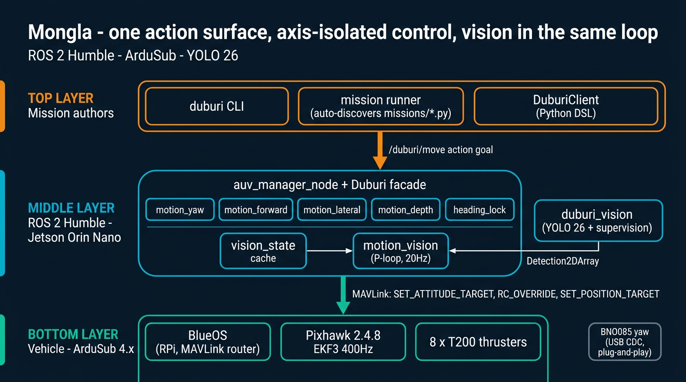
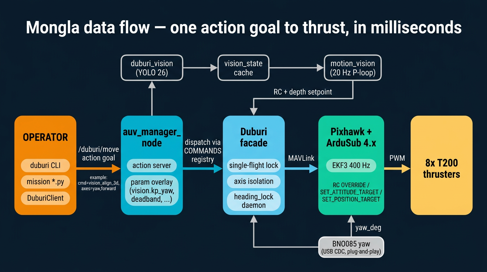
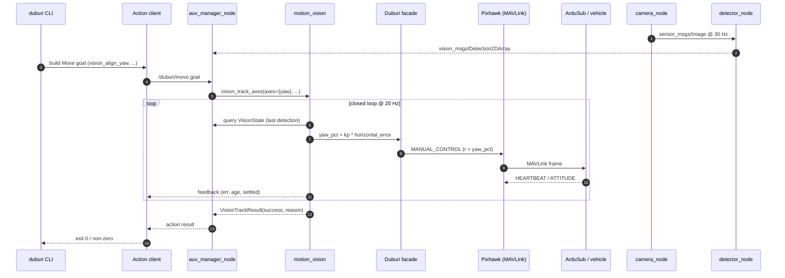
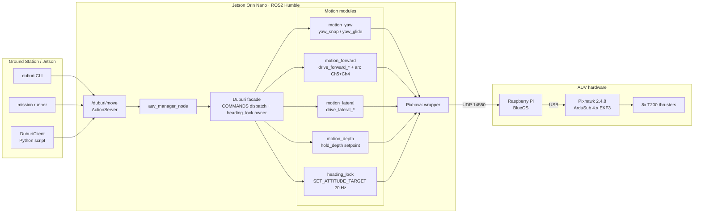
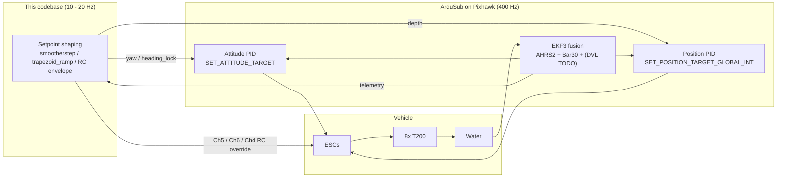
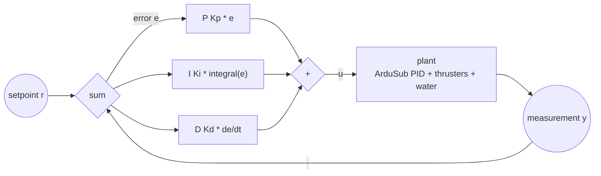
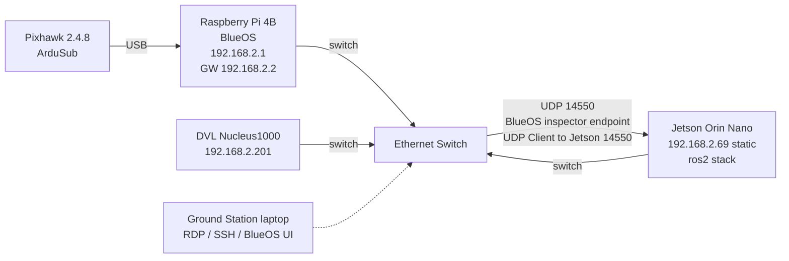
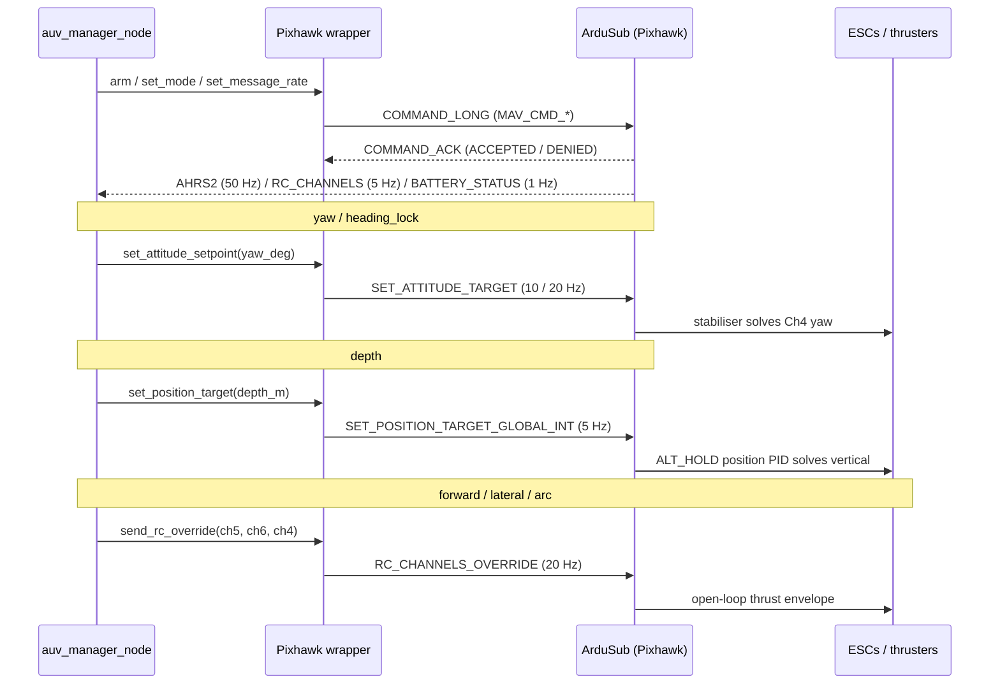

<h1 align="center">Mongla — <code>duburi_ws</code></h1>

<p align="center">
  <em>An AUV control stack named after the port that opens onto the Sundarbans.</em><br/>
  ROS 2 Humble · ArduSub · YOLO 26 · one action surface, axis-isolated control,
  vision in the same loop.
</p>

<p align="center">
  
</p>

<p align="center">
  
  
  
  
  
  
  
  
</p>

<p align="center">
  Mongla is a ROS 2 Humble control, mission, and simulation stack for ArduSub
  vehicles — one clean action surface (<code>/duburi/move</code>), one MAVLink
  owner, and per-axis motion modules behind a single dispatch table. The code is
  developed against an ArduSub SITL + Gazebo loop and field-tested on
  <strong>Duburi</strong>, a <code>vectored_6dof</code> 8-thruster AUV.
</p>

<p align="center">
  <a href="#quickstart-smoke-tests"><strong>Quickstart</strong></a> ·
  <a href="#concepts-in-5-videos"><strong>Concept videos</strong></a> ·
  <a href=".claude/context/mission-cookbook.md"><strong>Mission cookbook</strong></a> ·
  <a href="#9-command-cookbook-duburi-cli"><strong>CLI cookbook</strong></a> ·
  <a href="#3-architecture"><strong>Architecture</strong></a>
</p>

---

<p align="center">
  
</p>

### One verb, end to end

What actually happens when you type `ros2 run duburi_planner duburi vision_align_yaw --camera laptop --target_class person --duration 8`:



Same flow runs for every verb in §9 — only the motion module and the axes change. That single contract is why missions stay readable.

### What a session actually looks like

A pool-deck workflow is three terminals + one CLI prompt. Drop these into
`tmux` panes once and you never think about it again:

<table>
  <tr>
    <td align="center" width="25%">
      
      <br/><sub>Pre-flight: ports, UDP, BNO085, CUDA. <strong>~3 s.</strong></sub>
    </td>
    <td align="center" width="25%">
      
      <br/><sub>Connects MAVLink, owns Pixhawk, runs <code>/duburi/move</code>.</sub>
    </td>
    <td align="center" width="25%">
      
      <br/><sub>Camera + YOLO 26 + annotated debug stream. GPU-fast.</sub>
    </td>
    <td align="center" width="25%">
      
      <br/><sub>Where you actually drive the AUV. One verb per line.</sub>
    </td>
  </tr>
</table>

Exact commands for every pane live in [§5 Network setup](#5-network-setup) and
the [Quickstart smoke tests](#quickstart-smoke-tests) right below.

## Quickstart smoke tests

> Eight copy-paste scenarios, in the order you would actually run them.
> Each block lists **what success looks like** and **the exact commands**.
> All commands assume `source /opt/ros/humble/setup.bash && source install/setup.bash`.

> **Setting up a fresh Jetson / dev box?** See
> [`docs/JETSON_SETUP.md`](docs/JETSON_SETUP.md) for the apt + pip +
> udev one-time install, then come back here. Python deps live in
> [`requirements.txt`](requirements.txt) at the workspace root.

### 0 — Bringup health check (no AUV needed)

Probes USB serial ports, BlueOS UDP stream, BNO085 USB CDC, and ROS env in
one shot. **Run this first** every session.

```bash
ros2 run duburi_manager bringup_check
```

Success: every line ends in `OK`. Failures print the missing piece (e.g.
"no Pixhawk on /dev/ttyACM*", "BNO085 not detected") with the exact fix.

### 1 — SIM only (Gazebo + ArduSub SITL, no real AUV)

In separate terminals (full SIM bring-up is documented in §8.1):

```bash
# T1: ArduSub SITL
sim_vehicle.py -L RATBeach -v ArduSub -f vectored_6dof --model=JSON \
    --out=udp:0.0.0.0:14550 --out=udp:127.0.0.1:14551 --console
# T2: manager (auto-detects sim mode via UDP 14550)
ros2 run duburi_manager start
# T3: drive it
ros2 run duburi_planner duburi arm
ros2 run duburi_planner duburi set_depth --target -0.5
ros2 run duburi_planner duburi move_forward --duration 3 --gain 60
ros2 run duburi_planner duburi disarm
```

Success: thrusters spin (open Gazebo for visuals — see §8.1), depth in T2
logs converges on -0.5 m, every CLI exits 0.

### 2 — Vision pipeline (webcam, no AUV)

```bash
# T1
ros2 launch duburi_vision cameras_.launch.py
# T2 -- inspect annotated frames
ros2 run rqt_image_view rqt_image_view /duburi/vision/laptop/image_debug
# T3 -- inspect raw detections
ros2 topic echo /duburi/vision/laptop/detections
```

Success: rqt_image_view shows your webcam with green bounding boxes around
people. The detector logs `in_hz=~30  with_target=>0%`.

### 3 — Vision + control loop (the big one)

The integration test: webcam drives the simulated BlueROV2 in Gazebo.

```bash
# T1: ArduSub SITL (see §8.1)
sim_vehicle.py -L RATBeach -v ArduSub -f vectored_6dof --model=JSON \
    --out=udp:0.0.0.0:14550 --out=udp:127.0.0.1:14551 --console
# T2: manager
ros2 run duburi_manager start
# T3: vision
ros2 launch duburi_vision cameras_.launch.py
# T4: drive
ros2 run duburi_planner duburi arm
ros2 run duburi_planner duburi set_depth --target -0.5
ros2 run duburi_planner duburi vision_align_yaw \
    --camera laptop --target_class person --duration 8
ros2 run duburi_planner duburi disarm
```

Success: when you move sideways in front of the webcam, the BlueROV2 yaws
to keep you centred. Manager logs `[vision] err=±0.0XX  ch4=±YY%`.

### 4 — Mission runner (auto-discovered)

```bash
ros2 run duburi_planner mission --list           # shows every missions/*.py
ros2 run duburi_planner mission move_and_see     # short open-loop + vision demo
ros2 run duburi_planner mission find_person_demo # full vision-driven walkthrough
ros2 run duburi_planner mission robosub_prequal  # RoboSub pre-qualification sequence
```

Adding a new mission: drop `missions/<your_name>.py` exposing
`def run(duburi, log)`, rebuild `duburi_planner`, and it appears in
`--list` instantly. **No registry edit.** Full reference:
[.claude/context/mission-cookbook.md](.claude/context/mission-cookbook.md).

### 5 — Live-tune vision gains without restarting

While a vision verb / mission is running:

```bash
ros2 param set /duburi_manager vision.kp_yaw 80.0
ros2 param set /duburi_manager vision.deadband 0.06
ros2 param set /duburi_manager vision.target_bbox_h_frac 0.55
```

Every subsequent vision goal picks up the new value automatically — mission
files that omit those overrides use the live ROS-param value. Defaults live
in [src/duburi_manager/config/vision_tunables.yaml](src/duburi_manager/config/vision_tunables.yaml).

### 6 — BNO085 yaw source (plug-and-play)

Plug the ESP32-C3 + BNO085 into any USB port. The driver auto-probes
`/dev/serial/by-id/usb-Espressif*` and `/dev/ttyACM[0-9]` and locks onto
the first port that streams valid `{"yaw":..,"ts":..}` JSON.

Wire smoke-test (no MAVLink, no autopilot):

```bash
ros2 run duburi_sensors sensors_node --ros-args \
    -p yaw_source:=bno085               # bno085_port defaults to "auto"
```

Pin a specific port if you want determinism:

```bash
ros2 run duburi_sensors sensors_node --ros-args \
    -p yaw_source:=bno085 -p bno085_port:=/dev/ttyACM0
```

Calibrated, Earth-referenced (samples Pixhawk mag offset once, then
pure-gyro yaw — same path the manager uses):

```bash
ros2 run duburi_sensors sensors_node --ros-args \
    -p yaw_source:=bno085 -p calibrate:=true
```

Firmware + wiring contract: [src/duburi_sensors/firmware/esp32c3_bno085.md](src/duburi_sensors/firmware/esp32c3_bno085.md).
To make the manager use BNO085 instead of ArduSub AHRS, launch with
`-p yaw_source:=bno085` (and `-p bno085_port:=auto` is already the default).

### 7 — Per-command MAVLink debug trace

When something misbehaves and you want to know exactly which Duburi verb
emitted which MAVLink frame, restart the manager with `debug:=true`:

```bash
ros2 run duburi_manager start --ros-args -p debug:=true
```

That single param raises the manager logger to DEBUG and tags every
outbound MAVLink frame with both the Pixhawk method that emitted it
AND the verb that caused it. The body skips channels at neutral /
released so a typical line stays short:

```
[MAV set_target_depth cmd=set_depth]   depth=-0.50m
[MAV send_rc_override cmd=lock_heading] yaw=1430
[MAV send_rc_override cmd=stop]         all=neutral
[MAV release_rc_override cmd=pause]     all=released
```

Then `rg "cmd=lock_heading" session.log` returns every frame the verb
produced, across every implementation file. Off by default; production
runs stay quiet. Full format and examples in
[.claude/context/mavlink-reference.md](.claude/context/mavlink-reference.md#per-call-audit-every-send_--set_-on-pixhawkpy).

---

## Concepts in 5 videos

> Watch these once if any of the underlying ideas feel hand-wavy. They cover
> the **engineering concepts** Mongla is built on, not Duburi specifics.
> Click any thumbnail to play on YouTube.

<table>
  <tr>
    <td align="center" width="33%">
      <a href="https://www.youtube.com/watch?v=UR0hOmjaHp0">
        
      </a>
      <br/>
      <strong>PID Control</strong><br/>
      <sub>Every motion verb (depth, yaw, vision-yaw) is a P or PI loop. Saves you a pool day.</sub>
    </td>
    <td align="center" width="33%">
      <a href="https://www.youtube.com/watch?v=MPU2HistivI">
        
      </a>
      <br/>
      <strong>YOLO Object Detection</strong><br/>
      <sub>The vision pipeline runs Ultralytics YOLO 26. Helps you read <code>detector_node</code> logs.</sub>
    </td>
    <td align="center" width="33%">
      <a href="https://www.youtube.com/watch?v=Ha66uKC-od0">
        
      </a>
      <br/>
      <strong>MAVLink protocol</strong><br/>
      <sub>Every Mongla command is one MAVLink message — see how the bytes line up.</sub>
    </td>
  </tr>
  <tr>
    <td align="center" width="33%">
      <a href="https://www.youtube.com/watch?v=X7YSnDbKMWo">
        
      </a>
      <br/>
      <strong>ROS 2 Actions</strong><br/>
      <sub><code>/duburi/move</code> is an Action: cancellable, gives feedback, returns a result.</sub>
    </td>
    <td align="center" width="33%">
      <a href="https://www.youtube.com/watch?v=4sSxPkhI9Do">
        
      </a>
      <br/>
      <strong>BlueROV2 platform</strong><br/>
      <sub>The Gazebo SITL target — same <code>vectored_6dof</code> frame as the real Duburi.</sub>
    </td>
    <td align="center" width="33%" valign="middle">
      <a href=".claude/context/mission-cookbook.md">
        
      </a>
      <br/>
      <strong>Mission Cookbook</strong><br/>
      <sub>Working principles, every verb, ten ready-to-steal mission samples.</sub>
    </td>
  </tr>
</table>

For the deeper architecture story (axis isolation, vision math, heading
lock thread model), browse [.claude/context/](.claude/context/) —
especially `axis-isolation.md`, `vision-architecture.md`, and the
[mission cookbook](.claude/context/mission-cookbook.md).

---

## 0. The name

**Mongla** (মোংলা) is Bangladesh's second seaport, opened in 1950 on the
confluence of the Pasur and Mongla rivers in Bagerhat district. It sits a
hundred-odd kilometres north of the Bay of Bengal, ringed on every side by
the **Sundarbans** — the largest contiguous mangrove forest in the world,
a UNESCO World Heritage site, and the home of the Royal Bengal tiger.
Where Chittagong is the country's industrial gateway, Mongla is its quieter
delta gateway: tidal channels, brown water, and ships threading the
mangroves to reach the sea.

This codebase borrows the name on purpose. The waters it imagines are
Bengal's: muddy, current-laden, magnetically noisy, GPS-denied. The
vehicle it drives — **Duburi** (ডুবুরি, Bengali for *diver*) — is the test
platform; the engineering principles below are written for the kinds of
estuaries Mongla itself sits inside.

---

## Table of Contents

- [Quickstart smoke tests](#quickstart-smoke-tests)
- [Concepts in 5 videos](#concepts-in-5-videos)

0. [The name](#0-the-name)
1. [What this repo is](#1-what-this-repo-is)
2. [Test platform at a glance](#2-test-platform-at-a-glance)
2A. [Real vehicle vs sim](#2a-real-vehicle-vs-sim)
3. [Architecture](#3-architecture)
4. [Code structure](#4-code-structure)
5. [Network setup](#5-network-setup)
6. [Prerequisites](#6-prerequisites)
7. [Build](#7-build)
8. [Run — three modes](#8-run--three-modes)
9. [Command cookbook (duburi CLI)](#9-command-cookbook-duburi-cli)
10. [Configuration guide](#10-configuration-guide)
10A. [Yaw source — duburi_sensors](#10a-yaw-source--duburi_sensors)
10B. [Vision — duburi_vision](#10b-vision--duburi_vision)
11. [Tuning guide](#11-tuning-guide)
12. [Telemetry & log cheatsheet](#12-telemetry--log-cheatsheet)
13. [Troubleshooting](#13-troubleshooting)
14. [Development workflow](#14-development-workflow)
15. [Roadmap](#15-roadmap)
16. [Further reading](#16-further-reading)
17. [Test platform & acknowledgments](#17-test-platform--acknowledgments)
18. [License](#18-license)

---

## 1. What this repo is

`duburi_ws` is a ROS2 Humble colcon workspace that exposes one clean action
surface — `/duburi/move` — over the top of ArduSub. One Python node owns
the MAVLink connection, receives goals, and dispatches them to per-axis
motion controllers. A companion CLI (`duburi`), a scripted mission runner
(`mission`), and a Python `DuburiClient` all live in `duburi_planner`.

> The historical workspace name `duburi_ws` and the action namespace
> `/duburi/*` are preserved because they correspond to the **test
> vehicle**, Duburi. The codebase itself is named **Mongla** — that's the
> branding used in this README and in commit messages.

Four packages live inside:

| Package             | Role                                                                                     |
|---------------------|------------------------------------------------------------------------------------------|
| `duburi_interfaces` | `Move.action` + `DuburiState.msg` — the only ROS surface every client talks to           |
| `duburi_control`    | `Pixhawk` MAVLink wrapper (opt-in `[MAV <fn> cmd=verb]` DEBUG trace via `debug:=true`) + axis-split motion controllers (`motion_forward`, `motion_lateral`, `motion_yaw`, `motion_depth`, `heading_lock`) + shared helpers (`motion_writers`, `motion_easing`) + `Heartbeat` + `VisionVerbs` mixin + the `COMMANDS` registry + `tracing` (per-command tag) |
| `duburi_manager`    | ROS2 node, action server, telemetry logger, connection profiles                           |
| `duburi_planner`    | `DuburiClient` Python API + `duburi` CLI + `mission` runner + `missions/*` scripts (YASMIN slot reserved under `state_machines/`) |
| `duburi_sensors`    | `YawSource` abstraction — MAVLink AHRS, BNO085 (ESP32-C3 USB CDC), Nucleus1000 DVL, BNO+DVL composite (`bno085_dvl`), WitMotion stub |

Design principles we actually follow:

- **Axis-split control.** Forward (Ch5), lateral (Ch6), yaw, depth, and the
  curved `arc` verb each live in their own module (`motion_forward`,
  `motion_lateral`, `motion_yaw`, `motion_depth`). Each translation module
  has a bang-bang default (`drive_*_constant`) and a smoothed variant
  (`drive_*_eased`). Yaw has `yaw_snap` (default) and `yaw_glide` (opt-in).
  The `Duburi` facade is a lock plus a dispatch table.
- **Lock-aware neutrals.** `motion_writers.Writers` builds axis-specific
  writers that automatically use `send_rc_translation` (leaving Ch4 free)
  whenever `heading_lock` is active, so a background yaw setpoint stream is
  never stomped by a translation command's neutral packet.
- **One source of truth for commands.** Every command is one row in
  `duburi_control/commands.py` and one method on `Duburi`. The action server,
  the `duburi` CLI, the `mission` runner, and the Python `DuburiClient` all
  read from `COMMANDS`, so adding a verb takes two edits — not five.
- **Preserve the proven default.** Smoothing is opt-in via two ROS parameters
  (`smooth_yaw`, `smooth_translate`). The defaults replay the same bang-bang
  behaviour that has the most wet-test hours behind it.
- **ArduSub does the hard bit.** Attitude *and* depth control both run on the
  flight controller at 400 Hz — we never fight them. We stream setpoints
  (`SET_ATTITUDE_TARGET` for yaw + `heading_lock`, `SET_POSITION_TARGET_GLOBAL_INT`
  for depth, `RC_CHANNELS_OVERRIDE` for translation/arc) and let the
  EKF3-fused AHRS2 yaw and Bar30 depth do their jobs.
- **Stop vs pause are different.** `stop()` actively holds RC neutral
  (1500 µs on every channel). `pause(N)` releases the override entirely
  (65535) for N seconds so the autopilot's own ALT_HOLD takes over, then
  re-engages neutral. Every translation verb also accepts a `settle=` kwarg
  for an extra post-command neutral-hold so the next command starts from
  zero residual velocity.
- **Sharp vs curved turns.** `yaw_left` / `yaw_right` are sharp pivots
  (`SET_ATTITUDE_TARGET`). `arc` keeps Ch5 thrust + Ch4 yaw stick in the
  same RC packet for car-style curved trajectories.
- **Heading-lock is yaw's depth-hold cousin.** `lock_heading` spins up a
  background Ch4-rate-override stream at 20 Hz driven by the configured
  `YawSource`; translations and `pause` run on top of it; `yaw_*` and `arc`
  suspend → execute → retarget; only `unlock_heading` (or shutdown) tears it
  down. It is **source-agnostic** — the same `YawSource` that feeds the
  manager (MAVLink AHRS, BNO085, or a Gazebo mock) also feeds the lock.
- **Depth is owned by ArduSub's onboard ALT_HOLD.** `set_depth` engages
  ALT_HOLD and drives `hold_depth` to the target; once reached, ArduSub's
  400 Hz onboard depth controller keeps the sub there indefinitely without
  any Python-side streamer. There is no `lock_depth` / `unlock_depth` --
  the autopilot already does the right thing whenever the mode is
  ALT_HOLD/POSHOLD/GUIDED.
- **A `Heartbeat` keeps the wire warm.** A 5 Hz background stream of
  all-neutral `RC_CHANNELS_OVERRIDE` runs whenever no other writer is
  active so ArduSub never sees > 3 s of override silence and tripping
  `FS_PILOT_INPUT` (default action: disarm). The Duburi facade pauses
  the heartbeat on every command entry and for the lifetime of an active
  heading-lock so writers never race.
- **Every cross-command boundary is a hard reset.** Locks serialise, `stop()`
  forces RC neutral + clears the ACK cache, each axis module owns its exit
  semantics, and `settle=` plus `pause` close residual-inertia gaps between
  goals.

| Axis         | Setpoint message                  | Loop that closes it           | Our role                       |
|--------------|-----------------------------------|-------------------------------|--------------------------------|
| Yaw          | `RC_CHANNELS_OVERRIDE` Ch4 rate   | Python yaw_source loop        | stream + watch yaw_source      |
| Depth        | `SET_POSITION_TARGET_GLOBAL_INT`  | ArduSub ALT_HOLD position PID | one-shot drive to setpoint     |
| Forward      | `RC_CHANNELS_OVERRIDE` Ch5        | open loop (timed thrust)      | shape the thrust envelope      |
| Lateral      | `RC_CHANNELS_OVERRIDE` Ch6        | open loop (timed thrust)      | shape the thrust envelope      |
| Arc          | `RC_CHANNELS_OVERRIDE` Ch5+Ch4    | open loop                     | curved car-style trajectory    |
| Heading-lock | `RC_CHANNELS_OVERRIDE` Ch4 (bg)   | Python yaw_source loop @20 Hz | stream until unlocked          |
| Heartbeat    | `RC_CHANNELS_OVERRIDE` neutral    | n/a (failsafe guard only)     | stream @ 5 Hz when wire idle   |

---

## 2. Test platform at a glance

Mongla is developed against the test AUV **Duburi 4.2**. Any other ArduSub
`vectored_6dof` vehicle (e.g. BlueROV2 Heavy, BlueROV2 with extra
thrusters, custom Heavy clones) is a drop-in target — only the connection
profile changes.

| Component              | Hardware                                                          |
|------------------------|-------------------------------------------------------------------|
| Hull                   | **Duburi 4.2** — octagonal Marine 5083 aluminum, in-house         |
| Frame type (ArduSub)   | `vectored_6dof` (8× Blue Robotics T200) — same as BlueROV2 Heavy  |
| Flight controller      | Pixhawk 2.4.8 running ArduSub 4.x                                 |
| Companion              | Raspberry Pi running BlueOS (MAVLink router, web UI, video)       |
| Primary SBC            | Nvidia Jetson Orin Nano (all ROS2 nodes live here)                |
| Depth sensor           | Bar30 (ArduSub AHRS2 altitude)                                    |
| External IMU           | ESP32-C3 + BNO085 over USB CDC (gyro+accel, opt-in via param)     |
| DVL                    | Nortek Nucleus1000 @ `192.168.2.201` — **shipped** (TCP driver, auto-connect, distance commands) |
| Cameras                | Blue Robotics Low-Light HD USB (forward + downward)               |
| Tether                 | FathomX power-over-Ethernet                                       |
| Power                  | Dual LiPo (one propulsion, one compute+sensors — isolated rails)  |
| Payload                | Slingshot torpedo, aluminum grabber (current-sensed), solenoid dropper |
| Network switch         | Onboard 5-port, binds all three SBCs + DVL                        |

Active development goals:
1. Yaw and translation profiles smooth enough that vision-based PID can
   run on top without fighting the motion envelope.
2. Bring up the Nucleus1000 DVL driver and feed velocity into ArduSub's EKF3.
3. Plug in vision + `robot_localization` EKF when vision hardware lands.
4. Populate `duburi_planner/state_machines/` with YASMIN once mission
   logic outgrows linear scripts.

---

## 2A. Real vehicle vs sim

> **TL;DR — BlueROV2 Heavy is the Gazebo SITL target. The real test AUV is Duburi 4.2.** Both share the `vectored_6dof` 8-thruster ArduSub frame, which is why BlueROV2 is a faithful proxy for control development. Hull shape, mass, and payload geometry differ.

| Aspect             | Sim (Gazebo)                   | Real (Duburi 4.2)                           |
|--------------------|--------------------------------|---------------------------------------------|
| Hull               | BlueROV2 Heavy chassis         | Octagonal Marine 5083 aluminum, in-house    |
| Frame type         | `vectored_6dof` (8× T200)      | `vectored_6dof` (8× T200)                   |
| Compass            | Synthetic, drift-free          | Pixhawk mag — noisy near aluminum + thrusters |
| Heading source     | ArduSub AHRS                   | ArduSub AHRS · BNO085 · Nucleus AHRS · BNO+DVL (`yaw_source` param) |
| Depth sensor       | Sim plugin                     | Bar30                                       |
| DVL                | None                           | Nortek Nucleus1000 — **shipped** (auto-connect, `move_*_dist` commands) |
| Payload            | None                           | Torpedo, grabber, dropper                   |

The full Duburi 4.2 spec block lives in
[.claude/context/vehicle-spec.md](.claude/context/vehicle-spec.md) — that's
the canonical reference for hardware on the test platform.

---

## 3. Architecture

### 3.1 End-to-end data flow



### 3.2 Control philosophy

We never close a Python control loop in the live path. ArduSub's onboard
400 Hz attitude + position PIDs do the actual stabilising; we stream
*setpoints*, then watch telemetry to decide when each goal is done.



### 3.3 PID without a PhD (cheat sheet)

The two onboard loops above are textbook PID; our setpoint-shaping is
deliberately the only thing we touch. See
[`pid-theory.md`](.claude/context/pid-theory.md) for the longer treatment.



Key data flow:

1. The CLI (or `mission` runner, or any other Python client) sends a `Move`
   goal to `/duburi/move`.
2. `auv_manager_node` is the **only** entity calling `recv_match` on the
   MAVLink connection. All reads go through a single reader; all writes go
   through `Pixhawk`.
3. The action executor looks up the verb in the `COMMANDS` registry and
   dispatches to a same-named method on `Duburi` via `getattr`.
4. The motion module loops at 10-20 Hz, reads cached telemetry, writes RC
   override or attitude target, and logs a `[DEPTH]` / `[YAW  ]` / `[FOR  ]`
   line every 0.5 s (rate-limited via rclpy `throttle_duration_sec`).
5. ArduSub's EKF3-fused stabiliser does the 400 Hz inner loop. Telemetry
   stream rates are pinned at startup with `MAV_CMD_SET_MESSAGE_INTERVAL`
   (AHRS2 = 50 Hz, RC_CHANNELS = 5 Hz, BATTERY_STATUS = 1 Hz).
6. The action result returns a `Move.Result` with either success or a
   MAVLink-grounded failure reason (`DENIED`, `NO_ACK`, timeout, ...).
7. `auv_manager_node` republishes a typed `DuburiState` message on
   `/duburi/state` whenever the snapshot changes (or every ~1 s as a
   heartbeat).

---

## 4. Code structure

```
duburi_ws/
├── build_duburi.sh                    # colcon build helper
├── README.md
├── CLAUDE.md                          # agent/context index
├── LICENSE
├── .claude/context/                   # research notes (ArduSub, PID, yaw, ...)
└── src/
    ├── duburi_interfaces/
    │   ├── action/Move.action
    │   └── msg/DuburiState.msg        # typed snapshot for /duburi/state
    ├── duburi_control/
    │   └── duburi_control/
    │       ├── pixhawk.py             # pymavlink wrapper + COMMAND_ACK + [MAV <fn> cmd=verb] DEBUG trace
    │       ├── tracing.py             # per-command MAVLink-trace tag (off by default; debug:=true flips on)
    │       ├── commands.py            # COMMANDS registry (single source of truth)
    │       ├── motion_easing.py       # smoothstep / smootherstep / trapezoid_ramp
    │       ├── motion_rates.py        # single source of truth for all loop rates (YAW_RATE_HZ, THRUST_HZ, DEPTH_RAMP_S …)
    │       ├── motion_writers.py      # Writers (lock-aware Ch4 release) + thrust_loop + REVERSE_KICK_PCT
    │       ├── motion_yaw.py          # yaw_snap / yaw_glide (Ch4 rate override)
    │       ├── motion_forward.py      # drive_forward_* + arc (Ch5 / Ch5+Ch4 RC override)
    │       ├── motion_lateral.py      # drive_lateral_* (Ch6 RC override)
    │       ├── motion_depth.py        # hold_depth (ramped setpoint → SET_POSITION_TARGET, then ALT_HOLD owns it)
    │       ├── motion_vision.py       # vision_track_axes (Ch4/5/6 + depth, P-only) + vision_acquire
    │       ├── heading_lock.py        # background Ch4 yaw-rate streamer (yaw_source-driven)
    │       ├── heartbeat.py           # 5 Hz neutral RC override (FS_PILOT_INPUT guard)
    │       ├── vision_verbs.py        # VisionVerbs mixin -- vision_align_* / vision_acquire
    │       ├── duburi.py              # Duburi facade (lock + dispatch + heading_lock + heartbeat owner)
    │       └── errors.py              # MovementError / Timeout / ModeChangeError
    ├── duburi_sensors/
    │   ├── duburi_sensors/
    │   │   ├── factory.py             # name -> YawSource dispatch
    │   │   ├── sensors_node.py        # standalone diagnostic node
    │   │   └── sources/
    │   │       ├── base.py                # YawSource ABC
    │   │       ├── mavlink_ahrs.py        # ArduSub AHRS2 wrapper (default)
    │   │       ├── bno085.py              # ESP32-C3 + BNO085 over USB CDC
    │   │       ├── nucleus_dvl.py         # Nortek Nucleus 1000 — AHRS heading + DVL bottom-track
    │   │       ├── nucleus_parser.py      # Nucleus TCP packet decoder (AHRS + bottom-track frames)
    │   │       ├── composite_bno_dvl.py   # BNO085 heading + DVL position composite (bno085_dvl)
    │   │       └── witmotion_stub.py      # fail-loud placeholder for HWT905 / WT901C
    │   ├── firmware/
    │   │   └── esp32c3_bno085.md      # MCU-side wire contract + ref code
    │   └── config/sensors.yaml        # yaw_source / bno085_port / baud
    ├── duburi_manager/
    │   ├── duburi_manager/
    │   │   ├── auv_manager_node.py    # ROS2 node, ActionServer, telemetry, VisionState pool
    │   │   ├── vision_state.py        # per-camera Detection2DArray subscriber + bbox_error()
    │   │   └── connection_config.py   # PROFILES + NETWORK topology
    │   └── config/
    │       ├── modes.yaml             # default ros parameters
    │       └── vision_tunables.yaml   # default vision.* ROS params (live-tunable via ros2 param set)
    └── duburi_planner/
        └── duburi_planner/
            ├── client.py              # DuburiClient blocking ActionClient wrapper
            ├── cli.py                 # `duburi` command-line wrapper (auto-built from COMMANDS)
            ├── duburi_dsl.py          # DuburiMission DSL (duburi.* + duburi.vision.*)
            ├── mission.py             # `mission` runner — dispatches into missions/<name>.run
            ├── missions/
            │   ├── square_pattern.py    # open-loop square choreography
            │   ├── arc_demo.py          # sharp vs curved turn comparison
            │   ├── heading_lock_demo.py # lock_heading + translation demo
            │   ├── find_person_demo.py  # full vision-driven 3D alignment demo
            │   ├── move_and_see.py      # alternates open-loop + vision verbs
            │   ├── pursue_demo.py       # vision_align_3d lock_mode=pursue demo
            │   ├── gate_prequal.py      # gate pre-qualification sequence (MATE/RoboSub)
            │   └── robosub_prequal.py   # full RoboSub pre-qualification sequence
            └── state_machines/          # reserved for YASMIN-based plans
```

Every new command ends up in just two places:
1. One row in `duburi_control/commands.py` (`COMMANDS` dict — name, help text,
   accepted `Move.Goal` fields, and defaults).
2. A same-named method on `Duburi` in `duburi_control/duburi.py` returning a
   `Move.Result`.

The action server (`auv_manager_node.execute_callback`), the `duburi` CLI
(`duburi_planner/cli.py::_build_parser`), the `mission` runner
(`duburi_planner/mission.py`), and the Python client
(`DuburiClient.__getattr__`) all read from `COMMANDS` at runtime — no wiring
needed in any of them.

Only add a field to `Move.action` if you genuinely need a new parameter
shape; the existing `duration` / `degrees` / `meters` / `gain` / `timeout`
fields cover most verbs.

---

## 5. Network setup

### 5.1 Topology



### 5.1.1 MAVLink message flow we actually use



### 5.2 BlueOS endpoint configuration

On the BlueOS web UI (`http://192.168.2.1`) go to **Vehicle → Pixhawk →
Endpoints** and create:

| Field  | Value                 |
|--------|-----------------------|
| Name   | `inspector`           |
| Type   | `UDP Client`          |
| IP     | `192.168.2.69`        |
| Port   | `14550`               |

ROS2 side listens on `udpin:0.0.0.0:14550`. The same line works in sim,
laptop, and pool modes because BlueOS pushes MAVLink to us; we never dial
out. The canonical values live in
[src/duburi_manager/duburi_manager/connection_config.py](src/duburi_manager/duburi_manager/connection_config.py)
inside the `NETWORK` dict.

### 5.3 Sanity checks before a session

The fast path is a single command:

```bash
ros2 run duburi_manager bringup_check
```

It probes the canonical Pi (`192.168.2.1`) and Jetson (`192.168.2.69`)
IPs, looks for an active MAVLink stream on UDP `14550`, enumerates any
Pixhawk USB CDC devices, and tests BNO085 auto-detection -- printing
PASS / WARN / FAIL per check and a launch hint at the end. Exit code is
`0` when nothing failed, `1` otherwise (so it composes in scripts).

Manual probes if you want to double-check:

```bash
ping -c 3 192.168.2.1             # BlueOS reachable
ping -c 3 192.168.2.69            # Jetson reachable (from laptop on switch)
ss -lun | grep 14550              # UDP 14550 bound & listening (after `ros2 run duburi_manager start` is up)
timeout 5 tcpdump -i any udp port 14550 -c 10  # see MAVLink bytes flowing (needs root)
```

The `auv_manager` startup banner prints the expected BlueOS peer whenever
`mode:=pool` or `mode:=laptop` — if the printed IP doesn't match your
BlueOS endpoint config, fix BlueOS first.

### 5.4 Plug-and-play mode

`mode:=auto` (the default) makes the manager pick its own connection
profile at startup:

| Probe                                                  | Picked profile |
| ------------------------------------------------------ | -------------- |
| UDP `14550` already in use (BlueOS pushing MAVLink)    | `pool`         |
| Pixhawk USB CDC present (`/dev/serial/by-id/*ardupilot*` or `/dev/ttyACM0`) | `desk` |
| Neither                                                | `sim`          |

Pin a specific profile by passing `-p mode:=pool` (or `desk`/`sim`/`laptop`).
The startup banner always prints the resolved mode so you can see what
auto-detect picked.

---

## 6. Prerequisites

- **OS:** Ubuntu 22.04 (native, WSL2, or distrobox). The reference dev
  environment runs inside a distrobox with CUDA 12.8 on an Arch host and
  ROS2 Humble inside the box.
- **ROS2:** Humble Hawksbill (`sudo apt install ros-humble-desktop`).
- **Python:** 3.10 (ships with 22.04).
- **Python deps:** `pymavlink`, installed automatically by `colcon build`
  via the `install_requires` in `setup.py`.
- **For sim:** ArduPilot SITL + `sim_vehicle.py`, Gazebo Harmonic or Ignition
  (see `.claude/context/sim-setup.md`).
- **For hardware:** access to the AUV switch (either tethered laptop or
  onboard Jetson), BlueOS running on the Raspberry Pi.

---

## 7. Build

From the workspace root:

```bash
./build_duburi.sh
source install/setup.bash
```

The helper script:
1. Builds `duburi_interfaces` first (generates `Move` action types).
2. Builds `duburi_control` + `duburi_manager`.
3. Copies Debian-installed Python packages to the ament-expected layout
   (works around a Debian-vs-ament install quirk in colcon).
4. Symlinks executables so `ros2 run` can find them.

If you have already built once and only touched Python code, a plain
`colcon build --symlink-install --packages-select duburi_control duburi_manager`
is faster.

---

## 8. Run — three modes

### 8.1 SIM (Docker + Gazebo + ArduSub SITL)

Terminal 1 — ArduSub SITL:

```bash
sim_vehicle.py -L RATBeach -v ArduSub -f vectored_6dof --model=JSON \
    --out=udp:0.0.0.0:14550 --out=udp:127.0.0.1:14551 --console
```

Terminal 2 — Gazebo (optional, for visuals):

```bash
cd ~/Ros_workspaces/colcon_ws
gz sim -v 3 -r src/bluerov2_gz/worlds/bluerov2_underwater.world
```

Terminal 3 — manager node:

```bash
source install/setup.bash
ros2 run duburi_manager start --ros-args -p mode:=sim
```

Terminal 4 — commands via CLI (see §9).

### 8.2 DESK (Pixhawk via USB)

Plug the Pixhawk directly into the laptop or Jetson over USB. Grant serial
access on first use:

```bash
sudo usermod -aG dialout "$USER"   # log out / back in after the first time
ls -l /dev/ttyACM0                 # should show crw-rw---- root dialout
```

Start the node:

```bash
ros2 run duburi_manager start --ros-args -p mode:=desk
```

Useful for bench-testing ESC signals, calibration, and dry MAVLink plumbing
work without water.

### 8.3 POOL / HARDWARE (Jetson + BlueOS over switch)

1. Power on the AUV; confirm the switch link lights come up.
2. On a laptop on the same switch, open `http://192.168.2.1` and confirm
   the BlueOS `inspector` endpoint matches §5.2.
3. SSH into the Jetson:

   ```bash
   ssh fh1m@192.168.2.69
   cd ~/Ros_workspaces/duburi_ws
   source install/setup.bash
   ros2 run duburi_manager start --ros-args -p mode:=pool
   ```

4. Expected startup banner:

   ```
    DUBURI AUV MANAGER  │  mode: pool
    MAVLink: sys=1 comp=0  (v2.0)
    Profiles: yaw=snap  translate=constant
    Expect BlueOS "inspector" → UDP Client 192.168.2.69:14550
   ```

5. Within ~2 s you should see a `[STATE]` line. If not, the endpoint is
   misconfigured or the switch isn't bridged — see §13.

---

## 9. Command cookbook (`duburi` CLI)

All commands go through `/duburi/move` and block until done. Exit code 0 = success.

| Verb | What it does | Quick example |
|------|-------------|---------------|
| `arm` / `disarm` | Power thrusters on / off | `duburi arm` |
| `set_mode` | Switch ArduSub mode | `duburi set_mode --target_name ALT_HOLD` |
| `stop` | Active hold (RC neutral) | `duburi stop` |
| `pause` | Release RC for N seconds | `duburi pause --duration 2` |
| `set_depth` | Dive to absolute depth (m, negative) | `duburi set_depth --target -1.5` |
| `move_forward` / `move_back` | Open-loop thrust, duration + gain | `duburi move_forward --duration 5 --gain 80` |
| `move_left` / `move_right` | Lateral strafe | `duburi move_right --duration 3` |
| `yaw_left` / `yaw_right` | Sharp pivot by degrees | `duburi yaw_left --target 90` |
| `arc` | Forward + yaw simultaneously | `duburi arc --duration 4 --gain 50 --yaw_rate_pct 30` |
| `lock_heading` | Background yaw hold (returns immediately) | `duburi lock_heading --target 0` |
| `unlock_heading` | Stop background yaw hold | `duburi unlock_heading` |
| `dvl_connect` | Manually connect Nucleus DVL (auto by default) | `duburi dvl_connect` |
| `move_forward_dist` | DVL closed-loop forward N metres (heading lock stays active) | `duburi move_forward_dist --distance_m 2.0 --gain 60` |
| `move_lateral_dist` | DVL closed-loop lateral N metres (+ = right, − = left) | `duburi move_lateral_dist --distance_m 1.0 --gain 36` |
| `vision_acquire` | Sweep until target detected | `duburi vision_acquire --target_class person --target_name yaw_right` |
| `vision_align_yaw` | Centre target horizontally (yaw) | `duburi vision_align_yaw --target_class person --duration 15` |
| `vision_align_lat` | Centre target horizontally (strafe) | `duburi vision_align_lat --target_class person --duration 15` |
| `vision_align_depth` | Centre target vertically | `duburi vision_align_depth --target_class person --duration 15` |
| `vision_hold_distance` | Hold standoff distance | `duburi vision_hold_distance --target_class person --target_bbox_h_frac 0.55` |
| `vision_align_3d` | Multi-axis simultaneous hold | `duburi vision_align_3d --target_class gate --axes yaw,forward,depth` |
| `head` | Read live heading at execution time | `duburi head` |

Every flag: `ros2 run duburi_planner duburi <cmd> --help`

#### `head` — execution-time heading

The log shows heading continuously, but by the time you type the next command the AUV has drifted. Use `head` (or `--target head` on any numeric field) to snapshot the exact heading at the moment the command actually executes:

```bash
# Read heading
duburi head
# → head -> OK  final=273.400  msg="heading=273.4°"

# Lock at the heading the AUV is at RIGHT NOW — not when you started typing
duburi lock_heading --target head

# Works on any float field: yaw to wherever you're currently pointing
duburi yaw_right --target head
```

The `--target head` form sends a `head` query first, substitutes the live float, then dispatches the real command — two sequential action calls, resolved atomically from the operator's perspective.

Full parameter docs, MAVLink traces, and implementation chains:
[`.claude/context/command-reference.md`](.claude/context/command-reference.md)

### 9.1 Mission DSL — `duburi` + `duburi.vision`

```python
def run(duburi, log):
    duburi.target = 'person'
    duburi.arm()
    duburi.set_depth(-0.5)
    duburi.move_forward(3.0, gain=60)
    duburi.vision.find(sweep='right')
    duburi.vision.lock(axes='yaw,forward', distance=0.55, duration=12)
    duburi.move_back(2.0, gain=60)
    duburi.disarm()
```

- `duburi.*` — open-loop motion (arm, set_depth, move_\*, yaw_\*, arc, lock_heading, ...)
- `duburi.vision.*` — closed-loop vision verbs (find, yaw, lateral, depth, forward, lock, follow)

```bash
ros2 run duburi_planner mission --list
ros2 run duburi_planner mission find_person_demo   # vision-driven 3D alignment
ros2 run duburi_planner mission gate_prequal        # gate pre-qualification (MATE/RoboSub)
ros2 run duburi_planner mission robosub_prequal     # full RoboSub pre-qual sequence
```

Full DSL API + working principles + samples:
[`.claude/context/client-and-dsl-api.md`](.claude/context/client-and-dsl-api.md) ·
[`.claude/context/mission-cookbook.md`](.claude/context/mission-cookbook.md)

---

## 10. Configuration

Key params on `auv_manager_node`:

| Param | Default | Effect |
|-------|---------|--------|
| `mode` | `pool` | `pool`/`sim`/`desk`/`auto` — `auto` probes UDP 14550 + Pixhawk USB |
| `smooth_yaw` | `false` | `true` → smootherstep yaw setpoint sweep (reduces overshoot) |
| `smooth_translate` | `false` | `true` → trapezoid thrust ramp (softer start/stop) |
| `yaw_source` | `dvl` | `dvl` · `bno085_dvl` · `bno085` · `mavlink_ahrs` — see below |
| `dvl_auto_connect` | `true` | Auto-connect Nucleus DVL at startup; no manual `dvl_connect` needed |
| `dvl_retry_s` | `5.0` | Seconds between auto-connect retries |
| `vision.kp_yaw` / `vision.kp_lat` | 60.0 | Centring P-gain — tune live with `ros2 param set` |
| `vision.deadband` | 0.18 | Settle tolerance — tighten to 0.08–0.10 for pool |
| `vision.lock_mode` | `settle` | `settle` / `follow` / `pursue` — vision loop exit behaviour |
| `vision.depth_anchor_frac` | 0.5 | 0.2 for tall targets (person, pole) to prevent depth stall |
| `vision.distance_metric` | `height` | `height` / `area` / `diagonal` — how target size is measured |

**Yaw source selection:**

| `yaw_source` | Heading | Distance commands | Recommended for |
|---|---|---|---|
| `dvl` | Nucleus AHRS | DVL bottom-track | DVL as sole IMU |
| `bno085_dvl` | BNO085 (USB) | DVL bottom-track | **Pool** — stable gyro + DVL distance |
| `bno085` | BNO085 (USB) | open-loop fallback | Pool without DVL |
| `mavlink_ahrs` | ArduSub AHRS | open-loop fallback | Bench / sim |

> **Heading lock + DVL moves:** `lock_heading` stays ACTIVE during `move_forward_dist` / `move_lateral_dist`. The lock owns Ch4 (yaw), DVL owns Ch5/Ch6 (forward/lateral). Do not unlock before a DVL move.

Full param reference + yaw source + vision pipeline:
**[docs/configuration.md](docs/configuration.md)**

---

## 11. Tuning

Quick reference — tune vision gains live between goals:

```bash
ros2 param set /duburi_manager vision.kp_yaw 80.0
ros2 param set /duburi_manager vision.deadband 0.08
ros2 param set /duburi_manager vision.target_bbox_h_frac 0.55
```

Key constants (change in source, rebuild):

| What | File | Constant |
|------|------|----------|
| Yaw stream rate | `motion_rates.py` | `YAW_RATE_HZ = 10.0` |
| Thrust loop rate | `motion_rates.py` | `THRUST_HZ = 20.0` |
| Depth setpoint ramp | `motion_rates.py` | `DEPTH_RAMP_S = 2.5` — seconds to ramp from current to target depth (prevents overshoot) |
| Brake strength | `motion_writers.py` | `REVERSE_KICK_PCT = 25` |
| ArduSub depth gain | QGC → Pixhawk | `PSC_POSZ_P` (default 1.0) |

Full tuning guide: **[docs/tuning.md](docs/tuning.md)**

---

## 12. Telemetry & logs

| Tag | What it means |
|-----|---------------|
| `[STATE]` | arm / mode / yaw / depth / battery snapshot |
| `[RC   ]` | Active PWM values on Thr/Yaw/Fwd/Lat channels |
| `[DEPTH]` | Depth tracking: target, current, error |
| `[YAW  ]` | Yaw tracking: target, current, error |
| `[VIS  ]` | Vision loop: bbox error, size, lock mode |
| `[ARDUB]` | ArduSub STATUSTEXT (EKF events, pre-arm checks) |
| `[MAV  ]` | Per-frame MAVLink trace (`debug:=true` only) |

Full cheatsheet + one-liners: **[docs/telemetry.md](docs/telemetry.md)**

---

## 13. Troubleshooting

Most common issues:

| Symptom | Fix |
|---------|-----|
| No `[STATE]` after startup | BlueOS `inspector` endpoint IP wrong. Check `ss -lun \| grep 14550`. |
| `arm -> FAIL: DENIED` | Pre-arm check failed — read `[ARDUB]` lines for reason. |
| Depth times out at ~-0.5 m | ArduSub not in ALT_HOLD or Bar30 unhealthy. Check `[STATE]` mode. |
| Yaw overshoots | `-p smooth_yaw:=true`, or lower `ATC_ANG_YAW_P` in QGC. |
| Depth stalls on tall person | `ros2 param set /duburi_manager vision.depth_anchor_frac 0.2` |
| `/dev/ttyACM0: Permission denied` | `sudo usermod -aG dialout "$USER"` then re-login. |

Full issue list: **[docs/troubleshooting.md](docs/troubleshooting.md)**

---

## 14. Development workflow

Adding a new command — two edits only:

1. Add a row to `COMMANDS` in `duburi_control/commands.py` (name, help, fields, defaults).
2. Add a same-named method on `Duburi` in `duburi_control/duburi.py` that returns a `Move.Result`.

The action server, CLI, mission runner, and Python client all auto-discover `COMMANDS` — nothing else needs touching. Full dev guide: [CLAUDE.md §11](CLAUDE.md).

---

## 15. Roadmap

Phase 1 (done):
- Axis-split of the movement facade
- `COMMAND_ACK` + rich action results
- `smoothstep` / `trapezoid_ramp` profiles
- Per-variant exit semantics
- `duburi` CLI
- Workspace-root README

Phase 3 — `duburi_sensors` (**done**):
- `YawSource` ABC, `MavlinkAhrsSource` default, factory dispatch,
  `sensors_node` diagnostic. **Done.**
- `BNO085Source` over USB CDC + ESP32-C3 firmware contract +
  one-shot Pixhawk-mag offset calibration. **Done in software**,
  awaiting first pool run with the chip flashed.
- **Nortek Nucleus1000 DVL** — TCP driver (`nucleus_dvl.py`), packet decoder
  (`nucleus_parser.py`), velocity integrator, auto-connect, `move_forward_dist`
  / `move_lateral_dist` closed-loop commands. **Done — works at pool.**
- **`CompositeBnoDvlSource` (`bno085_dvl`)** — BNO085 heading + DVL position in
  one `yaw_source`; heading lock stable during DVL distance moves. **Done.**
- `mavros` **read-only** telemetry consumer on a separate endpoint — pending.

Phase 4 — `duburi_vision` (**v1 + v4 done**):
- Camera factory (laptop webcam + Gazebo `ros_topic`; jetson/blueos/mavlink
  stubs raise `NotImplementedError` with a friendly message). **Done.**
- YOLO26 detector with GPU-first `select_device`, class allowlist, warmup,
  vision_msgs converters (publishes the human label, not numeric class id). **Done.**
- Rich on-image visualization (boxes, labels, primary highlight, crosshair,
  alignment offset, status badge, stale banner). **Done.**
- **v4 — vision verbs on `/duburi/move`:** six `vision_*` commands
  (`vision_acquire`, `vision_align_yaw`/`lat`/`depth`, `vision_hold_distance`,
  `vision_align_3d`) running the closed loop inside `auv_manager_node` so
  vision and control share the same MAVLink owner. `VisionState` per-camera
  subscriber pool with `wait_vision_state_ready` preflight. CLI utilities
  `vision_check` (topic probe) and `vision_thrust_check` (detection -> RC).
  Mission `find_person_demo` exercises the whole chain. **Done.**
- **v2 — ByteTrack object tracking** + **v3 — per-track Kalman smoother**: `tracker_node`
  subscribes `/detections`, runs ByteTrack + 4-state CV Kalman, publishes `/tracks` with
  stable IDs + smoothed bbox. Opt-in: `cameras_.launch.py with_tracking:=true` or
  `--tracking true` per vision verb. **Done.**
- Per-track Kalman smoothing for visual-PID setpoints -- v3, see
  [filters/PLAN.md](src/duburi_vision/duburi_vision/filters/PLAN.md).

Phase 5 (queued):
- `robot_localization` EKF fusing DVL velocity + AHRS2 + Bar30 for full odometry.
- Mission autonomy layer (behaviour trees or YASMIN state machines).
- WitMotion backup IMU driver (replace `witmotion_stub.py`).

Skipped intentionally for now:
- Phase 2 `mavros` bi-directional bridge (pymavlink is already doing what
  we need).
- ros2_control controller layer.

---

## 16. Further reading

**Quick docs** (operational sub-pages):
- [**docs/configuration.md**](docs/configuration.md) — all ROS params, yaw source, vision pipeline
- [**docs/tuning.md**](docs/tuning.md) — vision gains, smoothing flags, ArduSub PID params
- [**docs/telemetry.md**](docs/telemetry.md) — log tags, MAVLink debug trace, one-liners
- [**docs/troubleshooting.md**](docs/troubleshooting.md) — full issue list with fixes
- [**docs/JETSON_SETUP.md**](docs/JETSON_SETUP.md) — one-time Jetson/dev-box setup

Research notes and agent context live in `.claude/context/`. The four
pillars (read these first) are bolded:

**API & verbs (start here):**
- [**command-reference.md**](.claude/context/command-reference.md) — every verb on `/duburi/move`: CLI, Python facade, DSL, MAVLink output, lock modes, distance metrics, depth anchor
- [**client-and-dsl-api.md**](.claude/context/client-and-dsl-api.md) — `DuburiClient`, `DuburiMission` DSL, `vision.follow()`, and `Duburi` facade
- [**mission-cookbook.md**](.claude/context/mission-cookbook.md) — mission DSL cookbook (verbs + working principles + ten samples)
- [**testing-guide.md**](.claude/context/testing-guide.md) — every test (unit, bringup, mission smoke, in-water checklist)

**ArduSub & MAVLink theory:**
- [**ardusub-canon.md**](.claude/context/ardusub-canon.md) — first-principles ArduSub: modes, depth cascade, yaw rate loop, failsafes
- [ardusub-reference.md](.claude/context/ardusub-reference.md) — ArduSub params quick-list + quirks
- [mavlink-reference.md](.claude/context/mavlink-reference.md) — full MAVLink message catalogue, per-call audit, `[MAV <fn> cmd=verb]` DEBUG trace
- [heading-lock.md](.claude/context/heading-lock.md) — heading-lock state diagram + Ch4 rate-override implementation
- [axis-isolation.md](.claude/context/axis-isolation.md) — first principles: sharp vs curved turns + settle/pause

**Vehicle, hardware, sim:**
- [vehicle-spec.md](.claude/context/vehicle-spec.md) — canonical Duburi 4.2 spec
- [hardware-setup.md](.claude/context/hardware-setup.md) — physical vehicle
- [sim-setup.md](.claude/context/sim-setup.md) — SITL + Gazebo details
- [sensors-pipeline.md](.claude/context/sensors-pipeline.md) — `duburi_sensors` design rules + calibration model

**Method & known issues:**
- [proven-patterns.md](.claude/context/proven-patterns.md) — known-good control patterns
- [ros2-conventions.md](.claude/context/ros2-conventions.md) — project code style
- [pid-theory.md](.claude/context/pid-theory.md) — PID tuning notes (after *PID without a PhD*)
- [yaw-stability-and-fusion.md](.claude/context/yaw-stability-and-fusion.md) — yaw stabilisation + vision/Kalman roadmap
- [mission-design.md](.claude/context/mission-design.md) — mission planning patterns
- [vision-architecture.md](.claude/context/vision-architecture.md) — vision pipeline architecture
- [vision-roadmap.md](.claude/context/vision-roadmap.md) — vision feature roadmap
- [known-issues.md](.claude/context/known-issues.md) — tracked code bugs from the audit

Top-level [CLAUDE.md](CLAUDE.md) is the agent memory index.

---

## 17. Test platform & acknowledgments

Mongla is developed against the **Duburi 4.2** test AUV. Pool, sim, and
in-water testing time on that platform is what turns the patterns in this
repo from theory into proven defaults; thanks to the hardware team that
keeps it floating.

Built on the shoulders of:
- [ArduPilot / ArduSub](https://ardupilot.org/sub/)
- [Blue Robotics BlueOS](https://blueos.cloud/docs/latest/)
- [pymavlink](https://github.com/ArduPilot/pymavlink)
- [ROS2 Humble](https://docs.ros.org/en/humble/)
- [auv_controllers](https://github.com/Robotic-Decision-Making-Lab/auv_controllers) (reference design)
- [orca4](https://github.com/clydemcqueen/orca4) (reference ROS2 + ArduSub stack)
- [YASMIN](https://github.com/uleroboticsgroup/yasmin) (state-machine slot for `duburi_planner/state_machines/`)

Reading list referenced in the design notes:
- *PID without a PhD* — Tim Wescott (Embedded Systems Programming, 2000)
- *Quaternion kinematics for the error-state Kalman filter* — Joan Solà
- ArduSub developer wiki ([ardusub.com](https://www.ardusub.com)) and the [MAVLink common message set](https://mavlink.io/en/messages/common.html)

---

## 18. License

MIT — see [LICENSE](LICENSE).
