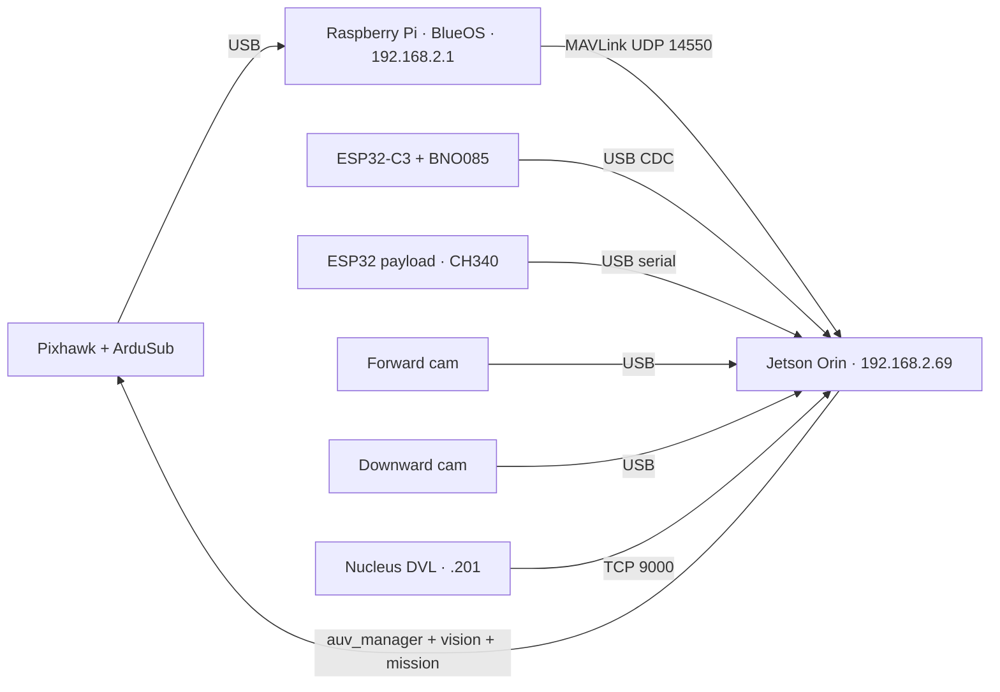

<p align="center">
  
</p>

<h1 align="center">Mongla — <code>duburi_ws</code></h1>

<p align="center">
  <em>One ROS 2 control / mission / vision brain for ArduSub AUVs.</em><br/>
  ROS 2 Humble · ArduSub 4.x · YOLO11 · one action surface, axis-isolated control, vision in the same loop.
</p>

<p align="center">
  
  
  
  
  
  
  <a href="https://fh1m.github.io/duburi_ws/"></a>
</p>

<p align="center">
  <a href="#-get-started">Get started</a> ·
  <a href="#-pool-day">Pool day</a> ·
  <a href="#-operating-the-auv">Operating</a> ·
  <a href="#-mission-design">Mission design</a> ·
  <a href="#-reference">Reference</a> ·
  <a href=".claude/context/mission-cookbook.md">Cookbook</a> ·
  <a href=".claude/context/development-board.md">Dev board</a>
</p>

Mongla is a ROS 2 Humble colcon workspace that exposes **one clean action surface
(`/duburi/move`)** over ArduSub. A single node owns the MAVLink connection, receives goals,
and dispatches them to per-axis motion modules behind one dispatch table (`COMMANDS`). It's
developed against an ArduSub SITL + Gazebo loop and field-tested on **Duburi**, a
`vectored_6dof` 8-thruster AUV, for **RoboSub 2026**.

> The workspace name `duburi_ws` and the `/duburi/*` namespace are kept for the test vehicle;
> the codebase itself is **Mongla**.

---

## One soul, two bodies

**Mongla is the *soul* (the code).** It runs on two competition *bodies*:

<table>
<tr>
<td width="50%" align="center"></td>
<td width="50%" align="center"></td>
</tr>
<tr>
<td align="center"><b>Duburi 4.5</b> — primary · octagonal · DVL + grabber/dropper/torpedo</td>
<td align="center"><b>Dubomini 2.0</b> — agile · compact · 8× T200 · manipulator-free</td>
</tr>
</table>

|  | Duburi 4.5 (primary) | Dubomini 2.0 (agile) |
|---|---|---|
| Frame | `vectored_6dof`, 8× T200 | `vectored_6dof`, 8× T200 |
| Flight controller | Pixhawk 2.4.8 · ArduSub 4.x | Pixhawk 2.4.8 · ArduSub |
| Compute | Jetson Orin Nano | Jetson Orin Nano |
| Heading | Pixhawk EKF + **BNO085** external gyro (`yaw_source`) | same |
| Localisation | Bar30 depth · **Nortek Nucleus 1000 DVL** | Bar30 depth · no DVL |
| Payload | grabber / dropper / torpedo (ESP32-serial) | shared dropper/torpedo; no manipulators |

> **Heading, code-truth:** `yaw_source` reads the **BNO085** (gyro, immune to in-hull magnetic
> interference) for heading-lock; the Pixhawk EKF owns attitude/depth. The 4.5 public spec
> lists a VectorNav VN-200 — *not* what the stack reads. Full delta:
> [`vehicle-spec.md`](.claude/context/vehicle-spec.md).

<details>
<summary><b>RoboSub 2026 — status at a glance</b> (✅ built · 🟦 phase-2 · ✏️ corrected)</summary>

<br/>Live status, open work, and the bug/fix log are centralised in the
**[development board](.claude/context/development-board.md) — start there.**

- **✅ Phase 1 (runs today):** single-body Duburi stack — `detected()` reactive missions,
  YOLO11 + Roboflow trackers (OC-SORT) + monocular depth (30 fps), Gate / Return / search-align, the
  control / MAVLink / vision core.
- **✅ Two-verb vision:** the whole vision surface is `vision_align` + `vision_move` —
  pixel-native, `gain` = max-speed cap, misses non-fatal, search/recovery via a `fallback`.
- **✅ YASMIN FSM layer:** `state_machines/` with `VehicleProfile` dual-vehicle auto-detect —
  one plan builder, DVL-distance for Duburi 4.5 and timed for Dubomini 2.0.
- **✅ ESP32-serial payload:** `PayloadDriver` + `fire` verb (1/2=torpedo, 3/4=dropper).
- **✅ Competition missions:** 5 task chunks + combinator + FSM launchers. Gate model
  (`gate_rescue_repair`) ships today; slalom / bin / torpedo `.pt` pending (YAMLs committed).
- **🟦 Phase 2:** Dubomini control path · inter-vehicle comms (IVC) · stepper grabber ·
  underwater preprocessing.
- **✏️ Corrected:** detector is **YOLO11** (the TDR's YOLO26 line is superseded).
</details>

<br/>

# 🚀 Get started

## Build

```bash
./build_duburi.sh            # builds interfaces first, then all packages; symlinks executables
source /opt/ros/humble/setup.bash && source install/setup.bash
```

**Prerequisites:** Ubuntu 22.04 (native / WSL2 / distrobox) · ROS 2 Humble · Python 3.10 ·
`pymavlink` (auto-installed by colcon). Sim adds ArduPilot SITL + `sim_vehicle.py` and Gazebo
([`sim-setup.md`](.claude/context/sim-setup.md)); vision adds a CUDA torch wheel + `ultralytics`,
`supervision`, `filterpy`, `onnxruntime` (`requirements.txt`). Fresh box:
[`docs/JETSON_SETUP.md`](docs/JETSON_SETUP.md).

> Every session, source ROS + the workspace, then run the preflight first:
> ```bash
> ros2 run duburi_manager bringup_check     # network · UDP 14550 · Pixhawk USB · DVL · BNO085 · mode hint
> ```
> Exit 0 = nothing failed (WARNs are OK in sim/desk).

## Quick start (three flows)

**Drive in sim** — Gazebo + ArduSub SITL, no real AUV:

```bash
# T1 — ArduSub SITL
sim_vehicle.py -L RATBeach -v ArduSub -f vectored_6dof --model=JSON \
    --out=udp:0.0.0.0:14550 --out=udp:127.0.0.1:14551 --console
# T2 — manager (auto-detects sim via UDP 14550)
ros2 run duburi_manager start
# T3 — drive
ros2 run duburi_planner duburi arm
ros2 run duburi_planner duburi set_depth --target -0.5
ros2 run duburi_planner duburi move_forward --duration 3 --gain 60
ros2 run duburi_planner duburi disarm
```

**Vision pipeline** — webcam, no AUV (camera + detector + tracker + HUD in one command):

```bash
ros2 launch duburi_vision vision.launch.py camera:=laptop model:=yolov11n classes:=person
#   headless (mission mode):  add  viewer:=false
#   competition dual-camera:  ros2 launch duburi_vision vision_dual.launch.py
```

**Run a mission** — auto-discovered from `missions/*.py`:

```bash
ros2 run duburi_planner mission --list
ros2 run duburi_planner mission demo_find_person      # vision align + move demo
ros2 run duburi_planner mission pool_day_practice     # ★ Gate→Slalom→Torpedo→Bin
```

<br/>

# 🏊 Pool day

End-to-end in-water session. Everything runs on the Jetson unless noted.


```mermaid
flowchart LR
  PIX[Pixhawk + ArduSub] -->|USB| RPI[Raspberry Pi · BlueOS · 192.168.2.1]
  RPI -->|MAVLink UDP 14550| JET[Jetson Orin · 192.168.2.69]
  BNO[ESP32-C3 + BNO085] -->|USB CDC| JET
  PAY[ESP32 payload · CH340] -->|USB serial| JET
  FCAM[Forward cam] -->|USB| JET
  DCAM[Downward cam] -->|USB| JET
  DVL[Nucleus DVL · .201] -->|TCP 9000| JET
  JET -->|auv_manager + vision + mission| PIX
```

**1 · Power & network** — power the AUV; BlueOS (`192.168.2.1`) routes Pixhawk MAVLink to the
Jetson (`192.168.2.69:14550`) as a UDP client (`inspector` endpoint).

**2 · Plug payload sensors** — BNO085 (VID/PID `303a:1001`) and ESP32 payload (CH340,
`1a86:7523`) auto-detect by VID/PID; the forward + downward cameras are USB.

**3 · Preflight**
```bash
ros2 run duburi_manager bringup_check          # network · UDP · Pixhawk · DVL · BNO085
ls /dev/video*                                 # confirm camera device indices
```

**4 · Manager + sensors** — DVL + BNO085 heading is the most stable pool combo:
```bash
ros2 launch duburi_manager bringup.launch.py mode:=pool yaw_source:=bno085_dvl
# expect the MONGLA · DUBURI AUV MANAGER banner, a [STATE] line within ~2 s,
# and [DVL] connected (dvl_auto_connect:=true)
```

**5 · Vision** — both cameras (detectors start paused; missions resume per task):
```bash
ros2 launch duburi_vision vision_dual.launch.py                  # fwd=gate_rescue_repair · dwn=bin_fire_blood
ros2 launch duburi_vision vision_dual.launch.py viewer:=false    # headless Jetson
ros2 launch duburi_vision vision_dual.launch.py paused:=false    # always-on (free command testing)
# single camera:
ros2 launch duburi_vision vision.launch.py camera:=forward model:=gate_rescue_repair classes:=gate,rescue,repair conf:=0.45
```

**6 · Verify before arming**
```bash
ros2 run duburi_vision vision_check --camera forward --require-class gate   # topic health
ros2 topic echo /duburi/state --once                                        # armed=false, mode, yaw, depth
ros2 run duburi_vision vision_thrust_check --camera forward --duration 4    # detection → RC echo (disarmed-safe)
```

**7 · Run** — `ros2 run duburi_planner mission pool_day_practice` (the tether countdown is in
the mission). Any single verb works too: `ros2 run duburi_planner duburi vision_align --camera forward --target_class gate --axes yaw,lat --duration 15`.

**8 · Record & watch every run** (optional, off the mission path) — add `foxglove:=true` to the
manager launch to stream telemetry, record the run to an MCAP bag, and get a per-run scorecard,
all in one folder. Replay bags **offline** to tune detection/gains without pool time; the
ground-station viewer is **Lichtblick** (offline-safe). Full runbook + dev-box setup:
[`foxglove-and-bags.md`](.claude/context/foxglove-and-bags.md).
```bash
source scripts/pool_session.sh gate_am   # pin one folder per run (source in each terminal)
scripts/pool_record.sh record gate_am    # MCAP bag → ~/duburi_runs/gate_am  ·  list / replay <dir>
```

> **Models live on the Jetson** in `src/duburi_vision/models/` (`.pt` gitignored; YAML class
> sidecars committed). Competition stems: `gate_rescue_repair` (ships), `slalom_red_pipe`,
> `bin_fire_blood`, `torpedo_blood_hole`. A missing `.pt` falls back to `yolo11n`. Status:
> [`models/README.md`](src/duburi_vision/models/README.md) · checklist:
> [`pool-day.md`](.claude/context/pool-day.md).

**Launch arguments**

| Launch | Key args |
|--------|----------|
| `bringup.launch.py` | `mode` (pool·sim·desk·laptop·auto) · `yaw_source` (dvl·bno085_dvl·bno085·mavlink_ahrs) · `vision` (adds 1 cam+detector+viewer) · `camera` · `model` · `classes` · `conf` · `dvl_auto_connect` · `viewer` · `foxglove` (+`foxglove_port`) |
| `vision.launch.py` | `camera` · `model` · `classes` · `conf` · `viewer` · `tracking` · `depth` · `device` · `video_file` |
| `vision_dual.launch.py` | `fwd_model`/`fwd_classes`/`fwd_device=0`/`fwd_conf` · `dwn_model`/`dwn_classes`/`dwn_device=4`/`dwn_conf` · `paused=true` · `viewer` · `tracking` |

**Any model · any classes · any number of cameras.** `model:=<stem>` picks any weights in
`models/` (or a `yolov11n`/`yolo26n` pretrained alias); `classes:=a,b,c` (empty = all) is a live
post-inference filter; `conf:=` sets the threshold. For N cameras, launch one
`vision.launch.py camera:=<name>` per camera — each gets its own `/duburi/vision/<name>/*` topics
and a `/duburi_detector_<name>` node you retarget live. Load several models at once with
`models:="gate=gate_nano_100ep,combined=gate_flare_medium_100ep" active_model:=gate` and hot-swap
mid-mission.

<br/>

# 🎮 Operating the AUV

## CLI command cookbook (`duburi`)

Every command goes through `/duburi/move` and **blocks until done** (exit 0 = success).
Full flags: `ros2 run duburi_planner duburi <cmd> --help`.

| Verb | What it does | Example |
|------|-------------|---------|
| `arm` / `disarm` | Power thrusters on / off | `duburi arm` |
| `set_mode` | Switch ArduSub mode | `duburi set_mode --target_name ALT_HOLD` |
| `set_depth` | Dive to absolute depth (m, negative) | `duburi set_depth --target -1.5` |
| `move_forward` / `move_back` | Open-loop thrust, duration + gain | `duburi move_forward --duration 5 --gain 80` |
| `move_left` / `move_right` | Lateral strafe | `duburi move_right --duration 3` |
| `yaw_left` / `yaw_right` | Sharp pivot by N° (relative) | `duburi yaw_left --target 90` |
| `turn` | Rotate to absolute heading (auto direction) | `duburi turn --target 270` |
| `arc` | Forward + yaw simultaneously | `duburi arc --duration 4 --gain 50 --yaw_rate_pct 30` |
| `style_yaw` / `style_roll` | N×360° spin / ACRO roll | `duburi style_yaw --flips 1` |
| `lock_heading` / `unlock_heading` | Background yaw hold (returns immediately) / stop | `duburi lock_heading --target 0` |
| `dvl_connect` | Manually connect Nucleus DVL (auto by default) | `duburi dvl_connect` |
| `move_forward_dist` / `move_back_dist` | DVL closed-loop ± N m (heading lock stays active) | `duburi move_forward_dist --distance_m 2.0 --gain 60` |
| `move_lateral_dist` | DVL closed-loop lateral (+ right, − left) | `duburi move_lateral_dist --distance_m 1.0 --gain 36` |
| `vision_align` | Centre target on lat/yaw/depth at signed px offsets | `duburi vision_align --target_class gate --axes yaw,lat --duration 15` |
| `vision_move` | Drive forward until bbox fills `fwd_fill`% | `duburi vision_move --target_class gate --fwd_fill 80 --mode area` |
| `fire` | Fire ESP32 payload channel (1/2=torpedo, 3/4=dropper) | `duburi fire --fire_channel 3` |
| `stop` / `pause` | Active RC-neutral hold / release override N s | `duburi pause --duration 2` |
| `mission_reset` | Stop heading lock + clear abort + RC neutral | `duburi mission_reset` |
| `surface` | Emergency ascend to 0 m (bypasses the busy gate) | `duburi surface` |
| `head` | Read live heading at execution time | `duburi head` |

`--target head` (on any numeric field) snapshots the live heading at dispatch:
`duburi lock_heading --target head`. Full param / MAVLink reference:
[`command-reference.md`](.claude/context/command-reference.md).

## Stopping, aborting & emergency kill

`stop`, `disarm`, and `surface` are **safety verbs** — they bypass the "one command at a time"
gate, so they run *even while another command is mid-execution* and signal it to abort at its
next tick.

```bash
ros2 run duburi_planner duburi stop        # active hold — RC neutral on every channel
ros2 run duburi_planner duburi surface     # ascend to 0 m and hold (works during a mission)
ros2 run duburi_planner duburi disarm      # cut thrusters (MANUAL → neutral → disarm)
```

**Ctrl-C is the kill switch.** Ctrl-C (or `SIGTERM`) on:
- **the manager** → automatic emergency stop: heading-lock + heartbeat stopped, RC neutral,
  **disarm**, sensor/camera handles closed (the red `MONGLA EMERGENCY STOP` banner prints).
- **a running mission** → cancels the in-flight goal, then `stop` + `disarm`.
- **a blocking `duburi <cmd>`** → cancels that goal and waits for it to unwind.

Every mission calls `duburi.mission_reset()` first so a fresh run never inherits the previous
run's heading lock or abort flag.

<br/>

# 🧭 Mission design

A mission is a plain Python file in `missions/` exposing `def run(duburi, log)`. **No rebuild,
no registry edit** — the runner loads it from source on every `ros2 run duburi_planner mission
<name>`. `duburi` is a `DuburiMission` DSL; `log` is a callable for one-line status.

```python
def run(duburi, log):
    duburi.mission_reset()                       # ALWAYS first — clears prior heading-lock/abort
    duburi.camera = 'forward'                    # sticky camera for vision verbs
    duburi.models(gate='gate_rescue_repair')     # register alias → auto model+class switch
    try:
        duburi.arm()
        duburi.set_depth(-0.8)
        # ... mission body (verbs below) ...
    finally:
        duburi.disarm()                          # runner also disarms on exception as a backstop
```

Cookbook with 10 ready-to-steal samples: [`mission-cookbook.md`](.claude/context/mission-cookbook.md) ·
full DSL API: [`client-and-dsl-api.md`](.claude/context/client-and-dsl-api.md).

## Open-loop motion verbs (`duburi.*`)

Each blocks until complete. `gain` is % thrust (0–100); `settle` adds a post-move neutral hold.

| DSL call (defaults shown) | Does |
|---|---|
| `duburi.arm(timeout=15)` / `duburi.disarm(timeout=20)` | Power thrusters on / off |
| `duburi.set_depth(meters, timeout=30, settle=0)` | Dive to absolute depth (negative = down); engages ALT_HOLD |
| `duburi.move_forward(seconds, gain=80, settle=0)` | Ch5 forward (also `move_back` / `move_left` / `move_right`) |
| `duburi.yaw_left(degrees, timeout=30, settle=0)` | Sharp pivot (also `yaw_right`); relative degrees |
| `duburi.turn(degrees, timeout=30, settle=0)` | Rotate to **absolute** heading, direction auto |
| `duburi.arc(seconds, gain=50, yaw_rate_pct=30, settle=0)` | Forward + yaw in one packet (curved) |
| `duburi.lock_heading(degrees=0, timeout=300)` / `duburi.release_heading()` | Background Ch4 yaw-hold (0 = current heading) |
| `duburi.move_forward_dist(metres, gain=60, tolerance=0.1)` | **DVL** closed-loop (also `move_back_dist` / `move_lateral_dist`, lock stays active) |
| `duburi.style_roll(gain=60, flips=1, headroom=1.0)` / `duburi.style_yaw(flips=1, deg_per_step=90)` | Style 360° manoeuvres |
| `duburi.fire(channel)` | ESP32 payload (1/2=torpedo, 3/4=dropper); `duburi.payload_ready` to check |
| `duburi.pause(seconds)` / `duburi.stop()` / `duburi.surface()` | Release override / active hold / emergency ascend |
| `duburi.head()` | Live heading (float) at call time |
| `duburi.countdown(seconds=10)` | Tether-removal countdown banner |

## Vision verbs (`duburi.vision.*`)

The entire vision surface is **two** pixel-native verbs. `gain` is a hard **max-speed cap**
(not a target speed), `err` is the pixel tolerance, and **neither ever fails a mission** — on a
miss they log the outcome and return so the next step runs. Control reads raw `/detections`
(the tracker feeds only the HUD).

```python
duburi.vision.align(target, *, lat=None, yaw=None, depth=None,
                    err=40, duration=20, gain=30, hold=None,
                    fire=None, fire_t=None, lock_on=False, fallback=None, camera=None)
duburi.vision.move(target, *, fwd=None, mode='area', maintain=None, hold=None,
                   err=40, duration=20, gain=30, fallback=None, camera=None)
```

| Arg | Applies to | Meaning |
|-----|-----------|---------|
| `target` | both | class string, or `duburi.models.<alias>.<class>` (auto-switches model + class) |
| `lat` / `yaw` / `depth` | align | `None` = axis off; a **number** = on, as a signed px offset from centre (`0` = centre). ≥1 required |
| `hold` | align | seconds to **active station-keep** after centring (fights inertia for a payload shot) |
| `fire` / `fire_t` | align | fire a payload **mid-hold while still correcting** — `fire` = channel int/list (1/2 torpedo, 3/4 dropper), `fire_t` = s into the hold. Gated on alignment, non-blocking, `fire_t < hold` |
| `lock_on` | align | **precision continuity lock:** steer to the box nearest the last centre (not the largest) so a 2nd hole / spurious box can't steal the aim on a close-in shot. Off by default |
| `fwd` | move | bbox fill % to stop at (`mode`=`area`·`width`·`height`); **`None` = pass-through** (drive until target seen-then-gone + commit) |
| `maintain` | move | ±px lateral offset held while driving (`None` = pure forward) |
| `hold` | move | seconds to station-keep once the fill target is reached |
| `err` | both | pixel tolerance for "aligned" (default 40). **`err=0` = "use default/`vision.err_px`", NOT zero-tolerance** (rosidl 0==unset); pass a small positive value for tight — the deadband is floored at ~5 px and stated in the `aligned (N/Mpx)` outcome |
| `duration` | both | total time budget (s); fallback cycles count against it |
| `gain` | both | **max-speed cap** (% thrust) — never exceeded |
| `fallback` | both | search `fn(duburi)` or `fn(duburi, should_stop)` run on target loss, then the verb re-enters |
| `camera` | both | overrides the sticky `duburi.camera` |

> **Yaw / Ch4 during a vision verb.** A verb writes Ch4 **only when `yaw` is a
> requested align axis**; `align` without `yaw` (and **all** `move`) leave Ch4 to a
> live `heading_lock` (BNO) or the autopilot, never fighting it. If yaw *jitters*
> while aligning, the cure is the `heading_lock` floor taper (already shipped), **not**
> releasing the lock — releasing it hands yaw to ArduSub's untrusted hull compass.
> The close-in precision layer (`lock_on` + `vision.ctrl_conf`/`range_gain_floor`/`ki_lat`)
> is in [`precision-alignment.md`](.claude/context/precision-alignment.md).

**Outcome — branch on WHERE/HOW it finished (hybrid vision+control).** Both return a
`VisionResult` (truthy only on success) carrying `x_px`/`y_px` (signed target-from-centre
px at the last seen frame, `NaN` if never seen), `saw_target`, `last_err_px`, `fill`,
`elapsed_s`, `status` (`0 ALIGNED · 1 LOST · 2 TIMEOUT · 3 NO_CAMERA · 4 ABORTED`, + DSL
`FAILED`). So a missed align can still recover: `if res: ... elif res.saw_target:
duburi.move_right(1) if res.x_px > 30 else duburi.move_left(1)`. Full contract, recovery
patterns, mid-hold fire, live `err_x_px` feedback, do's & don'ts →
[`vision-results.md`](.claude/context/vision-results.md). **Firing** = mid-hold (above) or
the simple `if duburi.vision.align('hole', yaw=0, lat=0, depth=0, err=12).ok: duburi.fire(1)`.

```python
# Gate pass: register model, search via fallback, centre, drive through
def run(duburi, log):
    duburi.mission_reset(); duburi.camera = 'forward'
    duburi.models(gate='gate_rescue_repair')
    duburi.arm(); duburi.set_depth(-0.8)
    duburi.vision.align(duburi.models.gate.gate, yaw=0, lat=0, duration=20, fallback=sweep)
    duburi.vision.move(duburi.models.gate.gate, fwd=80, mode='area', gain=35, duration=20)
    duburi.move_forward_dist(3.5, gain=60)
    duburi.disarm()

def sweep(duburi, should_stop):          # pure-control search; bails the moment target reappears
    for _ in range(6):
        if should_stop(): return
        duburi.yaw_right(15); duburi.pause(0.4)
```

## Detection, models & the `detected()` paradigm

| DSL call | Does |
|---|---|
| `duburi.detected(cls, camera=None, stale_after=1.0) -> bool` | Non-blocking cache check (case-insensitive); use in `while`/`if` |
| `duburi.models(gate='stem', …)` → `duburi.models.gate.gate` | Register aliases; pass the `ClassRef` as a `target` to auto model+class switch |
| `duburi.set_classes('gate,flare', camera=…)` | Live class filter (no restart) |
| `duburi.set_model('stem', camera=…)` / `duburi.use('stem','gate')` | Hot model swap (registry mode) / model + classes together |
| `duburi.set_conf(0.45, camera=…)` | Live confidence threshold |
| `duburi.pause_detector('forward')` / `duburi.resume_detector('forward')` | Free / restore GPU per task (dual-cam) |
| `duburi.use_camera('downward')` | Switch the sticky camera mid-mission |

**Reactive pattern** — open-loop until a target appears, then hand off to vision:

```python
MAX_STEPS = 60
for _ in range(MAX_STEPS):                       # 1) always bound the loop
    if duburi.detected(duburi.models.gate.gate, stale_after=0.5):
        break
    duburi.move_forward(0.5, gain=30)            # 2) short steps (≤0.5 s) — avoid overshoot
else:
    return
duburi.vision.align(duburi.models.gate.gate, yaw=0, lat=0)
```

Rules that bite: **bound every search loop** · **steps ≤ 0.5 s** · **restore the class filter
after a class switch** (`set_classes('gate,flare')`) or `detected('gate')` stays False ·
**set `duburi.camera` first**. Full reference: [`detected-paradigm.md`](.claude/context/detected-paradigm.md).

## Live-tunable gains (apply on the **next** vision goal, never mid-loop)

```bash
ros2 param set /duburi_manager vision.kp_yaw 80.0
ros2 param set /duburi_detector_forward classes gate,flare      # class filter, no restart
ros2 param set /duburi_detector_forward active_model flare       # hot model swap
```

| `vision.*` param | Default | Effect |
|---|---|---|
| `kp_lat` · `kp_yaw` | 60 · 60 | P-gain on lateral / yaw pixel error |
| `kp_depth` | 0.05 | depth nudge (m/tick) per unit error |
| `kp_forward` | 200 | P-gain on `vision_move` fill error |
| `lost_grace_s` | 1.0 | coast seconds on target loss before `LOST` → `fallback` |
| `frame_fill_default` | 95 | `vision_move` fill target when `fwd` is unset |
| `align_stable_frames` | 3 | in-band ticks before `ALIGNED` |
| `range_gain_floor` | 1.0 | **precision:** soften lat/depth gain as the bbox fills close-in (`1.0`=off, `~0.3`=gentle) |
| `ki_lat` | 0.0 | **precision:** lateral integral; nulls a steady-current offset during the hold (`0`=off) |
| `ctrl_conf` | 0.0 | **precision:** control-side min detection score to accept a box (`0`=off) |
| `coast_s` | 0.0 | **gap-bridging coast (opt-in):** steer on the tracker's predicted box of the locked id for `coast_s` s after a detection drops (`0`=OFF). Keeps a torpedo/gate lock through a brief flicker. A live detection always overrides; `< lost_grace_s`. See [`known-issues.md`](.claude/context/known-issues.md) D10 |

Defaults: [`vision_tunables.py`](src/duburi_manager/duburi_manager/vision_tunables.py). Pool-day
phase constants (depths, headings, fill %, gains) live in
[`missions/competition_config.py`](src/duburi_planner/duburi_planner/missions/competition_config.py)
— edit at the pool, no rebuild.

## FSM missions (dual-vehicle)

For robust competition runs, the YASMIN FSM layer wraps the same DSL verbs as states with
explicit timeouts and retries. `VehicleProfile.auto()` probes `yaw_source` at start —
`dvl` → Duburi 4.5 (DVL-distance passes), else → Dubomini (timed). One `build_*_fsm(duburi,
profile)` builds the right machine for either body. Guide:
[`fsm-guide.md`](.claude/context/fsm-guide.md).

```bash
ros2 run duburi_planner mission gate_flare_fsm     # gate + flare FSM (auto-detects vehicle)
ros2 run duburi_planner mission fsm_full_2026      # full 5-task YASMIN FSM
```

## Mission catalog

| Group | Missions |
|-------|----------|
| Demos | `demo_arc` `demo_find_person` `demo_heading_lock` `demo_move_see` `demo_pursue` `demo_square` |
| Prequal | `gate_prequal` `gate_flare_prequal` `gate_flare_autonomous` `robosub_prequal` `robosub_gate_rescue` |
| Pool-day | `pool_day_practice` (Gate→Slalom→Torpedo→Bin) · `pool_day_torpedo` |
| Competition chunks | `task_gate` `task_slalom` `task_bin` `task_torpedo` `task_return` `task_full_2026` |
| FSM | `gate_flare_fsm` `prequal_fsm` `gate_then_bin_fsm` `fsm_slalom` `fsm_bin` `fsm_torpedo` `fsm_return` `fsm_full_2026` |

<br/>

# 🔧 Reference

## Architecture

One node owns MAVLink; everything else is a client of `/duburi/move`.

```
[duburi CLI] [mission runner] [DuburiClient]
        └──────────── /duburi/move (action) ──────────► auv_manager_node
                                                            │  (sole recv_match / Pixhawk owner)
                                                            ▼
                                                       Duburi facade  ── COMMANDS dispatch
                                          ┌──────────────┼───────────────┬───────────────┐
                                     motion_yaw     motion_forward   motion_depth    heading_lock
                                   (Ch4 rate 10Hz)  (Ch5 / arc 20Hz) (SETPOS 5Hz)  (Ch4 rate 50Hz)
                                                            │
                                            Pixhawk ─ UDP 14550 ─► BlueOS ─ USB ─► Pixhawk/ArduSub
```

**ArduSub does the inner loop.** Its onboard 400 Hz stabilizer + EKF3 owns the inner loop.
**Depth** is fully ArduSub's (we stream `SET_POSITION_TARGET_GLOBAL_INT`). **Yaw is split:**
ArduSub's rate loop closes the yaw *rate* from our **Ch4 `RC_CHANNELS_OVERRIDE`** stick, while
the *absolute heading* loop is closed in Python against `yaw_source` — the in-hull compass is
untrusted, so we drive Ch4 as a rate command and never send `SET_ATTITUDE_TARGET` (it appears
nowhere in the code). Translation (Ch5/Ch6) and `arc` (Ch5+Ch4) are open-loop RC override.
First principles: [`axis-isolation.md`](.claude/context/axis-isolation.md) ·
[`heading-lock.md`](.claude/context/heading-lock.md).

## Code structure (5 packages)

| Package | Role |
|---------|------|
| `duburi_interfaces` | `Move.action` + `DuburiState.msg` — the only ROS surface clients touch |
| `duburi_control` | `Pixhawk` MAVLink wrapper + per-axis motion (`motion_{yaw,forward,lateral,depth,vision}`, `heading_lock`) + `Heartbeat` + `VisionVerbs` + the `COMMANDS` registry + `tracing` |
| `duburi_manager` | ROS2 node, `/duburi/move` action server, telemetry, `VisionState` pool, connection profiles, `vision.*` params |
| `duburi_planner` | `DuburiClient` + `duburi` CLI + `mission` runner + `missions/*` + `state_machines/` (YASMIN) + `model_context` |
| `duburi_sensors` | `YawSource` abstraction — MAVLink AHRS · BNO085 (ESP32-C3 USB CDC) · Nucleus1000 DVL · `bno085_dvl` composite · WitMotion stub |

**Adding a verb = two edits:** a row in `duburi_control/commands.py` (`COMMANDS`) + a same-named
method on `Duburi`. The action server, CLI, mission runner, and `DuburiClient` all read
`COMMANDS` at runtime — no other wiring. FSM state library: **navigation** =
Arm/Disarm/SetDepth/LockHeading/Move{Forward,Back,Lateral}/Turn/Surface · **vision** =
VisionSearch/VisionAlign/VisionMove · **utility** = Countdown/Pause/LogScore/SetDetector/Fire/StyleRoll.

## Per-node bringup (debug one layer at a time)

| Layer | Command | Verify |
|------|---------|--------|
| Flight controller | `ros2 run duburi_manager start [-p mode:=sim]` | `ros2 topic echo /duburi/state --once` |
| BNO085 (standalone) | `ros2 run duburi_sensors sensors_node -p yaw_source:=bno085 [-p calibrate:=true]` | `[SENS] yaw=…` |
| DVL | `ros2 run duburi_manager start --ros-args -p yaw_source:=dvl` (auto-connects) | `bringup_check` → `[PASS] Nucleus 1000` |
| Camera | `ros2 run duburi_vision camera_node --ros-args -p name:=forward -p source:=webcam` | `ros2 topic hz …/image_raw` (~30) |
| Detector | `ros2 run duburi_vision detector_node --ros-args -p camera:=forward` | `ros2 topic hz …/detections` (~15-25) |
| Tracker | `ros2 run duburi_vision tracker_node --ros-args -p camera:=forward -p tracker_type:=ocsort` | `ros2 topic hz …/tracks` |
| Depth (vis_range) | `ros2 run duburi_vision depth_estimation_node --ros-args -p camera:=forward` | `ros2 topic echo …/vis_range` |
| HUD viewer | `ros2 run duburi_vision vision_display --ros-args -p camera:=forward` | OpenCV window |
| Full stack | `ros2 launch duburi_manager bringup.launch.py vision:=true` | banner + `/duburi/state` |

**Preflight / utility scripts** (`ros2 run duburi_<pkg> <script>`): `bringup_check`
(network + serial + Jetson-power preflight), `vision_check` (topic-only health probe),
`vision_thrust_check` (detection→RC echo, disarmed-safe), `tracker_check` (tracker smoke
test), `vision_node` (in-process camera+detector smoke test), `export_engine` (build
TensorRT `.engine` files **on the Jetson** for 20–30 Hz inference).

Failure order: no `/duburi/state` → manager/UDP · no `image_raw` → camera (perms:
`sudo usermod -aG video $USER`) · no `detections` → detector (model/CUDA, check `[DET]`).
**Per-command MAVLink trace:** start the manager with `-p debug:=true` to tag every outbound
frame with the verb that caused it (`[MAV send_rc_override cmd=lock_heading] yaw=1430`); then
`rg "cmd=lock_heading"` the log.

## Modes, network & configuration

**Modes** (`-p mode:=`, default `auto` probes the environment): `sim` (SITL/Gazebo) · `pool`
(Jetson on the AUV, BlueOS pushes MAVLink) · `desk` (Pixhawk over USB) · `laptop` (tether on
switch). All listen on `udpin:0.0.0.0:14550`. **Network:** Jetson `192.168.2.69` · BlueOS
`192.168.2.1` · DVL `192.168.2.201` · MAVLink UDP `14550` (`connection_config.py`).

- **Config** — tracker thresholds [`config/tracker.yaml`](src/duburi_vision/config/tracker.yaml),
  detector defaults [`config/detector.yaml`](src/duburi_vision/config/detector.yaml), full list
  [`docs/configuration.md`](docs/configuration.md).
- **Tuning** — vision gains, smoothing flags (`smooth_yaw`, `smooth_translate`), ArduSub PID:
  [`docs/tuning.md`](docs/tuning.md).
- **Telemetry / troubleshooting** — [`docs/telemetry.md`](docs/telemetry.md) ·
  [`docs/troubleshooting.md`](docs/troubleshooting.md).

## Further reading

Deep design notes live in [`.claude/context/`](.claude/context/) — start with the
**[development board](.claude/context/development-board.md)**, then:

- **API & verbs:** [`command-reference.md`](.claude/context/command-reference.md) ·
  [`client-and-dsl-api.md`](.claude/context/client-and-dsl-api.md) ·
  [`mission-cookbook.md`](.claude/context/mission-cookbook.md) ·
  [`detected-paradigm.md`](.claude/context/detected-paradigm.md) ·
  [`testing-guide.md`](.claude/context/testing-guide.md)
- **ArduSub & MAVLink:** [`ardusub-canon.md`](.claude/context/ardusub-canon.md) ·
  [`mavlink-reference.md`](.claude/context/mavlink-reference.md) ·
  [`heading-lock.md`](.claude/context/heading-lock.md) ·
  [`axis-isolation.md`](.claude/context/axis-isolation.md)
- **Vehicle / sensors / vision:** [`vehicle-spec.md`](.claude/context/vehicle-spec.md) ·
  [`sensors-pipeline.md`](.claude/context/sensors-pipeline.md) ·
  [`dvl-reference.md`](.claude/context/dvl-reference.md) ·
  [`vision-architecture.md`](.claude/context/vision-architecture.md) ·
  [`fsm-guide.md`](.claude/context/fsm-guide.md)
- **Status:** [`robosub-2026-audit.md`](.claude/context/robosub-2026-audit.md) ·
  [`robosub-2026-roadmap.md`](.claude/context/robosub-2026-roadmap.md) ·
  [`known-issues.md`](.claude/context/known-issues.md)
- **Operator tooling (off mission path):** [`foxglove-and-bags.md`](.claude/context/foxglove-and-bags.md)
  — Foxglove/Lichtblick telemetry, rosbag record/replay, per-run scorecards, dev-box setup

Top-level [`CLAUDE.md`](CLAUDE.md) is the agent/context index.

---

## Acknowledgments & license

Developed against the **Duburi** test AUV by **BRAC University Duburi** for RoboSub 2026. Built
on [ArduPilot / ArduSub](https://ardupilot.org/sub/), [BlueOS](https://blueos.cloud/),
[pymavlink](https://github.com/ArduPilot/pymavlink), [ROS 2 Humble](https://docs.ros.org/en/humble/),
[YASMIN](https://github.com/uleroboticsgroup/yasmin),
[Ultralytics YOLO](https://github.com/ultralytics/ultralytics), and
[supervision](https://github.com/roboflow/supervision).

MIT — see [LICENSE](LICENSE).
