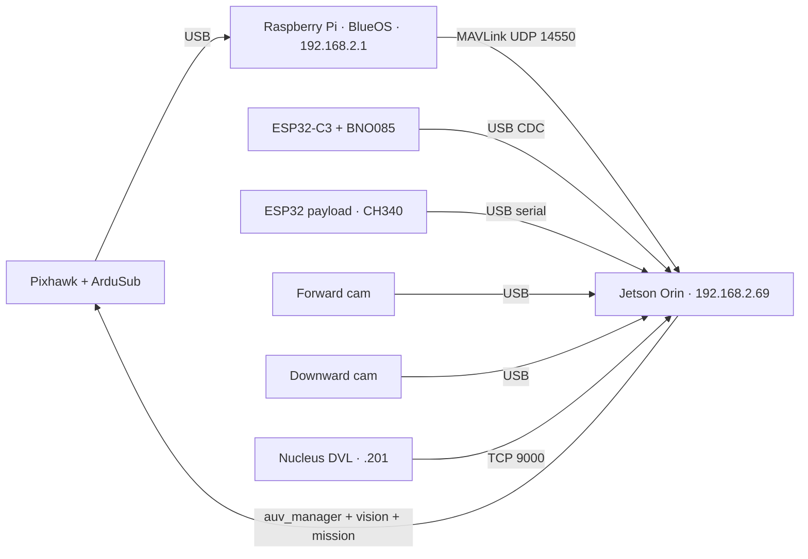

<p align="center">
  
</p>

<h1 align="center">Mongla — <code>duburi_ws</code></h1>

<p align="center">
  <em>One ROS 2 control / mission / vision brain for ArduSub AUVs.</em><br/>
  ROS 2 Humble · ArduSub 4.x · YOLO11 · one action surface, axis-isolated control, vision in the same loop.
</p>

<p align="center">
  
  
  
  
  
  
  <a href="https://fh1m.github.io/duburi_ws/"></a>
</p>

Mongla is a ROS 2 Humble colcon workspace that exposes **one clean action surface
(`/duburi/move`)** over ArduSub. A single node owns the MAVLink connection, receives
goals, and dispatches them to per-axis motion modules behind one dispatch table
(`COMMANDS`). It's developed against an ArduSub SITL + Gazebo loop and field-tested on
**Duburi**, a `vectored_6dof` 8-thruster AUV, for **RoboSub 2026**.

> The workspace name `duburi_ws` and the `/duburi/*` namespace are kept for the test
> vehicle; the codebase itself is **Mongla**.

---

## One soul, two bodies

**Mongla is the *soul* (the code).** It runs on two competition *bodies*:

<table>
<tr>
<td width="50%" align="center"></td>
<td width="50%" align="center"></td>
</tr>
<tr>
<td align="center"><b>Duburi 4.5</b> — primary · octagonal · DVL + grabber/dropper/torpedo</td>
<td align="center"><b>Dubomini 2.0</b> — agile · compact · 8× T200 · manipulator-free</td>
</tr>
</table>

|  | Duburi 4.5 (primary) | Dubomini 2.0 (agile) |
|---|---|---|
| Frame | `vectored_6dof`, 8× T200 | `vectored_6dof`, 8× T200 |
| Flight controller | Pixhawk 2.4.8 · ArduSub 4.x | Pixhawk 2.4.8 · ArduSub |
| Compute | Jetson Orin Nano | Jetson Orin Nano |
| Heading | Pixhawk EKF + **BNO085** external gyro (`yaw_source`) | same |
| Localisation | Bar30 depth · **Nortek Nucleus 1000 DVL** | Bar30 depth · no DVL |
| Payload | grabber / dropper / torpedo (ESP32-serial) | shared dropper/torpedo; no manipulators |

> **Heading, code-truth:** `yaw_source` reads the **BNO085** (gyro, immune to in-hull
> magnetic interference) for heading-lock; the Pixhawk EKF owns attitude/depth. The 4.5
> public spec lists a VectorNav VN-200 — *not* what the stack reads. Full delta:
> [`vehicle-spec.md`](.claude/context/vehicle-spec.md).

---

## RoboSub 2026 — status

Three states: **✅ built & tested · 🟦 committed (phase-2, not built) · ✏️ corrected.**
Live status, open work, and the bug/fix log are centralised in the
**[development board](.claude/context/development-board.md) — start there.**

- **✅ Phase 1 (runs today):** single-body Duburi stack — `detected()` reactive missions,
  YOLO11 + ByteTrack/Kalman + monocular depth (30 fps), Gate / Return / search-align, the
  control / MAVLink / vision core.
- **✅ Two-verb vision:** the whole vision surface is `vision_align` + `vision_move` —
  pixel-native, `gain` = max-speed cap, misses are non-fatal, search/recovery is a
  mission-authored `fallback`.
- **✅ YASMIN FSM layer:** `state_machines/` with `VehicleProfile` dual-vehicle
  auto-detect — one plan builder generates DVL-distance passes for Duburi 4.5 and timed
  passes for Dubomini 2.0.
- **✅ ESP32-serial payload:** `PayloadDriver` + `fire` verb (`fire_channel` 1/2=torpedo,
  3/4=dropper).
- **✅ Competition missions:** 5 task chunks + combinator + FSM launchers (see
  [missions](#run-a-mission)). Gate model (`gate_rescue_repair`) ships today; slalom / bin /
  torpedo `.pt` weights are pending (class-index YAMLs committed).
- **🟦 Phase 2:** Dubomini control path · inter-vehicle comms (IVC) · stepper grabber ·
  underwater preprocessing.
- **✏️ Corrected:** detector is **YOLO11** (the TDR's YOLO26 line is superseded).

---

## Quick start

> All commands assume `source /opt/ros/humble/setup.bash && source install/setup.bash`
> from the workspace root. Fresh Jetson / dev box: [`docs/JETSON_SETUP.md`](docs/JETSON_SETUP.md).

**Always run the preflight first** (network, UDP 14550, Pixhawk USB, DVL, BNO085, mode hint):

```bash
ros2 run duburi_manager bringup_check        # exit 0 = nothing failed (WARNs OK in sim/desk)
```

### Drive in sim (Gazebo + ArduSub SITL, no real AUV)

```bash
# T1 — ArduSub SITL
sim_vehicle.py -L RATBeach -v ArduSub -f vectored_6dof --model=JSON \
    --out=udp:0.0.0.0:14550 --out=udp:127.0.0.1:14551 --console
# T2 — manager (auto-detects sim via UDP 14550)
ros2 run duburi_manager start
# T3 — drive
ros2 run duburi_planner duburi arm
ros2 run duburi_planner duburi set_depth --target -0.5
ros2 run duburi_planner duburi move_forward --duration 3 --gain 60
ros2 run duburi_planner duburi disarm
```

### Vision pipeline (webcam, no AUV)

```bash
# camera + detector + tracker + HUD viewer, one command (yolov11n pretrained, COCO person)
ros2 launch duburi_vision vision.launch.py camera:=laptop model:=yolov11n classes:=person
# headless (mission mode): add  viewer:=false
# competition dual-camera: ros2 launch duburi_vision vision_dual.launch.py
```

### Run a mission

```bash
ros2 run duburi_planner mission --list        # every missions/*.py, auto-discovered
ros2 run duburi_planner mission demo_find_person      # vision align + move demo
ros2 run duburi_planner mission pool_day_practice     # ★ Gate→Slalom→Torpedo→Bin (two-verb, dual-cam)
ros2 run duburi_planner mission fsm_full_2026         # ★ full 5-task YASMIN FSM
```

Drop `missions/<name>.py` exposing `def run(duburi, log)` — **no rebuild, no registry
edit**; the runner loads from source on every invocation. Cookbook:
[`mission-cookbook.md`](.claude/context/mission-cookbook.md).

**Available missions:** demos (`demo_arc`, `demo_find_person`, `demo_heading_lock`,
`demo_move_see`, `demo_pursue`, `demo_square`) · prequal (`gate_prequal`,
`gate_flare_prequal`, `gate_flare_autonomous`, `robosub_prequal`, `robosub_gate_rescue`) ·
pool-day (`pool_day_practice`, `pool_day_torpedo`) · competition chunks
(`task_gate`, `task_slalom`, `task_bin`, `task_torpedo`, `task_return`, `task_full_2026`) ·
FSM (`gate_flare_fsm`, `prequal_fsm`, `gate_then_bin_fsm`, `fsm_slalom`, `fsm_bin`,
`fsm_torpedo`, `fsm_return`, `fsm_full_2026`).

---

## Pool-day startup sequence

End-to-end in-water session. Everything runs on the Jetson unless noted.


```mermaid
flowchart LR
  PIX[Pixhawk + ArduSub] -->|USB| RPI[Raspberry Pi · BlueOS · 192.168.2.1]
  RPI -->|MAVLink UDP 14550| JET[Jetson Orin · 192.168.2.69]
  BNO[ESP32-C3 + BNO085] -->|USB CDC| JET
  PAY[ESP32 payload · CH340] -->|USB serial| JET
  FCAM[Forward cam] -->|USB| JET
  DCAM[Downward cam] -->|USB| JET
  DVL[Nucleus DVL · .201] -->|TCP 9000| JET
  JET -->|auv_manager + vision + mission| PIX
```

1. **Power & network** — power the AUV; BlueOS (`192.168.2.1`) routes Pixhawk MAVLink to the
   Jetson (`192.168.2.69:14550`) as a UDP client (`inspector` endpoint).
2. **Plug payload sensors** — BNO085 (VID/PID `303a:1001`) and ESP32 payload (CH340,
   `1a86:7523`) auto-detect by VID/PID; cameras are USB.
3. **Preflight** — `ros2 run duburi_manager bringup_check` + `ls /dev/video*`.
4. **Manager + sensors** (DVL + BNO085 is the most stable pool combo):
   ```bash
   ros2 launch duburi_manager bringup.launch.py mode:=pool yaw_source:=bno085_dvl
   # expect the MONGLA · DUBURI AUV MANAGER banner, a [STATE] line within ~2 s,
   # and [DVL] connected (dvl_auto_connect:=true)
   ```
5. **Vision** (both cameras; detectors start paused, missions resume per task):
   ```bash
   ros2 launch duburi_vision vision_dual.launch.py            # fwd=gate_rescue_repair, dwn=bin_fire_blood
   ros2 launch duburi_vision vision_dual.launch.py viewer:=false   # headless
   # always-on (free command testing):  ... paused:=false
   # single camera:  ros2 launch duburi_vision vision.launch.py camera:=forward model:=gate_rescue_repair classes:=gate,rescue,repair conf:=0.45
   ```
6. **Verify before arming:**
   ```bash
   ros2 run duburi_vision vision_check --camera forward --require-class gate   # topic health
   ros2 topic echo /duburi/state --once                                        # armed=false, mode, yaw, depth
   ros2 run duburi_vision vision_thrust_check --camera forward --duration 4    # detection → RC echo (disarmed-safe)
   ```
7. **Run** — `ros2 run duburi_planner mission pool_day_practice` (tether countdown is in the mission).

> **Models live on the Jetson** in `src/duburi_vision/models/` (`.pt` gitignored; YAML class
> sidecars committed). Competition stems: `gate_rescue_repair` (ships), `slalom_red_pipe`,
> `bin_fire_blood`, `torpedo_blood_hole`. A missing `.pt` falls back to `yolo11n`. Status:
> [`models/README.md`](src/duburi_vision/models/README.md). Checklist:
> [`pool-day.md`](.claude/context/pool-day.md).

**`bringup.launch.py` args:** `mode` (pool·sim·desk·laptop·auto) · `yaw_source`
(dvl·bno085_dvl·bno085·mavlink_ahrs) · `vision` (adds one camera+detector+viewer) ·
`camera` · `model` · `classes` · `conf` · `dvl_auto_connect` · `viewer`.
**`vision_dual.launch.py` args:** `fwd_model`/`fwd_classes`/`fwd_device=0`/`fwd_conf` ·
`dwn_model`/`dwn_classes`/`dwn_device=4`/`dwn_conf` · `paused=true` · `viewer` · `tracking`.

---

## Command cookbook (`duburi` CLI)

Every command goes through `/duburi/move` and blocks until done (exit 0 = success).
Full flags: `ros2 run duburi_planner duburi <cmd> --help`.

| Verb | What it does | Example |
|------|-------------|---------|
| `arm` / `disarm` | Power thrusters on / off | `duburi arm` |
| `set_mode` | Switch ArduSub mode | `duburi set_mode --target_name ALT_HOLD` |
| `set_depth` | Dive to absolute depth (m, negative) | `duburi set_depth --target -1.5` |
| `move_forward` / `move_back` | Open-loop thrust, duration + gain | `duburi move_forward --duration 5 --gain 80` |
| `move_left` / `move_right` | Lateral strafe | `duburi move_right --duration 3` |
| `yaw_left` / `yaw_right` | Sharp pivot by N degrees (relative) | `duburi yaw_left --target 90` |
| `turn` | Rotate to absolute heading (auto direction) | `duburi turn --target 270` |
| `arc` | Forward + yaw simultaneously | `duburi arc --duration 4 --gain 50 --yaw_rate_pct 30` |
| `style_yaw` / `style_roll` | N×360° spin / ACRO roll | `duburi style_yaw --flips 1` |
| `lock_heading` / `unlock_heading` | Background yaw hold (returns immediately) / stop | `duburi lock_heading --target 0` |
| `dvl_connect` | Manually connect Nucleus DVL (auto by default) | `duburi dvl_connect` |
| `move_forward_dist` / `move_back_dist` | DVL closed-loop ± N m (heading lock stays active) | `duburi move_forward_dist --distance_m 2.0 --gain 60` |
| `move_lateral_dist` | DVL closed-loop lateral (+ right, − left) | `duburi move_lateral_dist --distance_m 1.0 --gain 36` |
| `vision_align` | Centre target on lat/yaw/depth at signed px offsets | `duburi vision_align --target_class gate --axes yaw,lat --duration 15` |
| `vision_move` | Drive forward until bbox fills `fwd_fill`% | `duburi vision_move --target_class gate --fwd_fill 80 --mode area` |
| `fire` | Fire ESP32 payload channel (1/2=torpedo, 3/4=dropper) | `duburi fire --fire_channel 3` |
| `stop` / `pause` | Active RC-neutral hold / release override N s | `duburi pause --duration 2` |
| `mission_reset` | Stop heading lock + clear abort + RC neutral (call first in every mission) | `duburi mission_reset` |
| `surface` | Emergency ascend to 0 m (bypasses the busy gate) | `duburi surface` |
| `head` | Read live heading at execution time | `duburi head` |

`--target head` (or any numeric field) snapshots the live heading at dispatch:
`duburi lock_heading --target head`. Full parameter / MAVLink reference:
[`command-reference.md`](.claude/context/command-reference.md).

### Vision: two verbs

The entire vision surface is two mission-facing verbs. Both are pixel-native, both treat
`gain` as a hard **max-speed cap**, and **neither ever fails a mission** — on a miss they
log the outcome and return so the next step runs. Control loops read raw `/detections`
(the tracker feeds only the HUD).

```python
duburi.vision.align(target, *, lat=None, yaw=None, depth=None,
                    err=40, duration=20, gain=30, fallback=None, camera=None)
duburi.vision.move(target, *, fwd=95, mode='area', maintain=None, hold=None,
                   err=40, duration=20, gain=30, fallback=None, camera=None)
```

- **`align`** centres `target` on the axes you name. Each of `lat`/`yaw`/`depth` is `None`
  (off) or a **number** = signed pixel offset from centre (`0` = centre). At least one axis.
- **`move`** drives forward until the bbox fills `fwd`% (`mode` = `area`·`width`·`height`).
  Never re-centres; `maintain=±px` holds a lateral offset, `hold=s` station-keeps.
- **Outcome** — a `VisionResult` (truthy only on success): `0 ALIGNED · 1 LOST · 2 TIMEOUT ·
  3 NO_CAMERA · 4 ABORTED` (+ DSL-only `FAILED` for setup errors, non-fatal).
- **`fallback`** = mission-authored search `fn(duburi)` / `fn(duburi, should_stop)` run on
  target loss; the verb then re-enters, all inside `duration`.
- Firing: `if duburi.vision.align('hole', yaw=0, lat=0, depth=0, err=12).ok: duburi.fire(1)`.

```python
def run(duburi, log):
    duburi.camera = 'forward'
    duburi.models(gate='gate_rescue_repair')        # register alias → auto model+class switch
    duburi.arm(); duburi.set_depth(-1.0)
    duburi.vision.align(duburi.models.gate.gate, yaw=0, lat=0, duration=20, fallback=sweep)
    duburi.vision.move(duburi.models.gate.gate, fwd=80, mode='area', gain=35, duration=20)
    duburi.move_forward_dist(3.5, gain=60)
    duburi.disarm()

def sweep(duburi, should_stop):                      # pure-control search; bails on reacquire
    for _ in range(6):
        if should_stop(): return
        duburi.yaw_right(15); duburi.pause(0.4)
```

DSL reference: [`client-and-dsl-api.md`](.claude/context/client-and-dsl-api.md) ·
`detected()` paradigm: [`detected-paradigm.md`](.claude/context/detected-paradigm.md).

### Live-tune (applies on the next vision goal, never mid-loop)

```bash
ros2 param set /duburi_manager vision.kp_yaw 80.0          # also kp_lat, kp_depth, kp_forward
ros2 param set /duburi_manager vision.lost_grace_s 1.5     # coast before LOST → fallback
ros2 param set /duburi_detector_forward classes gate,flare # class filter, no restart
ros2 param set /duburi_detector_forward active_model flare # hot model swap (registry mode)
```

Defaults: [`vision_tunables.py`](src/duburi_manager/duburi_manager/vision_tunables.py).

---

## Per-node bringup (debug one layer at a time)

Start from the bottom of the stack; check each `ros2 topic hz` before the next layer.

| Layer | Command | Verify |
|------|---------|--------|
| Flight controller | `ros2 run duburi_manager start [-p mode:=sim]` | `ros2 topic echo /duburi/state --once` |
| BNO085 (standalone) | `ros2 run duburi_sensors sensors_node -p yaw_source:=bno085 [-p calibrate:=true]` | `[SENS] yaw=…` |
| DVL | `ros2 run duburi_manager start --ros-args -p yaw_source:=dvl` (auto-connects) | `bringup_check` → `[PASS] Nucleus 1000` |
| Camera | `ros2 run duburi_vision camera_node --ros-args -p name:=forward -p source:=webcam` | `ros2 topic hz …/image_raw` (~30) |
| Detector | `ros2 run duburi_vision detector_node --ros-args -p camera:=forward` | `ros2 topic hz …/detections` (~15-25) |
| Tracker | `ros2 run duburi_vision tracker_node --ros-args -p camera:=forward` | `ros2 topic hz …/tracks` |
| Depth (vis_range) | `ros2 run duburi_vision depth_estimation_node --ros-args -p camera:=forward` | `ros2 topic echo …/vis_range` |
| HUD viewer | `ros2 run duburi_vision vision_display --ros-args -p camera:=forward` | OpenCV window |
| Full vision | `ros2 launch duburi_vision vision.launch.py camera:=forward [depth:=true]` | viewer + topics |
| Full stack | `ros2 launch duburi_manager bringup.launch.py vision:=true` | banner + `/duburi/state` |

Typical failure order: no `/duburi/state` → manager/UDP · no `image_raw` → camera (perms:
`sudo usermod -aG video $USER`) · no `detections` → detector (model/CUDA, check `[DET]`) ·
vision command times out → run `vision_check` first.

**Per-command MAVLink trace:** start the manager with `-p debug:=true` to tag every outbound
frame with the verb that caused it (`[MAV send_rc_override cmd=lock_heading] yaw=1430`), then
`rg "cmd=lock_heading"` the log. Off by default. ([`mavlink-reference.md`](.claude/context/mavlink-reference.md))

---

## Architecture

One node owns MAVLink; everything else is a client of `/duburi/move`.

```
[duburi CLI] [mission runner] [DuburiClient]
        └──────────── /duburi/move (action) ──────────► auv_manager_node
                                                            │  (sole recv_match / Pixhawk owner)
                                                            ▼
                                                       Duburi facade  ── COMMANDS dispatch
                                          ┌──────────────┼───────────────┬───────────────┐
                                     motion_yaw     motion_forward   motion_depth    heading_lock
                                   (Ch4 rate 10Hz)  (Ch5 / arc 20Hz) (SETPOS 5Hz)  (Ch4 rate 50Hz)
                                                            │
                                            Pixhawk ─ UDP 14550 ─► BlueOS ─ USB ─► Pixhawk/ArduSub
```

**Control philosophy — ArduSub does the inner loop.** ArduSub's onboard 400 Hz stabilizer +
EKF3 owns the inner loop. **Depth** is fully ArduSub's (we stream `SET_POSITION_TARGET_GLOBAL_INT`).
**Yaw is split:** ArduSub's rate loop closes the yaw *rate* from our **Ch4 `RC_CHANNELS_OVERRIDE`**
stick, while the *absolute heading* loop is closed in Python against `yaw_source` — the in-hull
compass is untrusted, so we drive Ch4 as a rate command and never send `SET_ATTITUDE_TARGET`
(it appears nowhere in the code). Translation (Ch5/Ch6) and `arc` (Ch5+Ch4) are open-loop RC
override. First principles: [`axis-isolation.md`](.claude/context/axis-isolation.md) ·
[`heading-lock.md`](.claude/context/heading-lock.md).

**Mission layers (both use `run(duburi, log)`):** `detected()` scripts for prototyping /
per-subsystem tests / scripted fallback; **YASMIN FSM** (`state_machines/`) for robust
competition runs with explicit timeouts, retries, and dual-vehicle `VehicleProfile`
auto-detect (`yaw_source=dvl` → Duburi 4.5 DVL-distance; else → Dubomini timed).
Guide: [`fsm-guide.md`](.claude/context/fsm-guide.md).

---

## Code structure

Five packages:

| Package | Role |
|---------|------|
| `duburi_interfaces` | `Move.action` + `DuburiState.msg` — the only ROS surface clients touch |
| `duburi_control` | `Pixhawk` MAVLink wrapper + per-axis motion (`motion_{yaw,forward,lateral,depth,vision}`, `heading_lock`) + `Heartbeat` + `VisionVerbs` + the `COMMANDS` registry + `tracing` |
| `duburi_manager` | ROS2 node, `/duburi/move` action server, telemetry, `VisionState` pool, connection profiles, `vision.*` params |
| `duburi_planner` | `DuburiClient` + `duburi` CLI + `mission` runner + `missions/*` + `state_machines/` (YASMIN) + `model_context` |
| `duburi_sensors` | `YawSource` abstraction — MAVLink AHRS · BNO085 (ESP32-C3 USB CDC) · Nucleus1000 DVL · `bno085_dvl` composite · WitMotion stub |

**Adding a verb = two edits:** a row in `duburi_control/commands.py` (`COMMANDS`) and a
same-named method on `Duburi`. The action server, CLI, mission runner, and `DuburiClient` all
read `COMMANDS` at runtime — no other wiring.

The FSM state library (`state_machines/states/`): **navigation** =
Arm/Disarm/SetDepth/LockHeading/Move{Forward,Back,Lateral}/Turn/Surface · **vision** =
VisionSearch/VisionAlign/VisionMove · **utility** =
Countdown/Pause/LogScore/SetDetector/Fire/StyleRoll.

---

## Build & run

```bash
./build_duburi.sh            # builds interfaces first, then all packages; symlinks executables
source install/setup.bash
```

**Prerequisites:** Ubuntu 22.04 (native / WSL2 / distrobox) · ROS 2 Humble · Python 3.10 ·
`pymavlink` (auto-installed by colcon). Sim also needs ArduPilot SITL + `sim_vehicle.py` and
Gazebo ([`sim-setup.md`](.claude/context/sim-setup.md)). Vision needs a CUDA torch wheel +
`ultralytics`, `supervision`, `filterpy`, `onnxruntime` (see `requirements.txt`).

**Modes** (`-p mode:=`, default `auto` probes the environment): `sim` (SITL/Gazebo) · `pool`
(Jetson on the AUV, BlueOS pushes MAVLink) · `desk` (Pixhawk over USB) · `laptop` (tether on
switch). All four listen on `udpin:0.0.0.0:14550`.

**Network:** Jetson `192.168.2.69` · BlueOS `192.168.2.1` · DVL `192.168.2.201` · MAVLink
UDP `14550`. Codified in `connection_config.py`.

---

## Configuration, tuning & troubleshooting

- **Config** — `vision.*` and connection params on `auv_manager_node`; tracker thresholds in
  [`config/tracker.yaml`](src/duburi_vision/config/tracker.yaml); detector defaults in
  [`config/detector.yaml`](src/duburi_vision/config/detector.yaml). Full list:
  [`docs/configuration.md`](docs/configuration.md).
- **Tuning** — vision gains (`vision.kp_*`, `lost_grace_s`), smoothing flags (`smooth_yaw`,
  `smooth_translate`), ArduSub PID params: [`docs/tuning.md`](docs/tuning.md).
- **Telemetry / logs** — log tags, the `debug:=true` MAVLink trace, one-liners:
  [`docs/telemetry.md`](docs/telemetry.md).
- **Troubleshooting** — [`docs/troubleshooting.md`](docs/troubleshooting.md).

---

## Further reading

Operational sub-pages live in [`docs/`](docs/). Deep design notes and agent context live in
[`.claude/context/`](.claude/context/) — start with the **[development board](.claude/context/development-board.md)**, then:

- **API & verbs:** [`command-reference.md`](.claude/context/command-reference.md) ·
  [`client-and-dsl-api.md`](.claude/context/client-and-dsl-api.md) ·
  [`mission-cookbook.md`](.claude/context/mission-cookbook.md) ·
  [`detected-paradigm.md`](.claude/context/detected-paradigm.md) ·
  [`testing-guide.md`](.claude/context/testing-guide.md)
- **ArduSub & MAVLink:** [`ardusub-canon.md`](.claude/context/ardusub-canon.md) ·
  [`mavlink-reference.md`](.claude/context/mavlink-reference.md) ·
  [`heading-lock.md`](.claude/context/heading-lock.md) ·
  [`axis-isolation.md`](.claude/context/axis-isolation.md)
- **Vehicle / sensors / vision:** [`vehicle-spec.md`](.claude/context/vehicle-spec.md) ·
  [`sensors-pipeline.md`](.claude/context/sensors-pipeline.md) ·
  [`dvl-reference.md`](.claude/context/dvl-reference.md) ·
  [`vision-architecture.md`](.claude/context/vision-architecture.md) ·
  [`fsm-guide.md`](.claude/context/fsm-guide.md)
- **Status:** [`robosub-2026-audit.md`](.claude/context/robosub-2026-audit.md) ·
  [`robosub-2026-roadmap.md`](.claude/context/robosub-2026-roadmap.md) ·
  [`known-issues.md`](.claude/context/known-issues.md)

Top-level [`CLAUDE.md`](CLAUDE.md) is the agent/context index.

---

## Acknowledgments & license

Developed against the **Duburi** test AUV by **BRAC University Duburi** for RoboSub 2026.
Built on [ArduPilot / ArduSub](https://ardupilot.org/sub/),
[BlueOS](https://blueos.cloud/), [pymavlink](https://github.com/ArduPilot/pymavlink),
[ROS 2 Humble](https://docs.ros.org/en/humble/), [YASMIN](https://github.com/uleroboticsgroup/yasmin),
[Ultralytics YOLO](https://github.com/ultralytics/ultralytics), and
[supervision](https://github.com/roboflow/supervision).

MIT — see [LICENSE](LICENSE).
