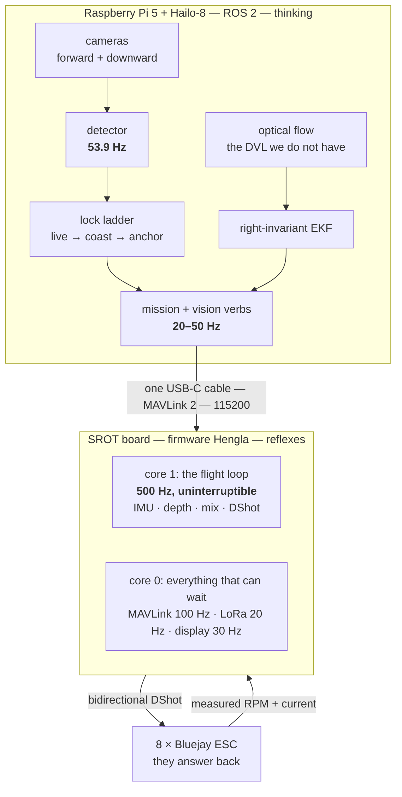
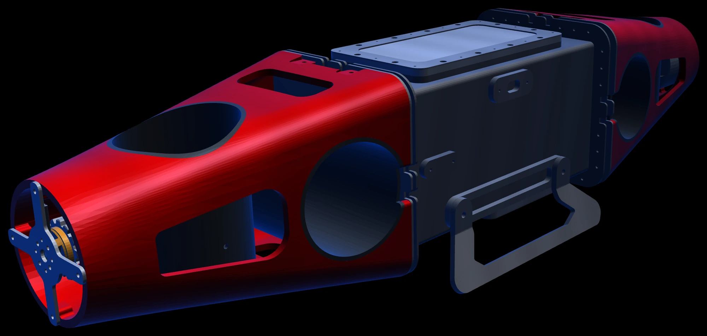
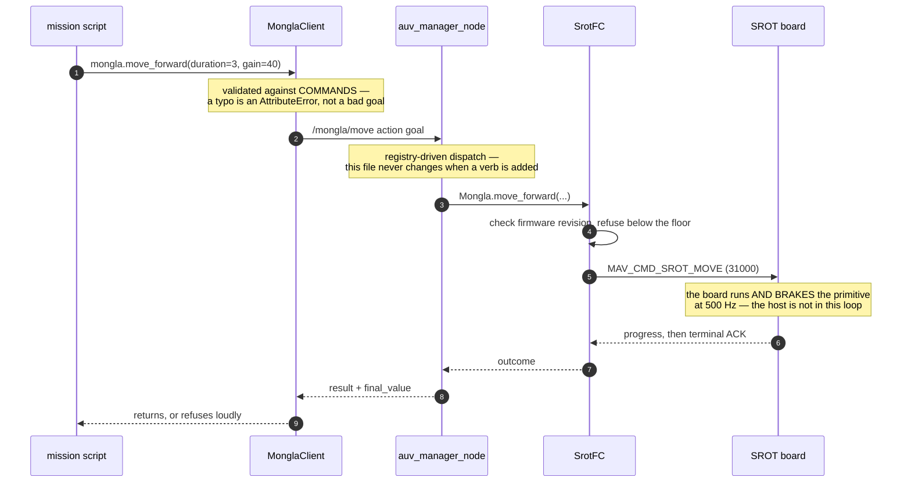
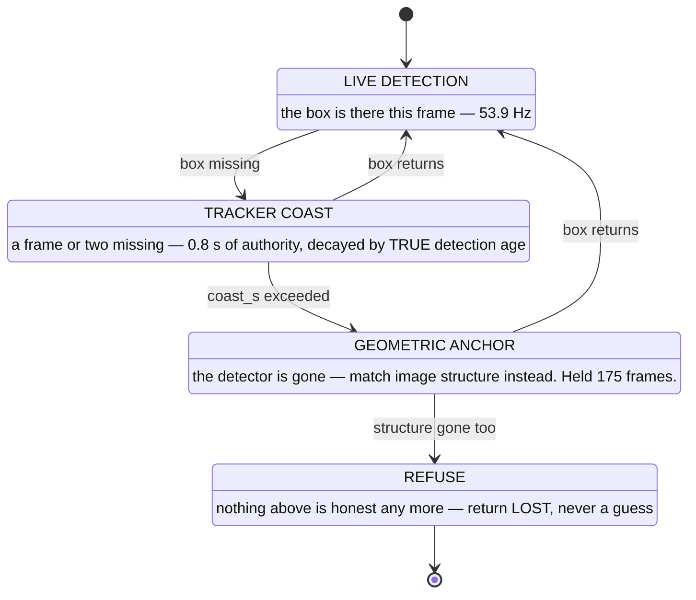

<p align="center">
  
</p>

<h1 align="center">Mongla</h1>

<p align="center">
  <em>Machines that have to work when nobody is watching.</em>
</p>

<p align="center">
  
  
  
  
  
  
  
</p>

<p align="center">
  <a href="https://fh1m.github.io/mongla_ws/the-shift.html"><b>The Shift</b></a> ·
  <a href="https://fh1m.github.io/mongla_ws/capability-map.html"><b>Capability map</b></a> ·
  <a href="#getting-it-running">Run it</a> ·
  <a href="#how-you-ask-it-to-move">Missions</a> ·
  <a href="#the-packages">Packages</a> ·
  <a href="#how-this-project-works">Doctrine</a>
</p>

<p align="center">
  <a href="https://fh1m.github.io/mongla_ws/"><b>&#9654;&nbsp; Read the long version — the field notes</b></a>
</p>

---

## Contents

**Start here** · [What this is](#what-this-is) · [How the whole thing fits together](#how-the-whole-thing-fits-together) · [The machine](#the-machine)

**The fundamentals** — written for someone who has never built a robot
[Why a control loop](#why-a-control-loop-and-why-500-hz) · [What a PID actually does](#what-a-pid-actually-does) · [How a camera becomes a position](#how-a-camera-becomes-a-position) · [The DVL we do not have](#the-dvl-we-do-not-have) · [Running a neural network on a chip](#running-a-neural-network-on-a-chip)

**The system** · [How a command becomes thrust](#how-a-command-becomes-thrust) · [When the detector blinks](#what-happens-when-the-detector-blinks) · [Seven packages](#seven-packages-deconstructed) · [The other three repositories](#the-other-three-repositories) · [The simulator](#the-simulator)

**The people and the record** · [Three acts](#three-acts) · [Why keep going](#why-keep-going) · [How this project works](#how-this-project-works) · [Where it stands](#where-it-stands-honestly) · [Authors](#authors)

---

## What this is

Mongla is the autonomy stack for an autonomous underwater vehicle. It runs on a control board
we own down to the firmware, and a Raspberry Pi 5 with a Hailo-8 for vision. It decides what
the machine should do next, and it is built to keep being right about that when there is
nobody in the loop to catch it being wrong.

Underwater, almost everything fights you. Radio does not travel, so there is no GPS and no
telemetry unless you carry it. Water bends light, so the camera you calibrated in air is a
different camera once it is wet. It eats red first, then contrast, then certainty. The floor
throws moving caustics that look exactly like motion. A magnetometer inside an aluminium hull
is a random number generator. And every one of these failures is quiet: nothing errors, the
logs stay green, and the vehicle confidently goes somewhere else.

So this repository is not really a pile of algorithms. It is an argument about **what a
machine has to do to perceive, decide and move in a place that offers it no help** — and the
receipts for every claim it makes.

---

## How the whole thing fits together

Two computers, one cable, and a hard rule about which one is allowed to be slow.


```mermaid
flowchart TB
    subgraph PI["Raspberry Pi 5 + Hailo-8 — ROS 2 — thinking"]
        direction LR
        CAM["cameras<br/>forward + downward"] --> DET["detector<br/><b>53.9 Hz</b>"]
        DET --> LOCK["lock ladder<br/>live → coast → anchor"]
        LOCK --> MISS["mission + vision verbs<br/><b>20–50 Hz</b>"]
        FLOW["optical flow<br/>the DVL we do not have"] --> EKF["right-invariant EKF"]
        EKF --> MISS
    end

    MISS -->|"one USB-C cable — MAVLink 2 — 115200"| BOARD

    subgraph BOARD["SROT board — firmware Hengla — reflexes"]
        direction LR
        C1["core 1: the flight loop<br/><b>500 Hz, uninterruptible</b><br/>IMU · depth · mix · DShot"]
        C0["core 0: everything that can wait<br/>MAVLink 100 Hz · LoRa 20 Hz · display 30 Hz"]
    end

    BOARD -->|"bidirectional DShot"| ESC["8 × Bluejay ESC<br/>they answer back"]
    ESC -->|"measured RPM + current"| BOARD
```

**The rule:** anything that keeps the vehicle upright runs on the board. Anything that decides
where it should go runs on the Pi. The cable carries *intent*, never reflexes — so a busy
detector, a garbage-collecting Python process or an unplugged cable cannot make the vehicle
tumble.

That split is worth one number. Our host loop runs at 20–50 Hz; the board runs at 500 Hz.
**About 25 corrections happen underneath every command we send.** On the old stack the inner
loop belonged to someone else's firmware and we were the only thing correcting anything, at
20 Hz. At 20 Hz you are not steering — you are voting.


## The machine

<p align="center">
  
</p>

Not a photograph and not an artist's impression — the CAD, rendered from the same mesh the
[interactive model](https://fh1m.github.io/mongla_ws/#body) on the site uses, in the livery the
vehicle is actually built in. Every number below was measured off that geometry, and validated
against the CAD tool to **0.08 %**.

| | | |
|---|---|---|
| **702.0 × 176.1 × 172.1 mm** | length × beam × height | fineness ratio **3.99** |
| **4 × ⌀84 mm tunnels** | 350 mm apart across, 519 mm fore and aft | sway · yaw · heave · pitch |
| **1 axial thruster** | in the nose | surge |
| **5 of 6 degrees of freedom** | roll has no actuator at all | it has to be passively stable |
| **3.310 L** | enclosed in the sealed pressure can | the entire source of buoyancy |
| **1.767 L** | solid material, all 40 bodies | validated against the CAD tool |

Four tunnels buy full authority *at zero forward speed* — which is the regime a task is
actually won in, holding still in front of a hole. They cost **221.7 cm² of open aperture
against a 160.9 cm² frontal area**, paid continuously while transiting. That trade is the
design, stated in both directions.

---

## Three acts

**Act I — the lab years.** Mongla began as the autonomy software for a university AUV
programme, and flew on its vehicles at **RoboSub 2023 (2nd place)** and **RoboSub 2025 (8th
place)**. Four computers, a closed inner loop, and a 20 Hz host loop steering a black box we
could not open. It won trophies and it had a ceiling.

**Act II — owning the stack.** A custom control board (firmware *Hengla*, by Rakibul Islam),
a Pi 5 with dedicated inference silicon, and one USB-C cable between them. A 500 Hz loop we
wrote, on a core nothing else can interrupt. Sensors that had been computed and thrown away —
per-motor RPM, two battery packs, the depth controller's own error — came back, because we
could finally read the source and ask for what was missing. *Read the whole story:*
**[The Shift](https://fh1m.github.io/mongla_ws/the-shift.html)**.

**Act III — open.** In September 2026 I left the university, on principle, and Mongla
continues as an independent project. Nothing here is owed to anyone's roadmap now. What
remains is the part I actually care about: making a machine that perceives honestly and moves
deliberately, and being able to prove it.

*The next act is open — the machine is still being built.*

---

## Why keep going

I build on hope. Not optimism — hope is different: it is the decision to keep working on the
better version of a thing while the current version is still broken.

Pushing a technical limit is the most concrete form of that I know. Every measurement in this
repository that came out worse than expected is a small argument that the world is knowable,
and that the next version can be better than this one. That is worth the hours it takes.

The engineering follows from it. If the point is a better future and not a better demo, then
the work has to be honest in a specific way: **you do not get to claim what you have not
measured.**

---

## How this project works

Five habits, learned the expensive way. Each one exists because its absence cost a run.

**Measure, then ship.** Every shipped threshold lives in
[`measured-bars.md`](.claude/context/measured-bars.md) with the method, the conditions and the
bar it must clear. It keeps its *retractions* too — numbers we believed, tested properly,
and withdrew — in the same file as the ones that stand. The image-enhancement step everybody adds to underwater vision took
the gate from 30.4 % to **1.2 %** when it was finally measured; it ships disabled, and a test
keeps it disabled.

**A plausible number is not a measurement.** The recurring defect in this codebase was never a
crash. It was a reading that looked reasonable: a phantom depth, a confident zero, 958 ESC
frames that were all exactly `0` with nothing plugged in. Absence is now `NaN`, never `0.0`,
on both sides of the wire.

**Injection-verify every guard.** A test that has never failed against a real defect is
decoration. Break it deliberately, watch it fail, restore it. Several tests here exist because
an earlier version of them passed while the vehicle was broken.

**Refuse loudly.** A verb that reports success while the vehicle does nothing is the failure
that ends a competition run with nobody knowing why. Unsupported verbs are refused before
dispatch, with the reason.

**One truth, never two copies.** Where a constant has to exist in two places, one reads the
other — or a test reads the firmware's own headers and fails when they drift.

**A missing feature is a pull request, not a workaround.** We own the firmware, the ground
station and the board. When the vehicle cannot do something, the honest move is to ask the
right layer to change, with the evidence attached. Nine such asks live in
[`.claude/context/upstream/`](.claude/context/upstream/README.md).

---

## Where it stands, honestly

Nothing on this platform has been in water. The board's depth loop has never run closed; no
mission has been flown; no non-zero thruster value has crossed the wire. The
[capability map](https://fh1m.github.io/mongla_ws/capability-map.html) marks every row
`WATER`, `BENCH`, `BUILT` or `BLOCKED`, and today none of them is `WATER`.

That is not modesty. A map that quietly promotes bench results to flight results is how a team
finds out at the venue.

---

## Getting it running

```bash
./build_mongla.sh
source install/setup.bash
```

```bash
# the vehicle: control, localization, vision on the Hailo
ros2 launch mongla_manager bringup.launch.py vision:=true

# is it healthy enough to arm?
ros2 run mongla_manager bringup_check --srot

# watch everything the board says, with no ROS graph at all
ros2 run mongla_manager connect --watch

# one verb at a time
ros2 run mongla_planner mongla arm
ros2 run mongla_planner mongla set_depth --target -0.5
ros2 run mongla_planner mongla disarm
```

## How you ask it to move

A mission is a Python file with a `run(mongla)` function. The object handed to it is the whole
vehicle.

```python
from mongla_planner.client import TaskAbandoned

def run(mongla, log=None):
    mongla.mission_reset()                     # clear old state, re-zero depth at the surface
    mongla.use_budget(900, reserve_s=45)       # ration the run; the clock starts on arm

    try:
        mongla.arm()
        mongla.set_depth(-0.8)

        with mongla.task('gate', deadline_s=120):
            if mongla.vision.align('gate', yaw=0, lat=0, gain=30, duration=60):
                mongla.vision.move('gate', fwd=None)      # drive through it
    except TaskAbandoned:
        mongla.note('gate', 'ran out of time', success=False)
    finally:
        mongla.surface()
        mongla.disarm()
```

Three ideas hold that up. **Two vision verbs, not nine** — centre on it, or drive to it;
neither raises, both return where the target was, so a mission recovers instead of crashing.
**Effort is not points** — a run is a budget, and each task is asked whether it is still worth
the attempt. **Give up cleanly** — a deadline cancels the goal in flight and hands the mission
its fallback, rather than overrunning into the next task.

Reference: [commands](.claude/context/missions/command-reference.md) ·
[the mission language](.claude/context/missions/client-and-dsl-api.md) ·
[cookbook](.claude/context/missions/mission-cookbook.md)

---

# The fundamentals

Everything below assumes you have never built a robot. If you have, skip to
[the packages](#seven-packages-deconstructed) — but the numbers here are measured, not
textbook, and a few of them are surprising.

## Why a control loop, and why 500 Hz

A submerged vehicle is never at rest. It is a buoyant body in a fluid that pushes back, and if
nothing corrects it, it drifts, rolls, and sinks or surfaces. A **control loop** is the thing
that stops that: read where you are, compare it to where you want to be, push in the direction
of the difference, repeat.

The only interesting question is *how often*. Between one correction and the next, the
disturbance is unopposed — the vehicle is, briefly, an uncontrolled object.

```
disturbance ─┬─────────────────────────────────────── 50 ms ──┐   old stack: 20 Hz
             │        (nothing is answering)                  ▼   ← up to 50 ms adrift
             │
             ├─┬─┬─┬─┬─┬─┬─┬─┬─┬─┬─┬─┬─┬─┬─┬─┬─┬─┬─┬─┬─┬─┬─┬─┐   Mongla: 500 Hz
             │ 2ms                                            ▼   ← up to 2 ms adrift
```

That is the entire argument for owning the firmware. Nothing about our code got faster — the
boundary moved. **At 20 Hz you are not steering, you are voting.**

Two more reasons the rate has to live on the board and not on the Pi:

- **Jitter is worse than latency.** A loop that runs at 500 Hz *except* when Python's garbage
  collector fires is not a 500 Hz loop; it is a 500 Hz loop with a hole in it, and the hole
  lands at random. ESP32 core 1 runs the flight loop and nothing else is permitted there.
- **A failure has to be survivable.** If the Pi dies mid-mission the board keeps its attitude
  and surfaces on its own after 5 s of silence. If the loop lived on the Pi, a dead Pi would
  mean a tumbling vehicle.

## What a PID actually does

A PID controller is three guesses about the future, added together.

| Term | What it answers | Costs you |
|---|---|---|
| **P** — proportional | "How wrong am I *right now*?" | Alone, it never quite arrives — it stalls where the push balances the drag |
| **I** — integral | "How long have I been wrong in the same direction?" | Fixes a steady current, but *winds up*: it keeps accumulating while saturated and then overshoots |
| **D** — derivative | "How fast is the error changing?" | Damps the overshoot, and amplifies every bit of sensor noise |

Underwater, the D term is the one that bites. A 20 kg hull has enormous **added mass** — it
drags a volume of water along with it, roughly 1.0× its displacement broadside — so it
responds late and then keeps going. Tuned for air, D is far too eager; the vehicle oscillates
around its target instead of settling on it.

**Where the PIDs live matters more than their gains.** Depth and attitude are closed on the
board at 500 Hz. Heading, historically, was closed in Python against a BNO085 — because the
magnetometer inside an aluminium hull with eight thrusters drawing current is a random number
generator, so the compass could not be trusted even though it existed.

And one measured thing about the actuator that no textbook mentions:

> at a demand of **0.005**, the thruster jumps from 0 to **16.13 %** of its band (DShot 1210).

The actuator is not linear near zero — it is closer to a relay. A gain schedule that softens
the response as the target gets close cannot work if the smallest command the hardware can
express is already 16 % of full thrust. That is why `range_gain_floor` is off.

## How a camera becomes a position

A detector returns a **box in pixels**. Control needs a **direction in the world**. Three
physical facts sit between them, and every one of them was measured rather than assumed.

**1. The lens is not what the datasheet says it is.** The camera is specified at 63.8° in air.
Underwater, light crosses from water into the flat port and refracts, and Snell's law narrows
the field of view to **46.7°** — measured, ±0.7°. Using the air figure means the vehicle
believes it can see 27 % more of the world than it can, so every search pattern is calibrated
against a view that does not exist.

**2. A pixel offset is not an angle until you say which camera.** The conversion needs that
camera's own focal length, so the measured constant belongs to the *physical device* — not to
the role. When the forward and downward cameras were swapped in udev, 46.7° stayed attached to
the wrong one for nine days and every range estimate was 17 % out.

**3. The bearing has to be computed in water.** We stream one `LANDING_TARGET` per frame as a
**bearing in radians**, not as pixels. Pixels are meaningless to firmware — change the lens and
every gain silently becomes wrong. A bearing has units and survives a hardware change.

```
   photons ──► exposure ──► Hailo-8 ──► box in pixels
                              18.0 ms total, photon to detection
                                   │
                                   ├─ undistort  (that camera's own intrinsics)
                                   ├─ refract    (flat port, water — not air)
                                   └─► bearing in radians ──► the controller
```

## The DVL we do not have

A **Doppler Velocity Log** is how serious AUVs know they are moving: it pings the seabed and
reads the Doppler shift of the return. We do not have one. What we have is a camera pointed at
the floor.

If you know how far the floor is and how much the image shifted between two frames, you know
how far you travelled. **Optical flow** does exactly that, and it is the vehicle's only
velocity sensor.

**Measured against a tape:** three 30 cm slides on three axes, worst error **1.09 cm** (3.6 %).
Implied height 0.72 / 0.69 / 0.70 m against a 0.72 m tape.

The interesting part is the failure and its inversion. Optical flow needs distinctive corners
to match between frames, and the pool floor is a repeating tile grid — the textbook worst case.
But:

> "That is true of MATCHING. It is exactly backwards for DEMODULATION. A periodic pattern is a
> **carrier**, and displacement is a phase shift of that carrier."
> — [`tile_grating.py:3`](src/mongla_localization/mongla_localization/tile_grating.py)

Read the floor as an optical encoder instead of a texture, and the thing that broke the method
becomes the thing that makes it precise.

All of it feeds a **right-invariant EKF** on SE₂(3) — a filter that respects the fact that
rotations are not a vector space, so errors compose the way the geometry actually composes
rather than approximately. Late measurements are **replayed at the instant they describe**
rather than applied on arrival, because a velocity fix that arrives 80 ms late and is applied
as though it were current is a measurement in the wrong place.

## Running a neural network on a chip

The Hailo-8 is a 26 TOPS accelerator on the Pi's HAT. A compiled `.hef` runs on it instead of
on the CPU, which is the only reason two cameras and a filter fit on one small computer.

**Measured: 98.0 Hz** on `gate_rescue_repair`, against a `hailortcli --hw-only` benchmark of
**97.9 FPS** on the same file. The host code is at 100 % of the chip — there is nothing left to
optimise on our side of the boundary.

Getting there took three findings that each looked like something else:

**The decode never has to leave the quantised domain.** The chip emits int8. Converting to
float before thresholding cost **31.5 ms**. But the class head is already a probability at
scale 1/255, so thresholding the raw bytes selects exactly the same cells — **0.93 ms**,
bit-for-bit identical output.

**Publishing slower makes detections fresher.** A full V4L2 queue keeps the *oldest* frames, so
the standard advice to drain it recovers almost nothing. Treat the topic as a **mailbox** —
newest frame wins, surplus dropped — and staleness falls from **396 ms to 16.9 ms**. The
pipeline that publishes *every* frame is the slow one.

**Image enhancement does not help, and we tested it until it was embarrassing.** CLAHE,
white balance, the lot: **17 configurations across four props and three venues.** Never once
positive. On the gate it destroyed **95 %** of detections. The implementation was correct; the
original +42 % that motivated it was a confounded A/B. A test now keeps preprocessing off.

---

## How a command becomes thrust

Thirty verbs, one action, and a registry that means adding the thirty-first touches two files.


```mermaid
sequenceDiagram
    autonumber
    participant M as mission script
    participant C as MonglaClient
    participant N as auv_manager_node
    participant F as SrotFC
    participant B as SROT board

    M->>C: mongla.move_forward(duration=3, gain=40)
    Note over C: validated against COMMANDS —<br/>a typo is an AttributeError, not a bad goal
    C->>N: /mongla/move action goal
    Note over N: registry-driven dispatch —<br/>this file never changes when a verb is added
    N->>F: Mongla.move_forward(...)
    F->>F: check firmware revision, refuse below the floor
    F->>B: MAV_CMD_SROT_MOVE (31000)
    Note over B: the board runs AND BRAKES the primitive<br/>at 500 Hz — the host is not in this loop
    B-->>F: progress, then terminal ACK
    F-->>N: outcome
    N-->>C: result + final_value
    C-->>M: returns, or refuses loudly
```

Adding a verb is two edits, and [`commands.py`](src/mongla_control/mongla_control/commands.py)
says so out loud:

> This is the ONE place that knows what commands exist, what fields each one reads from
> `Move.Goal`, what the defaults are, and what to print in `--help`. The action server, the
> Python client, and the `mongla` CLI all read from here.

One row in the registry, one method on the facade. The CLI, the action server and the Python
client pick it up with no further edits — there is no dispatch table to forget.


## Seven packages, deconstructed

<p align="center">
  
</p>

**60,026 lines of source across 221 files — and 45,355 lines of tests across 252.** There are
more test files than source files in this repository. That ratio is the single most honest
thing about it.

### `mongla_vision` — 22,419 LOC · 85 test files · 21 entry points

The largest package, and the one that touches physics twice: once at the lens, once at the
water. Cameras, the Hailo-8 detector, the lock ladder, optical flow, refraction correction,
guided calibration.

> "Round 29 measured this pipeline at **98.0 Hz** on `gate_rescue_repair` against a
> `hailortcli --hw-only` benchmark of **97.9 FPS** on the same HEF — so the host code is at
> 100 % of the chip."
> — [`detection/hailo.py:3`](src/mongla_vision/mongla_vision/detection/hailo.py)

The calibration tool is a *scripted sequence of poses*, and the reason is a measurement about
people rather than optics: a freeform version reached 9/9 coverage with **15 of 17 views
flat**, because an operator naturally holds a board square-on and the one axis that decides
correctness is the one that goes unfilled. Bars report the problem; they do not prevent it.

### `mongla_control` — 13,213 LOC · 63 test files · **zero** entry points

Zero is deliberate. This package is a pure library: it owns every verb and the
flight-controller boundary, but it never gets its own process, because exactly one node in the
system is allowed to hold the MAVLink connection.

> "yaw : target-right → yaw RIGHT toward it → NO negate (same polarity as lateral;
> pool-verified — the old `-ex` negation drove *away* from the target)"
> — [`motion_vision.py:28`](src/mongla_control/mongla_control/motion_vision.py)

That comment is a sign error found in water, preserved so nobody helpfully "fixes" it back.

### `mongla_planner` — 10,971 LOC · 33 test files · the mission language

`mongla.move_forward(...)` and `mongla.vision.align(...)` on one object. Missions are
discovered by filename — drop in `my_mission.py` with a `run(mongla, log)` and it appears in
`mission --list`, with no registry to update. A broken file is **skipped, not fatal**: on
competition day one half-edited scratch file must never brick the good mission.

> "⛔ A TIMED MOVE REPORTS SUCCESS WHETHER OR NOT THE HULL WENT ANYWHERE. … Treat unknown as
> 'no evidence', never as 'ok'."
> — [`mongla_dsl.py:1501`](src/mongla_planner/mongla_planner/mongla_dsl.py)

### `mongla_manager` — 7,983 LOC · 46 test files · 7 entry points

The one process that touches the board. Owns the MAVLink connection, the reader thread, the
`/mongla/move` action server and `/mongla/state`.

> "**absence is data.** … A consumer that renders a missing value as `0.0` re-creates exactly
> the failure the firmware fixed — a Bar30 read during a PROM reset race once published
> `-51 C` and `+2.87 m` in air with nothing marking them wrong."
> — [`srot_connect.py:15`](src/mongla_manager/mongla_manager/srot_connect.py)

### `mongla_localization` — 3,560 LOC · 20 test files · no GPS, no DVL

A right-invariant EKF on SE₂(3), corrected by depth, optical-flow velocity, headings and prop
fixes, with late measurements **replayed at the instant they describe** rather than applied on
arrival.

The best idea in it inverts a known failure. Optical flow dies on a repeating tiled floor —
no distinctive corners to match. But:

> "That is true of MATCHING. It is exactly backwards for DEMODULATION. A periodic pattern is a
> **carrier**, and displacement is a phase shift of that carrier."
> — [`tile_grating.py:3`](src/mongla_localization/mongla_localization/tile_grating.py)

And one refusal, from arithmetic rather than opinion: reading a heading off a lane line by FFT
needs five cycles of a 2.5 m pitch in frame, which at our downward focal length requires an
altitude of **26.8 m**. A pool is 2 m deep. The method is not tuned — it is rejected.

### `mongla_sensors` — 1,880 LOC · one job

"Which way is north", behind one interface. The BNO085 runs with its **magnetometer disabled**
— eight thrusters, an aluminium hull and battery currents make a magnetometer a random number
generator — so it gives a smooth heading with no absolute reference. The Earth reference is
borrowed from the Pixhawk's mag-fused yaw **exactly once**, at the surface, at boot, and the
offset is locked forever after.

### `mongla_interfaces` — 0 Python lines · 368 lines of interface

One action, four messages, zero services. `Move.action` is 212 lines of which only ~60 are
field declarations; the rest is argument.

> "⛔ 'fire' HERE MEANS ACTUATE A BOARD CHANNEL — it is NOT a torpedo verb. … Nothing in this
> action, and nothing in any of the 30 verbs, is named for a competition task — the stack is a
> set of AUV CAPABILITIES that missions compose, and `test_the_command_surface_is_task_free`
> keeps it that way."
> — [`Move.action:60`](src/mongla_interfaces/action/Move.action)

Two more design arguments live in the `.msg` files. Why not `PoseWithCovarianceStamped`: a
covariance asserts a *unimodal* distribution, and planar pose carries a flip ambiguity, which
is bimodal — "one of two places, mirrored". Why publish correspondences and not just the pose:
publish only the answer and a shot that missed can never be explained; publish the evidence
and a recorded run is **re-solvable off a bag, months later, with different thresholds**.

| Package | Source | Tests | Entry points |
|---|---:|---:|---:|
| [`mongla_vision`](.claude/context/packages/mongla_vision/README.md) | 22,419 | 14,708 | 21 |
| [`mongla_control`](.claude/context/packages/mongla_control/README.md) | 13,213 | 14,443 | 0 |
| [`mongla_planner`](.claude/context/packages/mongla_planner/README.md) | 10,971 | 5,951 | 2 |
| [`mongla_manager`](.claude/context/packages/mongla_manager/README.md) | 7,983 | 6,556 | 7 |
| [`mongla_localization`](.claude/context/packages/mongla_localization/README.md) | 3,560 | 3,295 | 4 |
| [`mongla_sensors`](.claude/context/packages/mongla_sensors/README.md) | 1,880 | 402 | 1 |
| [`mongla_interfaces`](.claude/context/packages/mongla_interfaces/README.md) | 368 IDL | — | — |

```bash
python3 -m pytest -q src/mongla_control/test      # 1114 passed, 1 xfailed
python3 -m pytest -q src/mongla_vision/test       # 1030 passed, 1 skipped
python3 -m pytest -q src/mongla_manager/test      #  461 passed, 4 skipped
python3 -m pytest -q src/mongla_planner/test      #  420 passed, 1 skipped
python3 -m pytest -q src/mongla_localization/test #  286 passed
```

No hardware needed: the board, the cameras and the ROS graph are faked at their real
boundaries.

---

## What happens when the detector blinks

A neural detector on real underwater footage drops the box constantly — a reflection, a bubble,
a bad angle. If control trusts only the detector, the vehicle loses a lock it never actually
lost. So there is a ladder, and every rung is allowed to be wrong for a *measured* length of
time.


```mermaid
stateDiagram-v2
    [*] --> LIVE
    LIVE: LIVE DETECTION
    LIVE: the box is there this frame — 53.9 Hz
    COAST: TRACKER COAST
    COAST: a frame or two missing — 0.8 s of authority, decayed by TRUE detection age
    ANCHOR: GEOMETRIC ANCHOR
    ANCHOR: the detector is gone — match image structure instead. Held 175 frames.
    LOST: REFUSE
    LOST: nothing above is honest any more — return LOST, never a guess

    LIVE --> COAST: box missing
    COAST --> LIVE: box returns
    COAST --> ANCHOR: coast_s exceeded
    ANCHOR --> LIVE: box returns
    ANCHOR --> LOST: structure gone too
    LOST --> [*]
```

The third rung is the one worth staring at. Through a gap of **175 consecutive frames** the
detector produced nothing at all, and the vehicle still knew where the target was — because
the anchor matches image structure rather than asking the network again.

The fourth rung matters as much: the ladder ends in a **refusal**, not in a confident
invention. A verb that reports success while the vehicle does nothing is the failure mode that
ends competition runs.

---

## The other three repositories

Mongla is the soul. It does not own the body.

| Repo | What it is | Owner |
|---|---|---|
| **Mongla** *(this one)* | Perception, estimation, mission language, simulator | Muhammad Fahim Faisal |
| [**Hengla**](https://github.com/RakibulIslam1/srot-control-board) — `srot-control-board` | The firmware. ESP32 dual-core + an RP2350 thruster co-processor | Rakibul Islam |
| [**Bondor**](https://github.com/RakibulIslam1/srot-ground-station) — `srot-ground-station` | Desktop GCS + a LoRa bridge | Rakibul Islam |
| [**ESC flasher**](https://github.com/RakibulIslam1/srot-esc-flasher) | Puts Bluejay on the ESCs | Rakibul Islam |

**We never commit to theirs; they never commit to ours.** Pull requests only. A missing
low-level feature is a request, not a host-side workaround.

Three copies of the wire contract exist on purpose, because there are no submodules across the
suite: the LoRa struct, the vendored MAVLink dialect, and a hand-mirrored TypeScript copy of
the message ids. The firmware is the source of truth for all three. A mismatch does **not**
raise an error — it fails CRC silently and looks exactly like being out of radio range. On our
side, `test_srot_protocol_drift.py` reads the firmware's own headers and fails if our
constants have drifted from them.

**Bondor** connects over USB serial at 115200 — opened with DTR and RTS de-asserted, so that
attaching a ground station does not reset the flight controller — or over UDP, or receive-only
over LoRa at 433 MHz, SF7, CR 4:5.

## The simulator

A full Gazebo pool lives in [`sim/`](sim/) — courses, props, both cameras, ground truth and an
operator lab. It runs ArduSub SITL by design: it is a physics environment, not the vehicle.
Control behaviour transfers; detection thresholds do not, because sim water is too clean.

---

## Shoulders

Borrowed convictions, each with the thing it changed here.

| | |
|---|---|
| [**Hotz**](https://www.latent.space/p/geohot) — *"complex things eventually collapse under their own weight"* | the 3D viewer on the site has no dependencies and no build step |
| [**Carmack**](https://danluu.com/latency-mitigation/) — *"the speed of light sucks"* | the camera became a mailbox, not a queue: 396 ms of staleness → **16.9 ms** |
| [**Karpathy**](https://karpathy.medium.com/software-2-0-a64152b37c35) — Software 2.0 | the detector is a component with a measured envelope, not an oracle |
| [**Keller**](https://www.techpowerup.com/270197/jim-keller-on-moores-law-microprocessors-and-designing-chips-from-scratch) — design again rather than patch | Act II: move the boundary instead of tuning harder |
| [**Lattner**](https://www.modular.com/blog/developer-voices-deep-dive-with-chris-lattner-on-mojo) — *"work backwards from the speed of light of hardware"* | the Hailo decode never leaves the quantised domain: 31.5 ms → **0.93 ms**, bit-identical |
| [**Rubin**](https://www.goodreads.com/work/quotes/96114890-the-creative-act-a-way-of-being) — keep removing until it hurts | the palette was sampled from the vehicle's own CAD materials, not chosen |

---

## Authors

Two people. One writes the software; the other writes the firmware and builds the board. There
is no third category, and nothing here is owned by an institution.

<table>
<tr>
<td width="160" align="center">
  
</td>
<td>

### Muhammad Fahim Faisal — author

Autonomy: perception, localization, control integration, the mission language, the simulator,
and this repository. Previously engineering team lead for the RoboSub 2026 campaign, AI &
Machine Vision sub-team lead (2025), and a junior member of that team (2024) — the software
placed **2nd at RoboSub 2023** and **8th in 2025**.

*"Machines that have to work when nobody is watching."*

[fh1m.github.io](https://fh1m.github.io/) · [@fh1m](https://github.com/fh1m) · <fh1m.dev@gmail.com>

</td>
</tr>
<tr>
<td>

### Rakibul Islam — firmware and hardware lead

The **SROT** control board and its firmware **Hengla** — an ESP32 running a 500 Hz flight loop
beside an RP2350 that speaks bidirectional DShot. Also **Bondor**, the desktop ground station,
and the ESC flashing tool. Each lives in his own repository, under his own authorship.

Mongla does not vendor any of it. It talks across a documented wire protocol, and every change
we need there is a pull request.

[srot-control-board](https://github.com/RakibulIslam1/srot-control-board) ·
[srot-ground-station](https://github.com/RakibulIslam1/srot-ground-station) ·
[@RakibulIslam1](https://github.com/RakibulIslam1)

</td>
<td width="160" align="center">
  
</td>
</tr>
</table>

### History

Mongla began as the autonomy software for an autonomous underwater vehicle programme at BRAC
University, and flew on that programme's vehicles at **RoboSub 2023 (2nd place)** and
**RoboSub 2025 (8th place)**. In September 2026 the author left the university, on principle,
and Mongla continues independently. The vehicles, the team name and the university's materials
remain with the university and are referred to here only in the past tense, as history. What
lives in this repository is the software and its measurements.

Full authorship: [AUTHORS.md](AUTHORS.md).

### Standing on

[ROS 2](https://docs.ros.org/) · [MAVLink](https://mavlink.io/) · [Hailo](https://hailo.ai/) ·
[Ultralytics YOLO](https://github.com/ultralytics/ultralytics) ·
[supervision](https://github.com/roboflow/supervision) ·
[YASMIN](https://github.com/uleroboticsgroup/yasmin) ·
[Gazebo](https://gazebosim.org/)

MIT — see [LICENSE](LICENSE).

<p align="center"><sub>[ SYS: ONLINE ] · the machine is still being built</sub></p>
