<picture>
  <source media="(prefers-color-scheme: dark)" srcset="docs/imgs/mongla-banner.png">
  <source media="(prefers-color-scheme: light)" srcset="docs/imgs/mongla-banner-light.png">
  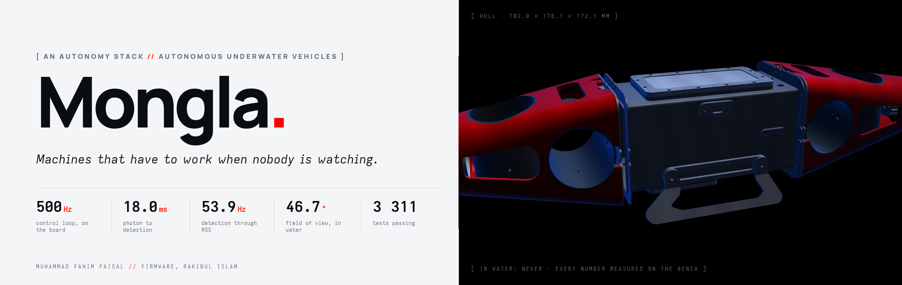
</picture>

# Mongla

**An autonomy stack for autonomous underwater vehicles — a control board we wrote the firmware
for, a neural accelerator that does nothing but see, and a rule that no number appears anywhere
in this repository without the measurement that produced it.**

[](#the-tests-are-the-argument) [](#1-a-control-loop-is-a-machine-that-asks-one-question) [](#4-a-neural-network-on-a-chip-that-only-does-that) [](#run-it) [](#what-is-true-today) [](LICENSE)

**[The Shift](https://fh1m.github.io/mongla_ws/the-shift.html)** · **[Capability map](https://fh1m.github.io/mongla_ws/capability-map.html)** · **[The site](https://fh1m.github.io/mongla_ws/)** · [Run it](#run-it) · [Fundamentals](#the-fundamentals) · [Docs](#every-document-in-this-repository) · [Story](#three-acts)

### The name

**Mongla** (মোংলা) is named for the **Port of Mongla**, the second-largest and busiest seaport
in Bangladesh after Chittagong. It opened in 1950 as Chalna Port, 48 km south of Khulna, where
the Mongla River meets the Pasur, about 100 km up from the Bay of Bengal. It is the gateway ships
use to reach the Sundarbans, the largest mangrove forest in the world. Before it had that name,
this workspace was called **Duburi** (ডুবুরি), which means "diver".

> **মোংলা** নামটি এসেছে **মোংলা বন্দর** থেকে। চট্টগ্রামের পরে এটি বাংলাদেশের দ্বিতীয় বৃহত্তম ও
> ব্যস্ততম সমুদ্রবন্দর। ১৯৫০ সালে চালনা বন্দর নামে এর যাত্রা শুরু। খুলনা শহর থেকে ৪৮ কিলোমিটার
> দক্ষিণে, পশুর নদী আর মোংলা নদীর সংগমে এর অবস্থান, বঙ্গোপসাগর থেকে প্রায় ১০০ কিলোমিটার উত্তরে।
> বিশ্বের বৃহত্তম ম্যানগ্রোভ বন সুন্দরবনে যাওয়ার প্রবেশদ্বার এই বন্দর। এই নামের আগে প্রকল্পটির নাম ছিল
> **ডুবুরি**।

<sub>Facts about the port from [Port of Mongla](https://en.wikipedia.org/wiki/Port_of_Mongla).</sub>

---

## What is true today

Read this before anything else on the page. This project sorts every claim into three states and
never blurs them, because the failure that ends competition runs is a vehicle that reports
success while doing nothing.

| | state | what it means | how much of this repo |
|:--:|---|---|---|
| 🟣 | **BENCH** | verified on hardware, on recorded footage, or against the live board | most of it |
| 🟡 | **BUILT** | implemented, covered by tests, never flown | a lot of it |
| 🔴 | **BLOCKED** | waiting on water, a firmware merge, or hardware | seven things, [listed](#what-stands-in-the-way) |
| 🟢 | **WATER** | verified with the vehicle swimming | **nothing. not one row.** |

> **This vehicle has never been in water.** Every number in this README was measured on a bench,
> on real recorded footage, or on the live board over a cable. The depth loop has never once run
> closed. If you are here to judge whether the software works underwater, the honest answer is
> that nobody knows yet, and this page will not pretend otherwise.

That is also why there is a [ledger of retractions](#the-ledger): 50 measurement entries, of
which 8 say in their own title that they took an earlier result back, and 5 more measured an idea
and concluded it should stay switched off.

---

## Who are you?

Four different people read a repository like this one, and they want four different doors.
Take yours.

| If you are… | Start here | Then |
|---|---|---|
| **judging this project** (a professor, a competition judge, a reviewer) | [What is true today](#what-is-true-today) · [Capability map](https://fh1m.github.io/mongla_ws/capability-map.html) — every capability with its evidence and an honest state | [The ledger](#the-ledger), including everything we got wrong |
| **thinking of contributing** | [Run it](#run-it) · [The seven packages](#the-seven-packages) | [Adding a verb](#adding-a-verb-is-two-edits) — it is two edits, and `.claude/context/` has a page per package |
| **an embedded / firmware engineer** | [What crosses the cable](#what-crosses-the-cable-44-bytes) · [The four repositories](#four-repositories-one-wire) | [`fc/srot_protocol.py`](src/mongla_control/mongla_control/fc/srot_protocol.py) — our single copy of the wire contract, and the [asks we have sent upstream](.claude/context/upstream/README.md) |
| **learning robotics** (you have never built one of these) | [The fundamentals](#the-fundamentals) — control loops, PID, state estimation, optical flow, detection, underwater optics, from first principles | the **[interactive explainers](https://fh1m.github.io/mongla_ws/#pid)** on the site, where you can turn the gains yourself and watch it fail |
| **here for the story** | [Three acts](#three-acts) | [Why keep going](#why-keep-going) |

---

## Run it

Nothing here needs the vehicle. The simulator is a second colcon workspace inside this
repository, and every verb runs against it.

```bash
# 1. build (mirrors ~/models and ~/missions in, then builds all seven packages)
./build_mongla.sh && source install/setup.bash

# 2. bring the stack up — no hardware required if you drop `flight_controller:=srot`
ros2 launch mongla_manager bringup.launch.py vision:=true

# 3. ask it something
ros2 run mongla_planner mongla arm
ros2 run mongla_planner mongla move_forward 3 --gain 40
ros2 run mongla_planner mongla --help          # all 30 verbs, generated from one table
```

With the board attached, these two answer the only two questions that matter before you put
propellers on anything:

```bash
ros2 run mongla_manager connect --watch        # everything the board is saying, no ROS graph needed
ros2 run mongla_manager bringup_check --srot   # grades every subsystem, exits non-zero on a fault
```

The first **reports**. The second **grades and gates** — it is the one that refuses.

<details>
<summary><b>The whole thing, from a cold clone</b> (click)</summary>

```bash
git clone https://github.com/fh1m/mongla_ws && cd mongla_ws
./build_mongla.sh                      # colcon build, seven packages
source install/setup.bash

# the simulator: Gazebo, a pool, both cameras, ground truth
cd sim && ./build_sim.sh && source install/setup.bash
ros2 launch mongla_sim_bringup sim.launch.py   # ArduSub SITL by design — see sim/README.md

# the tests (5 suites, 3 316 of them, ~5 minutes)
python3 -m pytest src/mongla_control/test src/mongla_vision/test src/mongla_manager/test \
                  src/mongla_planner/test src/mongla_localization/test -q
```
</details>

---

## Before anything spins

`bringup_check --srot` is the program that is allowed to say no. It grades each subsystem and
exits non-zero on a fault, and it exists because every one of these gates has, at least once,
been the reason a run did not happen.

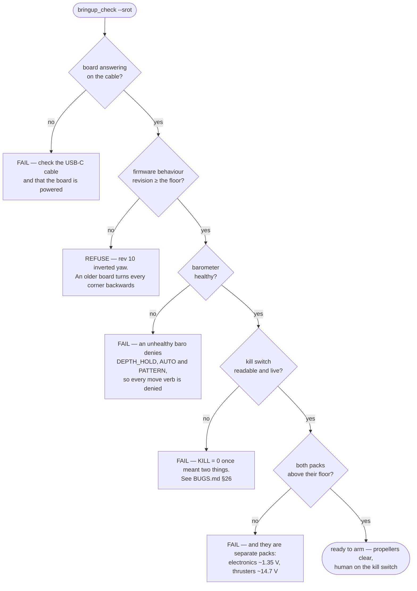
```mermaid
flowchart TB
    START(["bringup_check --srot"]) --> LINK{"board answering<br/>on the cable?"}
    LINK -->|no| F1["FAIL — check the USB-C cable<br/>and that the board is powered"]
    LINK -->|yes| REV{"firmware behaviour<br/>revision ≥ the floor?"}
    REV -->|no| F2["REFUSE — rev 10 inverted yaw.<br/>An older board turns every corner backwards"]
    REV -->|yes| BARO{"barometer<br/>healthy?"}
    BARO -->|no| F3["FAIL — an unhealthy baro denies<br/>DEPTH_HOLD, AUTO and PATTERN,<br/>so every move verb is denied"]
    BARO -->|yes| KILL{"kill switch<br/>readable and live?"}
    KILL -->|no| F4["FAIL — KILL = 0 once meant two things.<br/>See BUGS.md §26"]
    KILL -->|yes| BATT{"both packs<br/>above their floor?"}
    BATT -->|no| F5["FAIL — and they are separate packs:<br/>electronics ~1.35 V, thrusters ~14.7 V"]
    BATT -->|yes| OK(["ready to arm — propellers clear,<br/>human on the kill switch"])
```

⚠ **`VFR_HUD` is not gated on barometer health**, and it is where depth is read. Never infer
sensor health from the presence of a depth value — that is exactly how a broken sensor looks
healthy.

---

## How the whole thing fits together

> *"A complex system that works is invariably found to have evolved from a simple system that
> worked."* — John Gall, [*Systemantics*](https://en.wikiquote.org/wiki/John_Gall), 1975

Two computers, one cable, and a split that decides everything else: **reflexes on the board,
thinking on the Pi.**

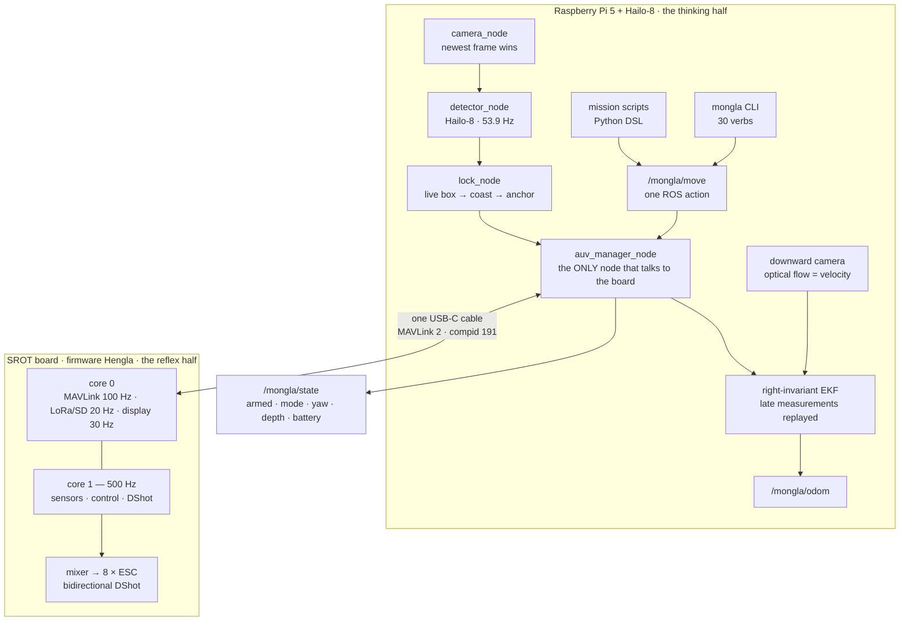
```mermaid
flowchart TB
    subgraph PI["Raspberry Pi 5 + Hailo-8 · the thinking half"]
        direction TB
        CLI["mongla CLI<br/>30 verbs"] --> ACT
        MIS["mission scripts<br/>Python DSL"] --> ACT
        ACT["/mongla/move<br/>one ROS action"] --> MGR
        MGR["auv_manager_node<br/>the ONLY node that talks to the board"]
        CAM["camera_node<br/>newest frame wins"] --> DET["detector_node<br/>Hailo-8 · 53.9 Hz"]
        DET --> LOCK["lock_node<br/>live box → coast → anchor"]
        LOCK --> MGR
        FLOW["downward camera<br/>optical flow = velocity"] --> EKF["right-invariant EKF<br/>late measurements replayed"]
        MGR --> EKF
        EKF --> ODOM["/mongla/odom"]
    end
    subgraph BOARD["SROT board · firmware Hengla · the reflex half"]
        direction TB
        C1["core 1 — 500 Hz<br/>sensors · control · DShot"]
        C0["core 0<br/>MAVLink 100 Hz · LoRa/SD 20 Hz · display 30 Hz"]
        MIX["mixer → 8 × ESC<br/>bidirectional DShot"]
        C1 --> MIX
    end
    MGR <-->|"one USB-C cable<br/>MAVLink 2 · compid 191"| C0
    C0 --- C1
    MGR --> STATE["/mongla/state<br/>armed · mode · yaw · depth · battery"]
```

Exactly one node touches the board. Everything else is a client of it — which is why a bug in
mission logic cannot, by construction, write a thruster command.

### Four repositories, one wire

Mongla is the soul, not the body. The board, its firmware, the ground station and the ESC
flasher are **not ours** — they belong to the firmware team, and we reach them the same way
anyone else would.

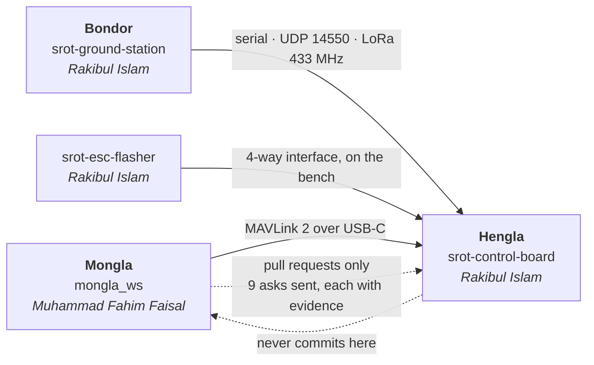
```mermaid
flowchart LR
    M["<b>Mongla</b><br/>mongla_ws<br/><i>Muhammad Fahim Faisal</i>"]
    H["<b>Hengla</b><br/>srot-control-board<br/><i>Rakibul Islam</i>"]
    B["<b>Bondor</b><br/>srot-ground-station<br/><i>Rakibul Islam</i>"]
    F["srot-esc-flasher<br/><i>Rakibul Islam</i>"]
    M -->|"MAVLink 2 over USB-C"| H
    B -->|"serial · UDP 14550 · LoRa 433 MHz"| H
    F -->|"4-way interface, on the bench"| H
    M -.->|"pull requests only<br/>9 asks sent, each with evidence"| H
    H -.->|"never commits here"| M
```

⛔ **We never commit to their repositories; they never commit to ours.** A handful of constants
are shared — the custom command's number, the flight-mode integers, the fact that depth is
reported negative below the surface. Those are frozen on both sides, and
[`test_srot_protocol_drift.py`](src/mongla_control/test/) reads the firmware's own headers to
prove ours have not drifted. A missing low-level feature is a pull request, not a workaround.

### What crosses the cable: 44 bytes

`mongla move_forward 3 --gain 40` leaves the Pi as **one MAVLink 2 frame, 44 bytes long**. Ten
of them are the envelope. The part that means anything is three numbers and a tag:

<p align="center">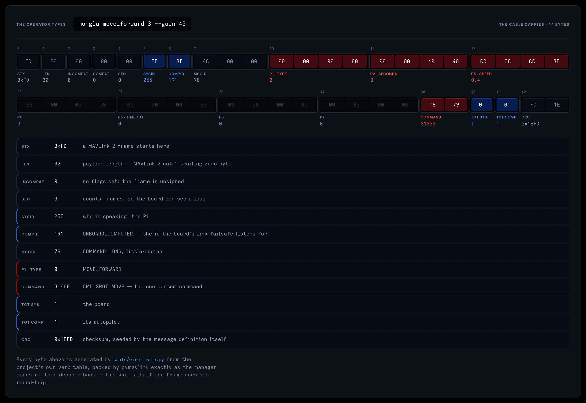</p>

No thrust. No motor, no angle, no depth. Which thrusters spin, how hard, and how the hull holds
its heading for those three seconds is the board's business — the Pi only said what it wanted.
The [front page](https://fh1m.github.io/mongla_ws/#shift) draws all 44 bytes, generated by
[`tools/wire_frame.py`](tools/wire_frame.py) from the project's own verb table and round-tripped
through pymavlink, so the figure cannot drift from the code.

### One verb, end to end

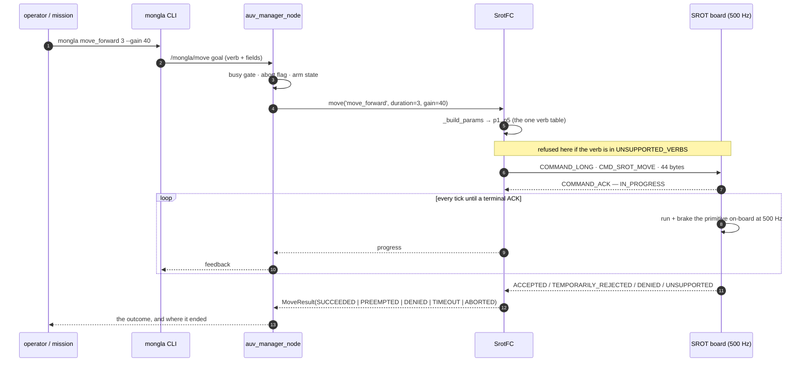
```mermaid
sequenceDiagram
    autonumber
    participant Op as operator / mission
    participant CLI as mongla CLI
    participant AS as auv_manager_node
    participant FC as SrotFC
    participant BD as SROT board (500 Hz)
    Op->>CLI: mongla move_forward 3 --gain 40
    CLI->>AS: /mongla/move goal (verb + fields)
    AS->>AS: busy gate · abort flag · arm state
    AS->>FC: move('move_forward', duration=3, gain=40)
    FC->>FC: _build_params → p1..p5 (the one verb table)
    Note over FC,BD: refused here if the verb is in UNSUPPORTED_VERBS
    FC->>BD: COMMAND_LONG · CMD_SROT_MOVE · 44 bytes
    BD-->>FC: COMMAND_ACK — IN_PROGRESS
    loop every tick until a terminal ACK
        BD->>BD: run + brake the primitive on-board at 500 Hz
        FC-->>AS: progress
        AS-->>CLI: feedback
    end
    BD-->>FC: ACCEPTED / TEMPORARILY_REJECTED / DENIED / UNSUPPORTED
    FC-->>AS: MoveResult(SUCCEEDED | PREEMPTED | DENIED | TIMEOUT | ABORTED)
    AS-->>Op: the outcome, and where it ended
```

The important part is the last line. A verb that cannot run **says so** — it never reports
success while the vehicle sits still.

### Photon to thrust

The other direction: light arrives, and eventually a propeller should turn. Every span below is
measured; the last one is not, because no thruster has ever been attached.

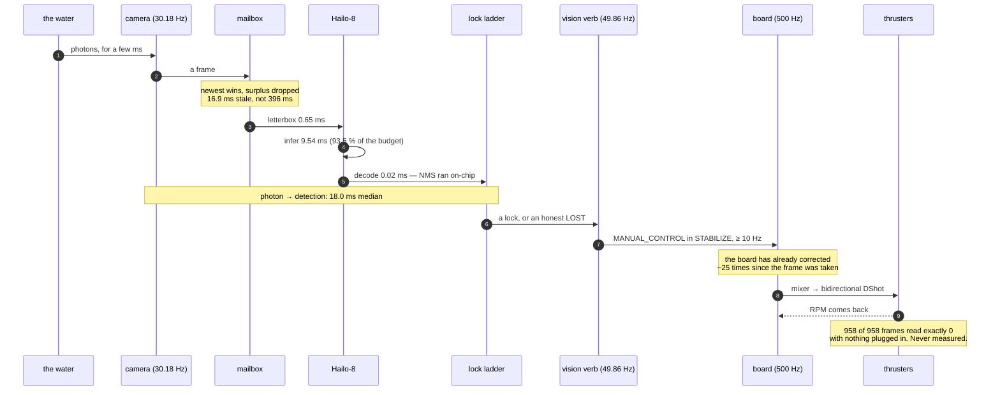
```mermaid
sequenceDiagram
    autonumber
    participant W as the water
    participant CAM as camera (30.18 Hz)
    participant MB as mailbox
    participant H as Hailo-8
    participant L as lock ladder
    participant V as vision verb (49.86 Hz)
    participant B as board (500 Hz)
    participant T as thrusters
    W->>CAM: photons, for a few ms
    CAM->>MB: a frame
    Note over MB: newest wins, surplus dropped<br/>16.9 ms stale, not 396 ms
    MB->>H: letterbox 0.65 ms
    H->>H: infer 9.54 ms (93.5 % of the budget)
    H->>L: decode 0.02 ms — NMS ran on-chip
    Note over CAM,L: photon → detection: 18.0 ms median
    L->>V: a lock, or an honest LOST
    V->>B: MANUAL_CONTROL in STABILIZE, ≥ 10 Hz
    Note over B: the board has already corrected<br/>~25 times since the frame was taken
    B->>T: mixer → bidirectional DShot
    T-->>B: RPM comes back
    Note over T: 958 of 958 frames read exactly 0<br/>with nothing plugged in. Never measured.
```


---

## The fundamentals

> *"The first principle is that you must not fool yourself — and you are the easiest person to
> fool."* — Richard Feynman, [Cargo Cult Science](https://calteches.library.caltech.edu/51/2/CargoCult.htm), 1974

An AUV reads as a black box from outside. It is six ideas, and each one below follows the same
shape: the belief it corrects, the idea in plain words, **a figure with our real numbers in
it**, a worked example you can check, the maths folded away for whoever wants it, and a way to
see it for yourself.

### 1. A control loop is a machine that asks one question

**You would expect** a robot to be told where to go. It is told where to go *and* asked, five
hundred times a second, how far it still is — and a controller is the thing that turns that
distance into a push.

<p align="center">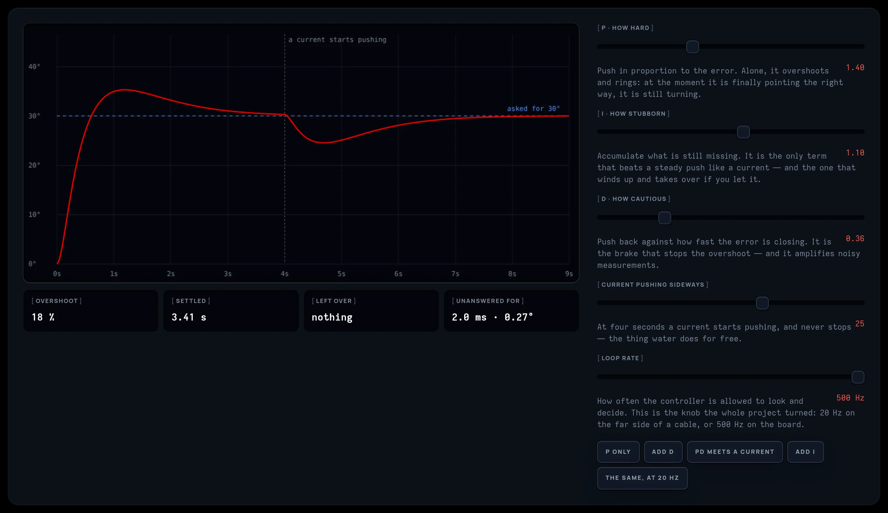</p>

**P** pushes in proportion to the error, and alone it overshoots — at the instant it points the
right way it is still turning. **D** pushes back against how fast the error is closing: the
brake. **I** remembers what is still missing, and is the only one that beats a steady current.
Above: a toy hull asked for 30°, with a current switched on at four seconds. PD alone would park
7.1° short for ever; adding I closes the gap, and costs 18 % overshoot to do it.

On the vehicle this loop runs **on the board at 500 Hz** — so the longest the hull is ever on
its own is 2 ms. Our old host loop ran at 20 Hz: 50 ms, twenty-five times longer for the water.

<details>
<summary><b>The maths, if you want it</b></summary>

```
u(t) = Kp·e(t)  +  Ki·∫e(τ)dτ  +  Kd·de/dt          e(t) = setpoint − measured
```

Run discretely at rate f, the controller only sees the world every 1/f seconds and holds its
output in between — which is why the rate changes behaviour even when the gains do not.
</details>

**See it yourself:** [turn the knobs in the browser](https://fh1m.github.io/mongla_ws/#pid) ·
`ros2 run mongla_manager connect --watch` streams the board's own attitude at 50 Hz.

### 2. Where am I, with no GPS?

**You would expect** one good sensor to answer that. There is no such sensor underwater: the IMU
is fast and drifts, depth is exact but in one axis, the camera sees the floor move, and the
compass inside an aluminium hull is a random number generator.

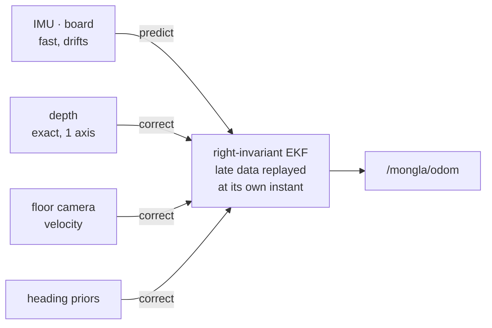
```mermaid
flowchart LR
    IMU["IMU · board<br/>fast, drifts"] -->|predict| EKF
    DEP["depth<br/>exact, 1 axis"] -->|correct| EKF
    FLOW["floor camera<br/>velocity"] -->|correct| EKF
    HDG["heading priors"] -->|correct| EKF
    EKF["right-invariant EKF<br/>late data replayed<br/>at its own instant"] --> ODOM["/mongla/odom"]
```

So a filter blends them: predict forward on the IMU, then correct with whatever else arrived.
Two details carry it. It is **right-invariant** — the maths lives on the rotation group, so
there is no Euler-angle singularity near vertical. And a measurement that arrives late is
**replayed at the instant it describes**: a detection that took 18 ms is evidence about where the
vehicle *was*.

<details>
<summary><b>The maths, if you want it</b></summary>

Predict `x̂⁻ = f(x̂, u)`, `P⁻ = F P Fᵀ + Q`; correct with gain `K = P⁻Hᵀ(HP⁻Hᵀ + R)⁻¹`. The
invariant form defines the error on the group itself (`η = X̂·X⁻¹`), which makes the error
dynamics independent of the state for this class of system — the property Barrau & Bonnabel
prove, and the reason it converges where a textbook EKF can diverge.
</details>

**See it yourself:** `ros2 topic echo /mongla/odom` with `localization:=true` · the package page,
[`mongla_localization`](.claude/context/packages/mongla_localization/README.md).

### 3. The DVL we do not have

**You would expect** a velocity sensor to measure velocity. A downward camera measures *pixels
per second* — and the same pixel motion is a different speed at a different height.

<p align="center">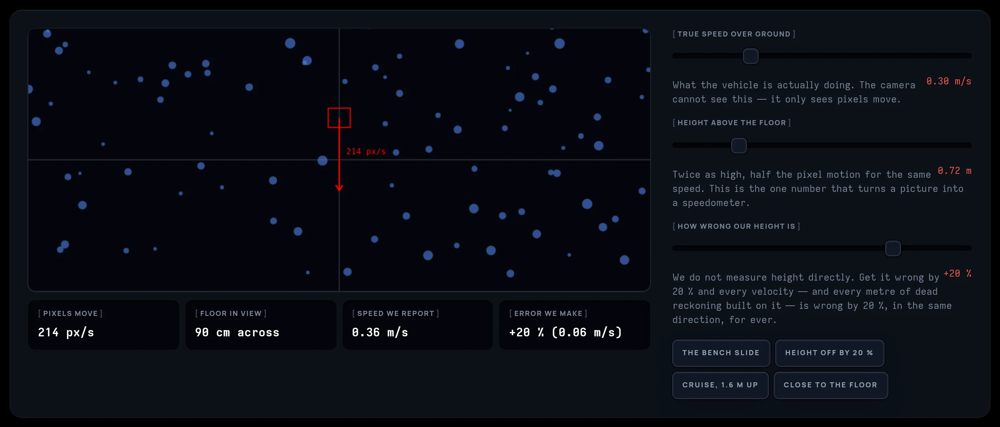</p>

A Doppler velocity log costs more than this vehicle, so the floor camera stands in. Worked
example, with the bench rig's measured focal length: at **0.72 m** up, a floor moving at
**0.30 m/s** slides past at **214 px/s**. Be 20 % wrong about the height and every speed — and
every metre of dead reckoning built on it — is 20 % wrong in the same direction, for ever.

Against a tape, three real 30 cm slides:

| slide | measured | error | height it implies |
|---|---|---|---|
| lateral | 30.13 cm | +0.13 | 0.72 m |
| forward | 31.09 cm | **+1.09** | 0.69 m |
| back | 31.04 cm | +1.04 | 0.70 m |
| *the tape* | — | — | **0.72 m** |

Worst **3.6 %** — several times a real DVL's 0.5–1 %, measured in air on a hand slide whose own
precision is about ±1 cm, so it is an upper bound. The last column is the part to trust: the
height recovered from each slide lands on the tape's.

<details>
<summary><b>The maths, if you want it</b></summary>

```
v = (Δpixels / Δt) · h / f          214 px/s × 0.72 m ÷ 513.94 px = 0.2998 m/s
```

Features come from Shi–Tomasi corners and are tracked with pyramidal Lucas–Kanade. A turning
hull also makes the floor appear to move, so the obvious next step is to subtract the gyro's
rotation first — and it was measured three ways on the vehicle, and **left off**: the fitted
gains were refuted by their own A/B (`measured-bars.md` §19–21). It is a measured choice, not a
missing feature.
</details>

**See it yourself:** [the flow lab](https://fh1m.github.io/mongla_ws/#flow) ·
`ros2 run mongla_planner mongla calc_distance --help` — the verb that brackets a flow distance.

### 4. A neural network, on a chip that only does that

**You would expect** a faster detector to need a faster computer. Here the computer barely
takes part: the Hailo-8 does nothing but multiply the numbers a neural network is made of.

<p align="center">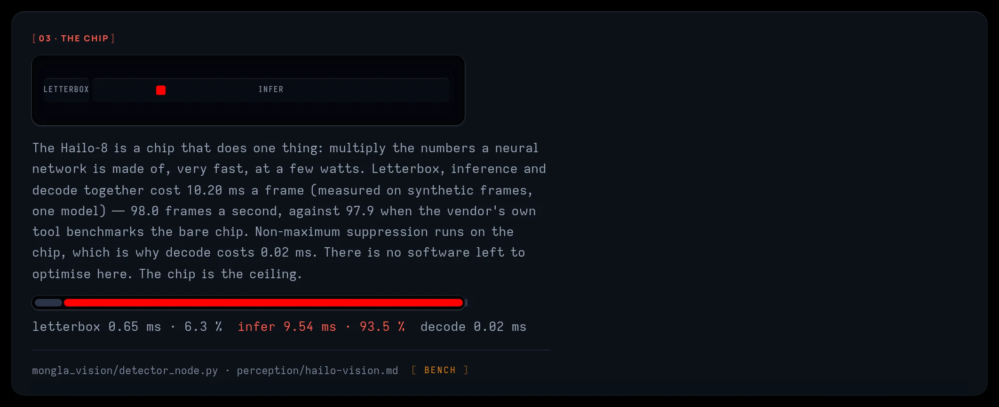</p>

Worked example: one frame costs **10.20 ms** — 0.65 letterbox, 9.54 inference, 0.02 decode —
so **1000 ÷ 10.20 = 98.0 Hz**. The vendor's own benchmark of the bare chip says 97.9. There is
no software left to optimise; the chip is the ceiling. Through the ROS graph the rest of the
vehicle sees **53.9 Hz**, and photon to detection is **18.0 ms** median.

⛔ A model's `<stem>.yaml` sidecar must ship beside it. Without it the class allowlist is empty
and every frame returns a silent `[]` — with the pipeline looking perfectly healthy.

**See it yourself:** `python3 tools/hailo_stages.py` on the Pi ·
[`hailo-vision.md`](.claude/context/perception/hailo-vision.md).

### 5. The detector blinks. The target does not.

**You would expect** a lost detection to mean a lost target. On real footage it usually means a
reflection, a bubble or a bad angle for a fraction of a second.

<p align="center">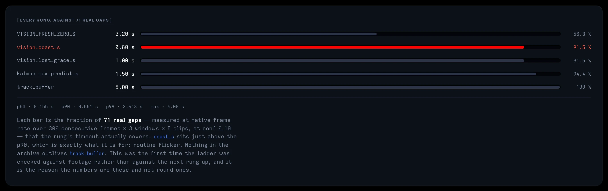</p>

So the lock climbs down a ladder — live box, then a tracker coasting on motion, then a feature
anchor matching the image itself — and each rung may be wrong for a *measured* length of time.
Over **71 real gaps** the median blink was 0.155 s and the p99 2.418 s; `coast_s = 0.80 s`
covers 91.5 % of them, and on one clip the anchor held **175 consecutive frames** the detector
had lost. At the bottom of the ladder it says `LOST`, and means it.

**See it yourself:** `python3 tools/gap_distribution.py` ·
[`detection-continuity.md`](.claude/context/perception/detection-continuity.md).

### 6. Water is not air, and the camera is the first casualty

**You would expect** water to tint the picture. It does that — and it also bends the rays, which
quietly shrinks the camera's view.

<p align="center">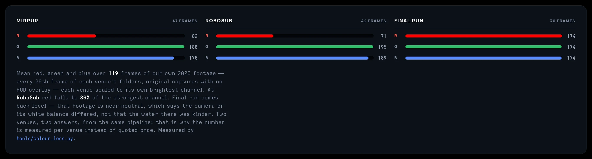</p>

Colour first: over 119 real frames red falls to **36 %** of the strongest channel at RoboSub and
**44 %** at Mirpur. Then geometry, which is the one worth checking by hand. The datasheet says
63.8°. Through a flat port, Snell's law predicts

```
2 · asin( sin(63.8° / 2) / 1.333 )  =  46.7°
```

and we **measured 46.7° ± 0.7°** in water. The theory and the bench agree to the tenth of a
degree — and a search pattern using the datasheet figure believes it sweeps 27 % more course
than it can see.

| the water does this | so this breaks | measured |
|---|---|---|
| absorbs red first | colour thresholds, contrast tricks | red at 36–44 % of the strongest channel |
| bends light at a flat port | any angle from a datasheet | 63.8° → **46.7°** |
| blocks radio | telemetry, GPS, rescue | no link below the surface |
| moves while you decide | dead reckoning | 0.12 m/s current → **1.374 m** of drift in 40 s |

⛔ **Image enhancement** — the first fix every underwater tutorial suggests — was measured
across 17 configurations, four props and three venues and was **never once positive**: on the
gate it took detection from 30.4 % of frames to **1.2 %**. It ships disabled, and a test keeps
it that way.

**See it yourself:** `MONGLA_ARCHIVE=… python3 tools/colour_loss.py` ·
[`underwater-vision.md`](.claude/context/perception/underwater-vision.md).

---

## The machine

| part | what |
|---|---|
| flight controller | **SROT board**, firmware **Hengla** — ESP32 (dual core) + RP2350 |
| control loop | **500 Hz** on ESP32 core 1 (sensors, control, DShot). Core 0: MAVLink 100 Hz, LoRa/SD 20 Hz, display 30 Hz |
| companion | **Raspberry Pi 5 + Hailo-8 AI HAT** — ROS 2 Jazzy on the vehicle, Humble on dev boxes |
| link | **one USB-C cable**, MAVLink 2 at 115200, compid **191** (`MAV_COMP_ID_ONBOARD_COMPUTER`) |
| sensors | IMU, depth, leak, kill switch, both battery packs, per-motor RPM — **all on the board**, one clock |
| thrusters | ⚠ **two answers — see below** |
| cameras | forward + downward USB; per-camera calibration measured *in water* |
| velocity | the **downward camera**. No DVL is fitted, and none has ever been validated in water |

<p align="center">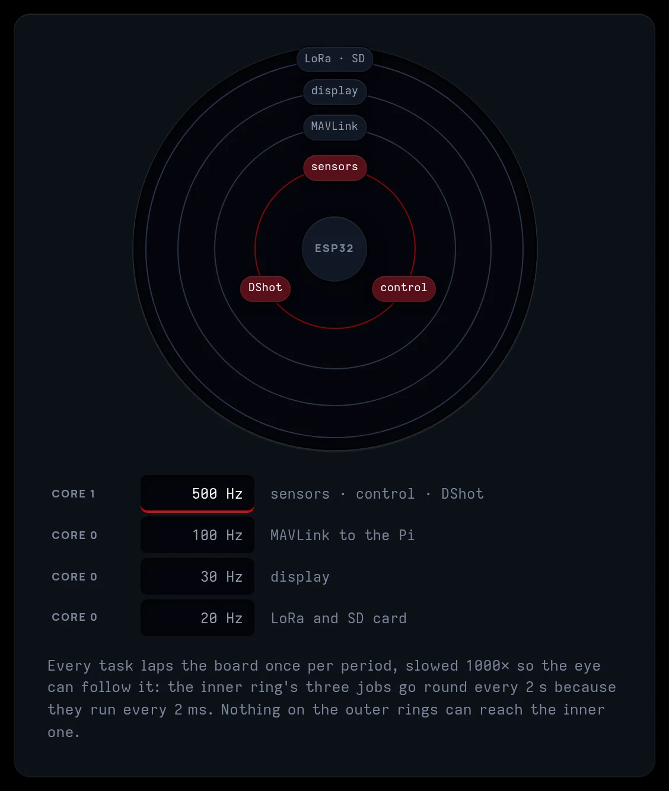</p>

The hull, measured off the CAD and validated against Onshape to **0.08 %**: **702.0 × 176.1 ×
172.1 mm**, fineness **3.99**, four ⌀84 mm tunnel thrusters (lateral pair 350 mm apart, vertical
pair 519 mm apart) plus one axial unit in the nose — five thrusters, **5 of 6 DOF with roll
unactuated**.

> ⚠ **The hull in CAD is not the hull the mixer was written for.** The firmware mixes for eight
> vectored T200s; the current CAD is a five-thruster hull. Both statements are true of
> *something*; they are not true of the same vehicle, and until that is settled every number
> here says which hull it belongs to. Onshape reports **no material assigned to any part**, so
> mass, centre of buoyancy and drag genuinely cannot be computed yet — and are therefore not
> quoted.

You can take the hull apart yourself on the [front page](https://fh1m.github.io/mongla_ws/#body):
a 0.9 mm-tessellated WebGL model, 40 bodies, that comes apart as you scroll.

---

## The seven packages

| package | what it owns | Python LOC | test files |
|---|---|---:|---:|
| [`mongla_vision`](.claude/context/packages/mongla_vision/README.md) | cameras, Hailo detection, the lock ladder, optical flow, optics | 24 000 | 85 |
| [`mongla_control`](.claude/context/packages/mongla_control/README.md) | the verbs and the flight-controller boundary — a pure library, **zero entry points** | 13 236 | 62 |
| [`mongla_planner`](.claude/context/packages/mongla_planner/README.md) | the `mongla` CLI, the mission DSL, the missions | 11 006 | 32 |
| [`mongla_manager`](.claude/context/packages/mongla_manager/README.md) | `auv_manager_node` — the one node that talks to the board | 8 498 | 46 |
| [`mongla_localization`](.claude/context/packages/mongla_localization/README.md) | the right-invariant EKF, retrodiction, course priors | 3 592 | 20 |
| [`mongla_sensors`](.claude/context/packages/mongla_sensors/README.md) | sensor drivers and firmware helpers | 1 906 | 4 |
| [`mongla_interfaces`](.claude/context/packages/mongla_interfaces/README.md) | one action, one state topic — the entire ROS surface | IDL | — |

**249 test files against the source.** The ROS surface really is that small: one action
`/mongla/move` carrying one verb per goal, and one topic `/mongla/state` publishing on change,
where an absent value is `NaN` and never `0.0`.

### Adding a verb is two edits

```python
# 1. a row in src/mongla_control/mongla_control/commands.py
'move_forward': {
    'help':     'Swim forward for a duration at a thrust cap.',
    'fields':   ['duration', 'gain', 'timeout'],
    'defaults': {'gain': 30.0, 'timeout': 0.0},
},
# 2. a method of the same name on the facade. That is all.
```

The CLI, the action server and the Python client all read that one table, so `--help`, argument
parsing and dispatch follow automatically. **30 verbs** today.

⛔ **Six of them are refused on the board** — `lock_heading`, `move_forward_dist`,
`move_back_dist`, `move_lateral_dist`, `arc`, `style_yaw` — because the board has no such
primitive and faking one host-side is how a mission comes to believe it moved a metre it never
moved. They are refused *before dispatch*, by name, in
[`srot_fc.UNSUPPORTED_VERBS`](src/mongla_control/mongla_control/fc/srot_fc.py).

---

## Asking it to do something

> *"There are two ways of constructing a software design: One way is to make it so simple that
> there are obviously no deficiencies, and the other way is to make it so complicated that there
> are no obvious deficiencies."* — C.A.R. Hoare, [ACM Turing Award Lecture](https://amturing.acm.org/award_recipient/hoare_4622167), 1980

A mission is a Python script, not a state machine you have to draw. The vision verbs are
pixel-native and **never raise** — they return where and how they finished, so a mission
branches on reality instead of on an exception.

```python
res = mongla.vision.align(
    'hole', lat=0, yaw=0,      # centre it: signed pixels from frame centre
    fwd=62, fwd_mode='area',   # and hold this standoff
    hold=4.0, fire=[1, 2],     # two shots, each gated on a NEW frame
    lock_on=True, brake=False,
)

if not res.saw_target:         # never read x_px before this — NaN < n is silently False
    return search_pattern(mongla)
if res.x_px > 0:               # it ended right of centre, so recover right
    mongla.move_right(duration=0.6)
```

That comment on line 8 is the whole philosophy compressed: **a result that is absent must never
be mistaken for a result that is zero.** Outcomes are `ALIGNED`, `LOST`, `TIMEOUT`, `NO_CAMERA`,
`ABORTED`, `FAILED` — and `FAILED` is what a refused axis comes back as, rather than an
exception that would unwind a mission mid-dive.

### What a task actually looks like

Not a flowchart of boxes: the real shape of a gate run, with the places it is allowed to give up
marked as clearly as the places it succeeds.

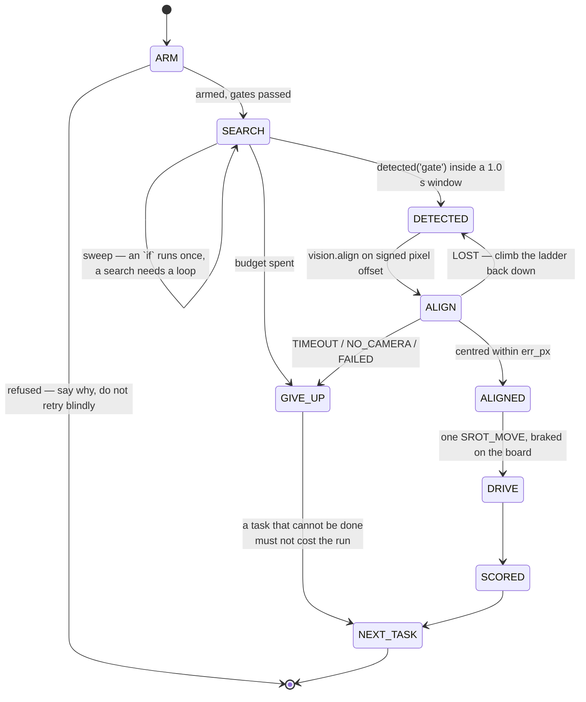
```mermaid
stateDiagram-v2
    [*] --> ARM
    ARM --> SEARCH: armed, gates passed
    ARM --> [*]: refused — say why, do not retry blindly
    SEARCH --> DETECTED: detected('gate') inside a 1.0 s window
    SEARCH --> SEARCH: sweep — an `if` runs once, a search needs a loop
    SEARCH --> GIVE_UP: budget spent
    DETECTED --> ALIGN: vision.align on signed pixel offset
    ALIGN --> ALIGNED: centred within err_px
    ALIGN --> DETECTED: LOST — climb the ladder back down
    ALIGN --> GIVE_UP: TIMEOUT / NO_CAMERA / FAILED
    ALIGNED --> DRIVE: one SROT_MOVE, braked on the board
    DRIVE --> SCORED
    GIVE_UP --> NEXT_TASK: a task that cannot be done<br/>must not cost the run
    SCORED --> NEXT_TASK
    NEXT_TASK --> [*]
```

---

## What keeps it from hurting someone

> *"For a successful technology, reality must take precedence over public relations, for nature
> cannot be fooled."* — Richard Feynman, Rogers Commission Report, [Appendix F](https://wist.info/feynman-richard/5360/), 1986

Six rules, and they are not negotiable. They are also the reason several features are *slower*
than they could be.

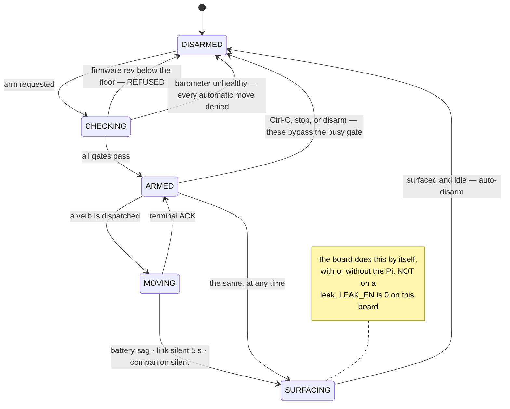
```mermaid
stateDiagram-v2
    [*] --> DISARMED
    DISARMED --> CHECKING: arm requested
    CHECKING --> DISARMED: firmware rev below the floor — REFUSED
    CHECKING --> DISARMED: barometer unhealthy — every automatic move denied
    CHECKING --> ARMED: all gates pass
    ARMED --> MOVING: a verb is dispatched
    MOVING --> ARMED: terminal ACK
    MOVING --> SURFACING: battery sag · link silent 5 s · companion silent
    ARMED --> SURFACING: the same, at any time
    SURFACING --> DISARMED: surfaced and idle — auto-disarm
    ARMED --> DISARMED: Ctrl-C, stop, or disarm — these bypass the busy gate
    note left of SURFACING
        the board does this by itself,
        with or without the Pi. NOT on a
        leak, LEAK_EN is 0 on this board
    end note
```

<details>
<summary><b>The six rules, in full</b></summary>

1. **Always have a disarm path.** Ctrl-C on the manager stops and disarms.
2. **Cooperative abort.** Every motion loop checks the abort flag once per tick; `disarm`,
   `stop` and `surface` bypass the busy gate so they always execute.
3. **The heartbeat keeps ticking.** Nothing in a callback may block long enough to break it —
   the board surfaces after 5 s of silence.
4. **Neutral on startup.** No axis is commanded until a verb asks for it.
5. **Propellers clear, and a human on the kill switch**, before anything arms.
6. **Never claim a verb worked without seeing the value it produced.** The recurring defect in
   this codebase is a plausible number standing in for an absent measurement.

</details>

### The chain, as it is configured today

<p align="center">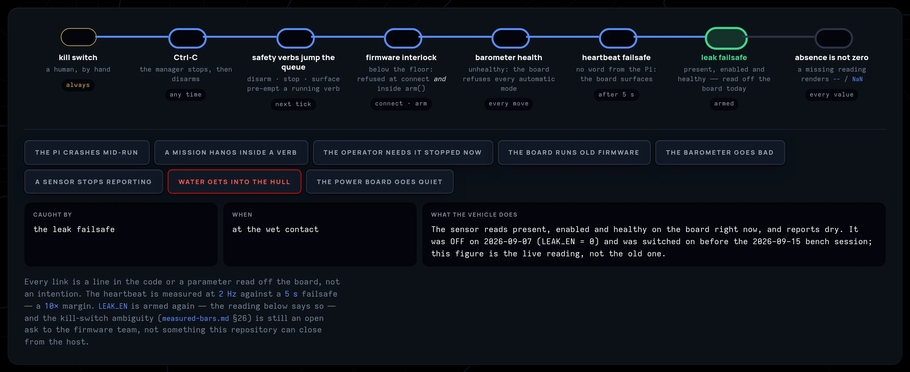</p>

Eight links, each owned by a different part of the system. Two are not what they should be, and
both are the firmware's to change, so both are open asks rather than host workarounds:

- **The leak link is off.** The sensor is present and its bit is readable, but `LEAK_EN = 0` on
  this board, and the firmware gates both the pre-arm refusal and the surface failsafe on it. Water
  in the hull would neither stop an arm nor bring the vehicle up.
  ([`srot-board-soul.md`](.claude/context/platform/srot-board-soul.md) §4)
- **The kill link is ambiguous.** `KILL = 0` means "live" *or* "the power board is not talking to
  us". The host shows `UNKNOWN` when the second board is silent, and `arm()` refuses only on a
  *known* engaged switch. ([`measured-bars.md`](.claude/context/measured-bars.md) §26)

The site lets you [pick a failure and watch which link takes it](https://fh1m.github.io/mongla_ws/#safety).

⛔ **Firmware revision is a hull-safety interlock**, checked at connect *and inside* `arm()`.
Revision 10 inverted yaw; a board below the floor takes every turn backwards. The floor lives in
`srot_protocol.py` and is deliberately not quoted here, because a number in a README is exactly
the kind of thing that goes stale — `test_doc_drift.py` fails any doc that states it.

---

## The ledger

> *"It doesn't make any difference how beautiful your guess is… If it disagrees with experiment,
> it's wrong."* — Richard Feynman

[`measured-bars.md`](.claude/context/measured-bars.md) is the file this project is really built
on: **50 entries, 390 rows of numbers**, each with the method, the conditions and the bar it had
to clear. Tests read it. A constant that drifts from it fails CI.

**8 of those 50 entries say in their own title that they took an earlier result back.** Five
more measured an idea and concluded it should stay switched off. The retractions live in the
same file as the results that stand, in the middle rather than in an appendix:

<p align="center">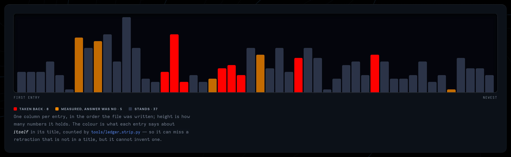</p>

<p align="center">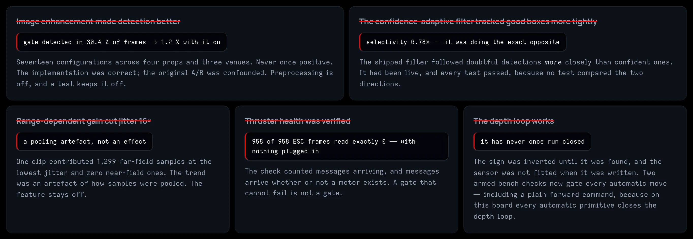</p>

None of that is hidden, because a capability map that promotes bench results to flight results
is how a team finds out at the venue.

### The tests are the argument

```
mongla_control       1 114 passed        the verbs, the wire, the refusals
mongla_vision        1 030 passed        detection, the lock ladder, optics, flow
mongla_manager         466 passed        the node, bring-up gates, the docs contract
mongla_planner         420 passed        the CLI, the DSL, the missions
mongla_localization     286 passed       the filter, retrodiction, course priors
                     ─────────────
                     3 316 passed, 0 failed
```

> *"Computing science has very convincingly shown that simplicity is a necessary precondition for
> reliability."* — Edsger W. Dijkstra, [EWD1175](https://www.cs.utexas.edu/~EWD/transcriptions/EWD11xx/EWD1175.html)

Some of those tests are unusual enough to be worth naming:

- **`test_doc_drift.py`** fails when a *document* states a constant the code no longer holds.
- **`test_srot_protocol_drift.py`** reads the **firmware's own headers** and fails if our copy of
  the wire contract has drifted from theirs.
- **`test_docs_contract.py`** checks that every published figure on the site still matches the
  code or the measurement that generated it — including the 44-byte frame, the ledger counts,
  and the colour-loss chart.
- **`test_no_profile_enables_preprocessing`** exists solely to keep a refuted idea switched off.


```mermaid
flowchart LR
    DEV["a change"] --> HOOK["editor hooks<br/>py_compile + the matching test file"]
    HOOK --> UNIT["5 suites · 3 316 tests"]
    UNIT --> GUARD["the drift guards"]
    GUARD --> G1["test_doc_drift<br/>docs vs code"]
    GUARD --> G2["test_srot_protocol_drift<br/>our wire copy vs THEIR headers"]
    GUARD --> G3["test_docs_contract<br/>published figures vs measurements"]
    G1 --> SIM["the simulator<br/>every recovery path, no water needed"]
    G2 --> SIM
    G3 --> SIM
    SIM --> BENCH["the bench: the real board,<br/>armed, propellers off"]
    BENCH --> POOL["a pool day — four hours,<br/>and the only thing that settles it"]
    POOL -.->|"has not happened yet"| WATER["🟢 WATER"]
```

And the rule behind them: **a test that has never failed against a real defect is not a guard.**
Break it deliberately, watch it fail, restore it. Several tests in this repo have a comment
recording the day they were injection-verified.

### When it does not come back

The question every post-mortem starts with, and the instrumentation that answers it. Every leaf
here is something we can actually read after a run.

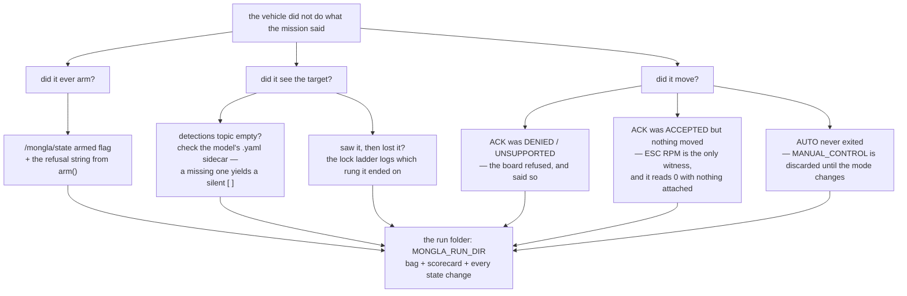
```mermaid
flowchart TB
    Q["the vehicle did not do what the mission said"] --> A["did it ever arm?"]
    Q --> B["did it see the target?"]
    Q --> C["did it move?"]
    A --> A1["/mongla/state armed flag<br/>+ the refusal string from arm()"]
    B --> B1["detections topic empty?<br/>check the model's .yaml sidecar —<br/>a missing one yields a silent [ ]"]
    B --> B2["saw it, then lost it?<br/>the lock ladder logs which rung it ended on"]
    C --> C1["ACK was DENIED / UNSUPPORTED<br/>— the board refused, and said so"]
    C --> C2["ACK was ACCEPTED but nothing moved<br/>— ESC RPM is the only witness,<br/>and it reads 0 with nothing attached"]
    C --> C3["AUTO never exited<br/>— MANUAL_CONTROL is discarded until the mode changes"]
    A1 --> LOG["the run folder: MONGLA_RUN_DIR<br/>bag + scorecard + every state change"]
    B1 --> LOG
    B2 --> LOG
    C1 --> LOG
    C2 --> LOG
    C3 --> LOG
```

---

## The simulator

[`sim/`](sim/) is a second colcon workspace inside this repository: Gazebo, a pool with courses
and props, both cameras, ground truth, fault injection and an operator lab — **six packages,
20 649 lines.** It runs **ArduSub SITL by design**: it is a physics environment, not the
vehicle, so it uses `flight_controller:=pixhawk`.

What transfers: control behaviour and every verb. What does **not**: detection thresholds and
vision gains, because simulator imagery is too clean. That distinction is the whole reason the
site labels simulator frames as [the rehearsal](https://fh1m.github.io/mongla_ws/#archive) and
real footage as [the water](https://fh1m.github.io/mongla_ws/#water-real).

<p align="center">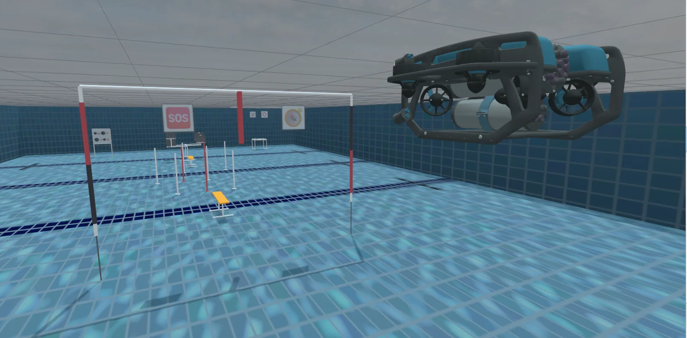</p>

<table><tr>
<td width="50%">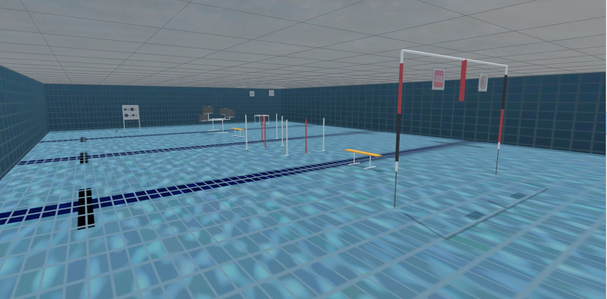</td>
<td width="50%">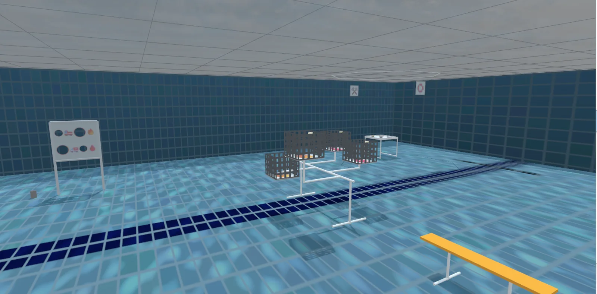</td>
</tr><tr>
<td>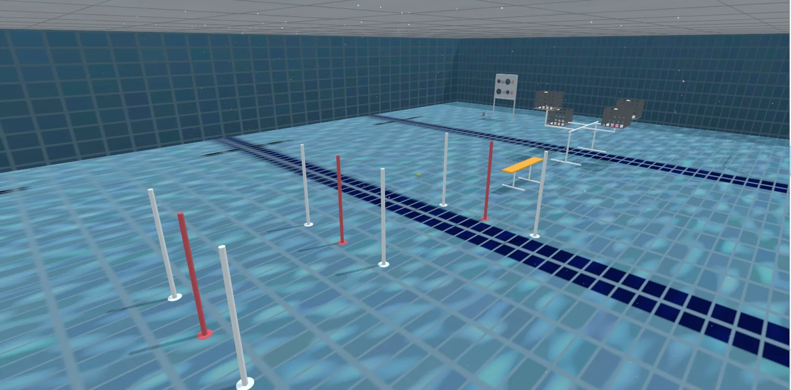</td>
<td>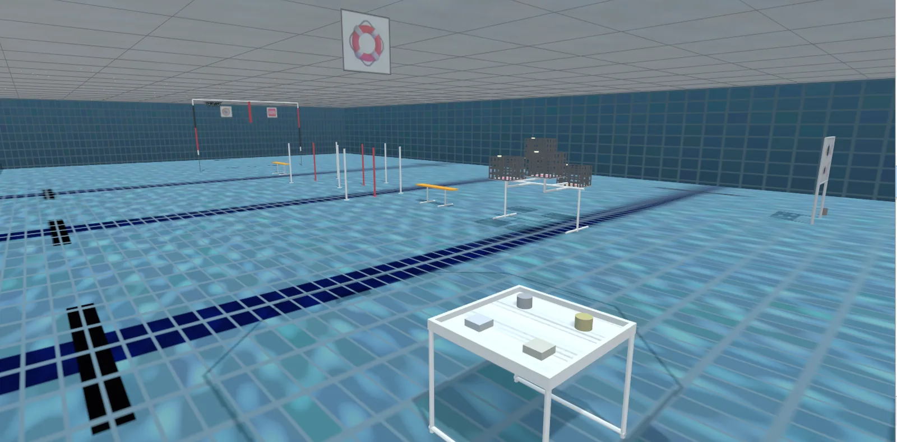</td>
</tr></table>

<sub>Gazebo, 2026-09-12. The hull is a BlueROV2 Heavy flown by ArduSub SITL — deliberately not
our vehicle: the simulator is a physics environment, and every verb goes through the same
interface the board uses.</sub>

The simulator earned its place by being wrong in the same places the pool is:

| what it models | why it had to | the number |
|---|---|---|
| the real T200 thrust curve | a straight line was wrong by a quarter of full thrust | 12.2 % |
| water current | the lateral integral term existed to fight a current the sim did not have | 0.12 m/s → 1.374 m in 40 s |
| camera FOV *in water* | the in-air figure showed more course than the vehicle can ever see | 63.8° → 46.7° |
| Bar30 noise | ours was ten times too noisy on the one sensor every mission depends on | 0.02 m → 0.002 m |
| fault injection | five recovery paths existed in the code and had never once executed | DVL · camera · link · battery · thruster |

---

## What stands in the way

> *"A ship in port is safe, but that is not what ships are built for."* — John A. Shedd, 1928;
> [a motto Grace Hopper lived by](https://quoteinvestigator.com/2013/12/09/safe-harbor/)

Seven things, and **not one of them is ours to fix alone**:

<p align="center">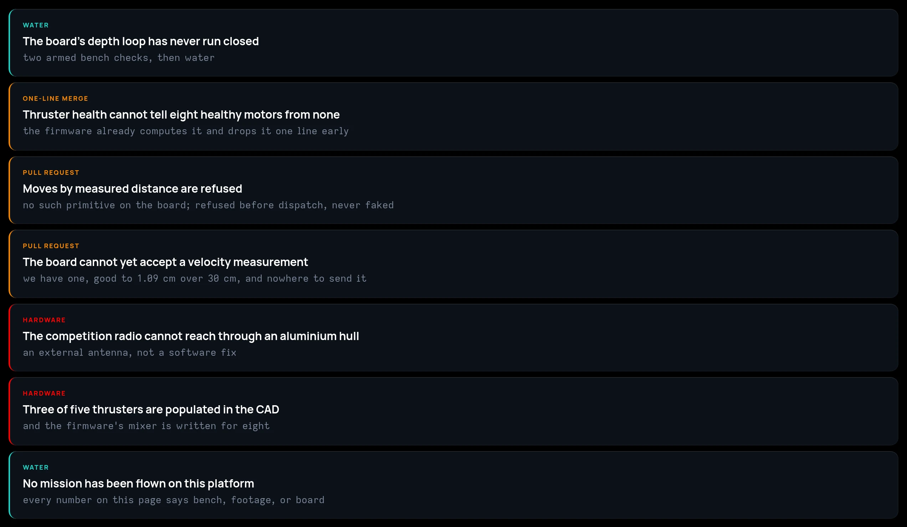</p>

The live list is [`ROADMAP.md`](.claude/context/ROADMAP.md) — one status file, so it cannot
disagree with itself. The asks already sent upstream, each carrying the evidence that produced
it, are in [`.claude/context/upstream/`](.claude/context/upstream/README.md).

---

## Every document in this repository

This README is a map, not the territory. The documents below are the territory, and they are
kept beside the code they describe rather than pasted in here.

Read them in order as **[the Mongla book](.claude/context/README.md)** — 46 chapters in seven parts,
from why the vehicle exists to every number it has measured. Or dip in:

**Start here**

| document | what it gives you |
|---|---|
| [`the-shift.md`](docs/the-shift.md) · [(rendered)](https://fh1m.github.io/mongla_ws/the-shift.html) | the architecture from first principles: why reflexes live on the board and thinking on the Pi |
| [`capability-map.md`](docs/capability-map.md) · [(rendered)](https://fh1m.github.io/mongla_ws/capability-map.html) | every capability with its evidence and an honest verification state |
| [`ROADMAP.md`](.claude/context/ROADMAP.md) | **the one status file** — where we are, what is left, what is blocked |
| [`measured-bars.md`](.claude/context/measured-bars.md) | every shipped constant with the measurement behind it, retractions included |
| [`BUGS.md`](.claude/context/BUGS.md) | the single defect register |
| [`reference/commands.md`](.claude/context/reference/commands.md) | **generated from the code**: all 30 verbs with their fields and defaults, which ones the board runs and which it refuses, every executable, launch argument, node parameter and wire constant |

<details>
<summary>**The platform** — [`.claude/context/platform/`](.claude/context/platform/) · 17 documents</summary>

`srot-architecture` · `srot-integration` (the traps that cost us runs) · `srot-board-soul` ·
`cross-repo-contract` · `vision-control-split` · `vehicle-spec` · `pi-hailo-vision-box` ·
`pi-and-env-traps` · `launch-combinations` · `pool-day` · `remote-access` · `foxglove-and-bags` ·
`ros2-conventions` · `system-harmony` · `mongla-sim` · `legacy-pixhawk-and-sitl` (only for the simulator's
ArduSub SITL harness)

</details>

<details>
<summary>**Perception** — [`.claude/context/perception/`](.claude/context/perception/) · 14 documents</summary>

`hailo-vision` · `vision-architecture` · `underwater-vision` · `camera-and-calibration` ·
`camera-latency` · `detection-continuity` · `depth-estimation` · `downward-camera` ·
`dual-camera-setup` · `pipeline-hardening` · `sensors-pipeline` · `video-testing`

</details>

<details>
<summary>**Missions** — [`.claude/context/missions/`](.claude/context/missions/) · 9 documents</summary>

`command-reference` (all 30 verbs) · `client-and-dsl-api` · `mission-cookbook` ·
`detected-paradigm` · `precision-alignment` · `vision-results` · `fsm-guide` ·
`fsm-vision-missions`

</details>

**Per package** — [`.claude/context/packages/`](.claude/context/packages/README.md) · one page each ·
**Upstream asks** — [`.claude/context/upstream/`](.claude/context/upstream/README.md) ·
**The simulator** — [`sim/README.md`](sim/README.md) and [`sim/.context/`](sim/.context/INDEX.md)

---

## Three acts

**Act I — the lab years.** Mongla began as the autonomy software for a university AUV programme.
The programme had placed **2nd at RoboSub 2023** the year before the author arrived; he joined in
2024 as a junior member of the AI and machine-vision team, led that sub-team in 2025 (RoboSub:
8th of 58), and was engineering lead for the 2026 campaign (8th of 58 again, 4 083 → 6 234
points). A closed inner loop and a 20 Hz host loop steering a box we were not allowed inside.
It placed, and it had a ceiling.

**Act II — opening the box.** The ceiling was never the code; it was the boundary. So the
boundary moved. The firmware team built a board we could write the control loop for, a Pi with a chip
that does nothing but see took the thinking, and the vehicle became two computers. Our own loop
got *slower* — and the vehicle got steadier, because the fast loop moved to where it belongs:
about **25 control corrections for every command we send**.

**Act III — open.** In September 2026 the author left the university, on principle, and Mongla
continues independently. The vehicles, the team name and the university's materials stayed
there. What lives here is the software and its measurements.

### Why keep going

> *"I've always pursued my interests without much regard for final value or value to the world.
> I've spent lots of time on totally useless things."*
> — Claude Shannon, [IEEE Spectrum](https://spectrum.ieee.org/claude-shannon-tinkerer-prankster-and-father-of-information-theory)

Shannon is the role model here, and not for information theory. He built a machine whose only
function was to switch itself off, a mechanical mouse that learned a maze, and a computer that
did arithmetic in Roman numerals — and the rigour was never separable from the play. That is the
register this project aims for: serious engineering, done because the machine is interesting.

I left on principle, and I am building this on **hope rather than optimism**. Hope is the
decision to keep working on the better version of a thing while the current version is still
broken. Pushing a technical limit is the most concrete form of that I know: every measurement
that came back worse than expected is a small argument that the world is knowable, and that the
next version can be better than this one.

---

## How this project works

- **Measure, then ship.** Every shipped threshold is in `measured-bars.md` with its method and
  conditions — including the numbers we later retracted.
- **Injection-verify a guard.** A test that has never failed against a real defect is not a
  guard. Break it on purpose, watch it fail, restore it.
- **Truth tests, not agreement tests.** Comparing a new estimator against the incumbent measures
  agreement and cannot rank them. Construct a case where truth is known.
- **Refuse loudly.** A verb that reports success while the vehicle does nothing is the failure
  mode that ends competition runs.
- **One truth, two copies is the bug.** When two places state the same constant, make one read
  the other — or have a test compare them.
- **A missing low-level feature is a pull request, not a host workaround.**

---

## Authors

Two people. One writes the software; the other writes the firmware and builds the board. There
is no third category, and nothing here is owned by an institution.

<div>
  
  <strong>Muhammad Fahim Faisal</strong> — author<br>
  Autonomy: perception, localization, control integration, the mission language, the simulator,
  and this repository.<br><br>
  Previously engineering team lead for the RoboSub 2026 campaign, AI &amp; Machine Vision sub-team
  lead (2025), and a junior member of that team from 2024 — the year after the programme's
  2nd place at RoboSub 2023, which predates him. His vision stack flew at
  <strong>RoboSub 2025 (8th of 58)</strong>, and the campaign he led placed
  <strong>RoboSub 2026 (8th of 58)</strong> on 53&nbsp;% more points.<br><br>
  <em>"Machines that have to work when nobody is watching."</em><br><br>
  <a href="https://fh1m.github.io/">fh1m.github.io</a> ·
  <a href="https://github.com/fh1m">@fh1m</a> ·
  <a href="mailto:fh1m.dev@gmail.com">fh1m.dev@gmail.com</a>
</div>
<br clear="both">

---

<div>
  
  <div align="right">
  <strong>Rakibul Islam</strong> — firmware and hardware lead<br>
  The <strong>SROT</strong> control board and its firmware <strong>Hengla</strong> — an ESP32
  running a 500 Hz flight loop beside an RP2350 that speaks bidirectional DShot. Also
  <strong>Bondor</strong>, the desktop ground station, and the ESC flashing tool. Each lives in
  his own repository, under his own authorship.<br><br>
  Mongla does not vendor any of it. It talks across a documented wire protocol, and every change
  we need there is a pull request.<br><br>
  <a href="https://github.com/RakibulIslam1/srot-control-board">srot-control-board</a> ·
  <a href="https://github.com/RakibulIslam1/srot-ground-station">srot-ground-station</a> ·
  <a href="https://github.com/RakibulIslam1">@RakibulIslam1</a>
  </div>
</div>
<br clear="both">

### The author, in his own log

Muhammad Fahim Faisal is a systems engineer in Dhaka, Bangladesh, working across robotics,
computer vision, embedded systems and control. The through-line of his
[log](https://fh1m.github.io/log/) is one question, asked since the first machine: *what is
actually happening underneath, and can I rebuild it from first principles?*

| year | phase | what it taught, in his words |
|---|---|---|
| 2022 | the first machine | machine learning from tutorials — *"loss went down"* without understanding why; the practice that stuck was to *"take the opaque thing apart and rebuild it from first principles"* |
| 2023 | experiments as apprenticeship | small vision projects, the comma.ai calibration challenge — calibration as *"the unglamorous core of any camera system"* |
| 2024 | learning the machine from inside | joins the AUV programme's AI and machine-vision sub-team: *"perception is a pipeline with budgets, not a model with an accuracy number"* |
| 2025 | from sub-team to engineering lead | *"engineering leadership is mostly making dependencies visible"* |
| 2026 | the stack becomes the product | ROS 2 control, the simulator, the test tooling: *"a vehicle is only as good as the tooling around it"* — then leaves on principle, and keeps building |

He thinks in five layers, from mission intent at the top, through control loops and
estimation, drivers and real-time scheduling, the boards and sensors, down to the water itself —
and works in one loop: **build, observe, fail, understand, rebuild.** Before this, rockets
(a hybrid rocket engine test with AERD) and the Mongol Tori team; the influences he names are George
Hotz, Andrej Karpathy and the comma.ai calibration mindset — and, above all of them, Claude
Shannon.

> *"The machine is still being built."* — the last line of his log, and the status of this
> repository

### History

Mongla began as the autonomy software for an autonomous underwater vehicle programme at BRAC
University. The author joined that programme in 2024 — after its **2nd place at RoboSub 2023**,
which is the team's result and not this software's — and the vision stack he led flew at
**RoboSub 2025 (8th of 58, 4 083 points)**; the 2026 campaign he led as engineering lead
placed **RoboSub 2026 (8th of 58, 6 234 points)** on the same programme's vehicle — both read
from RoboNation's published score sheets into [`docs/data/robosub.json`](docs/data/robosub.json)
by `tools/robosub_record.py`, never typed from memory. In September 2026 the author left the university, on principle,
and Mongla continues independently. The vehicles, the team name and the university's materials
remain with the university and are referred to here only in the past tense, as history. What
lives in this repository is the software and its measurements.

Full authorship: [AUTHORS.md](AUTHORS.md).

---

## Further reading

The resources below are the ones we would hand someone who wanted to understand this vehicle
from first principles. Every link was fetched and checked; where a host blocks automated
fetching, that is noted rather than hidden.

<details>
<summary><b>Control loops, PID and why 500 Hz matters</b></summary>

| | |
|---|---|
| [Understanding PID Control](https://www.mathworks.com/videos/series/understanding-pid-control.html) — MathWorks, 7-part video series | the plainest walk from "what is a PID controller" to anti-windup and tuning |
| [Control Bootcamp](https://www.youtube.com/playlist?list=PLMrJAkhIeNNR20Mz-VpzgfQs5zrYi085m) — Steve Brunton, U. Washington | state space, observers and Kalman filters from scratch |
| [Control System Lectures](https://www.youtube.com/user/ControlLectures) — Brian Douglas | the standard second stop: root locus, frequency response, state space |
| [*Feedback Systems*](https://www.cds.caltech.edu/~murray/books/AM08/pdf/am08-complete_22Feb09.pdf) — Åström & Murray (free PDF, 1st ed.) | the textbook, if you want the maths under all of the above |
| [PID Without a PhD](http://www.wescottdesign.com/articles/Sampling/pidwophd.html) — Tim Wescott | the practical embedded version, written for people shipping firmware |

</details>

<details>
<summary><b>State estimation — where the vehicle thinks it is</b></summary>

| | |
|---|---|
| [How a Kalman Filter Works, in Pictures](https://www.bzarg.com/p/how-a-kalman-filter-works-in-pictures/) — Tim Babb | start here; intuition before algebra |
| [Quaternion kinematics for the error-state Kalman filter](https://arxiv.org/abs/1711.02508) — Joan Solà | the reference everyone implementing orientation estimation ends up reading |
| [The Invariant Extended Kalman Filter as a Stable Observer](https://arxiv.org/abs/1410.1465) — Barrau & Bonnabel | why our filter is *right-invariant* rather than a textbook EKF |
| [Contact-Aided Invariant EKF](https://arxiv.org/abs/1904.09251) — Hartley, Ghaffari, Eustice & Grizzle | the InEKF applied to a real legged robot, with the derivations spelled out |

</details>

<details>
<summary><b>Optical flow — the DVL we could not buy</b></summary>

| | |
|---|---|
| [An Iterative Image Registration Technique…](https://publications.ri.cmu.edu/storage/publications/pub_files/pub3/lucas_bruce_d_1981_2/lucas_bruce_d_1981_2.pdf) — Lucas & Kanade, IJCAI 1981 | the original sparse optical-flow algorithm |
| [Pyramidal Implementation of the Lucas Kanade Feature Tracker](https://robots.stanford.edu/cs223b04/algo_tracking.pdf) — Bouguet, Intel | what OpenCV's `calcOpticalFlowPyrLK` actually implements |
| [Good Features to Track](https://users.cs.duke.edu/~tomasi/papers/shi/TR_93-1399_Cornell.pdf) — Shi & Tomasi, 1993 | which pixels are worth tracking over a pool floor |
| [OpenCV: Optical Flow](https://docs.opencv.org/4.x/d4/dee/tutorial_optical_flow.html) — OpenCV docs | the practical API entry point |
| [Visual Odometry, Part I](https://rpg.ifi.uzh.ch/docs/VO_Part_I_Scaramuzza.pdf) — Scaramuzza & Fraundorfer, IEEE RAM 2011 | the tutorial that frames the whole problem, drift included |

</details>

<details>
<summary><b>Detection, and running a network on a chip that only does that</b></summary>

| | |
|---|---|
| [You Only Look Once](https://arxiv.org/abs/1506.02640) — Redmon, Divvala, Girshick & Farhadi | the single-shot idea the whole YOLO family came from |
| [Ultralytics YOLO11 docs](https://docs.ultralytics.com/models/yolo11/) | the model family we train and export |
| [hailo-apps](https://github.com/hailo-ai/hailo-apps) — Hailo AI | the maintained pipelines for Pi 5 + Hailo-8 |
| [hailo-rpi5-examples](https://github.com/hailo-ai/hailo-rpi5-examples) — Hailo AI | older, but documents the Pi-specific pipeline pattern in more depth |
| [AI HATs](https://www.raspberrypi.com/documentation/accessories/ai-hat-plus.html) — Raspberry Pi | the hardware this runs on, from the people who made it |

</details>

<details>
<summary><b>Underwater optics — why land vision does not survive the swim</b></summary>

| | |
|---|---|
| [A Revised Underwater Image Formation Model](https://openaccess.thecvf.com/content_cvpr_2018/html/Akkaynak_A_Revised_Underwater_CVPR_2018_paper.html) — Akkaynak & Treibitz, CVPR 2018 | why the atmospheric haze model is simply wrong underwater |
| [Sea-thru](https://openaccess.thecvf.com/content_CVPR_2019/html/Akkaynak_Sea-Thru_A_Method_for_Removing_Water_From_Underwater_Images_CVPR_2019_paper.html) — Akkaynak & Treibitz, CVPR 2019 | the physically grounded way to take the water back out |
| [Flat Refractive Geometry](https://csms.haifa.ac.il/profiles/tTreibitz/webfiles/flat_refractive_geometry.pdf) — Treibitz, Schechner & Singh | what a flat port does to your camera model — the 63.8° → 46.7° story |

</details>

<details>
<summary><b>The wire, the motors and the board</b></summary>

| | |
|---|---|
| [MAVLink serialization](https://mavlink.io/en/guide/serialization.html) | the frame format, including the v2 payload truncation our 44-byte frame relies on |
| [MAVLink common message set](https://mavlink.io/en/messages/common.html) · [common.xml](https://github.com/mavlink/mavlink/blob/master/message_definitions/v1.0/common.xml) | `COMMAND_LONG`, `MANUAL_CONTROL`, and every message we decode |
| [DShot — and bidirectional DShot](https://brushlesswhoop.com/dshot-and-bidirectional-dshot/) — Brushless Whoop | how a motor command becomes a signal, and how RPM comes back |
| [Bidirectional DShot and RPM filter](https://github.com/betaflight/betaflight/wiki/Bidirectional-DSHOT-and-RPM-Filter) — Betaflight wiki · [DShot RPM filtering](https://betaflight.com/docs/wiki/guides/current/DSHOT-RPM-Filtering) | the practical side, from the people who shipped it first |
| [FreeRTOS on ESP-IDF](https://docs.espressif.com/projects/esp-idf/en/stable/esp32/api-reference/system/freertos_idf.html) · [ESP32 Technical Reference Manual](https://www.espressif.com/sites/default/files/documentation/esp32_technical_reference_manual_en.pdf) — Espressif | how you pin a 500 Hz loop to one core and keep everything else off it |

</details>

<details>
<summary><b>The instrument we do not have, and the competition</b></summary>

| | |
|---|---|
| [Nortek DVL1000-300m](https://www.nortekgroup.com/products/dvl-1000-300m) | a real DVL's specification — ±0.1 % — which is the bar our camera misses by several times |
| [Teledyne Tasman DVL](https://www.teledynemarine.com/en-us/products/SiteAssets/RD%20Instruments/Tasman_DVL.pdf) · [PathFinder DVL Guide](https://www.teledynemarine.com/en-us/resources/Documents/Brand%20Support/RD%20INSTRUMENTS/Technical%20Resources/Manuals%20and%20Guides/Pathfinder/PathFinder%20DVL%20Guide_Apr22.pdf) | bottom tracking and the Janus beam geometry, explained by the manufacturer |
| [RoboSub](https://robosub.org/) · [2026 programme](https://robosub.org/programs/2026/) · [Team Handbook](https://robonation.org/app/uploads/sites/4/2026/07/RoboSub-2026_Team-Handbook_20260711-compressed.pdf) | the competition these tasks come from |

</details>

<details>
<summary><b>ROS 2, if it is new to you</b></summary>

| | |
|---|---|
| [ROS 2 Jazzy documentation](https://docs.ros.org/en/jazzy/index.html) | the distribution the vehicle runs |
| [Topics](https://docs.ros.org/en/jazzy/Concepts/Basic/About-Topics.html) · [Actions](https://docs.ros.org/en/jazzy/Concepts/Basic/About-Actions.html) · [Quality of Service](https://docs.ros.org/en/jazzy/Concepts/Intermediate/About-Quality-of-Service-Settings.html) | the three concepts this codebase actually uses |

</details>

<sub>Checked 2026-09-21. Two Teledyne/Nortek pages and the YouTube links are served behind bot
protection that blocks automated fetching; those were confirmed by status code and independent
search rather than by reading the page.</sub>

---

---

## Contributing

This is a two-person project that would be better with more people in it. The useful shapes of
help, in order:

1. **Run it and tell us what broke.** The simulator needs no hardware. A reproducible failure is
   worth more than a feature.
2. **Attack a measurement.** Every number in `measured-bars.md` names its method. If the method
   is wrong, that is the most valuable bug you can file — several entries in the ledger exist
   because someone did exactly that.
3. **Add a verb, a mission, or a test.** Adding a verb is [two edits](#adding-a-verb-is-two-edits).
4. **Improve the docs you had to read twice.** If a page confused you, it is wrong.

Before a pull request: `python3 -m pytest src/*/test -q` should stay green, and anything that
ships a constant needs a row in `measured-bars.md` saying how it was measured.

⛔ **Do not send us firmware.** The board, its firmware and the ground station live in
[their own repositories](#four-repositories-one-wire) and belong to the firmware team. Ask there,
with evidence — that is what we do.

## Citing this

```bibtex
@software{faisal_mongla,
  author  = {Faisal, Muhammad Fahim and Islam, Rakibul},
  title   = {Mongla: an autonomy stack for autonomous underwater vehicles},
  year    = {2026},
  url     = {https://github.com/fh1m/mongla_ws}
}
```

## Licence

MIT — see [LICENSE](LICENSE). The hull renders, the measurements and the documentation are part
of the same repository and the same licence.

---

<div align="center">

**[The site](https://fh1m.github.io/mongla_ws/)** · **[The Shift](https://fh1m.github.io/mongla_ws/the-shift.html)** · **[Capability map](https://fh1m.github.io/mongla_ws/capability-map.html)**

<sub>Nothing on this platform has been in water. Every number above says where it was taken.</sub>

</div>
