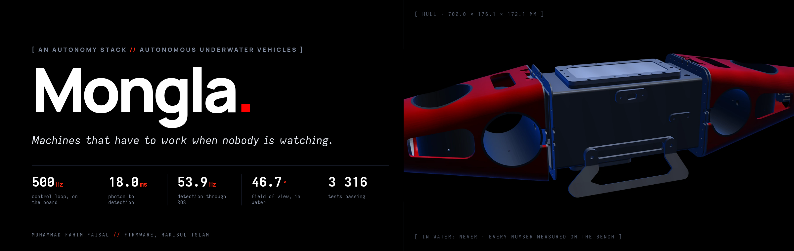
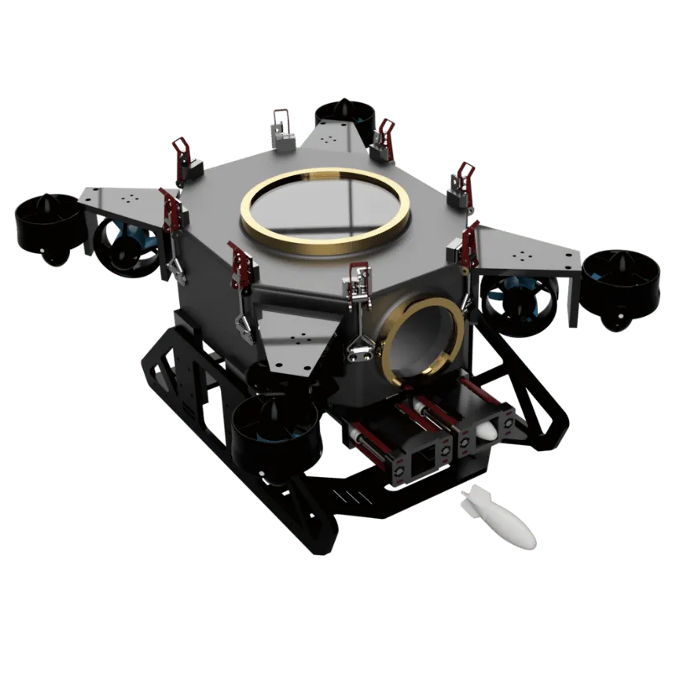
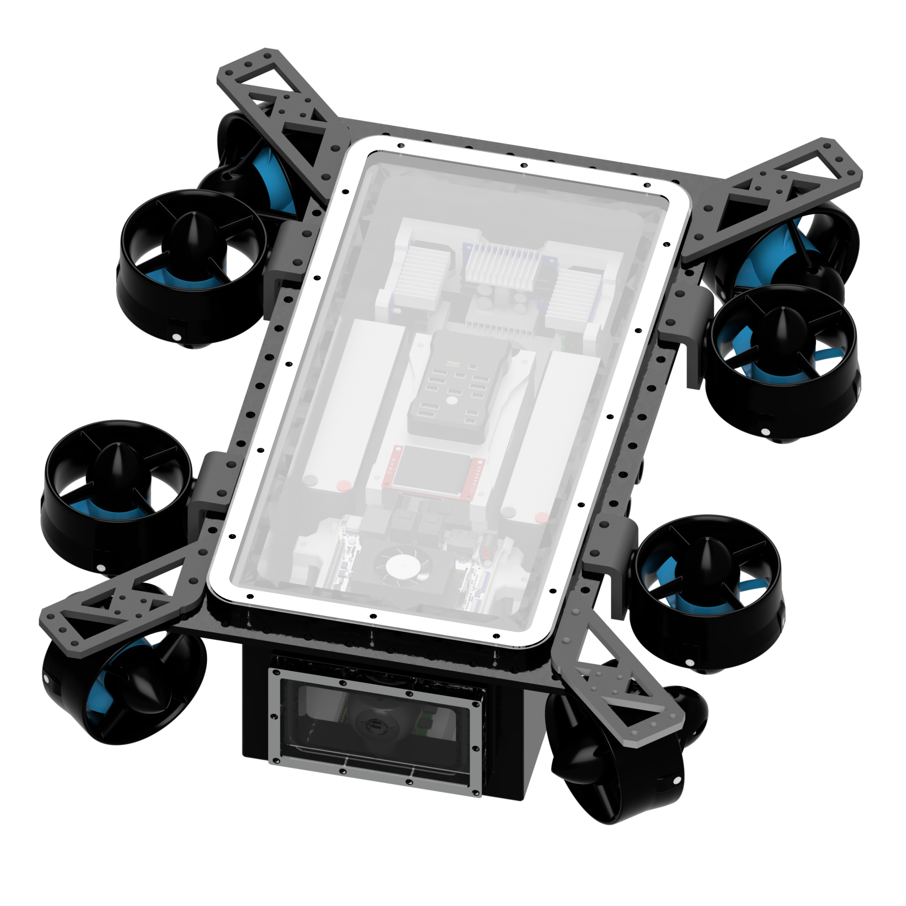
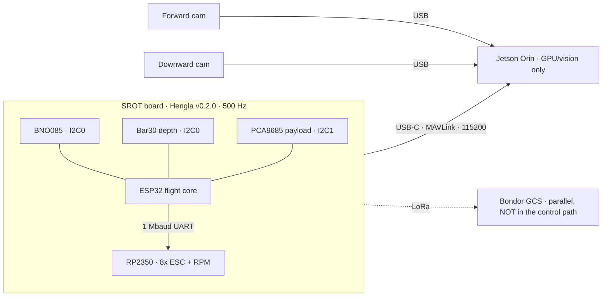
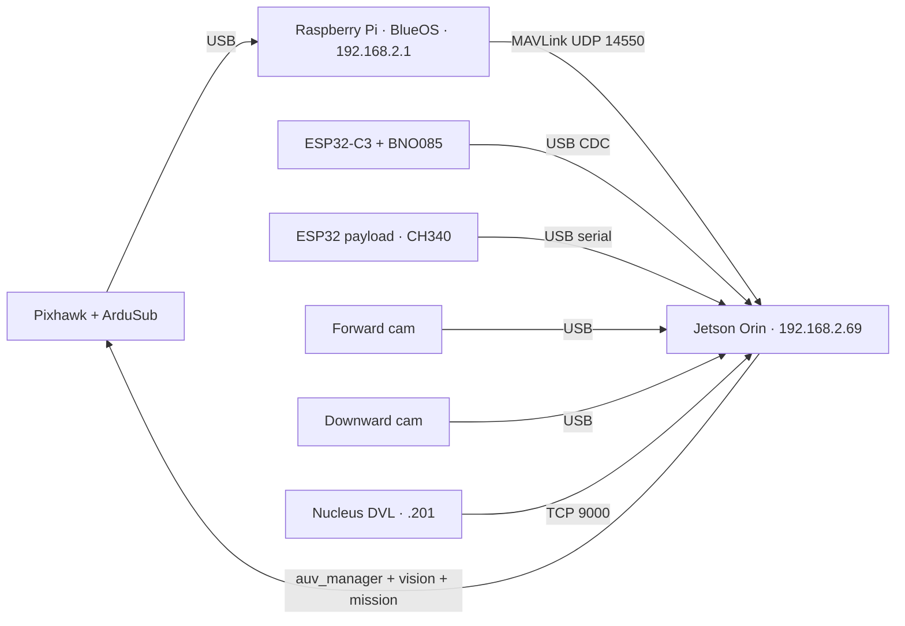

<p align="center">
  
</p>

<h1 align="center">Mongla — <code>duburi_ws</code></h1>

<p align="center">
  <em>One ROS 2 control / mission / vision brain for ArduSub AUVs.</em><br/>
  ROS 2 Humble · ArduSub 4.x · YOLO11 · one action surface, axis-isolated control, vision in the same loop.
</p>

<p align="center">
  
  
  
  
  
  
  <a href="https://fh1m.github.io/duburi_ws/"></a>
</p>

<p align="center">
  <a href="#-get-started">Get started</a> ·
  <a href="#-simulator--gazebo--ardusub-sitl">Simulator</a> ·
  <a href="#-pool-day">Pool day</a> ·
  <a href="#-operating-the-auv">Operating</a> ·
  <a href="#-mission-design">Mission design</a> ·
  <a href="#-reference">Reference</a> ·
  <a href=".claude/context/mission-cookbook.md">Cookbook</a> ·
  <a href=".claude/context/development-board.md">Dev board</a>
</p>

Mongla is a ROS 2 Humble colcon workspace that exposes **one clean action surface
(`/duburi/move`)** over ArduSub. A single node owns the MAVLink connection, receives goals,
and dispatches them to per-axis motion modules behind one dispatch table (`COMMANDS`). It's
developed against an ArduSub SITL + Gazebo loop and field-tested on **Duburi**, a
`vectored_6dof` 8-thruster AUV, for **RoboSub 2026**. That sim loop is **in this
repo** — [`sim/`](sim/) is a full Gazebo Harmonic pool with courses, props and an
operator web lab, so the whole stack can be exercised without water.

> The workspace name `duburi_ws` and the `/duburi/*` namespace are kept for the test vehicle;
> the codebase itself is **Mongla**.

---

## One soul, two bodies

**Mongla is the *soul* (the code).** It runs on two competition *bodies*:

<table>
<tr>
<td width="50%" align="center"></td>
<td width="50%" align="center"></td>
</tr>
<tr>
<td align="center"><b>Duburi 4.5</b> — primary · octagonal · DVL + grabber/dropper/torpedo</td>
<td align="center"><b>Dubomini 2.0</b> — agile · compact · 8× T200 · manipulator-free</td>
</tr>
</table>

|  | Duburi 4.5 (primary) | Dubomini 2.0 (agile) |
|---|---|---|
| Frame | `vectored_6dof`, 8× T200 | `vectored_6dof`, 8× T200 |
| Flight controller | Pixhawk 2.4.8 · ArduSub 4.x | Pixhawk 2.4.8 · ArduSub |
| Compute | Jetson Orin Nano | Jetson Orin Nano |
| Heading | Pixhawk EKF + **BNO085** external gyro (`yaw_source`) | same |
| Localisation | Bar30 depth · **Nortek Nucleus 1000 DVL** | Bar30 depth · no DVL |
| Payload | grabber / dropper / torpedo (ESP32-serial) | shared dropper/torpedo; no manipulators |

> **Heading, code-truth:** `yaw_source` reads the **BNO085** (gyro, immune to in-hull magnetic
> interference) for heading-lock; the Pixhawk EKF owns attitude/depth. The 4.5 public spec
> lists a VectorNav VN-200 — *not* what the stack reads. Full delta:
> [`vehicle-spec.md`](.claude/context/vehicle-spec.md).

<details>
<summary><b>RoboSub 2026 — status at a glance</b> (✅ built · 🟦 phase-2 · ✏️ corrected)</summary>

<br/>Live status, open work, and the bug/fix log are centralised in the
**[development board](.claude/context/development-board.md) — start there.**

- **✅ Phase 1 (runs today):** single-body Duburi stack — `detected()` reactive missions,
  YOLO11 + Roboflow trackers (OC-SORT) + monocular depth (30 fps), Gate / Return / search-align, the
  control / MAVLink / vision core.
- **✅ Two-verb vision:** the whole vision surface is `vision_align` + `vision_move` —
  pixel-native, `gain` = max-speed cap, misses non-fatal, search/recovery via a `fallback`.
- **✅ YASMIN FSM layer:** `state_machines/` with `VehicleProfile` dual-vehicle auto-detect —
  one plan builder, DVL-distance for Duburi 4.5 and timed for Dubomini 2.0.
- **✅ Payload:** `fire` verb. On srot it is the board's PCA9685 over MAVLink and the argument is the **board channel** (1..16); the board's `SERVO{n}_ROLE` decides whether it fires. Legacy Pixhawk path keeps `PayloadDriver` (ESP32 serial).
- **✅ Competition missions:** 5 task chunks + combinator + FSM launchers. Gate model
  (`gate_rescue_repair`) ships today; slalom / bin / torpedo `.pt` pending (YAMLs committed).
- **🟦 Phase 2:** Dubomini control path · inter-vehicle comms (IVC) · stepper grabber ·
  underwater preprocessing.
- **✏️ Corrected:** detector is **YOLO11** (the TDR's YOLO26 line is superseded).
</details>

<br/>

# 🚀 Get started

## Build

```bash
./build_dubomini.sh            # syncs ~/models + ~/missions into the tree, then builds interfaces-first
source /opt/ros/humble/setup.bash && source install/setup.bash
```

> Device-local YOLO weights and personal test missions are kept **out of git** and
> live in `~/models` / `~/missions`; `build_dubomini.sh` mirrors them into
> `src/duburi_vision/models/` and `src/duburi_planner/duburi_planner/missions/` on
> every build, so a fresh clone restores them with one build (no manual copy).

**Simulator** (optional, [`sim/`](sim/)) — a second colcon workspace, built after autonomy:

```bash
pip install -r sim/requirements.txt
cd sim && ./build_sim.sh          # NOT a bare `colcon build` — see below
```

> Installing the sim deps pulls FastAPI's `anyio`, whose pytest plugin autoloads
> and needs pytest ≥ 7 while ROS Humble ships 6.2.5 — so it would break *autonomy's*
> test runs with a `_pytest.scope` import error that looks like a broken workspace.
> The root [`pytest.ini`](pytest.ini) disables that autoload, so nothing is needed
> from you; run tests per package (`cd src/duburi_control && python -m pytest test -q`)
> or via `colcon test`.

> `sim/COLCON_IGNORE` keeps the root `colcon build` at exactly **six** autonomy
> packages, so adding the simulator does not change how `duburi_ws` builds or
> tests. colcon checks that marker against the base path too, which means
> `cd sim && colcon build` ignores *itself* and builds nothing; `build_sim.sh`
> passes `--base-paths src` to step past it. Deleting the marker to "fix" that
> re-contaminates the root build.

**Prerequisites:** Ubuntu 22.04 (native / WSL2 / distrobox) · ROS 2 Humble · Python 3.10 ·
`pymavlink` (auto-installed by colcon). The simulator adds Gazebo Harmonic, an ArduSub SITL
build and the ArduPilot Gazebo plugin ([`sim/README.md`](sim/README.md)); vision adds a CUDA
torch wheel + `ultralytics`,
`supervision`, `filterpy`, `onnxruntime` (`requirements.txt`). Fresh box:
[`docs/JETSON_SETUP.md`](docs/JETSON_SETUP.md).

> Every session, source ROS + the workspace, then run the preflight first:
> ```bash
> ros2 run duburi_manager connect                # ★ SROT: open the serial link, show the WHOLE vehicle
> ros2 run duburi_manager bringup_check --srot   # SROT gate: FW rev · barometer sanity · depth loop · GAIN
> ros2 run duburi_manager bringup_check          # Pixhawk vehicle: network · UDP 14550 · Pixhawk USB · DVL · BNO085
> ```
> Exit 0 = nothing failed (WARNs are OK in sim/desk). **`--srot` is the flag for this
> branch's default vehicle** — without it you get probes for a Pi, a UDP router and a
> Pixhawk that a SROT vehicle does not have.

## ⚠ Which vehicle are you on?

This tree runs **two** flight-controller backends, and **`pixhawk` is the default** --
it is the configuration that placed 8th at RoboSub 2025. The srot vehicle passes
`flight_controller:=srot`. Almost every command below changes shape between them,
so start here.

| | `flight_controller:=pixhawk` *(default)* | `flight_controller:=srot` |
|---|---|---|
| Autopilot | Pixhawk 2.4.8 + ArduSub 4.x | **SROT board**, firmware **Hengla v0.2.0** |
| Link | BlueOS → UDP 14550 | **one USB-C cable @115200** |
| In between | Raspberry Pi + BlueOS + MAVLink router | *nothing* |
| Sensors | on the Pixhawk + a USB IMU | **all on the board** (BNO085, Bar30) |
| Control loops | ArduSub 400 Hz + Python outer loops | **on the board, 500 Hz** |

`PixhawkFC` **is-a** `Pixhawk`, so the pixhawk path is byte-identical to history — pass
`flight_controller:=pixhawk` and everything in the old docs still applies.

### Vocabulary transition — what changed from the Pixhawk era

Every one of these is a command that still *runs* but now means something different, or
nothing at all. This is the table to read before reusing anything from your shell history.

| Pixhawk-era | SROT-era | Why |
|---|---|---|
| `mode:=pool` (UDP 14550 profiles) | *(omit it)* — the USB device autodetects | no Pi, no BlueOS, no UDP router |
| `yaw_source:=dvl` / `:=bno085` | **`yaw_source:=mavlink_ahrs`** | the BNO085 is **on the board**; the USB IMU is off the hull |
| `ALT_HOLD` | **`DEPTH_HOLD`** (`ALT_HOLD` still aliases to it) | different name, same capability |
| `RC_CHANNELS_OVERRIDE` Ch4/5/6 | `MAV_CMD_SROT_MOVE` (31000), or one `MANUAL_CONTROL` | no per-channel release on srot |
| `lock_heading` | *(automatic)* — the board holds the heading each leg starts with | refused on srot; the board does it in `attitude::holdYaw` |
| `move_forward_dist` &c. | *(unavailable)* | DVL not fitted / never validated — [`vehicle-spec.md`](.claude/context/vehicle-spec.md) "DVL status" |
| `set_depth` | `set_depth` → an on-board DIVE — **behind the depth gate below** | the board's depth loop has never run closed |
| `arc`, `style_yaw`, `vision_align`, `vision_move` | *(refused, clearly)* | genuine gaps — see `srot_fc.UNSUPPORTED_VERBS` |

## Quick start (three flows)

**⚡ Drive the SROT vehicle (control only)** — one USB-C cable, no Pi, no BlueOS:

```bash
ros2 run duburi_manager connect                       # 2 batteries · depth loop · ESC rpm/temp · health
ros2 run duburi_manager bringup_check --srot          # FW rev >= 2, barometer sane, depth loop settled
ros2 launch duburi_manager bringup.launch.py flight_controller:=srot   # main defaults to pixhawk
# ...then in another terminal:
ros2 run duburi_planner duburi arm
ros2 run duburi_planner duburi move_forward --duration 5 --gain 40
ros2 run duburi_planner duburi stop
ros2 run duburi_planner duburi disarm
```

> ### ⛔ Before the vehicle goes in water — the depth gate
>
> **The board's depth loop has never run closed.** The sign was inverted until 2026-07-30
> (SURFACE drove the vehicle *down*) and the Bar30 was not fitted while that code was written.
>
> **This gates `move_forward` too, not just diving.** `SROT_MOVE` auto-enters `AUTO`, and
> `AUTO` holds depth underneath **every** primitive (`task_control_loop.cpp:236`) — there is
> no depth-free path through it. A horizontal-only mission still runs that loop, and a
> vertical runaway mid-leg looks exactly like a buoyancy problem.
>
> Two checks, **props off, on the bench**:
> ```bash
> ros2 run duburi_planner duburi set_mode --target_name DEPTH_HOLD
> ```
> 1. Raise and lower the sub by hand — the verticals must push **back toward** the latched
>    depth. Pushing *away* means the sign is still inverted: **stop**.
> 2. Trip the leak input at depth — the demand must be **ascend**.
>
> A successful in-air `move_forward` is **not** partial validation of this.

> ### First power-on with firmware rev 3 — three ways the vehicle refuses to move
>
> Rev 3 (2026-08-02) made the board **fail loudly instead of flying on bad data**. That is
> the right trade, but it means a healthy-looking vehicle can now decline to move for
> reasons that never existed before. All three are visible from the bench:
>
> | Symptom on the deck | Cause | Check before you get wet |
> |---|---|---|
> | Arms fine, **every move verb DENIED**, nothing obviously wrong | Bar30 PROM failed CRC, or its sample is stale → the board refuses `DEPTH_HOLD`/`AUTO`/`PATTERN`, and `SROT_MOVE` enters `AUTO` | `bringup_check --srot` → **`Bar30 health`** must read PASS |
> | Disarms itself, or refuses to arm, on a good pack | The thruster-pack voltage was reading **0 V** until `PM2_SRC=2` — the low-battery failsafe was **inert and is now live**, and its threshold has never been exercised | Compare `FS_BAT_VOLTAGE` (13.2) against your real pack in Bondor |
> | Manual piloting feels half-powered | `GAIN` boots from `JS_GAIN_DEFAULT`, which reads **0.5** on this board — `MANUAL_CONTROL` has been at half authority all along | `bringup_check --srot` reports GAIN; the manager also re-writes it at startup |
>
> Depth and water temperature are **suppressed**, not faked, when the baro is unhealthy —
> so an absent reading is now information. `VFR_HUD.alt` is the one exception: it keeps
> streaming a number regardless, which is exactly why the `Bar30 health` line reads the
> `SYS_STATUS` health bit instead of trusting the depth value.

### Reading the board — `ros2 run duburi_manager connect`

The Pixhawk + Pi stack had a dozen windows onto the vehicle (BlueOS web UI, QGC, MAVProxy).
The SROT board has **one USB cable and no web UI**, so this is that surface: point it at the
serial path and it prints everything the board says.

```bash
ros2 run duburi_manager connect                     # autodetect the port, one snapshot
ros2 run duburi_manager connect --path /dev/ttyUSB0 # explicit device, like the Pixhawk days
ros2 run duburi_manager connect --watch             # ★ live DASHBOARD + change log
ros2 run duburi_manager connect --json              # machine-readable, for logs and CI
ros2 run duburi_manager connect --no-roles          # skip the 16 PCA9685 param reads
```

**`--watch` is a fixed-position dashboard, not a scrolling dump**, with a **change log**
underneath it: one line whenever a value crosses a threshold, a mode flips, a failsafe fires,
or a field goes **absent ↔ present**. The panel answers *"what is the board doing now"*; the
log answers *"what changed while I wasn't looking"*. That last category matters because the
board **suppresses** values it cannot stand behind — a barometer that stops being reported is
the board telling you something, and a log that only watches numbers move would never mention
it.

The same change log runs inside `duburi_manager start` as `[SROT ] ~ …` lines, so a mission
recording carries it too.

It needs **no ROS graph, no manager, and not even a fully-built workspace** — it is usually
the first thing you run. `connect` never grades and always exits 0; `bringup_check --srot` is
the pass/fail gate. Use `connect` to look, `bringup_check` to decide.

**What the SROT board sends that the Pixhawk never did:**

| Group | Values | Why it is new |
|---|---|---|
| **Two batteries** | `BATTERY_STATUS` id 0 = **PM1 electronics**, id 1 = **PM2 thruster pack** | the thruster pack is invisible to the flight controller and arrives over **ESP-NOW** from the 2nd board — it is absent, not zero, when that link drops |
| **Per-thruster telemetry** | RPM, temperature, voltage, current ×8 | bidirectional DShot via the RP2350 Pico co-processor — needs **Bluejay** on the ESCs |
| **Depth-loop internals** | `DEPTH_CMD`, `DEPTH_ERR`, `DEPTH_OUT`, `MIX_VERT`, `MIX_VSGN` | lets you read the depth controller **disarmed**, before it can move anything |
| **Move state** | `MV_STATE`, `MV_TYPE`, `MV_PROG` | on-board motion primitives report their own phase and progress |
| **Sensor honesty** | `MAGACC`, `LEAK`, `KILL`, `WTEMP`, `SYS_STATUS` health bits | since rev 3 the board **withholds** values it cannot stand behind |
| **Firmware health** | free heap, per-task stack high-water ×6, load, drop rate | an ESP32 running FreeRTOS can run out of stack; you want to see it coming |

> ### Heading is **0..360**, everywhere
>
> The board's OLED, `VFR_HUD.heading`, `/duburi/state` and every tool here show the **same
> number** — a compass heading in `0..360`. `ATTITUDE.yaw` is on the wire as signed radians
> (`±π`), and rendering that raw once printed `yaw -162.23°` beside the board's `heading 197°`:
> the same angle, disagreeing by exactly 360, on adjacent lines. **Roll and pitch stay signed** —
> a 3° list to port is not a 357° list. `connect` prints its own heading next to the board's
> `VFR_HUD` copy precisely so a future drift is visible in one glance.

> **A missing value is `--`, never `0.0`.** From rev 4 the board *suppresses* `WTEMP` and
> `SCALED_PRESSURE2` when the barometer is unhealthy, and sends `0` in
> `SCALED_IMU2.temperature` as MAVLink's "not provided". Rendering absence as zero recreates
> the exact bug that suppression was added to fix — a Bar30 read during a PROM reset race once
> published `−51 °C` and `+2.87 m` in air with nothing marking them wrong.

> **20+ scalars share one `NAMED_VALUE_FLOAT` msgid** and are sent as a burst, while pymavlink
> caches one message *per msgid*. Anything that samples that cache sees only the last name in
> the burst. Both `connect` and the manager's reader thread de-multiplex by name — and
> `BATTERY_STATUS` needs the identical treatment by instance id, or the reading alternates
> between two packs an order of magnitude apart.

> ### Bare-board bench — what *should* read `--`
>
> With the board alone (no thrusters, no Bar30, no 2nd board), most of the vehicle is
> legitimately **absent**, and the tools say so rather than inventing zeros:
>
> | Reads `--` | Because |
> |---|---|
> | `depth`, `water temp`, barometer | no Bar30. ⚠ `VFR_HUD.alt` keeps streaming `-0.000` regardless — it is **not** gated on baro health (`mav_stream.cpp:258`), so `connect` cross-checks the `SYS_STATUS` health bit instead of trusting the value's presence |
> | `Vservo`, `battery 1` | `Vservo` **is** PM2 — the thruster pack, which reaches the board over ESP-NOW from the 2nd board |
> | ESC temps, `rpm` | no Pico co-processor and no ESCs. An ESC reporting 0 °C is implausible, so an all-zero temp row means nothing is attached |
> | `DEPTH_OUT`, `DEPTH_ERR` | the depth loop does not run without a barometer |
>
> `Vcc` shows `5.00 V (nominal, not measured)` — the firmware packs a **hardcoded `5000`**
> (`mav_stream.cpp:328`), so nobody debugs a 5 V rail off a constant. And `battery 0` on an
> unwired PM1 pin floats: the change log caught it oscillating **1.20 ↔ 5.96 V**, which is what
> a floating ADC looks like, not a pack.

The manager logs the same data periodically once running — `srot_telemetry_period_s:=2.0`
(set `0` to silence it). It also **refuses to arm while the depth controller is saturated**
(`|DEPTH_OUT| ≥ 0.90`), because the mixer's throttle column is `-1` on all four verticals, so
that state becomes full vertical thrust the instant the outputs go live. Override with
`allow_saturated_depth_arm:=true` — deliberately its own flag, not the firmware-revision one,
since accepting an unknown firmware and accepting uncommanded heave are different decisions:

```
[SROT ] BAT main  1.35V | thruster 14.74V | DEPTH +2.96m err -3.03m out -1.00 | WTEMP 21.6C | MAGACC 1 | LEAK dry | KILL clear
[SROT ] RPM      0     0     0     0     0     0     0     0
```

### Payload — `duburi_ws` drives switch channels only

The SROT board's PCA9685 has 16 channels, and **each channel's role is a firmware
parameter set in Bondor** (`SERVO{n}_ROLE`, where `n` = PCA channel + 1):

| Role | Meaning | Who drives it |
|---|---|---|
| `1` — **SERVO (PWM)** | the on-board **manipulator arm** | the board. **`duburi_ws` must not touch these** |
| `2` — **SWITCH (MOSFET/relay)** | torpedo / dropper solenoids | `duburi_ws`, via `fire()` |

**Measured on the vehicle:** channels **1–8 are SERVO**, **9–16 are SWITCH**.

So the fire map is just numbers — `<duburi_channel>:<pca_channel>`:

```bash
ros2 launch duburi_manager bringup.launch.py payload_channels:="9:torpedo_1, 11:dropper_1"
#   ^ labels for the log ONLY -- fire(N) always addresses BOARD channel N
#                                              torpedo 1/2 ^^^^  ^^^^^  dropper 3/4
```

**`fire()` reads the role off the board and refuses anything that is not a switch**, naming
the channel and the role it actually has. It **fails closed on an unreadable role** — a param
read that timed out is not evidence a channel is safe to drive, and payload actuation is never
urgent enough to justify guessing.

> **Why the host does not store the role.** The old map encoded `relay:`/`servo:` host-side,
> which duplicates board state and goes stale **silently** the moment someone re-roles a
> channel in Bondor. The failure mode of a stale copy is driving the manipulator arm during a
> drop. The channel *number* is the only thing that needs to cross repos. (The legacy
> `1:relay:0` / `2:servo:3` forms still parse, so existing launch files keep working.)

`connect` prints the live role map, and the manager logs it at bring-up:

```
== payload (PCA9685) ==   role is a FIRMWARE param, set in Bondor
  SWITCH (duburi_ws may fire)   [9, 10, 11, 12, 13, 14, 15, 16]
  SERVO  (on-board arm, ignored)  [1, 2, 3, 4, 5, 6, 7, 8]
```

**Drive in sim** — Gazebo + ArduSub SITL, no real AUV (this is the **pixhawk** backend):

**Drive in sim** — bare ArduSub SITL, no Gazebo, no pool geometry. Enough to
exercise arming, depth and the motion verbs:
```bash
# T1 — ArduSub SITL
sim_vehicle.py -L RATBeach -v ArduSub -f vectored_6dof --model=JSON \
    --out=udp:0.0.0.0:14550 --out=udp:127.0.0.1:14551 --console
# T2 — manager. SITL is ArduSub, so ask for the pixhawk backend explicitly
#      (this branch defaults to srot, which would look for a USB board)
ros2 run duburi_manager start --ros-args -p flight_controller:=pixhawk
# T3 — drive
ros2 run duburi_planner duburi arm
ros2 run duburi_planner duburi set_depth --target -0.5   # ⛔ srot: behind the depth gate
ros2 run duburi_planner duburi move_forward --duration 3 --gain 60
ros2 run duburi_planner duburi disarm
```

> For the **full simulator** — a Gazebo pool with courses, props, two cameras and
> ground truth, which is what you want for vision and mission work — see
> [Simulator](#-simulator--gazebo--ardusub-sitl) below.

**Vision pipeline** — webcam, no AUV (camera + detector + tracker + HUD in one command):

```bash
ros2 launch duburi_vision vision.launch.py camera:=laptop model:=yolov11n classes:=person
#   headless (mission mode):  add  viewer:=false
#   competition dual-camera:  ros2 launch duburi_vision vision_dual.launch.py
```

**Run a mission** — auto-discovered from `missions/*.py`:

```bash
ros2 run duburi_planner mission --list
ros2 run duburi_planner mission demo_find_person      # vision align + move demo
ros2 run duburi_planner mission pool_day_practice     # ★ Gate→Slalom→Torpedo→Bin
```

<br/>

# 🏊 Pool day

End-to-end in-water session. Everything runs on the Jetson unless noted.

**SROT vehicle (default).** One cable replaces the entire network stack:


```mermaid
flowchart LR
  subgraph BOARD[SROT board · Hengla v0.2.0 · 500 Hz]
    IMU[BNO085 · I2C0] --- ESP[ESP32 flight core]
    BAR[Bar30 depth · I2C0] --- ESP
    PCA[PCA9685 payload · I2C1] --- ESP
    ESP -->|1 Mbaud UART| PICO[RP2350 · 8x ESC + RPM]
  end
  BOARD -->|USB-C · MAVLink · 115200| JET[Jetson Orin · GPU/vision only]
  FCAM[Forward cam] -->|USB| JET
  DCAM[Downward cam] -->|USB| JET
  BOARD -.->|LoRa| BON[Bondor GCS · parallel, NOT in the control path]
```

<details><summary>Pixhawk vehicle (<code>flight_controller:=pixhawk</code>) — the previous topology</summary>


```mermaid
flowchart LR
  PIX[Pixhawk + ArduSub] -->|USB| RPI[Raspberry Pi · BlueOS · 192.168.2.1]
  RPI -->|MAVLink UDP 14550| JET[Jetson Orin · 192.168.2.69]
  BNO[ESP32-C3 + BNO085] -->|USB CDC| JET
  PAY[ESP32 payload · CH340] -->|USB serial| JET
  FCAM[Forward cam] -->|USB| JET
  DCAM[Downward cam] -->|USB| JET
  DVL[Nucleus DVL · .201] -->|TCP 9000| JET
  JET -->|auv_manager + vision + mission| PIX
```
</details>

**1 · Power & connect** — power the AUV and plug the board's USB-C into the Jetson. That is
the whole link: no BlueOS, no UDP, no `192.168.2.x`. The port autodetects; override with
`mav_device:=/dev/serial/by-id/<yours>`.
*(Pixhawk backend: BlueOS at `192.168.2.1` routes MAVLink to `192.168.2.69:14550`.)*

**2 · Plug the cameras** — forward + downward, USB. **No BNO085 or payload board to plug in**
on srot: both are on the control board.

**3 · Preflight**
```bash
ros2 run duburi_manager connect                # everything the board sends (see "Reading the board")
ros2 run duburi_manager bringup_check --srot   # serial · FW rev · barometer · depth loop · GAIN
ls /dev/video*                                 # confirm camera device indices
```
> **The line that matters is `FW behaviour rev`.** Below **2**, the board's `MOVE_STOP`
> applies zero braking thrust and this host no longer carries a brake — `stop` and every
> abort would silently fail to decelerate the hull. It FAILs here and `arm()` refuses.
> Fixing it means a reflash that **wipes the tune and `CAL_*`**: export from Bondor first,
> then `pio run -t erase && pio run -t upload`, re-import, and re-write `JS_GAIN_DEFAULT=1.0`.

**4 · Manager** — `srot` + `mavlink_ahrs` are already the defaults:
```bash
ros2 launch duburi_manager bringup.launch.py
# expect: MONGLA · DUBURI AUV MANAGER banner, [NET] flight_controller = srot,
#         a [STATE] line within ~2 s, and [SROT] firmware behaviour rev 3
# payload: fire(N) = BOARD channel N. Which channels are fireable is read from the
#   board at bring-up -- see the "[PAYLOAD] board roles: FIREABLE (switch) [...]" line.
```
*(Pixhawk backend: `bringup.launch.py flight_controller:=pixhawk mode:=pool yaw_source:=bno085_dvl`.)*

**5 · Vision** — both cameras (detectors start paused; missions resume per task):
```bash
ros2 launch duburi_vision vision_dual.launch.py                  # fwd=gate_rescue_repair · dwn=bin_fire_blood
ros2 launch duburi_vision vision_dual.launch.py viewer:=false    # headless Jetson
ros2 launch duburi_vision vision_dual.launch.py paused:=false    # always-on (free command testing)
# single camera:
ros2 launch duburi_vision vision.launch.py camera:=forward model:=gate_rescue_repair classes:=gate,rescue,repair conf:=0.45
```

**6 · Verify before arming**
```bash
ros2 run duburi_vision vision_check --camera forward --require-class gate   # topic health
ros2 topic echo /duburi/state --once                                        # armed=false, mode, yaw, depth
ros2 run duburi_vision vision_thrust_check --camera forward --duration 4    # detection → RC echo (disarmed-safe)
```

**7 · Run** — `ros2 run duburi_planner mission pool_day_practice` (the tether countdown is in
the mission). Any single verb works too: `ros2 run duburi_planner duburi vision_align --camera forward --target_class gate --axes yaw,lat --duration 15`.

**8 · Record & watch every run** (optional, off the mission path) — add `foxglove:=true` to the
manager launch to stream telemetry, record the run to an MCAP bag, and get a per-run scorecard,
all in one folder. Replay bags **offline** to tune detection/gains without pool time; the
ground-station viewer is **Lichtblick** (offline-safe). Full runbook + dev-box setup:
[`foxglove-and-bags.md`](.claude/context/foxglove-and-bags.md).
```bash
source scripts/pool_session.sh gate_am   # pin one folder per run (source in each terminal)
scripts/pool_record.sh record gate_am    # MCAP bag → ~/duburi_runs/gate_am  ·  list / replay <dir>
```

> **Models live on the Jetson** in `src/duburi_vision/models/` (`.pt` gitignored; YAML class
> sidecars committed). Competition stems: `gate_rescue_repair` (ships), `slalom_red_pipe`,
> `bin_fire_blood`, `torpedo_blood_hole`. A missing `.pt` falls back to `yolo11n`. Status:
> [`models/README.md`](src/duburi_vision/models/README.md) · checklist:
> [`pool-day.md`](.claude/context/pool-day.md).

**Launch arguments**

| Launch | Key args |
|--------|----------|
| `bringup.launch.py` | `mode` (pool·sim·desk·laptop·auto) · `yaw_source` (dvl·bno085_dvl·bno085·mavlink_ahrs) · `vision` (adds 1 cam+detector+viewer) · `camera` · `model` · `classes` · `conf` · `dvl_auto_connect` · `viewer` · `foxglove` (+`foxglove_port`) |
| `vision.launch.py` | `camera` · `model` · `classes` · `conf` · `viewer` · `tracking` · `depth` · `device` · `video_file` |
| `vision_dual.launch.py` | `fwd_model`/`fwd_classes`/`fwd_device=0`/`fwd_conf` · `dwn_model`/`dwn_classes`/`dwn_device=4`/`dwn_conf` · `paused=true` · `viewer` · `tracking` |
| `mission_web.launch.py` ★ | `cameras` (both·forward·downward) · `fwd_*`/`dwn_*` (device/model/classes/conf) · `web_port=8090` · `video_port=8080` · `no_browser` — one command: camera(s)+detector(s)+MJPEG+browser console |

> **Every launch/run command with all args + combinations** (single/dual cam, single/multi-model,
> by-path device, dataset video, CLI, missions): [`launch-combinations.md`](.claude/context/launch-combinations.md) — the "so we never fail" master reference.

**Any model · any classes · any number of cameras.** `model:=<stem>` picks any weights in
`models/` (or a `yolov11n`/`yolo26n` pretrained alias); `classes:=a,b,c` (empty = all) is a live
post-inference filter; `conf:=` sets the threshold. For N cameras, launch one
`vision.launch.py camera:=<name>` per camera — each gets its own `/duburi/vision/<name>/*` topics
and a `/duburi_detector_<name>` node you retarget live. Load several models at once with
`models:="gate=gate_nano_100ep,combined=gate_flare_medium_100ep" active_model:=gate` and hot-swap
mid-mission.

<br/>

---

# 🌊 Simulator — Gazebo + ArduSub SITL

The simulator is **in this repo**, at [`sim/`](sim/): Gazebo Harmonic, an ArduSub
SITL vehicle, the SAUVC pool with courses and props, front + bottom cameras, ground
truth, and a browser operator lab. Underwater robotics is testing-limited — this is
how control, vision and planner get exercised without a pool.

**One repo, two colcon workspaces.**

```text
duburi_ws/
  src/     autonomy   — six packages, unchanged, still the same tests
  sim/     simulator  — six duburi_sim_* packages, built separately
    COLCON_IGNORE     — keeps the root build at exactly six packages
    build_sim.sh
```

They are not merged and not a submodule: `sim/` is committed as plain files, so
there is no pin and no second push target to keep in sync. They referee each other
through [`test_sim_contract_drift.py`](src/duburi_manager/test/test_sim_contract_drift.py),
which reads the sim's launch files, model SDF and ArduSub params and fails if they
stop agreeing with autonomy. It skips cleanly when `sim/` is absent, so the
sparse-checkout recipe for the 15 W Jetson still passes.

The simulator is also published standalone as
[`fh1m/duburi-sim_ws`](https://github.com/fh1m/duburi-sim_ws) for sim-only work.
**`duburi_ws/sim/` is canonical**; that repo mirrors it.

## Cold start, terminal by terminal

Every terminal starts from the same three lines, **autonomy sourced before the sim**
(the sim's `stack.launch.py` includes autonomy launch files by share directory):

```bash
source /opt/ros/humble/setup.bash
source ~/Ros_workspaces/duburi_ws/install/setup.bash
source ~/Ros_workspaces/duburi_ws/sim/install/setup.bash
export GZ_IP=127.0.0.1
```

<details open>
<summary><b>Terminal 0 — build, once</b></summary>

```bash
cd ~/Ros_workspaces/duburi_ws
pip install -r sim/requirements.txt        # PyYAML, numpy, Pillow (world generators)

./build_dubomini.sh                        # autonomy FIRST
cd sim && ./build_sim.sh                   # then the simulator
```

Needs an ArduSub SITL build and the ArduPilot Gazebo plugin. Found via
`$HOME/stuff/ardupilot` and `$HOME/stuff/ardupilot_gazebo`, or point
`ARDUPILOT_ROOT` / `ARDUPILOT_GAZEBO_ROOT` at them. Check without launching:

```bash
ros2 launch duburi_sim_bringup sim.launch.py --show-args
```
</details>

<details open>
<summary><b>Terminal 1 — Gazebo world + ArduSub SITL</b></summary>

```bash
ros2 run duburi_sim_bringup duburi_sim stop        # ALWAYS first — one sim only
ros2 run duburi_sim_bringup duburi_sim sim         # GUI
#   headless:        duburi_sim sim --headless
#   another course:  duburi_sim sim course:=sauvc26_final
```

Brings up the pool world with its props, spawns the vehicle, starts ArduSub SITL
and the `ros_gz` camera + ground-truth bridges.

**Wait for `JSON received`** — that is SITL and Gazebo agreeing on the physics
handshake. The vehicle sits at **x ≈ −11.8**, the start zone.

Courses live in [`sim/src/duburi_sim_worlds/worlds/`](sim/src/duburi_sim_worlds/worlds/)
(`sauvc26_qualification` is the default, plus `sauvc26_final` and `pool_empty`);
`gen_world.py --list` enumerates them and prop layouts come from
[`spec/arena.yaml`](sim/src/duburi_sim_worlds/spec/arena.yaml).

> `stop` before every `sim` is not politeness. A second Gazebo or ArduSub on the
> same ports produces a stack that connects, reports healthy, and drives the wrong
> vehicle.
</details>

<details open>
<summary><b>Terminal 2 — the autonomy stack (this codebase)</b></summary>

```bash
export DUBURI_WS=~/Ros_workspaces/duburi_ws
ros2 run duburi_sim_bringup duburi_sim stack --no-vision
#   with vision (needs YOLO weights):  duburi_sim stack
```

This is the connection point: it starts `auv_manager_node` against SITL's MAVLink
on **UDP 14550** and, with vision, the detector on the sim's front camera. From
here the vehicle is driven by exactly the same verbs as the real one.

The sim vehicle carries Gazebo's **native DVL**, so `move_forward_dist` and the
other `*_dist` verbs close a real position loop here instead of dead reckoning.
`yaw_source=sim_dvl` is the default (heading still from MAVLink AHRS, position
from the DVL); pass `yaw_source:=mavlink_ahrs` to run without one, in which case
those verbs **refuse** rather than guess. Details and the four traps that make a
sim DVL look like it works when it does not:
[`sim/.context/DVL_AND_SONAR.md`](sim/.context/DVL_AND_SONAR.md).

> **`flight_controller:=pixhawk`** is passed through by `stack.launch.py`. It is
> **required on the `srot` branch** and **inert on `main`**, which declares no such
> argument — inert, not an error. `IncludeLaunchDescription.execute()` raises only
> for *missing required* arguments; extra keys become launch configurations nobody
> reads, with no log line anywhere. A renamed or branch-only launch argument
> therefore fails silently in both directions, which is why the drift test asserts
> on it rather than trusting the launch to complain.
</details>

<details open>
<summary><b>Terminal 3 — prove the loop before trusting it</b></summary>

```bash
ros2 run duburi_sim_bridge contract_check      # 4 topics ≥5 msgs, 640×480, + ground truth
ros2 run duburi_sim_bringup duburi_sim smoke   # arm → set_depth −1 → move_forward 8 s
```

`contract_check` is the gate that says the sim is presenting the surface autonomy
expects. Run it before concluding anything from a mission.

> **`mavlink_check` must run with the stack DOWN.** It binds UDP 14550 itself, so
> against a live manager it either fails or silently steals the autonomy link —
> and a stolen link looks like a sim fault, not a tooling one.
> ```bash
> ros2 run duburi_sim_bringup duburi_sim stop
> ros2 run duburi_sim_bridge mavlink_check
> ```
</details>

<details open>
<summary><b>Terminal 3b — RViz: what the vehicle <i>believes</i></b></summary>

```bash
ros2 run duburi_sim_bringup duburi_sim rviz
```

Gazebo renders what is **true**; RViz renders what the vehicle **believes** and
what it can **see**. The saved config draws both poses at once — ground truth as
axes, the stack's believed pose as an orange arrow — so the AHRS2 depth offset
(measured 0.64 m in one run) is something you watch rather than read about.

Also: robot model, TF tree, DVL beams (green locked / red not), DVL altitude,
both cameras, ground-truth track. Brings up `robot_state_publisher` and the
`odom → base_link` broadcaster with it.

The URDF is **generated** from the same `configs.yaml` as the Gazebo SDF
(`duburi_sim_description/scripts/generate_urdf.py`), so the model RViz draws
cannot drift from the model Gazebo simulates.

RViz displays; it does not tune. Gains stay on the existing path:
`ros2 param set /duburi_manager vision.kp_lat 80.0`.
</details>

<details>
<summary><b>Terminal 4 — operator lab (optional)</b></summary>

```bash
ros2 run duburi_sim_bringup duburi_sim lab
# http://localhost:28765     port: cat /tmp/duburi-$USER/lab_port.txt
```

| Tab | Use |
|-----|-----|
| **Operate** | Both cameras, D-pad teleop, arm/disarm, turbidity, record → zip |
| **World** | Start/restart/stop a course, spawn and move props, upload a model zip |
| **Datasets** | Recorded clips with wall duration and `fps_actual`, download zip |

> The lab binds **`127.0.0.1`** by default: it is unauthenticated and its API can
> arm thrusters. Reach it from a topside laptop with an SSH port-forward;
> `DUBURI_LAB_HOST=0.0.0.0` is the explicit opt-in.
</details>

<details>
<summary><b>Terminal 5 — run missions against the sim</b></summary>

Vision runs on **both** cameras: `duburi_sim stack` starts
`/duburi_detector_forward` on the sim front camera and `/duburi_detector_downward`
on the bottom one, labelled so missions resolve them exactly as on the vehicle.
Pick a single-task course to drill one thing at a time —
`duburi_sim sim course:=task_navigation` (or `task_target_acquisition`,
`task_localization`) — and move any prop live with
`ros2 run duburi_sim_scenarios props move <name> <x> <y>`.


```bash
ros2 run duburi_planner mission --list
ros2 run duburi_planner mission gate_flare_prequal

# or drive by hand — identical verbs to the real vehicle
ros2 run duburi_planner duburi arm
ros2 run duburi_planner duburi set_depth --target -1.0
ros2 run duburi_planner duburi move_forward --duration 5 --gain 60
ros2 run duburi_planner duburi disarm
```

**Verifying the vision path needs an explicit pass criterion — both failure modes
are silent.** `duburi_sim stack` defaults to `model:=gate_rescue_repair`, whose
`.pt` weight is **not in git** (`*.pt` is gitignored; `build_dubomini.sh` mirrors
it from `~/models`) and whose `gate_rescue_repair.yaml` class sidecar may also be
missing. A missing weight is loud. **A missing sidecar is not** — the class
allowlist comes up empty and the detector publishes `[]` every frame, forever, with
a clean launch. So require all three in the detector log:

1. the expected model stem, `[YOLO ] … gate_rescue_repair`
2. a **non-empty** class allowlist
3. the always-on `[ align lat=… depth=… ]` line, with a gate in frame

The contract gate in Terminal 3 runs `--no-vision` on purpose, so it stays
meaningful on a box without weights.
</details>

<details open>
<summary><b>Terminal 6 — the end-to-end check: <code>sim_shakedown</code></b></summary>

One mission that exercises the whole loop — arm, hold depth, drive out, drive
back, surface, disarm — and gives you a **number** to compare against, not a
feeling:

```bash
ros2 run duburi_planner mission sim_shakedown
#   depth/leg/gain overridable without editing the file:
#   DUBURI_SHAKEDOWN_DEPTH=-0.8 DUBURI_SHAKEDOWN_LEG_S=8 ros2 run duburi_planner mission sim_shakedown
```

The two legs are **symmetric** — equal duration, equal thrust, opposite sign —
and that is the entire return-to-origin mechanism. There is no position feedback
in the mission by design, because the same file has to run unchanged on the real
vehicle. So measure the residual against ground truth:

```bash
ros2 topic echo /duburi/sim/ground_truth --once   # before, and again after
```

Two measured runs (5 s legs @ 55 %, −1.2 m):

| run | along-track (x) | cross-track (y) | horizontal residual |
|---|---|---|---|
| 1 | 0.037 m | 0.263 m | 0.266 m |
| 2 | **0.011 m** | 0.200 m | 0.200 m |

**Read the structure, not the total.** Symmetric timed legs retrace along-track
to within 1–4 cm; the 20–26 cm error is almost entirely **cross-track**, i.e.
heading drift during the legs. If your along-track number grows, suspect thrust
or timing; if cross-track grows, suspect yaw hold.

> **The pool is 1.6 m deep** (`sim/src/duburi_sim_worlds/spec/arena.yaml`, floor
> at z = −1.6 in all three worlds). A deeper target is unreachable — the hull
> bottoms out and `set_depth` burns its whole timeout. The mission warns and
> continues rather than refusing, since the real vehicle is not in this pool.

> **`surface()` will not confirm in sim, and that is expected.** Depth telemetry
> comes from `AHRS2.altitude`, which is offset from truth (0.33 m at the surface,
> ~0.16 m at depth) while ArduSub controls on EKF3. The hull surfaces; the
> readback never reaches 0.00. The same offset makes `mission_reset`'s baro
> re-zero refuse. Full measurements:
> [`sim/.context/TROUBLESHOOTING.md`](sim/.context/TROUBLESHOOTING.md).
> `set_depth` is unaffected in substance — measured true depth was within 2.5 cm
> of the command.
</details>

<details>
<summary><b>Shutdown, datasets, timeseries</b></summary>

```bash
ros2 run duburi_sim_bringup duburi_sim stop     # sim + stack + lab + bridges + prop_manager

# vision datasets -- start the recorder BEFORE the mission, it cannot capture
# retroactively. Writes to sim/datasets/<label>_<ts>/ (gitignored; ~850 MB/min
# with --frames on two cameras).
ros2 run duburi_sim_bridge record_cameras --duration 60 --frames --labels \
    --label shakedown --cameras front,bottom

# timeseries
ros2 run duburi_sim_bringup duburi_sim plotjuggler
```

**Check a recording before you train on it.** `record_cameras` buffers frames in
RAM and drops PNG/label writes on a full queue, which desyncs the indices without
erroring — so "the directory exists" proves nothing. Frame count on disk must
equal `meta.json`'s `counts`:

```bash
cd sim/datasets/<run> && python3 -c "
import json,os; m=json.load(open('meta.json'))
for c,n in m['counts'].items():
    f=len(os.listdir(f'frames/{c}')); l=len(os.listdir(f'labels/{c}'))
    print(c, n, f, l, 'OK' if f==n==l else 'MISMATCH')"
ffprobe -v error -show_entries format=duration -of csv=p=0 front.mp4   # ~= duration_s
```

Verified on two runs: 2044 and 1805 frames per camera, frames == labels ==
`counts`, `ffprobe` within 1 ms of `duration_s`. The lab's **Datasets** tab lists
the same runs and `/api/datasets/<run>/zip` downloads one (829 MB for a 60 s
two-camera run).
</details>

## Sim ⇄ hardware: what does and does not transfer

| | Simulator | Pool / vehicle |
|---|---|---|
| Vehicle | BlueROV2 Heavy proxy — same `vectored_6dof` frame, different hull and mass | Duburi 4.5 / Dubomini 2.0 |
| Autopilot | ArduSub SITL | ArduSub 4.x on Pixhawk 2.4.8 |
| MAVLink | UDP 14550 from SITL | UDP 14550 from BlueOS |
| Heading | `mavlink_ahrs` | `bno085` / `dvl` — the hull's compass is untrusted |
| Cameras | Gazebo, 640×480, perfect optics | Blue Robotics low-light USB, turbidity, real backscatter |
| Ground truth | `/duburi/sim/ground_truth` | none |

Control behaviour and every `/duburi/move` verb transfer. **Detection thresholds
and vision gains do not** — sim imagery is too clean, so treat sim-tuned
confidence and gain values as a starting point, never as pool-verified.

Full operator guide, prop editing, dataset recording and the lab API:
[`sim/README.md`](sim/README.md) and [`sim/.context/`](sim/.context/).

<br/>

# 🎮 Operating the AUV

---

## CLI command cookbook (`duburi`)

Every command goes through `/duburi/move` and **blocks until done** (exit 0 = success).
Full flags: `ros2 run duburi_planner duburi <cmd> --help`.

| Verb | What it does | Example |
|------|-------------|---------|
| `arm` / `disarm` | Power thrusters on / off | `duburi arm` |
| `set_mode` | Switch ArduSub mode | `duburi set_mode --target_name ALT_HOLD` |
| `set_depth` | Dive to absolute depth (m, negative) | `duburi set_depth --target -1.5` |
| `move_forward` / `move_back` | Open-loop thrust, duration + gain | `duburi move_forward --duration 5 --gain 80` |
| `move_left` / `move_right` | Lateral strafe | `duburi move_right --duration 3` |
| `yaw_left` / `yaw_right` | Sharp pivot by N° (relative) | `duburi yaw_left --target 90` |
| `turn` | Rotate to absolute heading (auto direction) | `duburi turn --target 270` |
| `arc` | Forward + yaw simultaneously | `duburi arc --duration 4 --gain 50 --yaw_rate_pct 30` |
| `style_yaw` / `style_roll` | N×360° spin / ACRO roll | `duburi style_yaw --flips 1` |
| `lock_heading` / `unlock_heading` | Background yaw hold (returns immediately) / stop | `duburi lock_heading --target 0` |
| `dvl_connect` | Manually connect Nucleus DVL (auto by default) | `duburi dvl_connect` |
| `move_forward_dist` / `move_back_dist` | DVL closed-loop ± N m (heading lock stays active) | `duburi move_forward_dist --distance_m 2.0 --gain 60` |
| `move_lateral_dist` | DVL closed-loop lateral (+ right, − left) | `duburi move_lateral_dist --distance_m 1.0 --gain 36` |
| `vision_align` | Centre target on lat/yaw/depth at signed px offsets | `duburi vision_align --target_class gate --axes yaw,lat --duration 15` |
| `vision_move` | Drive forward until bbox fills `fwd_fill`% | `duburi vision_move --target_class gate --fwd_fill 80 --mode area` |
| `fire` | Activate payload BOARD channel 1..16 (board refuses PWM/arm channels) | `duburi fire --fire_channel 9` |
| `stop` / `pause` | Active RC-neutral hold / release override N s | `duburi pause --duration 2` |
| `mission_reset` | Stop heading lock + clear abort + RC neutral | `duburi mission_reset` |
| `surface` | Emergency ascend to 0 m (bypasses the busy gate) | `duburi surface` |
| `head` | Read live heading at execution time | `duburi head` |

`--target head` (on any numeric field) snapshots the live heading at dispatch:
`duburi lock_heading --target head`. Full param / MAVLink reference:
[`command-reference.md`](.claude/context/command-reference.md).

## Stopping, aborting & emergency kill

`stop`, `disarm`, and `surface` are **safety verbs** — they bypass the "one command at a time"
gate, so they run *even while another command is mid-execution* and signal it to abort at its
next tick.

```bash
ros2 run duburi_planner duburi stop        # active hold — RC neutral on every channel
ros2 run duburi_planner duburi surface     # ascend to 0 m and hold (works during a mission)
ros2 run duburi_planner duburi disarm      # cut thrusters (MANUAL → neutral → disarm)
```

**Ctrl-C is the kill switch.** Ctrl-C (or `SIGTERM`) on:
- **the manager** → automatic emergency stop: heading-lock + heartbeat stopped, RC neutral,
  **disarm**, sensor/camera handles closed (the red `MONGLA EMERGENCY STOP` banner prints).
- **a running mission** → cancels the in-flight goal, then `stop` + `disarm`.
- **a blocking `duburi <cmd>`** → cancels that goal and waits for it to unwind.

Every mission calls `duburi.mission_reset()` first so a fresh run never inherits the previous
run's heading lock or abort flag.

<br/>

# 🧭 Mission design

A mission is a plain Python file in `missions/` exposing `def run(duburi, log)`. **No rebuild,
no registry edit** — the runner loads it from source on every `ros2 run duburi_planner mission
<name>`. `duburi` is a `DuburiMission` DSL; `log` is a callable for one-line status.

```python
def run(duburi, log):
    duburi.mission_reset()                       # ALWAYS first — clears prior heading-lock/abort
    duburi.camera = 'forward'                    # sticky camera for vision verbs
    duburi.models(gate='gate_rescue_repair')     # register alias → auto model+class switch
    try:
        duburi.arm()
        duburi.set_depth(-0.8)
        # ... mission body (verbs below) ...
    finally:
        duburi.disarm()                          # runner also disarms on exception as a backstop
```

Cookbook with 10 ready-to-steal samples: [`mission-cookbook.md`](.claude/context/mission-cookbook.md) ·
full DSL API: [`client-and-dsl-api.md`](.claude/context/client-and-dsl-api.md).

## Open-loop motion verbs (`duburi.*`)

Each blocks until complete. `gain` is % thrust (0–100); `settle` adds a post-move neutral hold.

| DSL call (defaults shown) | Does |
|---|---|
| `duburi.arm(timeout=15)` / `duburi.disarm(timeout=20)` | Power thrusters on / off |
| `duburi.set_depth(meters, timeout=30, settle=0)` | Dive to absolute depth (negative = down); engages ALT_HOLD |
| `duburi.move_forward(seconds, gain=80, settle=0)` | Ch5 forward (also `move_back` / `move_left` / `move_right`) |
| `duburi.yaw_left(degrees, timeout=30, settle=0)` | Sharp pivot (also `yaw_right`); relative degrees |
| `duburi.turn(degrees, timeout=30, settle=0)` | Rotate to **absolute** heading, direction auto |
| `duburi.arc(seconds, gain=50, yaw_rate_pct=30, settle=0)` | Forward + yaw in one packet (curved) |
| `duburi.lock_heading(degrees=0, timeout=300)` / `duburi.release_heading()` | Background Ch4 yaw-hold (0 = current heading) |
| `duburi.move_forward_dist(metres, gain=60, tolerance=0.1)` | **DVL** closed-loop (also `move_back_dist` / `move_lateral_dist`, lock stays active) |
| `duburi.style_roll(gain=60, flips=1, headroom=1.0)` / `duburi.style_yaw(flips=1, deg_per_step=90)` | Style 360° manoeuvres |
| `duburi.fire(channel)` | Payload BOARD channel 1..16 (no host map; board role decides); `duburi.payload_ready` to check |
| `duburi.pause(seconds)` / `duburi.stop()` / `duburi.surface()` | Release override / active hold / emergency ascend |
| `duburi.head()` | Live heading (float) at call time |
| `duburi.countdown(seconds=10)` | Tether-removal countdown banner |

## Vision verbs (`duburi.vision.*`)

The entire vision surface is **two** pixel-native verbs. `gain` is a hard **max-speed cap**
(not a target speed), `err` is the pixel tolerance, and **neither ever fails a mission** — on a
miss they log the outcome and return so the next step runs. Control reads raw `/detections`
(the tracker feeds only the HUD).

```python
duburi.vision.align(target, *, lat=None, yaw=None, depth=None,
                    err=40, duration=20, gain=30, hold=None,
                    fire=None, fire_t=None, lock_on=False, fallback=None, camera=None)
duburi.vision.move(target, *, fwd=None, mode='area', maintain=None, hold=None,
                   err=40, duration=20, gain=30, fallback=None, camera=None)
```

| Arg | Applies to | Meaning |
|-----|-----------|---------|
| `target` | both | class string, or `duburi.models.<alias>.<class>` (auto-switches model + class) |
| `lat` / `yaw` / `depth` | align | `None` = axis off; a **number** = on, as a signed px offset from centre (`0` = centre). ≥1 required |
| `hold` | align | seconds to **active station-keep** after centring (fights inertia for a payload shot) |
| `fire` / `fire_t` | align | fire a payload **mid-hold while still correcting** — `fire` = channel int/list (1/2 torpedo, 3/4 dropper), `fire_t` = s into the hold. Gated on alignment, non-blocking, `fire_t < hold` |
| `lock_on` | align | **precision continuity lock:** steer to the box nearest the last centre (not the largest) so a 2nd hole / spurious box can't steal the aim on a close-in shot. Off by default |
| `fwd` | move | bbox fill % to stop at (`mode`=`area`·`width`·`height`); **`None` = pass-through** (drive until target seen-then-gone + commit) |
| `maintain` | move | ±px lateral offset held while driving (`None` = pure forward) |
| `hold` | move | seconds to station-keep once the fill target is reached |
| `err` | both | pixel tolerance for "aligned" (default 40). **`err=0` = "use default/`vision.err_px`", NOT zero-tolerance** (rosidl 0==unset); pass a small positive value for tight — the deadband is floored at ~5 px and stated in the `aligned (N/Mpx)` outcome |
| `duration` | both | total time budget (s); fallback cycles count against it |
| `gain` | both | **max-speed cap** (% thrust) — never exceeded |
| `fallback` | both | search `fn(duburi)` or `fn(duburi, should_stop)` run on target loss, then the verb re-enters |
| `camera` | both | overrides the sticky `duburi.camera` |

> **Yaw / Ch4 during a vision verb.** A verb writes Ch4 **only when `yaw` is a
> requested align axis**; `align` without `yaw` (and **all** `move`) leave Ch4 to a
> live `heading_lock` (BNO) or the autopilot, never fighting it. If yaw *jitters*
> while aligning, the cure is the `heading_lock` floor taper (already shipped), **not**
> releasing the lock — releasing it hands yaw to ArduSub's untrusted hull compass.
> The close-in precision layer (`lock_on` + `vision.ctrl_conf`/`range_gain_floor`/`ki_lat`)
> is in [`precision-alignment.md`](.claude/context/precision-alignment.md).

**Outcome — branch on WHERE/HOW it finished (hybrid vision+control).** Both return a
`VisionResult` (truthy only on success) carrying `x_px`/`y_px` (signed target-from-centre
px at the last seen frame, `NaN` if never seen), `saw_target`, `last_err_px`, `fill`,
`elapsed_s`, `status` (`0 ALIGNED · 1 LOST · 2 TIMEOUT · 3 NO_CAMERA · 4 ABORTED`, + DSL
`FAILED`). So a missed align can still recover: `if res: ... elif res.saw_target:
duburi.move_right(1) if res.x_px > 30 else duburi.move_left(1)`. Full contract, recovery
patterns, mid-hold fire, live `err_x_px` feedback, do's & don'ts →
[`vision-results.md`](.claude/context/vision-results.md). **Firing** = mid-hold (above) or
the simple `if duburi.vision.align('hole', yaw=0, lat=0, depth=0, err=12).ok: duburi.fire(1)`.

```python
# Gate pass: register model, search via fallback, centre, drive through
def run(duburi, log):
    duburi.mission_reset(); duburi.camera = 'forward'
    duburi.models(gate='gate_rescue_repair')
    duburi.arm(); duburi.set_depth(-0.8)
    duburi.vision.align(duburi.models.gate.gate, yaw=0, lat=0, duration=20, fallback=sweep)
    duburi.vision.move(duburi.models.gate.gate, fwd=80, mode='area', gain=35, duration=20)
    duburi.move_forward_dist(3.5, gain=60)
    duburi.disarm()

def sweep(duburi, should_stop):          # pure-control search; bails the moment target reappears
    for _ in range(6):
        if should_stop(): return
        duburi.yaw_right(15); duburi.pause(0.4)
```

## Detection, models & the `detected()` paradigm

| DSL call | Does |
|---|---|
| `duburi.detected(cls, camera=None, stale_after=1.0) -> bool` | Non-blocking cache check (case-insensitive); use in `while`/`if` |
| `duburi.models(gate='stem', …)` → `duburi.models.gate.gate` | Register aliases; pass the `ClassRef` as a `target` to auto model+class switch |
| `duburi.set_classes('gate,flare', camera=…)` | Live class filter (no restart) |
| `duburi.set_model('stem', camera=…)` / `duburi.use('stem','gate')` | Hot model swap (registry mode) / model + classes together |
| `duburi.set_conf(0.45, camera=…)` | Live confidence threshold |
| `duburi.pause_detector('forward')` / `duburi.resume_detector('forward')` | Free / restore GPU per task (dual-cam) |
| `duburi.use_camera('downward')` | Switch the sticky camera mid-mission |

**Reactive pattern** — open-loop until a target appears, then hand off to vision:

```python
MAX_STEPS = 60
for _ in range(MAX_STEPS):                       # 1) always bound the loop
    if duburi.detected(duburi.models.gate.gate, stale_after=0.5):
        break
    duburi.move_forward(0.5, gain=30)            # 2) short steps (≤0.5 s) — avoid overshoot
else:
    return
duburi.vision.align(duburi.models.gate.gate, yaw=0, lat=0)
```

Rules that bite: **bound every search loop** · **steps ≤ 0.5 s** · **restore the class filter
after a class switch** (`set_classes('gate,flare')`) or `detected('gate')` stays False ·
**set `duburi.camera` first**. Full reference: [`detected-paradigm.md`](.claude/context/detected-paradigm.md).

## Live-tunable gains (apply on the **next** vision goal, never mid-loop)

```bash
ros2 param set /duburi_manager vision.kp_yaw 80.0
ros2 param set /duburi_detector_forward classes gate,flare      # class filter, no restart
ros2 param set /duburi_detector_forward active_model flare       # hot model swap
```

| `vision.*` param | Default | Effect |
|---|---|---|
| `kp_lat` · `kp_yaw` | 60 · 60 | P-gain on lateral / yaw pixel error |
| `kp_depth` | 0.05 | depth nudge (m/tick) per unit error |
| `kp_forward` | 200 | P-gain on `vision_move` fill error |
| `lost_grace_s` | 1.0 | coast seconds on target loss before `LOST` → `fallback` |
| `frame_fill_default` | 95 | `vision_move` fill target when `fwd` is unset |
| `align_stable_frames` | 3 | in-band ticks before `ALIGNED` |
| `range_gain_floor` | 1.0 | **precision:** soften lat/depth gain as the bbox fills close-in (`1.0`=off, `~0.3`=gentle) |
| `ki_lat` | 0.0 | **precision:** lateral integral; nulls a steady-current offset during the hold (`0`=off) |
| `ctrl_conf` | 0.0 | **precision:** control-side min detection score to accept a box (`0`=off) |
| `coast_s` | 0.0 | **gap-bridging coast (opt-in):** steer on the tracker's predicted box of the locked id for `coast_s` s after a detection drops (`0`=OFF). Keeps a torpedo/gate lock through a brief flicker. A live detection always overrides; `< lost_grace_s`. See [`known-issues.md`](.claude/context/known-issues.md) D10 |

Defaults: [`vision_tunables.py`](src/duburi_manager/duburi_manager/vision_tunables.py). Pool-day
phase constants (depths, headings, fill %, gains) live in
[`missions/competition_config.py`](src/duburi_planner/duburi_planner/missions/competition_config.py)
— edit at the pool, no rebuild.

## FSM missions (dual-vehicle)

For robust competition runs, the YASMIN FSM layer wraps the same DSL verbs as states with
explicit timeouts and retries. `VehicleProfile.auto()` probes `yaw_source` at start —
`dvl` → Duburi 4.5 (DVL-distance passes), else → Dubomini (timed). One `build_*_fsm(duburi,
profile)` builds the right machine for either body. Guide:
[`fsm-guide.md`](.claude/context/fsm-guide.md).

```bash
ros2 run duburi_planner mission gate_flare_fsm     # gate + flare FSM (auto-detects vehicle)
ros2 run duburi_planner mission fsm_full_2026      # full 5-task YASMIN FSM
```

## Mission catalog

| Group | Missions |
|-------|----------|
| Demos | `demo_arc` `demo_find_person` `demo_heading_lock` `demo_move_see` `demo_pursue` `demo_square` |
| Prequal | `gate_prequal` `gate_flare_prequal` `gate_flare_autonomous` `robosub_prequal` `robosub_gate_rescue` |
| Pool-day | `pool_day_practice` (Gate→Slalom→Torpedo→Bin) · `pool_day_torpedo` |
| Competition chunks | `task_gate` `task_slalom` `task_bin` `task_torpedo` `task_return` `task_full_2026` |
| FSM | `gate_flare_fsm` `prequal_fsm` `gate_then_bin_fsm` `fsm_slalom` `fsm_bin` `fsm_torpedo` `fsm_return` `fsm_full_2026` |

<br/>

# 🔧 Reference

## Architecture

One node owns MAVLink; everything else is a client of `/duburi/move`.

```
[duburi CLI] [mission runner] [DuburiClient]
        └──────────── /duburi/move (action) ──────────► auv_manager_node
                                                            │  (sole recv_match / Pixhawk owner)
                                                            ▼
                                                       Duburi facade  ── COMMANDS dispatch
                                          ┌──────────────┼───────────────┬───────────────┐
                                     motion_yaw     motion_forward   motion_depth    heading_lock
                                   (Ch4 rate 10Hz)  (Ch5 / arc 20Hz) (SETPOS 5Hz)  (Ch4 rate 50Hz)
                                                            │
                                            Pixhawk ─ UDP 14550 ─► BlueOS ─ USB ─► Pixhawk/ArduSub
```

**ArduSub does the inner loop.** Its onboard 400 Hz stabilizer + EKF3 owns the inner loop.
**Depth** is fully ArduSub's (we stream `SET_POSITION_TARGET_GLOBAL_INT`). **Yaw is split:**
ArduSub's rate loop closes the yaw *rate* from our **Ch4 `RC_CHANNELS_OVERRIDE`** stick, while
the *absolute heading* loop is closed in Python against `yaw_source` — the in-hull compass is
untrusted, so we drive Ch4 as a rate command and never send `SET_ATTITUDE_TARGET` (it appears
nowhere in the code). Translation (Ch5/Ch6) and `arc` (Ch5+Ch4) are open-loop RC override.
First principles: [`axis-isolation.md`](.claude/context/axis-isolation.md) ·
[`heading-lock.md`](.claude/context/heading-lock.md).

## Code structure (5 packages)

| Package | Role |
|---------|------|
| `duburi_interfaces` | `Move.action` + `DuburiState.msg` — the only ROS surface clients touch |
| `duburi_control` | `Pixhawk` MAVLink wrapper + per-axis motion (`motion_{yaw,forward,lateral,depth,vision}`, `heading_lock`) + `Heartbeat` + `VisionVerbs` + the `COMMANDS` registry + `tracing` |
| `duburi_manager` | ROS2 node, `/duburi/move` action server, telemetry, `VisionState` pool, connection profiles, `vision.*` params |
| `duburi_planner` | `DuburiClient` + `duburi` CLI + `mission` runner + `missions/*` + `state_machines/` (YASMIN) + `model_context` |
| `duburi_sensors` | `YawSource` abstraction — MAVLink AHRS · BNO085 (ESP32-C3 USB CDC) · Nucleus1000 DVL · `bno085_dvl` composite · WitMotion stub |

**Adding a verb = two edits:** a row in `duburi_control/commands.py` (`COMMANDS`) + a same-named
method on `Duburi`. The action server, CLI, mission runner, and `DuburiClient` all read
`COMMANDS` at runtime — no other wiring. FSM state library: **navigation** =
Arm/Disarm/SetDepth/LockHeading/Move{Forward,Back,Lateral}/Turn/Surface · **vision** =
VisionSearch/VisionAlign/VisionMove · **utility** = Countdown/Pause/LogScore/SetDetector/Fire/StyleRoll.

## Per-node bringup (debug one layer at a time)

| Layer | Command | Verify |
|------|---------|--------|
| Flight controller | `ros2 run duburi_manager start [-p mode:=sim]` | `ros2 topic echo /duburi/state --once` |
| BNO085 (standalone) | `ros2 run duburi_sensors sensors_node -p yaw_source:=bno085 [-p calibrate:=true]` | `[SENS] yaw=…` |
| DVL | `ros2 run duburi_manager start --ros-args -p yaw_source:=dvl` (auto-connects) | `bringup_check` → `[PASS] Nucleus 1000` |
| Camera | `ros2 run duburi_vision camera_node --ros-args -p name:=forward -p source:=webcam` | `ros2 topic hz …/image_raw` (~30) |
| Detector | `ros2 run duburi_vision detector_node --ros-args -p camera:=forward` | `ros2 topic hz …/detections` (~15-25) |
| Tracker | `ros2 run duburi_vision tracker_node --ros-args -p camera:=forward -p tracker_type:=ocsort` | `ros2 topic hz …/tracks` |
| Depth (vis_range) | `ros2 run duburi_vision depth_estimation_node --ros-args -p camera:=forward` | `ros2 topic echo …/vis_range` |
| HUD viewer | `ros2 run duburi_vision vision_display --ros-args -p camera:=forward` | OpenCV window |
| Full stack | `ros2 launch duburi_manager bringup.launch.py vision:=true` | banner + `/duburi/state` |

**Preflight / utility scripts** (`ros2 run duburi_<pkg> <script>`): `bringup_check`
(network + serial + Jetson-power preflight), `vision_check` (topic-only health probe),
`vision_thrust_check` (detection→RC echo, disarmed-safe), `tracker_check` (tracker smoke
test), `vision_node` (in-process camera+detector smoke test), `export_engine` (build
TensorRT `.engine` files **on the Jetson** for 20–30 Hz inference).

Failure order: no `/duburi/state` → manager/UDP · no `image_raw` → camera (perms:
`sudo usermod -aG video $USER`) · no `detections` → detector (model/CUDA, check `[DET]`).
**Per-command MAVLink trace:** start the manager with `-p debug:=true` to tag every outbound
frame with the verb that caused it (`[MAV send_rc_override cmd=lock_heading] yaw=1430`); then
`rg "cmd=lock_heading"` the log.

## Modes, network & configuration

**Modes** (`-p mode:=`, default `auto` probes the environment): `sim` (SITL/Gazebo) · `pool`
(Jetson on the AUV, BlueOS pushes MAVLink) · `desk` (Pixhawk over USB) · `laptop` (tether on
switch). All listen on `udpin:0.0.0.0:14550`. **Network:** Jetson `192.168.2.69` · BlueOS
`192.168.2.1` · DVL `192.168.2.201` · MAVLink UDP `14550` (`connection_config.py`).

- **Config** — tracker thresholds [`config/tracker.yaml`](src/duburi_vision/config/tracker.yaml),
  detector defaults [`config/detector.yaml`](src/duburi_vision/config/detector.yaml), full list
  [`docs/configuration.md`](docs/configuration.md).
- **Tuning** — vision gains, smoothing flags (`smooth_yaw`, `smooth_translate`), ArduSub PID:
  [`docs/tuning.md`](docs/tuning.md).
- **Telemetry / troubleshooting** — [`docs/telemetry.md`](docs/telemetry.md) ·
  [`docs/troubleshooting.md`](docs/troubleshooting.md).

## Further reading

Deep design notes live in [`.claude/context/`](.claude/context/) — start with the
**[development board](.claude/context/development-board.md)**, then:

- **API & verbs:** [`command-reference.md`](.claude/context/command-reference.md) ·
  [`client-and-dsl-api.md`](.claude/context/client-and-dsl-api.md) ·
  [`mission-cookbook.md`](.claude/context/mission-cookbook.md) ·
  [`detected-paradigm.md`](.claude/context/detected-paradigm.md) ·
  [`testing-guide.md`](.claude/context/testing-guide.md)
- **ArduSub & MAVLink:** [`ardusub-canon.md`](.claude/context/ardusub-canon.md) ·
  [`mavlink-reference.md`](.claude/context/mavlink-reference.md) ·
  [`heading-lock.md`](.claude/context/heading-lock.md) ·
  [`axis-isolation.md`](.claude/context/axis-isolation.md)
- **Vehicle / sensors / vision:** [`vehicle-spec.md`](.claude/context/vehicle-spec.md) ·
  [`sensors-pipeline.md`](.claude/context/sensors-pipeline.md) ·
  [`dvl-reference.md`](.claude/context/dvl-reference.md) ·
  [`vision-architecture.md`](.claude/context/vision-architecture.md) ·
  [`fsm-guide.md`](.claude/context/fsm-guide.md)
- **Status:** [`robosub-2026-audit.md`](.claude/context/robosub-2026-audit.md) ·
  [`robosub-2026-roadmap.md`](.claude/context/robosub-2026-roadmap.md) ·
  [`known-issues.md`](.claude/context/known-issues.md)
- **Simulator:** [`sim/README.md`](sim/README.md) — operator cold start ·
  [`sim/.context/CONTRACT.md`](sim/.context/CONTRACT.md) — the surface autonomy relies on ·
  [`sim/.context/WORLD_EDITING.md`](sim/.context/WORLD_EDITING.md) — courses and props ·
  [`sim/.context/AUDIT.md`](sim/.context/AUDIT.md) — known sim issues
- **Operator tooling (off mission path):** [`foxglove-and-bags.md`](.claude/context/foxglove-and-bags.md)
  — Foxglove/Lichtblick telemetry, rosbag record/replay, per-run scorecards, dev-box setup ·
  [`remote-access.md`](.claude/context/remote-access.md) — smooth, drop-proof ground-station
  workflow (mosh+tmux, NoMachine, kill the password popups); `tools/setup_remote_access.sh`

Top-level [`CLAUDE.md`](CLAUDE.md) is the agent/context index.

---

## Acknowledgments & license

Developed against the **Duburi** test AUV by **BRAC University Duburi** for RoboSub 2026. Built
on [ArduPilot / ArduSub](https://ardupilot.org/sub/), [BlueOS](https://blueos.cloud/),
[pymavlink](https://github.com/ArduPilot/pymavlink), [ROS 2 Humble](https://docs.ros.org/en/humble/),
[YASMIN](https://github.com/uleroboticsgroup/yasmin),
[Ultralytics YOLO](https://github.com/ultralytics/ultralytics), and
[supervision](https://github.com/roboflow/supervision).

MIT — see [LICENSE](LICENSE).
