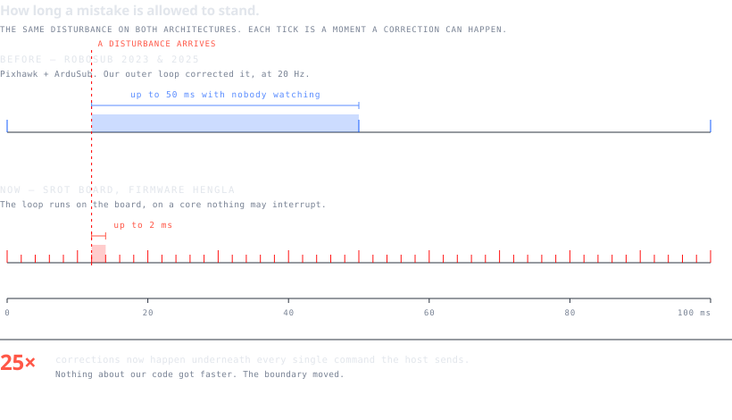
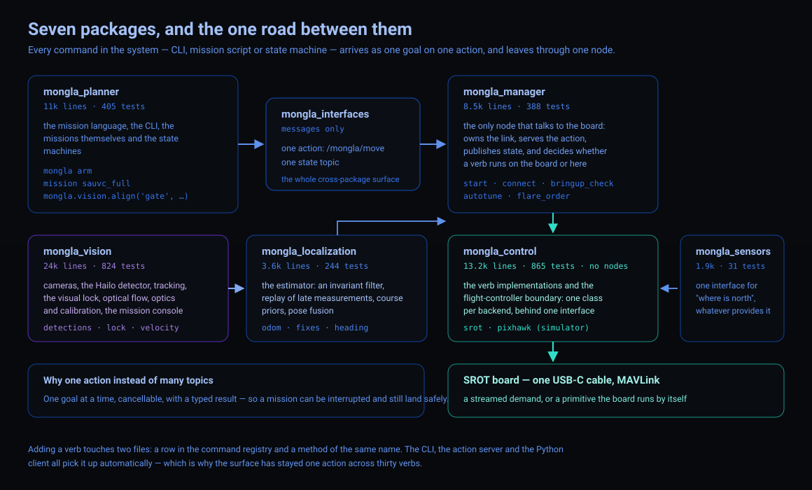

<p align="center">
  
</p>

<h1 align="center">Mongla — <code>duburi_ws</code></h1>

<p align="center">
  <em>The autonomy stack for an AUV whose every layer we own.</em><br/>
  ROS 2 · SROT control board (firmware <b>Hengla</b>) · Raspberry Pi 5 + Hailo-8 AI HAT
</p>

<p align="center">
  
  
  
  
  
  
  <a href="https://fh1m.github.io/duburi_ws/"></a>
</p>

<p align="center">
  <a href="https://fh1m.github.io/duburi_ws/the-shift.html"><b>The Shift</b></a> ·
  <a href="https://fh1m.github.io/duburi_ws/capability-map.html"><b>Capability map</b></a> ·
  <a href="#get-started">Get started</a> ·
  <a href="#missions">Missions</a> ·
  <a href="#the-packages">Packages</a> ·
  <a href="#reference">Reference</a>
</p>

---

Mongla is the ROS 2 brain of **BRAC University Duburi**'s autonomous underwater vehicles. It
runs on hardware our own team designed — the **SROT control board** with its firmware
**Hengla**, and a **Raspberry Pi 5 with a Hailo-8 AI HAT** for vision — and it exposes
exactly one action surface, `/duburi/move`, for thirty verbs.

If you read one page, read **[The Shift](https://fh1m.github.io/duburi_ws/the-shift.html)**:
what an AUV actually needs, why the old Pixhawk + Jetson stack had a ceiling, and what owning
the firmware bought us. If you want the receipts, read the
**[Capability Map](https://fh1m.github.io/duburi_ws/capability-map.html)** — every capability
with its evidence and an honest verification state.

> The workspace name `duburi_ws` and the `/duburi/*` namespace are kept for the test vehicle's
> tooling; the codebase itself is **Mongla**.

---

## Reflexes and thinking, on separate hardware

<p align="center">
  
</p>

| | Where it runs | Rate |
|---|---|---|
| Attitude, depth, thrust mixing, failsafes | **SROT board**, on a core reserved for it | **500 Hz** |
| Detection, tracking, flow, localization, mission logic | **Pi 5 + Hailo-8** | 20–54 Hz |
| Between them | one USB-C cable carrying MAVLink | — |

The board keeps flying with the Pi unplugged. That is the whole point: a dropped frame is a
late correction, not a falling vehicle.

## One soul, two bodies

**Mongla is the *soul* (the code).** It runs on two competition *bodies*:

<table>
<tr>
<td width="50%" align="center"></td>
<td width="50%" align="center"></td>
</tr>
<tr>
<td align="center"><b>Duburi 4.5</b> — primary · octagonal · grabber / dropper / torpedo</td>
<td align="center"><b>Dubomini 2.0</b> — agile · compact · manipulator-free</td>
</tr>
</table>

|  | Duburi 4.5 (primary) | Dubomini 2.0 (agile) |
|---|---|---|
| Frame | vectored, 8 × T200 | vectored, 8 × T200 |
| Flight controller | **SROT board · firmware Hengla** | same |
| Compute | **Raspberry Pi 5 + Hailo-8 AI HAT** | same |
| Attitude and heading | the board's own IMU, fused on-board | same |
| Depth | Bar30 on the board | same |
| Velocity / distance | **the downward camera** (no DVL fitted) | same |
| Payload | grabber / dropper / torpedo, through the board's own outputs | shared dropper / torpedo |

Competition record: **RoboSub 2023 — 2nd place · RoboSub 2025 — 8th place**, both on the
previous stack, preserved on the [`pixhawk`](https://github.com/fh1m/duburi_ws/tree/pixhawk)
branch.

---

## Get started

```bash
# build (interfaces first, then everything else)
./build_dubomini.sh
source install/setup.bash
```

```bash
# T1 — the vehicle: control, localization, and vision on the Hailo
ros2 launch duburi_manager bringup.launch.py vision:=true

# T2 — is it healthy enough to arm?
ros2 run duburi_manager bringup_check --srot

# T3 — drive it
ros2 run duburi_planner duburi arm
ros2 run duburi_planner duburi set_depth --target -0.5
ros2 run duburi_planner duburi move_forward --duration 3 --gain 40
ros2 run duburi_planner duburi disarm
```

**Look at the board directly**, with no ROS graph and not even a built workspace:

```bash
ros2 run duburi_manager connect --watch
```

It prints both battery packs, per-ESC RPM and temperature, the depth controller's own error
and output, leak, kill, water temperature, heap and per-task stacks. Absent values render as
`--`, never `0.0` — the board suppresses what it cannot stand behind, and so do we.

> ⛔ **Before anything moves in water.** The board's depth loop has never run closed, and
> every on-board move runs through it. Two bench checks gate that, and until they pass the
> board may refuse a move outright. See
> [`srot-integration.md`](.claude/context/srot-integration.md).

---

## Missions

A mission is a Python file with a `run(duburi)` function. The object is the whole vehicle.

```python
from duburi_planner.client import TaskAbandoned

def run(duburi, log=None):
    duburi.mission_reset()                     # clear old state, re-zero depth at the surface
    duburi.use_budget(900, reserve_s=45)       # ration the run; the clock starts on arm

    try:
        duburi.arm()
        duburi.set_depth(-0.8)

        with duburi.task('gate', deadline_s=120):
            if duburi.vision.align('gate', yaw=0, lat=0, gain=30, duration=60):
                duburi.vision.move('gate', fwd=None)      # drive through it
    except TaskAbandoned:
        duburi.note('gate', 'ran out of time', success=False)
    finally:
        duburi.surface()
        duburi.disarm()
```

```bash
ros2 run duburi_planner mission --list
ros2 run duburi_planner mission sauvc_full
```

Three ideas the mission language is built on:

- **Two vision verbs, not nine.** `align` holds a target at a pixel offset on whichever axes
  you name; `move` drives toward or through it. Neither raises — they return an outcome and
  where the target was, so a mission recovers instead of crashing.
- **Effort is not points.** `use_budget()` plus `worth_attempting()` decide whether a task is
  still worth a full attempt, only a fallback, or should be skipped — and record the verdict.
- **A task can be abandoned cleanly.** A deadline cancels the goal in flight and hands the
  mission its fallback, instead of overrunning into the next task.

Full reference: [`client-and-dsl-api.md`](.claude/context/client-and-dsl-api.md) ·
[`command-reference.md`](.claude/context/command-reference.md) ·
[`mission-cookbook.md`](.claude/context/mission-cookbook.md)

---

## The packages

<p align="center">
  
</p>

| Package | What it is |
|---|---|
| [`duburi_manager`](.claude/context/packages/duburi_manager/README.md) | the one node that talks to the board: the link, the action server, the operator tools |
| [`duburi_control`](.claude/context/packages/duburi_control/README.md) | every verb's implementation, and one class per flight controller behind one interface |
| [`duburi_vision`](.claude/context/packages/duburi_vision/README.md) | cameras, the Hailo detector, tracking and the visual lock, optical flow, optics |
| [`duburi_localization`](.claude/context/packages/duburi_localization/README.md) | where the vehicle is, without a DVL |
| [`duburi_planner`](.claude/context/packages/duburi_planner/README.md) | the CLI, the mission language, the missions, the state machines |
| [`duburi_sensors`](.claude/context/packages/duburi_sensors/README.md) | one interface for "which way is north" |
| [`duburi_interfaces`](.claude/context/packages/duburi_interfaces/README.md) | one action and one state topic — the whole cross-package surface |

```bash
python3 -m pytest -q src/duburi_control/test      # 865
python3 -m pytest -q src/duburi_vision/test       # 824
python3 -m pytest -q src/duburi_planner/test      # 405
python3 -m pytest -q src/duburi_manager/test      # 388
python3 -m pytest -q src/duburi_localization/test # 244
```

No hardware needed for any of them: the board, the cameras and the ROS graph are faked at
their real boundaries.

---

## Vision, in one paragraph

Water bends light, absorbs red first, and throws moving caustics across the floor — so this is
not only a neural network. The camera path keeps the **newest** frame (16.9 ms stale, against
396 ms for an ordinary queue). The lens is **measured in water** (46.7°, not the datasheet's
63.8° in air) and every metric consumer goes through the same refraction correction. Detection
runs on the Hailo-8 at **53.9 Hz through the live ROS graph**, 18 ms from photon to detection.
When the detector blinks, a ladder of fallbacks holds the target — one rung once held 175
consecutive frames the detector had lost. And the downward camera doubles as the velocity
sensor we do not otherwise have: **1.09 cm worst error over a 30 cm slide**.

Every one of those numbers, with the method that produced it, is in
[`measured-bars.md`](.claude/context/measured-bars.md).

---

## Simulator

A full Gazebo pool lives in [`sim/`](sim/) — courses, props, cameras, ground truth and an
operator web lab. It runs **ArduSub SITL by design**: it is a physics environment, not the
vehicle, so it uses the `pixhawk` backend.

```bash
cd sim && ./build_sim.sh
ros2 run duburi_sim_bringup duburi_sim sim
ros2 run duburi_sim_bringup duburi_sim stack --no-vision
```

What transfers: control behaviour and every verb. What does **not**: detection thresholds and
vision gains — sim imagery is too clean. See [`sim/README.md`](sim/README.md).

---

## Reference

**Start here**
- [The Shift](https://fh1m.github.io/duburi_ws/the-shift.html) — the architecture, from first principles
- [Capability map](https://fh1m.github.io/duburi_ws/capability-map.html) — what it does, with evidence
- [`ROADMAP.md`](.claude/context/ROADMAP.md) — where we are and what is left
- [`packages/`](.claude/context/packages/README.md) — one page per package

**Using it**
- [`command-reference.md`](.claude/context/command-reference.md) — all thirty verbs
- [`client-and-dsl-api.md`](.claude/context/client-and-dsl-api.md) — the mission language
- [`vision-results.md`](.claude/context/vision-results.md) — reading a vision result
- [`precision-alignment.md`](.claude/context/precision-alignment.md) — holding still enough to fire
- [`launch-combinations.md`](.claude/context/launch-combinations.md) — every launch argument

**The hardware and the firmware**
- [`srot-architecture.md`](.claude/context/srot-architecture.md) · [`srot-integration.md`](.claude/context/srot-integration.md) · [`srot-board-soul.md`](.claude/context/srot-board-soul.md)
- [`cross-repo-contract.md`](.claude/context/cross-repo-contract.md) — what neither side may change alone
- [`upstream/`](.claude/context/upstream/README.md) — the asks we have sent the firmware team

**Method**
- [`measured-bars.md`](.claude/context/measured-bars.md) — every shipped threshold and its measurement
- [`BUGS.md`](.claude/context/BUGS.md) — the defect register
- [`hailo-vision.md`](.claude/context/hailo-vision.md) · [`underwater-vision.md`](.claude/context/underwater-vision.md)

---

## Credits

Built by **BRAC University Duburi**, Dhaka, Bangladesh.

The vehicle is four repositories by two teams:

| Repository | Codename | Owner |
|---|---|---|
| [`srot-control-board`](https://github.com/RakibulIslam1/srot-control-board) | Hengla — the firmware | firmware team |
| [`srot-ground-station`](https://github.com/RakibulIslam1/srot-ground-station) | Bondor — the ground station | ground-station team |
| [`srot-esc-flasher`](https://github.com/RakibulIslam1/srot-esc-flasher) | ESC tooling | firmware team |
| `duburi_ws` | Mongla — this repository | autonomy team |

**Rakibul Islam** — firmware development team lead, and author of the board firmware, the
ground station and the ESC flasher.

Standing on [ROS 2](https://docs.ros.org/), [MAVLink](https://mavlink.io/),
[Hailo](https://hailo.ai/), [Ultralytics YOLO](https://github.com/ultralytics/ultralytics),
[supervision](https://github.com/roboflow/supervision) and
[YASMIN](https://github.com/uleroboticsgroup/yasmin).

MIT — see [LICENSE](LICENSE).
