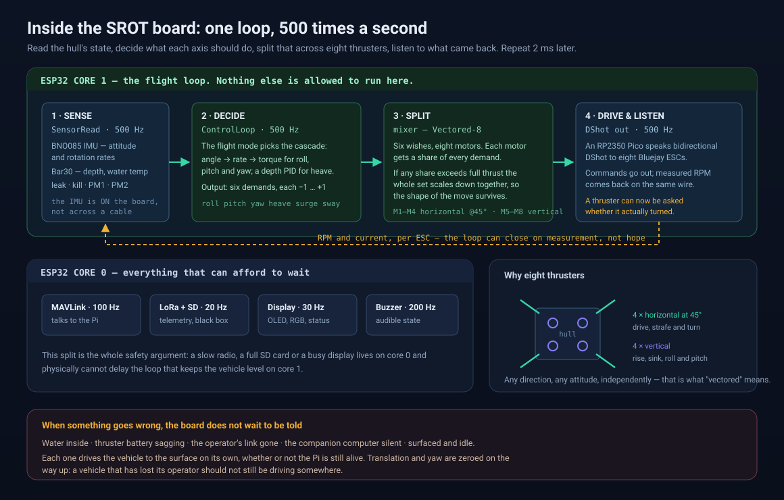
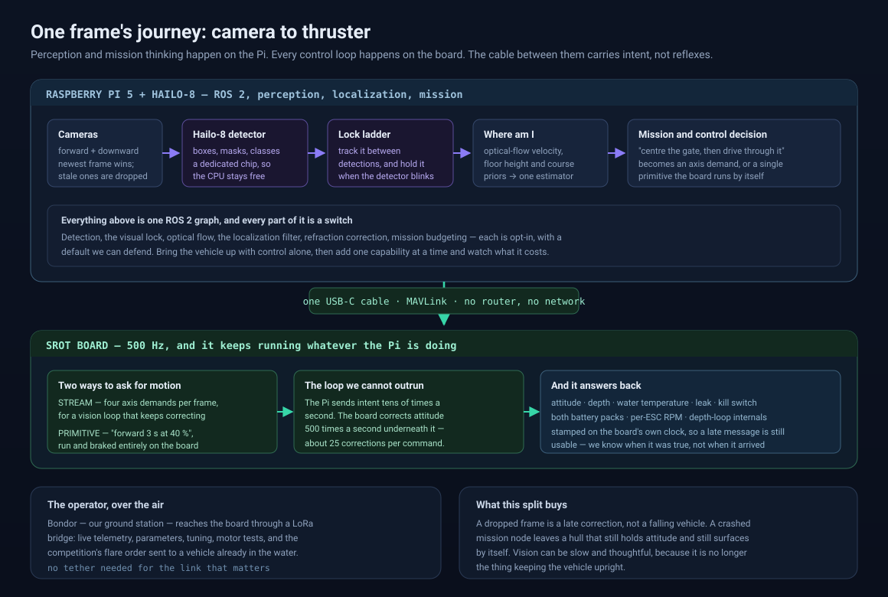
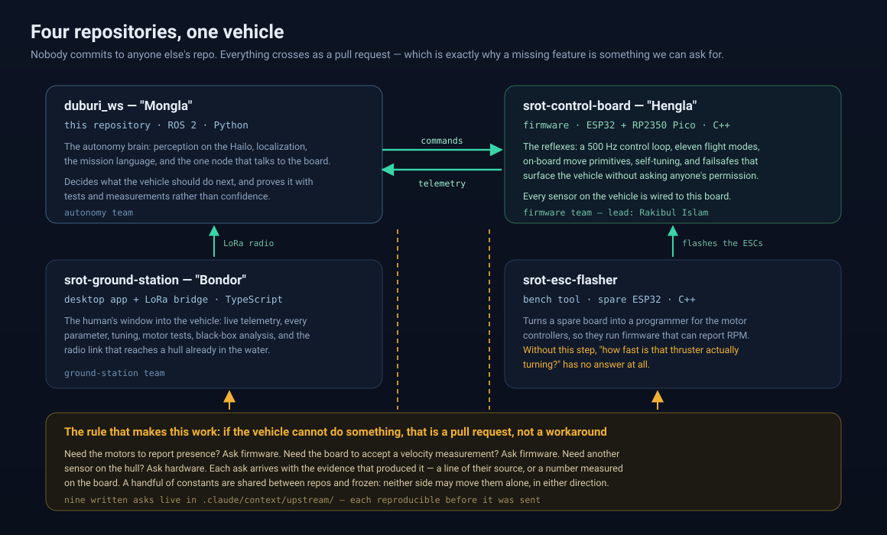

# The Shift

### From Pixhawk + Jetson to SROT + AI HAT — what changed, and why it changed everything

*This page assumes no background in robotics. If you already know what a flight controller
is, skip to [The old stack and its ceiling](#the-old-stack-and-its-ceiling).*

---

## First principles: what an underwater robot actually needs

Strip away the acronyms and an autonomous underwater vehicle (AUV) has to answer four
questions, over and over, until the run ends:

1. **Which way is up, and how deep am I?** Without this the vehicle tumbles. It must be
   answered hundreds of times a second, because water pushes back, and a hull that is 3° off
   level *now* is 10° off a moment later.
2. **What is around me?** Gates, markers, bins, flares. This takes a camera and a neural
   network, and by comparison it is slow and expensive — tens of times a second at best.
3. **What should I do next?** Mission logic. Seconds matter here, not milliseconds.
4. **How do I make the thrusters do it?** Turning "go forward and a little left" into eight
   separate motor commands.

Questions 1 and 4 are **reflexes**. They must never be late, and late is dangerous.
Questions 2 and 3 are **thinking**. They can afford to take their time.

Nearly every design decision in this project follows from that split: put the reflexes on
hardware that cannot be interrupted, put the thinking on hardware that is good at thinking,
and be careful about the line between them.

---

## The old stack and its ceiling

For RoboSub 2023 (2nd place) and 2025 (8th place), the vehicle carried **four computers**:

| Box | Job |
|---|---|
| **Pixhawk 2.4.8** running **ArduSub** | the reflexes — attitude, depth, motor mixing |
| **Raspberry Pi** running BlueOS | a MAVLink router; mostly a hop between the other two |
| **Jetson Orin Nano** | vision and every ROS 2 node — the thinking |
| the ESCs (motor controllers) | stock firmware, no telemetry |

It worked. It won trophies. And it had a hard ceiling, which is the whole reason for this
page:

- **The inner loop was closed to us.** ArduSub is excellent, mature, open-source software —
  but it is *someone else's* control system with *their* idea of what a flight mode is. We
  could set parameters. We could not change how the loop behaved, add a mode, or watch
  inside it while it ran. Every fix had to be shaped as "what can we do from outside?"
- **Our own control ran at 20 Hz.** Anything the autopilot did not offer, we bolted on from
  the host — the heading loop, the vision alignment loop. Fifty milliseconds between
  corrections, plus link delay, on a 20 kg hull with momentum.
- **The motors never answered.** Stock ESC firmware takes a command and reports nothing. Ask
  "is thruster 3 actually spinning?" and the honest answer was: *nobody knows*.
- **Sensors were scattered.** The IMU on one board, depth from the autopilot, each arriving
  over a different link with a different delay, and no shared clock to relate them.

The one-sentence version: **we could tune the vehicle, but we could not change it.**

---

## What replaced it

Two computers, one cable.

### The SROT board (firmware: *Hengla*)

A purpose-built flight controller, written by our own firmware team. Two processors:

- An **ESP32** with two cores, and the split between them is the safety argument for the
  whole vehicle. **Core 1** runs three things and nothing else — read the sensors, run the
  control loop, drive the motors — each at **500 Hz**, one pass every 2 ms. **Core 0** runs
  everything that can wait: the link to the Pi, the radio, the display, the buzzer. A slow
  radio or a full SD card lives on core 0 and *physically cannot* delay the loop that keeps
  the vehicle level.
- An **RP2350 Pico** speaking **bidirectional DShot** to the motor controllers: commands go
  out on the same wire the RPM comes back on.

Every sensor is on this board — the IMU (attitude and rotation rates), depth and water
temperature, leak detection, the kill switch, both battery packs, per-motor RPM. One device,
one clock, one place to look.

It also carries eleven flight modes, a set of movement primitives it runs by itself, an
automatic tuning routine, and failsafes that surface the vehicle without asking anyone.

### The Raspberry Pi 5 + Hailo-8 AI HAT

The thinking half. A Pi 5 with a **Hailo-8** — a chip that does nothing but run neural
networks, roughly the way a graphics card does nothing but draw. Detection runs there
instead of on the main processor, which leaves the CPU free for everything else: holding a
target between detections, measuring the vehicle's velocity from the downward camera,
running the position filter, and deciding what the mission does next.

### One cable

No network, no router, nothing in between. A single USB-C cable carrying MAVLink. The Pi
sends *intent* — "strafe left a little", or a whole primitive such as "forward 3 seconds at
40 %" — and the board turns that into thrust 500 times a second underneath it: roughly
**25 control corrections for every command we send**.

That ratio is the point of the redesign. Our loop got *slower* and the vehicle got
*steadier*, because the fast loop moved to where it belongs.

---

## The four repositories

| Repository | Codename | What it is |
|---|---|---|
| [`srot-control-board`](https://github.com/RakibulIslam1/srot-control-board) | **Hengla** | The firmware: 500 Hz control loop, eleven flight modes, on-board move primitives, self-tuning, failsafes, and roughly 227 tunable parameters. C++ on ESP32 + RP2350. |
| [`srot-ground-station`](https://github.com/RakibulIslam1/srot-ground-station) | **Bondor** | The operator's window: a desktop app (Electron + React) plus an ESP32-C3 radio bridge — live telemetry, every parameter, tuning, motor tests, black-box analysis, joystick, and a LoRa link to a vehicle already in the water. |
| [`srot-esc-flasher`](https://github.com/RakibulIslam1/srot-esc-flasher) | — | A bench tool that turns a spare ESP32 into a programmer for the motor controllers, so they can run firmware that reports RPM at all. |
| `duburi_ws` | **Mongla** | This repository. ROS 2 autonomy: perception, localization, the mission language, and the single node that talks to the board. |

**Firmware development team lead: Rakibul Islam** — author of the board firmware, the ground
station and the ESC flasher (GitHub [`RakibulIslam1`](https://github.com/RakibulIslam1)).

*Mongla* is the soul, not the body: one codebase, more than one hull.

---

## Why owning the stack is the actual story

The hardware is not the interesting part. Plenty of teams build a custom board. What changed
is **what happens when the vehicle cannot do something.**

Before, the answer was a workaround on the host. Now it is a pull request.

Three real examples, none hypothetical:

- **The motors could not report whether they were present.** The firmware already worked
  that out and then dropped it one line before it reached the wire — so our thruster-health
  check could only ever say "unknown". We read their source, found the line, and sent it back
  as a one-line ask.
- **The board had no way to accept a velocity measurement.** We had just turned the downward
  camera into a bottom-tracking velocity sensor, good to about a centimetre over 30 cm — and
  there was nowhere to send the number. That is a pull request: accept the standard MAVLink
  message for optical flow.
- **The kill switch reported the same value for "power is live" and "I cannot hear the power
  board".** Nothing on either side refused to arm a killed hull. One line, using their own
  suppression rule, already applied twice in the same function.

Nine such asks live in
[`.claude/context/upstream/`](https://github.com/fh1m/duburi_ws/tree/main/.claude/context/upstream),
each carrying the evidence that produced it — a line of their source, or a number measured
on the live board. That is the culture: **ask with evidence, in public, and let the right
team own the fix.**

It runs both ways, and it has rules:

- We never commit to their repositories; they never commit to ours. Pull requests are the
  only channel.
- A handful of constants are shared — the custom command's number, the flight-mode integers,
  the fact that depth is reported negative below the surface. Those are **frozen**: neither
  side may move one alone, and a test in this repository reads the firmware's own headers to
  prove ours have not drifted.
- The hardware is not final either. If a capability needs a sensor the hull does not carry,
  that is a conversation with the hardware team, not a constraint to design around.

The practical consequence for anyone reading this repository: what this vehicle *could* do
is not bounded by what an autopilot vendor shipped. It is bounded by what we can justify,
measure and ask for.

---

## What this bought, concretely

| Then | Now |
|---|---|
| A 400 Hz inner loop we could not modify | a 500 Hz loop we wrote, on a core nothing else can interrupt |
| Our own control loop at 20 Hz | the same loop, still around 20 Hz — but now it only steers, while the board stabilises 25× faster underneath it |
| No motor feedback at all | per-motor RPM on every thruster, and current |
| Sensors scattered across boards and links | every sensor on one board, on one clock |
| The vendor's flight modes | eleven modes, and a twelfth is a pull request away |
| Vision on a 15 W Jetson, competing for the GPU | a dedicated inference chip, leaving the CPU for tracking, flow and localization |
| "Is the vehicle moving?" — inferred | measured, from the downward camera and from thruster RPM |

The full, evidence-backed list — including what is verified in water, what is verified only
on a bench, and what is built but never flown — is the **[Capability Map](capability-map.html)**.

---

## Where the old world went

The Pixhawk + Jetson configuration is preserved on the **`pixhawk` branch** (commit
`b483722`), exactly as it stood. Nothing on the default branch describes it as the live
vehicle any more.

Two things from that era are deliberately still here and are not leftovers:

- The **`pixhawk` backend** still exists in the code, behind the same interface as the board.
  It is how the simulator flies.
- The **simulator** runs ArduSub SITL by design — it is a physics environment, not the
  vehicle.

Both are described in [Legacy: the Pixhawk backend and SITL](https://github.com/fh1m/duburi_ws/blob/main/.claude/context/legacy-pixhawk-and-sitl.md).

---

## Where to go next

- **[Capability Map](capability-map.html)** — everything the vehicle can do, each row with its
  evidence and its honest verification state.
- **Package documentation** — one page per package, under
  [`.claude/context/packages/`](https://github.com/fh1m/duburi_ws/tree/main/.claude/context/packages).
