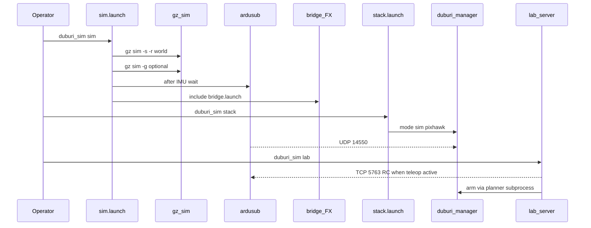

# Architecture

## Packages

| Package | Responsibility |
|---------|----------------|
| `duburi_sim_description` | `duburi_heavy` Gazebo model (BlueROV2 Heavy proxy) |
| `duburi_sim_worlds` | Pool, SAUVC props, course YAML → `.world` |
| `duburi_sim_bringup` | Orchestration: sim, stack, ArduSub params, `duburi_sim` CLI |
| `duburi_sim_bridge` | ros_gz cameras/GT, underwater FX, recorder, contract tools |
| `duburi_sim_scenarios` | Runtime prop services + CLI |
| `duburi_sim_web` | FastAPI + React operator lab |

## Process graph



## Design choices (intentional)

1. **Split gz server / GUI** — GUI X11 failure must not kill physics.
2. **ArduSub JSON FDM on 9002** — standard ArduPilot Gazebo plugin path.
3. **Manager owns 14550; lab teleop on 5763** — continuous RC override without
   fighting the manager’s MAVLink socket.
4. **Course change = stop + start** — no true Gazebo world hot-swap in v0.1.
5. **FX on separate topics** — raw contract topics stay clean; training uses `image_fx`.
6. **Sibling workspace** — keep sim drop-in without merging into `duburi_ws` yet.

## Data flow: cameras

```text
Gazebo camera sensors
  → ros_gz bridge → /duburi/sim/*/image_raw (+ camera_info)
  → underwater_fx → /duburi/sim/*/image_fx
  → lab ROS node: JPEG q≈82; Operate preview defaults to **raw**
  → MJPEG (/api/cameras/*/mjpeg) ~30 Hz poll; skip duplicate JPEG seq
  → record_cameras: buffer frames; async PNG/labels; encode MP4 at fps_actual
  → optional duburi_vision (forward) on image_raw
```

**MJPEG budget:** ~33 ms sleep when frames are fresh; idle backoff 50 ms.
Do not re-encode stale frames (seq check). FX remains a record-time choice so
preview stays smooth under turbidity load.

**Recorder pipeline:** callback copies frame → video buffer + disk queue;
finalize writes MP4 with `fps = count/duration_s` so playback length = wall time.

## Data flow: control

```text
Planner / mission  → /duburi/move → manager → MAVLink 14550 → ArduSub → thrusters
Lab D-pad          → TeleopStreamer → RC_CHANNELS_OVERRIDE @5763 → ArduSub
Lab arm button     → subprocess: ros2 run duburi_planner duburi arm|disarm
```

Idle teleop stops writing overrides so manager heartbeats can hold neutrals.

## Key files

See [CODEMAP.md](CODEMAP.md).
