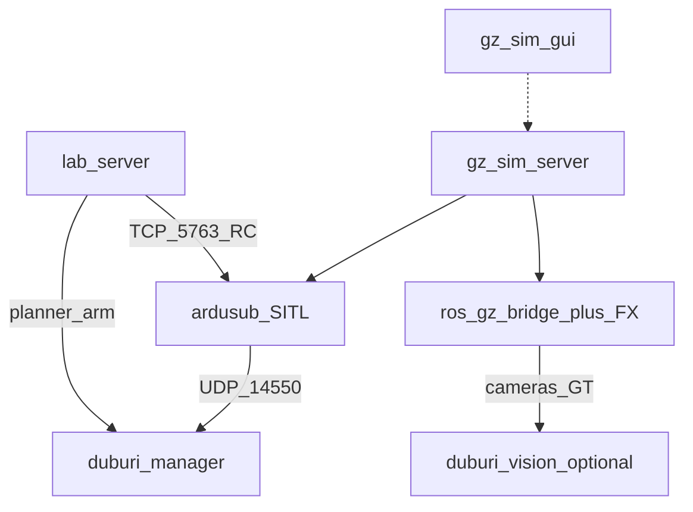

# Operator guide

> ℹ **Absorbed 2026-08-27.** This workspace is no longer the sibling tree
> `Ros_workspaces/duburi-sim_ws`; it lives inside the `duburi_ws` repo at
> `duburi_ws/sim/` and is under version control. Paths below have been
> updated; any remaining "sibling" phrasing is historical.

Full bring-up for Mongla sim lab. Companion: [QUICKSTART.md](QUICKSTART.md),
[TROUBLESHOOTING.md](TROUBLESHOOTING.md), [COMMAND_REFERENCE.md](COMMAND_REFERENCE.md).

## What you are running



## Prerequisites checklist

- [ ] Humble + Gazebo Harmonic installed
- [ ] `colcon build --symlink-install` succeeded in `duburi_ws/sim`
- [ ] `duburi_ws` built; set `DUBURI_WS` if not sibling `../duburi_ws`
- [ ] ArduPilot SITL binary found (see launch errors for `ARDUPILOT_ROOT`)
- [ ] For GUI: X11/`DISPLAY` works in this environment
- [ ] Prefer `export GZ_IP=127.0.0.1` on multi-homed hosts

## Canonical session

1. **Stop leftovers** — `duburi_sim stop`
2. **Sim** — `duburi_sim sim` (GUI) or `--headless`
3. Wait for **`JSON received`** and visible AUV at start zone
4. **Stack** — `duburi_sim stack --no-vision` first; add vision later with `stack` (no flag)
5. **Smoke** — `duburi_sim smoke`
6. **Lab** (optional) — `duburi_sim lab` → browser

### When to use vision

| Goal | Stack |
|------|-------|
| Control / teleop / record only | `--no-vision` |
| Mission + YOLO on forward cam | `duburi_sim stack` (needs weights in `duburi_ws`) |

## Courses

| Course | Use |
|--------|-----|
| `sauvc26_qualification` | Default; start zone + qual gate |
| `sauvc26_final` | Final arena props |
| `pool_empty` | Bare pool / hydro tuning |

```zsh
ros2 run duburi_sim_bringup duburi_sim sim course:=sauvc26_final
# Lab World tab: restart / switch (stop→start; polls gz+ardusub ~90s)
```

**Important:** UI “switch course” is **not** in-process Gazebo hot-reload. Backend stops,
starts new world, waits ready, restacks `prop_manager` with `world:={course}`.

## Operator lab (mission control)

URL: `http://localhost:${DUBURI_LAB_PORT:-28765}`

Tabs:

| Tab | Actions |
|-----|---------|
| **Operate** | Cams (front/bottom/both; preview defaults to **raw**), D-pad, arm, record → zip, turbidity 0–2 |
| **World** | Start / restart-switch / stop, course, props spawn/**move**/remove + yaw, instances, custom zip upload |
| **Datasets** | Newest-first; duration + `fps_actual`; zip download |

Teleop: hold WASD / arrows / R·F depth / Space arm. RC goes to ArduSub TCP **5763**.
Arm/disarm still via `duburi_planner` through `DUBURI_WS`.

Record: name + cam / fx / frames / labels; stop writes `datasets/` and triggers zip.
MP4 wall duration matches take length (`fps_actual` encode). Course stamp = `active_course`.

**Cameras:** Operate MJPEG prefers raw for fluid preview; check **fx** on record for
underwater domain on the clip.

## PlotJuggler (desktop)

```zsh
sudo apt install ros-humble-plotjuggler-ros
ros2 run duburi_sim_bringup duburi_sim plotjuggler
```

Timeseries for `/duburi/state` + GT. Foxglove stays in `duburi_ws` for 3D/images.
Full guide: [PLOTJUGGLER.md](PLOTJUGGLER.md).

## Recording without the lab

```zsh
ros2 run duburi_sim_bridge record_cameras --duration 30 --fx --frames --labels \
  --label gate_approach --course sauvc26_qualification
```

See [DATASETS.md](DATASETS.md). Verify with `ffprobe` that MP4 duration ≈ `meta.duration_s`.

## Props / world freedom

```zsh
ros2 run duburi_sim_scenarios prop_manager --ros-args -p world:=sauvc26_qualification
ros2 run duburi_sim_scenarios props add sauvc_qual_gate gate_a 1.0 0.0 --z -1.5
ros2 run duburi_sim_scenarios props move gate_a 2.0 0.0 --z -1.5
ros2 run duburi_sim_scenarios props remove gate_a
```

Or World tab: catalog, spawn with yaw, instances, move, custom model zip.
Course geometry still needs restart — [WORLD_EDITING.md](WORLD_EDITING.md).

## Healthy signs

- Gazebo: AUV mid-water at start zone; front/bottom ImageDisplay panels live
- `ros2 topic hz /duburi/sim/front_camera/image_raw` shows rate
- `ros2 topic echo /duburi/state --once` after stack
- Lab link dots: gz · sitl · mav · cams solid; teleop fills when holding D-pad
- `contract_check` / `mavlink_check` print satisfied / rates OK

## Shutdown

```zsh
# Ctrl-C lab and stack terminals, then:
ros2 run duburi_sim_bringup duburi_sim stop
```

`stop` does not kill `lab_server` by default (pattern list is sim/stack focused).
Stop the lab terminal separately, or `pkill -f duburi_sim_web/lab_server` if orphaned.
