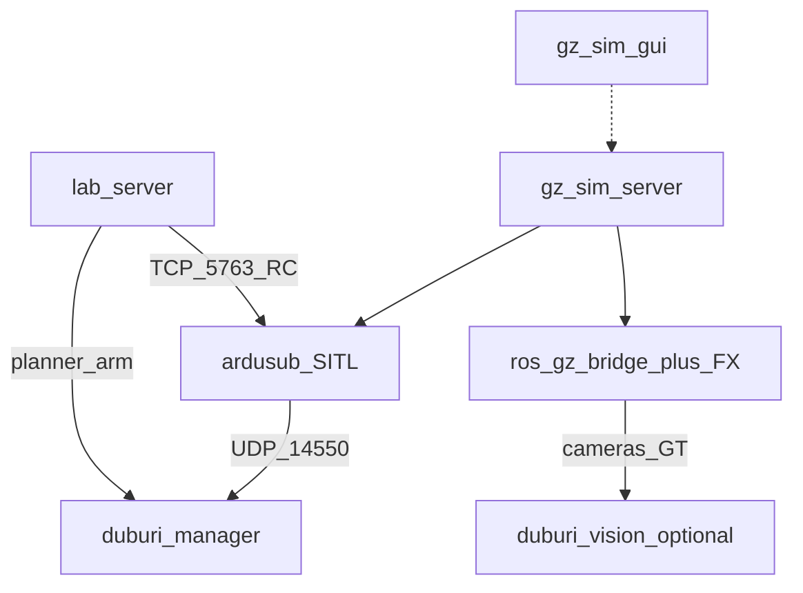

# Operator guide

> ℹ **Absorbed 2026-08-27.** This workspace is no longer the sibling tree
> `Ros_workspaces/duburi-sim_ws`; it lives inside the `duburi_ws` repo at
> `duburi_ws/sim/` and is under version control. Paths below have been
> updated; any remaining "sibling" phrasing is historical.

Full bring-up for Mongla sim lab. Companion: [QUICKSTART.md](QUICKSTART.md),
[TROUBLESHOOTING.md](TROUBLESHOOTING.md), [COMMAND_REFERENCE.md](COMMAND_REFERENCE.md).

## What you are running



## Prerequisites checklist

- [ ] Humble + Gazebo Harmonic installed
- [ ] `colcon build --symlink-install` succeeded in `duburi_ws/sim`
- [ ] `duburi_ws` built; set `DUBURI_WS` if not sibling `../duburi_ws`
- [ ] ArduPilot SITL binary found (see launch errors for `ARDUPILOT_ROOT`)
- [ ] For GUI: X11/`DISPLAY` works in this environment
- [ ] Prefer `export GZ_IP=127.0.0.1` on multi-homed hosts

## Canonical session

1. **Stop leftovers** — `duburi_sim stop`
2. **Sim** — `duburi_sim sim` (GUI) or `--headless`
3. Wait for **`JSON received`** and visible AUV at start zone
4. **Stack** — `duburi_sim stack --no-vision` first; add vision later with `stack` (no flag)
5. **Smoke** — `duburi_sim smoke`
6. **Lab** (optional) — `duburi_sim lab` → browser

### When to use vision

| Goal | Stack |
|------|-------|
| Control / teleop / record only | `--no-vision` |
| Mission + YOLO on forward cam | `duburi_sim stack` (needs weights in `duburi_ws`) |

## Courses

| Course | Use |
|--------|-----|
| `sauvc26_qualification` | Default; start zone + qual gate |
| `sauvc26_final` | Final arena props |
| `pool_empty` | Bare pool / hydro tuning |

```zsh
ros2 run duburi_sim_bringup duburi_sim sim course:=sauvc26_final
# Lab World tab: restart / switch (stop→start; polls gz+ardusub ~90s)
```

**Important:** UI “switch course” is **not** in-process Gazebo hot-reload. Backend stops,
starts new world, waits ready, restacks `prop_manager` with `world:={course}`.

## Operator lab (mission control)

URL: `http://localhost:${DUBURI_LAB_PORT:-28765}`

Tabs:

| Tab | Actions |
|-----|---------|
| **Operate** | Cams (front/bottom/both; preview defaults to **raw**), D-pad, arm, record → zip, turbidity 0–2 |
| **World** | Start / restart-switch / stop, course, props spawn/**move**/remove + yaw, instances, custom zip upload |
| **Datasets** | Newest-first; duration + `fps_actual`; zip download |

Teleop: hold WASD / arrows / R·F depth / Space arm. RC goes to ArduSub TCP **5763**.
Arm/disarm still via `duburi_planner` through `DUBURI_WS`.

Record: name + cam / fx / frames / labels; stop writes `datasets/` and triggers zip.
MP4 wall duration matches take length (`fps_actual` encode). Course stamp = `active_course`.

**Cameras:** Operate MJPEG prefers raw for fluid preview; check **fx** on record for
underwater domain on the clip.

## PlotJuggler (desktop)

```zsh
sudo apt install ros-humble-plotjuggler-ros
ros2 run duburi_sim_bringup duburi_sim plotjuggler
```

Timeseries for `/duburi/state` + GT. Foxglove stays in `duburi_ws` for 3D/images.
Full guide: [PLOTJUGGLER.md](PLOTJUGGLER.md).

## Recording without the lab

```zsh
ros2 run duburi_sim_bridge record_cameras --duration 30 --fx --frames --labels \
  --label gate_approach --course sauvc26_qualification
```

See [DATASETS.md](DATASETS.md). Verify with `ffprobe` that MP4 duration ≈ `meta.duration_s`.

## Props / world freedom

```zsh
ros2 run duburi_sim_scenarios prop_manager --ros-args -p world:=sauvc26_qualification
ros2 run duburi_sim_scenarios props add sauvc_qual_gate gate_a 1.0 0.0 --z -1.5
ros2 run duburi_sim_scenarios props move gate_a 2.0 0.0 --z -1.5
ros2 run duburi_sim_scenarios props remove gate_a
```

Or World tab: catalog, spawn with yaw, instances, move, custom model zip.
Course geometry still needs restart — [WORLD_EDITING.md](WORLD_EDITING.md).

## Healthy signs

- Gazebo: AUV mid-water at start zone; front/bottom ImageDisplay panels live
- `ros2 topic hz /duburi/sim/front_camera/image_raw` shows rate
- `ros2 topic echo /duburi/state --once` after stack
- Lab link dots: gz · sitl · mav · cams solid; teleop fills when holding D-pad
- `contract_check` / `mavlink_check` print satisfied / rates OK

## Shutdown

```zsh
# Ctrl-C lab and stack terminals, then:
ros2 run duburi_sim_bringup duburi_sim stop
```

`stop` does not kill `lab_server` by default (pattern list is sim/stack focused).
Stop the lab terminal separately, or `pkill -f duburi_sim_web/lab_server` if orphaned.

---

## The view — third-person by default

The run used to open on `<camera_pose>-14 0 4</camera_pose>`: 4 m up in the
air, looking down at the water surface. You could see the pool and not the run.

The GUI camera now starts **underwater behind the hull** and **follows it**.
`CameraTracking` was already loaded in `gui.config` with an empty body, so it
never tracked anything; it now has a `follow_target` of `duburi` — the world
*instance* name, which is the same on all 13 courses (the model name is
`duburi_heavy`, and passing that silently follows nothing).

The offset is behind, slightly left and slightly above: dead astern hides the
hull behind its own wake, dead overhead loses the horizon, and both make it
hard to tell whether the vehicle is level. `follow_pgain` is deliberately low —
a stiff follow transmits every yaw correction to the camera and the picture
shakes.

```bash
duburi_sim view          # chase the vehicle (the default)
duburi_sim view free     # let go, fly the camera by hand
duburi_sim view chase    # back to following
```

Useful for looking at a prop mid-run and then returning to the vehicle without
restarting.

## The score page

`duburi_sim lab` now has a **score** tab: every rulebook line item for the
running course's competition, what it is worth, whether it was earned, and the
evidence. Full detail in [SCORING.md](SCORING.md).

## `duburi_sim view high` — a third-person camera that actually aims

**Follow sets position only; it does not aim.** gz-rendering applies
`follow_offset` to the camera's position and leaves its orientation alone
(`Camera.hh` says so in as many words). The starting pitch in `gui.config` was
+0.12 rad **nose-up**, so raising the camera lifted it while it kept staring
upward — you got a higher view of the underside of the water surface, not a
better view of the vehicle. That is why the run still read as first-person after
the chase offset was set in Round 6.

Two changes, and they only work together:

- `camera_pose` is pitched **−0.30 rad, nose down**, and the follow offset is
  `-5.0 0.4 1.5` — five metres astern, 1.5 m up, about a 17° elevation from
  three times the old distance, so the hull *and* the prop it is working sit in
  frame together instead of the hull filling it.
- `follow_pgain` 0.008 → 0.03. At five metres the old gain lagged most of a
  length through a turn and the vehicle swam out of frame.

Height is bought by moving **back**, not up, on purpose: the offset is in the
hull's own frame and the water visual sits at z = 0, so at a 0.8 m run depth
much more elevation puts the camera through the surface looking down at it.

```bash
ros2 run duburi_sim_bringup duburi_sim view high    # aimed 3rd-person, high
ros2 run duburi_sim_bringup duburi_sim view chase   # the close chase
ros2 run duburi_sim_bringup duburi_sim view free    # let go and fly by hand
```

`view high` is a **different mechanism**, not a different offset: it publishes
`gz.msgs.CameraTrack` on `/gui/track` with `track_mode: 4` (`FOLLOW_LOOK_AT`),
which is the genuinely aimed rig and exists **only at runtime** — the SDF block
parses `follow_target`, `follow_offset` and `follow_pgain` and nothing else
(verified by string-dumping the installed `libCameraTracking.so`).

> **The lab's video panels and the docked `ImageDisplay` widgets are the
> vehicle's own cameras and are irreducibly first-person.** None of the above
> changes them. A third-person feed in the lab would need a new world camera
> plus a bridge; it does not exist today.

## `view high` never worked, and the pool caps how high it can go

`/gui/track` is a **topic, not a service**. The plugin subscribes to it
(`OnTrackSub`); `Node::Advertise` is instantiated only for `StringMsg`,
`GUICamera` and `Vector3d`, never `CameraTrack`. The first version of
`duburi_sim view high` called `gz service -s /gui/track`, which cannot succeed,
and swallowed the failure into **"no Gazebo GUI is running (or it is
headless)"** — so the command never worked *and* said something false about why.
It publishes now, and checks the GUI first with a service that really is one.

**The pool caps the height, and there is no way around it.** The water surface
is an opaque model (Fuel `openrobotics/waves`) at z = 0, the RoboSub pool is
2.1 m deep, and the hull runs about 0.8 m down — so there is at most ~0.8 m of
headroom. Verified by driving the camera there: at z offsets of 2.2 and 3.2 the
camera really did move (the pose stream confirms it) and was looking at the
underside of the surface.

So elevation is bought by **distance**, not altitude:

```bash
duburi_sim view far     # 12 m astern -- the vehicle and the task in one frame
duburi_sim view high    # 6 m astern, over the shoulder
duburi_sim view chase   # the close follow
duburi_sim view free    # let go and fly by hand
```

`far` is the "watch the run" view. It is **not** a bird's eye, and in a 2.1 m
pool it cannot be.
